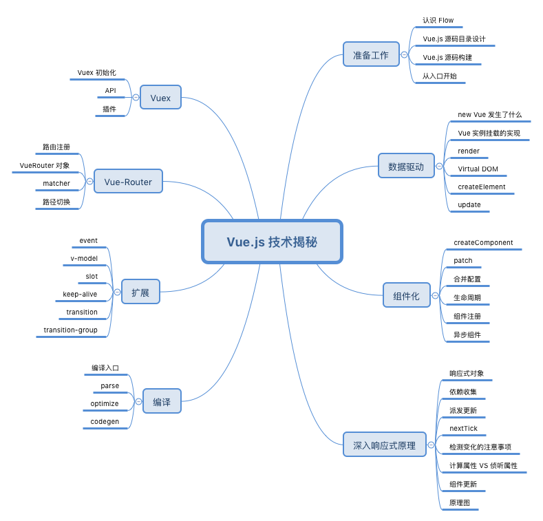

# Vue的原理

[vue.js框架原理浅析 - saucxs - 博客园 (cnblogs.com)](https://www.cnblogs.com/chengxs/p/10384397.html)

## vue实例化

初始化生命周期，初始化事件，初始化渲染，触发执行beforeCreate生命周期方法，初始化data/props数据监听，触发执行created生命周期方法。

对应到生命周期示例图，created方法执行结束，接下来判断是否传入挂载的el节点，如果传入的话此时就会通过`$mount`函数把组件挂载到DOM上面，整个vue构造函数就执行完成了。以上是vue对象创建的基本流程。

## 模板编译过程

挂载的`$mount`函数，此函数的实现与运行环境有关，在此只看web中的实现。

实现只有简单的两行，

1、判断运行环境为浏览器，

2、调用工具方法查找到el对应的DOM节点，

3、mountComponent方法来实现挂载，

这里就涉及到了挂载之前的处理问题。

1、对于拥有render(JSX)函数的情况，组件可以直接挂载，

2、如果使用的是template，需要从中提取AST渲染方法（注意如果使用构建工具，最终会为我们编译成render(JSX)形式，所以无需担心性能问题），AST即抽象语法树，它是对真实DOM结构的映射，可执行，可编译，能够把每个节点部分都编译成vnode，组成一个有对应层次结构的vnode对象。

有了渲染方法，下一步就是更新DOM，注意并不是直接更新，而是通过vnode，于是涉及到了一个非常重要的概念。

## 虚拟DOM

虚拟DOM技术是一个很流行的东西，现代前端开发框架vue和react都是基于虚拟DOM来实现的。

虚拟DOM技术是为了解决一个很重要的问题：**浏览器进行DOM操作会带来较大的开销。**

1、要知道js本身运行速度是很快的，

2、而js对象又可以很准确地描述出类似DOM的树形结构，

> 通过使用js描述出一个假的DOM结构，每次数据变化时候，在假的DOM上分析数据变化前后结构差别，找出这个最小差别并且在真实DOM上只更新这个最小的变化内容，这样就极大程度上降低了对DOM的操作带来的性能开销。

上面的假的DOM结构就是**虚拟DOM，比对的算法成为diff算法，这是实现虚拟DOM技术的关键。**

1、在vue初始化时，首先用JS对象描述出DOM树的结构，

2、用这个描述树去构建真实DOM，并实际展现到页面中，

3、一旦有数据状态变更，需要重新构建一个新的JS的DOM树，

4、对比两棵树差别，找出最小更新内容，

5、并将最小差异内容更新到真实DOM上。

有了虚拟DOM，下面一个问题就是，什么时候会触发更新，接下来要介绍的，就是vue中最具特色的功能--数据响应系统及实现。

## 数据绑定

vue.js的作者尤雨溪老师在知乎上一个回答中提到过自己创作vue的过程，最初就是尝试实现一个类似angular1的东西，发现里面对于数据处理非常不优雅，于是创造性的尝试利用ES5中的Object.defineProperty来实现数据绑定，于是就有了最初的vue。vue中响应式的数据处理方式是一项很有价值的东西。

vue官网上面其实有具体介绍，下面是一张官方图片：

响应实现的基本原理：

1、vue会遍历此data中对象所有的属性，

2、并使用Object.defineProperty把这些属性全部转为getter/setter，

3、而每个组件实例都有watcher对象，

4、它会在组件渲染的过程中把属性记录为依赖，

5、之后当依赖项的 setter被调用时，会通知watcher重新计算，从而致使它关联的组件得以更新。

**为什么vue不能在IE8以下运行？**

因为IE8不支持ES5，所以用不了Object.defineProperty方法，又因为Object.defineProperty无法shim，所以vue不支持IE8及以下不支持ES5的浏览器。

