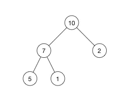
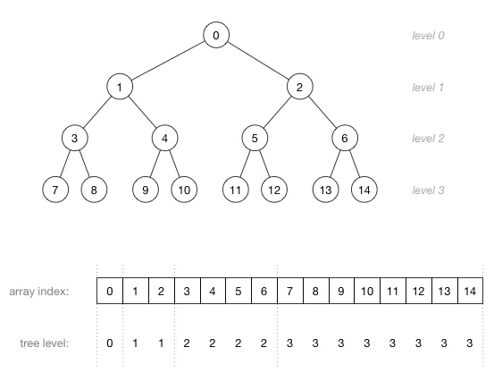
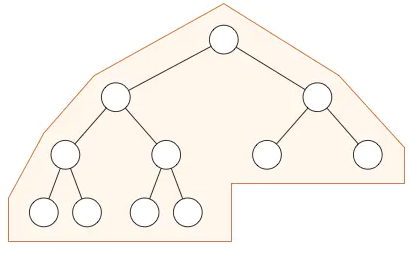

# 数据结构中的堆栈

数据结构的堆就是用数组实现的二叉树，所以它没有使用父指针或者子指针。堆根据“堆属性”来排序，“堆属性”决定了树中节点的位置。

堆分为两种：*最大堆*和*最小堆*，两者的差别在于节点的排序方式



这是一个最大堆，，因为每一个父节点的值都比其子节点要大。`10` 比 `7` 和 `2` 都大。`7` 比 `5` 和 `1`都大。

根据这一属性，那么最大堆总是将其中的最大值存放在树的根节点。而对于最小堆，根节点中的元素总是树中的最小值。堆属性非常有用，因为堆常常被当做优先队列使用，因为可以快速地访问到“最重要”的元素。

根据这一属性，那么最大堆总是将其中的最大值存放在树的根节点。而对于最小堆，根节点中的元素总是树中的最小值。堆属性非常有用，因为堆常常被当做优先队列使用，因为可以快速地访问到“最重要”的元素。

> **注意：**堆的根节点中存放的是最大或者最小元素，但是其他节点的排序顺序是未知的。例如，在一个最大堆中，最大的那一个元素总是位于 index 0 的位置，但是最小的元素则未必是最后一个元素。--唯一能够保证的是最小的元素是一个叶节点，但是不确定是哪一个。

## 堆和普通树的区别

堆并不能取代二叉搜索树，它们之间有相似之处也有一些不同。我们来看一下两者的主要差别：

**节点的顺序。**在二叉搜索树中，左子节点必须比父节点小，右子节点必须必比父节点大。但是在堆中并非如此。在最大堆中两个子节点都必须比父节点小，而在最小堆中，它们都必须比父节点大。

**内存占用。**普通树占用的内存空间比它们存储的数据要多。你必须为节点对象以及左/右子节点指针分配内存。堆仅仅使用一个数据来存储数组，且不使用指针。

**平衡。**二叉搜索树必须是“平衡”的情况下，其大部分操作的复杂度才能达到**O(log n)**。你可以按任意顺序位置插入/删除数据，或者使用 AVL 树或者红黑树，但是在堆中实际上不需要整棵树都是有序的。我们只需要满足堆属性即可，所以在堆中平衡不是问题。因为堆中数据的组织方式可以保证**O(log n)** 的性能。

**搜索。**在二叉树中搜索会很快，但是在堆中搜索会很慢。在堆中搜索不是第一优先级，因为使用堆的目的是将最大（或者最小）的节点放在最前面，从而快速的进行相关插入、删除操作。

## 使用数组来存储堆

用数组来实现树相关的数据结构也许看起来有点古怪，但是它在时间和空间上都是很高效的。

我们可以使用下面这个公式来获取父节点和左右节点

```kotlin
parent(i) = floor((i - 1)/2)
left(i)   = 2i + 1
right(i)  = 2i + 2
```

在最大堆中，父节点的值总是要大于（或者等于）其子节点的值。这意味下面的公式对数组中任意一个索引 `i`都成立：

```c
array[parent(i)] >= array[i]
```

理解数组索引和节点位置之间的关系非常重要。这里有一个更大的堆，它有15个节点被分成了4层:



> 注意:在堆中，在当前层级所有的节点都已经填满之前不允许开是下一层的填充，所以堆总是有这样的形状：



# 操作系统中的堆栈

栈区（stack）— 由编译器自动分配释放 ，存放函数的参数值，局部变量的值等。其操作方式类似于数据结构中的栈。
堆区（heap） — 一般由程序员分配释放， 若程序员不释放，程序结束时可能由OS回收 。

## 区别和联系：

1.申请方式

堆是由程序员自己申请并指明大小，在c中malloc函数 如p1 = (char *)malloc(10);
栈由系统自动分配，如声明在函数中一个局部变量 int b; 系统自动在栈中为b开辟空间
2.申请后系统的响应

栈：只要栈的剩余空间大于所申请空间，系统将为程序提供内存，否则将报异常提示栈溢出。
堆：首先应该知道操作系统有一个记录空闲内存地址的链表，当系统收到程序的申请时，会 遍历该链表，寻找第一个空间大于所申请空间的堆结点，然后将该结点从空闲结点链表中删除，并将该结点的空间分配给程序，另外，对于大多数系统，会在这块内 存空间中的首地址处记录本次分配的大小，这样，代码中的delete语句才能正确的释放本内存空间。另外，由于找到的堆结点的大小不一定正好等于申请的大 小，系统会自动的将多余的那部分重新放入空闲链表中。
3.申请大小的限制

栈：在Windows下,栈是向低地址扩展的数据结 构，是一块连续的内存的区域。这句话的意思是栈顶的地址和栈的最大容量是系统预先规定好的，在WINDOWS下，栈的大小是2M（也有的说是1M，总之是 一个编译时就确定的常数），如果申请的空间超过栈的剩余空间时，将提示overflow。因此，能从栈获得的空间较小。

堆：堆是向高地址扩展的数据结构，是不连续的内存区域。这是由于系统是用链表来存储的空闲内存地址的，自然是不连续的，而链表的遍历方向是由低地址向高地址。堆的大小受限于计算机系统中有效的虚拟内存。由此可见，堆获得的空间比较灵活，也比较大。
4.申请效率的比较：

栈由系统自动分配，速度较快。但程序员是无法控制的。

堆是由new分配的内存，一般速度比较慢，而且容易产生内存碎片,不过用起来最方便.

体会：
使用栈就象我们去饭馆里吃饭，只管点菜（发出申请）、付钱、和吃（使用），吃饱了就走，不必理会切菜、洗菜等准备工作和洗碗、刷锅等扫尾工作，他的好处是快捷，但是自由度小。
使用堆就象是自己动手做喜欢吃的菜肴，比较麻烦，但是比较符合自己的口味，而且自由度大。

```c
  //main.cpp   
  int   a   =   0;   全局初始化区   
  char   *p1;   全局未初始化区   
  main()   
  {   
      int   b;   栈   
      char   s[]   =   "abc";   栈   
      char   *p2;   栈   
      char   *p3   =   "123456";   123456/0在常量区，p3在栈上。   
      static   int   c   =0；   全局（静态）初始化区   
      p1   =   (char   *)malloc(10);   
      p2   =   (char   *)malloc(20);   
      分配得来得10和20字节的区域就在堆区。   
      strcpy(p1,   "123456");   123456/0放在常量区，编译器可能会将它与p3所指向的"123456" 
      优化成一个地方。   
  }   
```


# 栈的运用

(1)保存现场/上下文
(2)传递参数:汇编代码调用c函数时，需传递参数
(3)保存临时变量:包括函数的非静态局部变量以及编译器自动生成的其他临时变量。

> 参考

[什么是堆？什么是栈？他们之间有什么区别和联系？ - 知乎 (zhihu.com)](https://www.zhihu.com/question/19729973)

[数据结构：堆（Heap） - 简书 (jianshu.com)](https://www.jianshu.com/p/6b526aa481b1)

