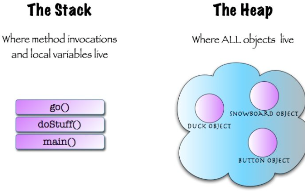

# 数据结构中的堆栈

数据结构的堆就是用数组实现的二叉树，所以它没有使用父指针或者子指针。堆根据“堆属性”来排序，“堆属性”决定了树中节点的位置。


# 操作系统中的堆栈

栈区（stack）— 由编译器自动分配释放 ，存放函数的参数值，局部变量的值等。其操作方式类似于数据结构中的栈。
堆区（heap） — 一般由程序员分配释放， 若程序员不释放，程序结束时可能由OS回收 。

## 区别和联系：

1.申请方式

堆是由程序员自己申请并指明大小，在c中malloc函数 如p1 = (char *)malloc(10);
栈由系统自动分配，如声明在函数中一个局部变量 int b; 系统自动在栈中为b开辟空间
2.申请后系统的响应

栈：只要栈的剩余空间大于所申请空间，系统将为程序提供内存，否则将报异常提示栈溢出。
堆：首先应该知道操作系统有一个记录空闲内存地址的链表，当系统收到程序的申请时，会 遍历该链表，寻找第一个空间大于所申请空间的堆结点，然后将该结点从空闲结点链表中删除，并将该结点的空间分配给程序，另外，对于大多数系统，会在这块内 存空间中的首地址处记录本次分配的大小，这样，代码中的delete语句才能正确的释放本内存空间。另外，由于找到的堆结点的大小不一定正好等于申请的大 小，系统会自动的将多余的那部分重新放入空闲链表中。
3.申请大小的限制

栈：在Windows下,栈是向低地址扩展的数据结 构，是一块连续的内存的区域。这句话的意思是栈顶的地址和栈的最大容量是系统预先规定好的，在WINDOWS下，栈的大小是2M（也有的说是1M，总之是 一个编译时就确定的常数），如果申请的空间超过栈的剩余空间时，将提示overflow。因此，能从栈获得的空间较小。

堆：堆是向高地址扩展的数据结构，是不连续的内存区域。这是由于系统是用链表来存储的空闲内存地址的，自然是不连续的，而链表的遍历方向是由低地址向高地址。堆的大小受限于计算机系统中有效的虚拟内存。由此可见，堆获得的空间比较灵活，也比较大。
4.申请效率的比较：

栈由系统自动分配，速度较快。但程序员是无法控制的。

堆是由new分配的内存，一般速度比较慢，而且容易产生内存碎片,不过用起来最方便.

体会：
使用栈就象我们去饭馆里吃饭，只管点菜（发出申请）、付钱、和吃（使用），吃饱了就走，不必理会切菜、洗菜等准备工作和洗碗、刷锅等扫尾工作，他的好处是快捷，但是自由度小。
使用堆就象是自己动手做喜欢吃的菜肴，比较麻烦，但是比较符合自己的口味，而且自由度大。

```c
  //main.cpp   
  int   a   =   0;   全局初始化区   
  char   *p1;   全局未初始化区   
  main()   
  {   
      int   b;   栈   
      char   s[]   =   "abc";   栈   
      char   *p2;   栈   
      char   *p3   =   "123456";   123456/0在常量区，p3在栈上。   
      static   int   c   =0；   全局（静态）初始化区   
      p1   =   (char   *)malloc(10);   
      p2   =   (char   *)malloc(20);   
      分配得来得10和20字节的区域就在堆区。   
      strcpy(p1,   "123456");   123456/0放在常量区，编译器可能会将它与p3所指向的"123456" 
      优化成一个地方。   
  }   
```



> 参考

[什么是堆？什么是栈？他们之间有什么区别和联系？ - 知乎 (zhihu.com)](https://www.zhihu.com/question/19729973)

[数据结构：堆（Heap） - 简书 (jianshu.com)](https://www.jianshu.com/p/6b526aa481b1)