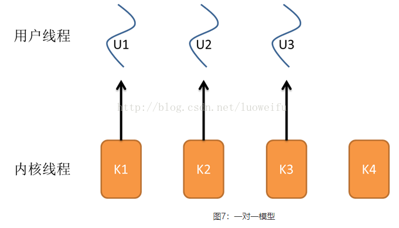

# 协程

协程，又称微线程，纤程。英文名Coroutine，

## 协程的优势

最大的优势就是协程极高的执行效率。因为子程序切换不是线程切换，而是由程序自身控制，因此，没有线程切换的开销，和多线程比，线程数量越多，协程的性能优势就越明显。

第二大优势就是不需要多线程的锁机制，因为只有一个线程，也不存在同时写变量冲突，在协程中控制共享资源不加锁，只需要判断状态就好了，所以执行效率比多线程高很多

## 协程的特点

协程，英文Coroutines，是一种基于线程之上，但又比线程更加轻量级的存在，这种由程序员自己写程序来管理的轻量级线程叫做『用户空间线程』，具有对内核来说不可见的特性。

1. 线程的切换由操作系统负责调度，协程由用户自己进行调度，因此减少了上下文切换，提高了效率。
2. 线程的默认Stack大小是1M，而协程更轻量，接近1K。因此可以在相同的内存中开启更多的协程。
3. 由于在同一个线程上，因此可以避免竞争关系而使用锁。
4. 适用于被阻塞的，且需要大量并发的场景。但不适用于大量计算的多线程，遇到此种情况，更好实用线程去解决。

## 协程的原理

当出现IO阻塞的时候，由协程的调度器进行调度，通过将数据流立刻yield掉（主动让出），并且记录当前栈上的数据，阻塞完后立刻再通过线程恢复栈，并把阻塞的结果放到这个线程上去跑，这样看上去好像跟写同步代码没有任何差别，这整个流程可以称为coroutine，而跑在由`coroutine`负责调度的线程称为`Fiber`。比如Golang里的 go关键字其实就是负责开启一个`Fiber`，让`func`逻辑跑在上面。

由于协程的暂停完全由程序控制，发生在用户态上；而线程的阻塞状态是由操作系统内核来进行切换，发生在内核态上。
因此，协程的开销远远小于线程的开销，也就没有了ContextSwitch（上下文切换）上的开销。

## 协程和线程的比较

# 进程

我们都知道计算机的核心是CPU，它承担了所有的计算任务；而操作系统是计算机的管理者，它负责任务的调度、资源的分配和管理，统领整个计算机硬件；应用程序则是具有某种功能的程序，程序是运行于操作系统之上的。

  进程是一个具有一定独立功能的程序在一个数据集上的一次动态执行的过程，是操作系统进行资源分配和调度的一个独立单位，是应用程序运行的载体。进程是一种抽象的概念，从来没有统一的标准定义。

进程一般由程序、数据集合和进程控制块三部分组成。

- 程序用于描述进程要完成的功能，是控制进程执行的指令集；
- 数据集合是程序在执行时所需要的数据和工作区；
- 程序控制块(Program Control Block，简称PCB)，包含进程的描述信息和控制信息，是进程存在的唯一标志。

进程具有的特征：

- 动态性：进程是程序的一次执行过程，是临时的，有生命期的，是动态产生，动态消亡的；
- 并发性：任何进程都可以同其他进程一起并发执行；
- 独立性：进程是系统进行资源分配和调度的一个独立单位；
- 结构性：进程由程序、数据和进程控制块三部分组成。

# 线程

在早期的操作系统中并没有线程的概念，进程是能拥有资源和独立运行的最小单位，也是程序执行的最小单位。任务调度采用的是时间片轮转的抢占式调度方式，而进程是任务调度的最小单位，每个进程有各自独立的一块内存，使得各个进程之间内存地址相互隔离。

  后来，随着计算机的发展，对CPU的要求越来越高，进程之间的切换开销较大，已经无法满足越来越复杂的程序的要求了。于是就发明了线程。

  线程是程序执行中一个单一的顺序控制流程，是程序执行流的最小单元，是处理器调度和分派的基本单位。一个进程可以有一个或多个线程，各个线程之间共享程序的内存空间(也就是所在进程的内存空间)。一个标准的线程由线程ID、当前指令指针(PC)、寄存器和堆栈组成。而进程由内存空间(代码、数据、进程空间、打开的文件)和一个或多个线程组成。

## 进程与线程的区别

1. 线程是程序执行的最小单位，而进程是操作系统分配资源的最小单位；
2. 一个进程由一个或多个线程组成，线程是一个进程中代码的不同执行路线；
3. 进程之间相互独立，但同一进程下的各个线程之间共享程序的内存空间(包括代码段、数据集、堆等)及一些进程级的资源(如打开文件和信号)，某进程内的线程在其它进程不可见；
4. 调度和切换：线程上下文切换比进程上下文切换要快得多。

线程与进程关系的示意图：

## 内核线程

多核(心)处理器是指在一个处理器上集成多个运算核心从而提高计算能力，也就是有多个真正并行计算的处理核心，每一个处理核心对应一个内核线程。
内核线程（Kernel Thread，KLT）就是直接由操作系统内核支持的线程，这种线程由内核来完成线程切换，内核通过操作调度器对线程进行调度，并负责将线程的任务映射到各个处理器上。一般一个处理核心对应一个内核线程，比如单核处理器对应一个内核线程，双核处理器对应两个内核线程，四核处理器对应四个内核线程。

程序一般不会直接去使用内核线程，而是去使用内核线程的一种高级接口——轻量级进程（Lightweight Process，LWP），轻量级进程就是我们通常意义上所讲的线程，也被叫做用户线程。由于每个轻量级进程都由一个内核线程支持，因此只有先支持内核线程，才能有轻量级进程。用户线程与内核线程的对应关系有三种模型：一对一模型、多对一模型、多对多模型，在这以4个内核线程、3个用户线程为例对三种模型进行说明。

### 一对一模型

对于一对一模型来说，一个用户线程就唯一地对应一个内核线程(反过来不一定成立，一个内核线程不一定有对应的用户线程)。这样，如果CPU没有采用超线程技术(如四核四线程的计算机)，一个用户线程就唯一地映射到一个物理CPU的内核线程，线程之间的并发是真正的并发。一对一模型使用户线程具有与内核线程一样的优点，一个线程因某种原因阻塞时其他线程的执行不受影响；此处，一对一模型也可以让多线程程序在多处理器的系统上有更好的表现。

但一对一模型也有两个缺点：

1. 许多操作系统限制了内核线程的数量，因此一对一模型会使用户线程的数量受到限制；
2. 许多操作系统内核线程调度时，上下文切换的开销较大，导致用户线程的执行效率下降。

### 多对一模型

多对一模型将多个用户线程映射到一个内核线程上，线程之间的切换由用户态的代码来进行，系统内核感受不到线程的实现方式。用户线程的建立、同步、销毁等都在用户态中完成，不需要内核的介入。因此相对一对一模型，多对一模型的线程上下文切换速度要快许多；此外，多对一模型对用户线程的数量几乎无限制。

但多对一模型也有两个缺点：

1. 如果其中一个用户线程阻塞，那么其它所有线程都将无法执行，因为此时内核线程也随之阻塞了；
2. 在多处理器系统上，处理器数量的增加对多对一模型的线程性能不会有明显的增加，因为所有的用户线程都映射到一个处理器上了。

### 多对多模型

  多对多模型结合了一对一模型和多对一模型的优点，将多个用户线程映射到多个内核线程上。由线程库负责在可用的可调度实体上调度用户线程，这使得线程的上下文切换非常快，因为它避免了系统调用。但是增加了复杂性和优先级倒置的可能性，以及在用户态调度程序和内核调度程序之间没有广泛（且高昂）协调的次优调度。

多对多模型的优点有：

1. 一个用户线程的阻塞不会导致所有线程的阻塞，因为此时还有别的内核线程被调度来执行；
2. 多对多模型对用户线程的数量没有限制；
3. 在多处理器的操作系统中，多对多模型的线程也能得到一定的性能提升，但提升的幅度不如一对一模型的高。

## 线程的生命周期

当线程的数量小于处理器的数量时，线程的并发是真正的并发，不同的线程运行在不同的处理器上。但当线程的数量大于处理器的数量时，线程的并发会受到一些阻碍，此时并不是真正的并发，因为此时至少有一个处理器会运行多个线程。

进程在运行过程有三种状态：就绪、运行、阻塞，创建和退出状态描述的是进程的创建过程和退出过程。

- 创建：进程正在创建，还不能运行。操作系统在创建进程时要进行的工作包括分配和建立进程控制块表项、建立资源表格并分配资源、加载程序并建立地址空间；
- 就绪：时间片已用完，此线程被强制暂停，等待下一个属于它的时间片到来；
- 运行：此线程正在执行，正在占用时间片；
- 阻塞：也叫等待状态，等待某一事件(如IO或另一个线程)执行完；
- 退出：进程已结束，所以也称结束状态，释放操作系统分配的资源。

- 创建：一个新的线程被创建，等待该线程被调用执行；
- 就绪：时间片已用完，此线程被强制暂停，等待下一个属于它的时间片到来；
- 运行：此线程正在执行，正在占用时间片；
- 阻塞：也叫等待状态，等待某一事件(如IO或另一个线程)执行完；
- 退出：一个线程完成任务或者其他终止条件发生，该线程终止进入退出状态，退出状态释放该线程所分配的资源。

> 参考

[一文读懂什么是进程、线程、协程 - 回首笑人间 - 博客园 (cnblogs.com)](https://www.cnblogs.com/Survivalist/p/11527949.html#进程)

