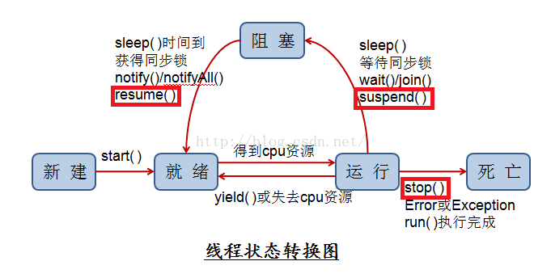

# MySql的读锁（S ）和写锁（X ）

`读锁又称为共享锁`，简称S锁，顾名思义，共享锁就是多个事务对于同一数据可以共享一把锁，**都能访问到数据，但是只能读不能修改。**

`写锁又称为排他锁`，简称X锁，顾名思义，排他锁就是不能与其他所并存，如一个事务获取了一个数据行的排他锁，其他事务就不能再获取该行的其他锁，包括共享锁和排他锁，但是获取排他锁的事务是可以对数据就行读取和修改。

`mysql InnoDB`引擎默认的修改数据语句，`update,delete,insert` 都会自动给涉及到的数据加上排他锁，`select` 语句默认不会加任何锁类型。

如果加`排他锁`可以使用`select ...for update` 语句，加`共享锁`可以使用`select ... lock in share mode`语句。所以加过排他锁的数据行在其他事务种是不能修改数据的，也不能通过`for update`和`lock in share mode`锁的方式查询数据，但可以直接通过`select ...from...`查询数据，因为普通查询没有任何锁机制。

## mysql锁的范围

MySQL数据库根据锁锁定数据的颗粒度可分为表级锁、行级锁和页级锁

## 意向锁（IS 意向共享锁  IX意向排他锁）

- **IX，IS是表级锁，不会和行级的X，S锁发生冲突。只会和表级的X，S发生冲突**
- 行级别的X和S按照普通的共享、排他规则即可。所以之前的示例中第2步不会冲突，只要写操作不是同一行，就不会发生冲突。

解决完这个疑问，再来回答意向锁的作用。意向锁是在添加行锁之前添加。

当再向一个表添加表级X锁的时候

- 如果没有意向锁的话，则需要遍历所有整个表判断是否有行锁的存在，以免发生冲突
- 如果有了意向锁，只需要判断该意向锁与即将添加的表级锁是否兼容即可。因为意向锁的存在代表了，有行级锁的存在或者即将有行级锁的存在。因而无需遍历整个表，即可获取结果

# java同步锁（Synchronized）



在图中，红框标识的部分方法，可以认为已过时，不再使用。

（1）wait、notify、notifyAll是线程中通信可以使用的方法。线程中调用了wait方法，则进入阻塞状态，只有等另一个线程调用与wait同一个对象的notify方法。这里有个特殊的地方，调用wait或者notify，前提是需要获取锁，也就是说，需要在同步块中做以上操作。

（2）join方法。该方法主要作用是在该线程中的run方法结束后，才往下执行。如以下代码：

```java
package com.thread.simple;
public class ThreadJoin {
	public static void main(String[] args) {
		Thread thread= new Thread(new Runnable() {
			@Override
			public void run() {
				System.err.println("线程"+Thread.currentThread().getId()+" 打印信息");
			}
		});
		thread.start();
		try {
			thread.join();
		} catch (InterruptedException e) {
			// TODO Auto-generated catch block
			e.printStackTrace();
		}
		System.err.println("主线程打印信息");
	}
}
/*
该方法显示的信息是：
线程8 打印信息
主线程打印信息

如果去掉其中的join方法，则显示如下：

主线程打印信息
线程8 打印信息
*/
```

（3）yield方法。这个是线程本身的调度方法，使用时你可以在run方法执行完毕时，调用该方法，告知你已可以出让内存资源。

其他的线程方法，基本都会在日常中用到，如start、run、sleep，这里就不再介绍。

## Synchronized（同步锁）

在Java中使用多线程，你就不能绕过同步锁这个概念。这在多线程中是十分重要的。

在Java多线程的使用中，你必然会遇到一个问题：多个线程共享一个或者一组资源，这资源包括内存、文件等。

很常见的一个例子是，张三在银行账户存有9999元，经过多次的取100，存100后，账户还有多少钱？

如果不使用同步的话，每次打印出来的信息都不相同

同步锁有下面几种修饰方式

### 原理

synchronized 方法控制对类成员变量的访问：每个类实例对应一把锁，每个 synchronized 方法都必须获得调用该方法的类实例的锁方能执行，否则所属线程阻塞，方法一旦执行，就独占该锁，直到从该方法返回时才将锁释放，此后被阻塞的线程方能获得该锁，重新进入可执行状态。这种机制确保了同一时刻对于每一个类实例，其所有声明为 synchronized 的成员函数中至多只有一个处于可执行状态（因为至多只有一个能够获得该类实例对应的锁），从而有效避免了类成员变量的访问冲突（只要所有可能访问类成员变量的方法均被声明为 synchronized）。

### （1）对动态方法的修饰。

作用的是调用该方法的对象（或者说对象引用）。

```java
public synchronized void doSomething(){}
```

### （ 2） 对代码块的修饰。

作用的是调用该方法的对象（或者说对象引用）。

```java
public  void  increaseAmt(float increaseAmt){
    try {
    	TimeUnit.SECONDS.sleep(1);
    } catch (InterruptedException e) {
        // TODO Auto-generated catch block
        e.printStackTrace();
    }
    synchronized (this) {
    	System.out.println(this);
    	amt+=increaseAmt;
    }
}
```

### （3）对静态方法的修饰。

作用的是静态方法所在类的所有对象（或者说对象引用）。

```java
public synchronized static  void  increaseAmt(float increaseAmt){
    try {
        TimeUnit.SECONDS.sleep(1);
    } catch (InterruptedException e) {
        // TODO Auto-generated catch block
        e.printStackTrace();
    }
    amt+=increaseAmt;
}
```

### （4）对类的修饰。

作用的是静态方法所在类的所有对象（或者说对象引用）。

```java
synchronized (AccountSynchronizedClass.class) {
	amt-=decreaseAmt;
}
```

## Lock

### 差异

总结来说，Lock和synchronized有以下几点不同：

1）Lock是一个接口，而synchronized是Java中的关键字，synchronized是内置的语言实现；

2）synchronized在发生异常时，会自动释放线程占有的锁，因此不会导致死锁现象发生；而Lock在发生异常时，如果没有主动通过unLock()去释放锁，则很可能造成死锁现象，因此使用Lock时需要在finally块中释放锁；

3）Lock可以让等待锁的线程响应中断，而synchronized却不行，使用synchronized时，等待的线程会一直等待下去，不能够响应中断；

4）通过Lock可以知道有没有成功获取锁，而synchronized却无法办到。

5）Lock可以提高多个线程进行读操作的效率。

在性能上来说，如果竞争资源不激烈，两者的性能是差不多的，而当竞争资源非常激烈时（即有大量线程同时竞争），此时Lock的性能要远远优于synchronized。所以说，在具体使用时要根据适当情况选择。

### 使用

```java
package com.thread.simple;
import java.util.ArrayList;
import java.util.List;
import java.util.concurrent.locks.Lock;
import java.util.concurrent.locks.ReadWriteLock;
import java.util.concurrent.locks.ReentrantLock;
import java.util.concurrent.locks.ReentrantReadWriteLock;
public class LockImp {
    
	private Lock lock=new ReentrantLock();
	private ReadWriteLock rwLock=new ReentrantReadWriteLock();
	private List<Integer> list=new ArrayList<Integer>();
    
	public void doReentrantLock(Thread thread){
		lock.lock();
		System.out.println(thread.getName()+"获取锁");
		try {
			  for(int i=0;i<10;i++){
		        	list.add(i);
		        }
		} catch (Exception e) {
			
		}finally{
			lock.unlock();
			System.out.println(thread.getName()+"释放锁");
		}
	}
	public void doReentrantReadLock(Thread thread){
		rwLock.readLock().lock();
		System.out.println(thread.getName()+"获取读锁");
		try {
			for(int i=0;i<10;i++){
				list.add(i);
			}
		} catch (Exception e) {
			
		}finally{
			rwLock.readLock().unlock();
			System.out.println(thread.getName()+"释放读锁");
		}
	}
	public void doReentrantWriteLock(Thread thread){
		rwLock.writeLock().lock();
		System.out.println(thread.getName()+"获取写锁");
		try {
			for(int i=0;i<10;i++){
				list.add(i);
			}
		} catch (Exception e) {
		}finally{
			rwLock.writeLock().unlock();
			System.out.println(thread.getName()+"释放写锁");
		}
	}
	/**
	 * @param args
	 */
	public static void main(String[] args) {
		final LockImp lockImp=new LockImp();
		final Thread thread1=new Thread();
		final Thread thread2=new Thread();
		final Thread thread3=new Thread();
		new Thread(new Runnable() {
			@Override
			public void run() {
				lockImp.doReentrantLock(thread1);
			}
		}).start();
		new Thread(new Runnable() {
					
					@Override
					public void run() {
						lockImp.doReentrantLock(thread2);
					}
				}).start();
		new Thread(new Runnable() {
			@Override
			public void run() {
				lockImp.doReentrantLock(thread3);
			}
		}).start();
		lockImp.doReentrantReadLock(thread1);
		lockImp.doReentrantReadLock(thread2);
		lockImp.doReentrantReadLock(thread3);
		lockImp.doReentrantWriteLock(thread1);
		lockImp.doReentrantWriteLock(thread2);
		lockImp.doReentrantWriteLock(thread3);
	}
}
```


> 参考

[Java多线程简析——Synchronized（同步锁）、Lock以及线程池_双斧狂暴战专栏-CSDN博客](https://blog.csdn.net/yangzhaomuma/article/details/51236976)

[java 多线程 Synchronized方法和方法块 synchronized(this)和synchronized(object)的理解_xxyyww的专栏-CSDN博客](https://blog.csdn.net/xxyyww/article/details/5780806)