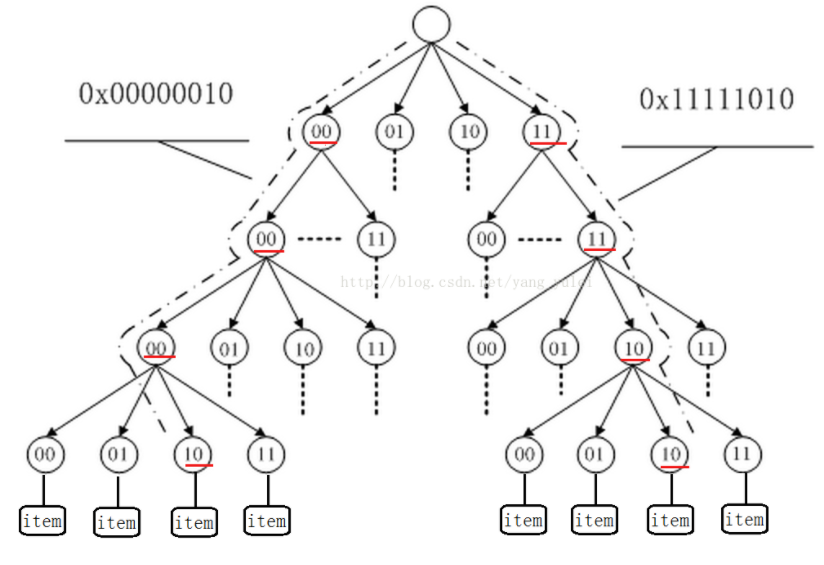

# go的几种web框架

beego

iris

gin

echo

revel


# 为什么路由查找算法更快

基于 [radix tree](http://en.wikipedia.org/wiki/Radix_tree) ，Echo 的路由查询速度非常快。路由使用 [sync pool](https://golang.org/pkg/sync/#Pool) 来重用内存，实现无 GC 开销下的零动态内存分配。

## radixTreee（基数树）

对于 长整型数据的映射，如何解决Hash冲突和Hash表大小的设计是一个很头疼的问题。
radix树就是针对这种稀疏的长整型数据查找，能快速且节省空间地完成映射。借助于Radix树，我们可以 实现对于长整型数据类型的路由。 利用radix树可以根据一个长整型（比如一个长ID）快速查找到其对应的对象指针。这比用hash映射来的简单，也更节省空间，使用hash映射hash函数难以设计，不恰当的hash函数可能增大冲突，或浪费空间。

radix tree是一种多叉搜索树，树的叶子结点是实际的数据条目。每个结点有一个固定的、2^n指针指向子结点（每个指针称为槽slot，n为划分的基的大小）

### 插入、删除 

radix Tree(基数树) 其实就差不多是传统的二叉树，只是在寻找方式上，利用比如一个unsigned int的类型的每一个比特位作为树节点的判断。
可以这样说，比如一个数1000101010101010010101010010101010，那么按照Radix 树的插入就是在根节点，如果遇到0，就指向左节点，如果遇到1就指向右节点，在插入过程中构造树节点，在删除过程中删除树节点。如果觉得太多的调用Malloc的话，可以采用池化技术，预先分配多个节点。
（使用一个比特位判断，会使树的高度过高，非叶节点过多。故在实际应用中，我们一般是使用多个比特位作为树节点的判断，但多比特位会使节点的子节点槽变多，增大节点的体积，一般选用2个或4个比特位作为树节点即可）



### 插入：

我们在插入一个新节点时，我们根据数据的比特位，在树中向下查找，若没有相应结点，则生成相应结点，直到数据的比特位访问完，则建立叶节点映射相应的对象。

### 删除：

我们可以“惰性删除”，即沿着路径查找到叶节点后，直接删除叶节点，中间的非叶节点不删除。

## sync pool

我们通常用golang来构建高并发场景下的应用，但是由于golang内建的GC机制会影响应用的性能，为了减少GC，golang提供了对象重用的机制，也就是sync.Pool对象池。 sync.Pool是可伸缩的，并发安全的。其大小仅受限于内存的大小，可以被看作是一个存放可重用对象的值的容器。 设计的目的是存放已经分配的但是暂时不用的对象，在需要用到的时候直接从pool中取。

任何存放区其中的值可以在任何时候被删除而不通知，在高负载下可以动态的扩容，在不活跃时对象池会收缩。

使用：

```go
package main
import (
    "sync"
    "time"
    "fmt"
)
var bytePool = sync.Pool{
    New: func() interface{} {
        b := make([]byte, 1024)
        return &b
    },
}
func main()  {
    //defer
    //debug.SetGCPercent(debug.SetGCPercent(-1))
    a := time.Now().Unix()
    for i:=0;i<1000000000;i++{
        obj := make([]byte, 1024)
        _ = obj
    }
    b := time.Now().Unix()
    for j:=0;j<1000000000;j++  {
        obj := bytePool.Get().(*[]byte)
        _ = obj
        bytePool.Put(obj)
    }
    c := time.Now().Unix()
    fmt.Println("without pool ", b - a, "s")
    fmt.Println("with    pool ", c - b, "s")
}
```

通过以上的解读，我们可以看到，Get方法并不会对获取到的对象值做任何的保证，因为放入本地池中的值有可能会在任何时候被删除，但是不通知调用者。放入共享池中的值有可能被其他的goroutine偷走。 所以对象池比较适合用来存储一些临时切状态无关的数据，但是不适合用来存储数据库连接的实例，因为存入对象池重的值有可能会在垃圾回收时被删除掉，这违反了数据库连接池建立的初衷。

根据上面的说法，Golang的对象池严格意义上来说是一个临时的对象池，适用于储存一些会在goroutine间分享的临时对象。主要作用是减少GC，提高性能。在Golang中最常见的使用场景是fmt包中的输出缓冲区。

> 参考

[查找——图文翔解RadixTree（基数树）_菜鸟的自留地-mooyang-CSDN博客_radix tree](https://blog.csdn.net/yang_yulei/article/details/46371975)

[深入Golang之sync.Pool详解 - sunsky303 - 博客园 (cnblogs.com)](https://www.cnblogs.com/sunsky303/p/9706210.html)