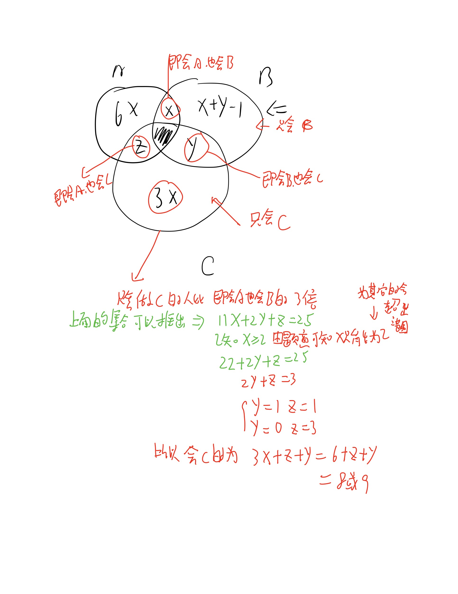

## (10),11,9,9,8,7,7,5,6

有两种理解： 第一种是 10,9,8,7,6 和 11,9,7,5 拼接起来

第二种： 第一项和最后一项结果为16，第二项和倒数第二项和为16，以此类推

## 做菜问题

小米公司举行厨艺大PK，有24人参加，参赛项目包括ABC三道菜，已知：

1. 每人至少能做一道菜
2. 没有人会做三道菜
3. 只会做A的人是只会做C的人的2倍
4. 只会做C的人是既会做A又会做B的人的3倍
5. 在会做B的人中，只会做B的人比其它的少1人
6. 不止一个人会做A又会做B

问：共有()人会做C?

这个题目需要我们使用未知数法来进行计算

## 称球问题

一般化这个问题，有n个球，其中1个球是次品，质量比其他球都要重。现在有一个没有砝码的天平，要求称t次，将次品球挑出。当3^t >=n时，有解且当且仅当3^t=2n+1时，需要1个标准球辅助。所以说只要小于等于27的球，都可以的

