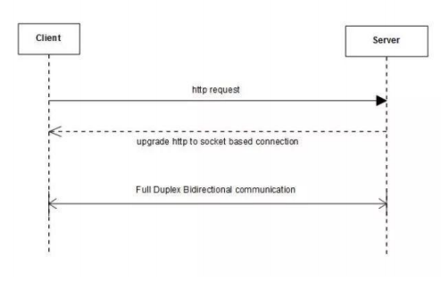

# 什么是 Spring Boot？

 多年来，随着新功能的增加，spring 变得越来越复杂。只需访问 https://spring.io/projects 页面，我们就会看到可以在我们的应用程序中使用的 所有 Spring 项目的不同功能。如果必须启动一个新的 Spring 项目，我们必须添 加构建路径或添加 Maven 依赖关系，配置应用程序服务器，添加 spring 配置。 因此，开始一个新的 spring 项目需要很多努力，因为我们现在必须从头开始做所 有事情。 Spring Boot 是解决这个问题的方法。Spring Boot 已经建立在现有 spring 框架 之上。使用 spring 启动，我们避免了之前我们必须做的所有样板代码和配置。因 此，Spring Boot 可以帮助我们以最少的工作量，更加健壮地使用现有的 Spring 功能。

# Spring Boot 有哪些优点？

Spring Boot 的优点有：

 1、减少开发，测试时间和努力。 

2、使用 JavaConfig 有助于避免使用 XML。

 3、避免大量的 Maven 导入和各种版本冲突。 

4、提供意见发展方法。

 5、通过提供默认值快速开始开发。

 6、没有单独的 Web 服务器需要。这意味着你不再需要启动 Tomcat，Glassfish 或其他任何东西。

 7、需要更少的配置 因为没有 web.xml 文件。只需添加用@ Configuration 注释 的类，然后添加用@Bean 注释的方法，Spring 将自动加载对象并像以前一样对其 进行管理。您甚至可以将@Autowired 添加到 bean 方法中，以使 Spring 自动装 入需要的依赖关系中。 

8、基于环境的配置 使用这些属性，您可以将您正在使用的环境传递到应用程序： -Dspring.profiles.active = {enviornment}。在加载主应用程序属性文件后， Spring 将在（application{environment} .properties）中加载后续的应用程序属 性文件。

# 什么是 JavaConfig？

Spring JavaConfig 是 Spring 社区的产品，它提供了配置 Spring IoC 容器的纯 Java 方法。因此它有助于避免使用 XML 配置。使用 JavaConfig 的优点在于：

 1、面向对象的配置。由于配置被定义为 JavaConfig 中的类，因此用户可以充分 利用 Java 中的面向对象功能。一个配置类可以继承另一个，重写它的@Bean 方 法等。

 2、减少或消除 XML 配置。基于依赖注入原则的外化配置的好处已被证明。但是， 许多开发人员不希望在 XML 和 Java 之间来回切换。JavaConfig 为开发人员提供 了一种纯 Java 方法来配置与 XML 配置概念相似的 Spring 容器。从技术角度来讲， 只使用 JavaConfig 配置类来配置容器是可行的，但实际上很多人认为将 JavaConfig 与 XML 混合匹配是理想的。

 3、类型安全和重构友好。JavaConfig 提供了一种类型安全的方法来配置 Spring 容器。由于 Java 5.0 对泛型的支持，现在可以按类型而不是按名称检索 bean，不 需要任何强制转换或基于字符串的查找。

# 如何重新加载 Spring Boot 上的更改，而无需重新启动服务 器？

这可以使用 DEV 工具来实现。通过这种依赖关系，您可以节省任何更改，嵌入式 tomcat 将重新启动。Spring Boot 有一个开发工具（DevTools）模块，它有助于 提高开发人员的生产力。Java 开发人员面临的一个主要挑战是将文件更改自动部 署到服务器并自动重启服务器。开发人员可以重新加载 Spring Boot 上的更改， 而无需重新启动服务器。这将消除每次手动部署更改的需要。Spring Boot 在发布 它的第一个版本时没有这个功能。这是开发人员最需要的功能。DevTools 模块完 全满足开发人员的需求。该模块将在生产环境中被禁用。它还提供 H2 数据库控制 台以更好地测试应用程序。

```xml
<dependency>
<groupId>org.springframework.boot</groupId>
<artifactId>spring-boot-devtools</artifactId>
<optional>true</optional>
```

# Spring Boot 中的监视器是什么?

Spring boot actuator 是 spring 启动框架中的重要功能之一。Spring boot 监视 器可帮助您访问生产环境中正在运行的应用程序的当前状态。有几个指标必须在 生产环境中进行检查和监控。即使一些外部应用程序可能正在使用这些服务来向 相关人员触发警报消息。监视器模块公开了一组可直接作为 HTTP URL 访问的 REST 端点来检查状态。

# 如何在 Spring Boot 中禁用 Actuator 端点安全性？

默认情况下，所有敏感的 HTTP 端点都是安全的，只有具有 ACTUATOR 角色的用 户才能访问它们。安全性是使用标准的 HttpServletRequest.isUserInRole 方法实 施的。 我们可以使用 来禁用安全性。只有在执行机构端点在防火墙后访问时，才建议禁用安全性。

# 如何在自定义端口上运行 Spring Boot 应用程序？

为了在自定义端口上运行 Spring Boot 应用程序，您可以在 application.properties 中指定端口。

```
server.port = 8090
```

# 什么是 YAML？

YAML 是一种人类可读的数据序列化语言。它通常用于配置文件。 与属性文件相比，如果我们想要在配置文件中添加复杂的属性，YAML 文件就更加 结构化，而且更少混淆。可以看出 YAML 具有分层配置数据。

# 如何实现 Spring Boot 应用程序的安全性？

为了实现 Spring Boot 的安全性，我们使用 spring-boot-starter-security 依赖 项，并且必须添加安全配置。它只需要很少的代码。配置类将必须扩展 WebSecurityConfigurerAdapter 并覆盖其方法。

# 如何集成 Spring Boot 和 ActiveMQ？

对于集成 Spring Boot 和 ActiveMQ，我们使用 依赖关系。 它只需要很少的配置，并且不需要样板代码。

# 如何使用 Spring Boot 实现分页和排序？

使用 Spring Boot 实现分页非常简单。使用 Spring Data-JPA 可以实现将可分页 的 传递给存储库方法

# 什么是 Swagger？你用 Spring Boot 实现了它吗？

Swagger 广泛用于可视化 API，使用 Swagger UI 为前端开发人员提供在线沙箱。 Swagger 是用于生成 RESTful Web 服务的可视化表示的工具，规范和完整框架实 现。它使文档能够以与服务器相同的速度更新。当通过 Swagger 正确定义时，消 费者可以使用最少量的实现逻辑来理解远程服务并与其进行交互。因此，Swagger 消除了调用服务时的猜测。

# 什么是 Spring Profiles？

Spring Profiles 允许用户根据配置文件（dev，test，prod 等）来注册 bean。因 此，当应用程序在开发中运行时，只有某些 bean 可以加载，而在 PRODUCTION 中，某些其他 bean 可以加载。假设我们的要求是 Swagger 文档仅适用于 QA 环 境，并且禁用所有其他文档。这可以使用配置文件来完成。Spring Boot 使得使用 配置文件非常简单

# 什么是 Spring Batch？

Spring Boot Batch 提供可重用的函数，这些函数在处理大量记录时非常重要，包 括日志/跟踪，事务管理，作业处理统计信息，作业重新启动，跳过和资源管理。 它还提供了更先进的技术服务和功能，通过优化和分区技术，可以实现极高批量和高性能批处理作业。简单以及复杂的大批量批处理作业可以高度可扩展的方式 利用框架处理重要大量的信息。

# 什么是 FreeMarker 模板？

FreeMarker 是一个基于 Java 的模板引擎，最初专注于使用 MVC 软件架构进行动 态网页生成。使用 Freemarker 的主要优点是表示层和业务层的完全分离。程序员 可以处理应用程序代码，而设计人员可以处理 html 页面设计。最后使用 freemarker 可以将这些结合起来，给出最终的输出页面。

# 如何使用 Spring Boot 实现异常处理？

Spring 提供了一种使用 ControllerAdvice 处理异常的非常有用的方法。 我们通 过实现一个 ControlerAdvice 类，来处理控制器类抛出的所有异常。

# 您使用了哪些 starter maven 依赖项？

使用了下面的一些依赖项

```
spring-boot-starter-activemq
spring-boot-starter-security
```

这有助于增加更少的依赖关系，并减少版本的冲突。

# 什么是 CSRF 攻击？

CSRF 代表跨站请求伪造。这是一种攻击，迫使最终用户在当前通过身份验证的 Web 应用程序上执行不需要的操作。CSRF 攻击专门针对状态改变请求，而不是 数据窃取，因为攻击者无法查看对伪造请求的响应。

# 什么是 WebSockets？

WebSocket 是一种计算机通信协议，通过单个 TCP 连接提供全双工通信信道。



1、WebSocket 是双向的 -使用 WebSocket 客户端或服务器可以发起消息发送。 

2、WebSocket 是全双工的 -客户端和服务器通信是相互独立的。

 3、单个 TCP 连接 -初始连接使用 HTTP，然后将此连接升级到基于套接字的连接。 然后这个单一连接用于所有未来的通信

 4、Light -与 http 相比，WebSocket 消息数据交换要轻得多。

# 什么是 AOP？

在软件开发过程中，跨越应用程序多个点的功能称为交叉问题。这些交叉问题与 应用程序的主要业务逻辑不同。因此，将这些横切关注与业务逻辑分开是面向方 面编程（AOP）的地方。

# 什么是 Apache Kafka？

Apache Kafka 是一个分布式发布 - 订阅消息系统。它是一个可扩展的，容错的 发布 - 订阅消息系统，它使我们能够构建分布式应用程序。这是一个 Apache 顶 级项目。Kafka 适合离线和在线消息消费。

# 我们如何监视所有 Spring Boot 微服务？（不完整）

Spring Boot 提供监视器端点以监控各个微服务的度量。这些端点对于获取有关应 用程序的信息（如它们是否已启动）以及它们的组件（如数据库等）是否正常运 行很有帮助。但是，使用监视器的一个主要缺点或困难是，我们必须单独打开应 用程序的知识点以了解其状态或健康状况。想象一下涉及 50 个应用程序的微服务， 管理员将不得不击中所有 50 个应用程序的执行终端。 为了帮助我们处理这种情况，我们将使用位于 的开源项目。 它建立在 Spring Boot Actuator 之上，它提供了一个 Web UI，使 我们能够可视化多个应用程序的度量。

