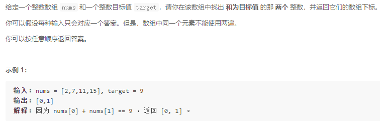
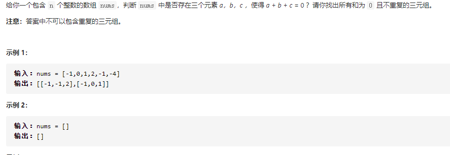

[2.01 Array | LeetCode Cookbook (halfrost.com)](https://books.halfrost.com/leetcode/ChapterTwo/Array/)

> 注意：前面是时间复杂度，后面是空间复杂度

# 简单

## 两数之和（O(n) - O(n)）

[1. 两数之和 - 力扣（LeetCode） (leetcode-cn.com)](https://leetcode-cn.com/problems/two-sum/)

### 题目



### 思路

这个题目的关键部分其实就在于我们知道结果，知道一个值，那么另一个值我们其实也就确定了，对于这种情况，我们可以使用一个map，这个map的key就是值，然后value就是位置信息。

### 题解

```go
func twoSum(nums []int, target int) []int {
	// 创建一个map
	m := make(map[int]int)
	// 遍历整个nums
	for i := 0; i < len(nums); i++ {
		// 关键部分，我没有想到其实我们知道了结果，
		// 知道了其中一个数，其实就知道了另一个数
		another := target - nums[i]
		// 我们的map key存储的是值，value存储的是位置
		if _, ok := m[another]; ok {
			return []int{m[another], i}
		}
		// 如果在map中不存在的话，那我们就把这个数字存入map中
		m[nums[i]] = i
	}
	return nil
}

func main() {
	fmt.Println(twoSum([]int{2,7,11,15},9))
}
```

# 中等

## 三数之和

[15. 三数之和 - 力扣（LeetCode） (leetcode-cn.com)](https://leetcode-cn.com/problems/3sum/)

### 题目



### 思路


### 题解


# 复杂