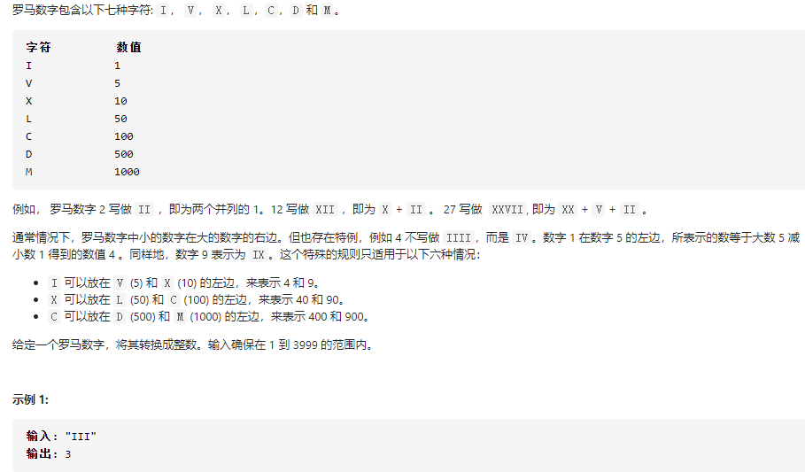
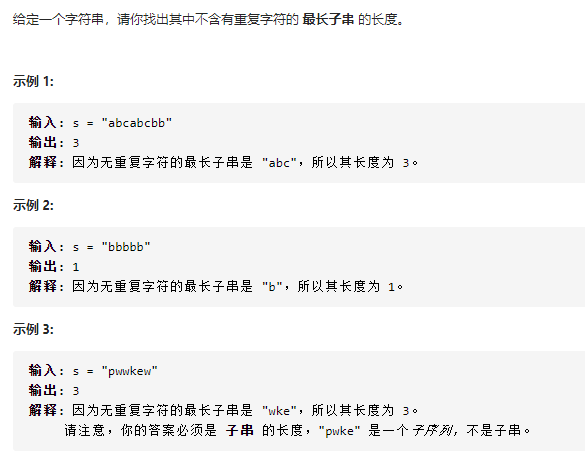

# 简单

## 罗马数字转整数

[13. 罗马数字转整数 - 力扣（LeetCode） (leetcode-cn.com)](https://leetcode-cn.com/problems/roman-to-integer/)

[0013. Roman to Integer | LeetCode Cookbook (halfrost.com)](https://books.halfrost.com/leetcode/ChapterFour/0001~0099/0013.Roman-to-Integer/)

### 题目



### 思路

解法一：我个人思路比较简单就是for循环来遍历整个字符串，然后顺便判断几种特殊情况

解法二： 大佬的思路其实和我的差不多，只是他计算的时候是从后面往前计算的，同时他没有单独判断特殊情况，他通过一个临时变量来存储上一次的信息，如果比这个临时变量大就加否则就减，不需要额外进行判断

### 题解

```go
func romanToInt(s string) int {
   // 初始化map存储信息
   info:=map[string]int{"I":1,"V":5,"X":10,"L":50,"C":100,"D":500,"M":1000}
   sum:=0
   // 遍历string
   for i:=0;i<len(s);i++ {
      num:=0
      // 首先判断特殊情况
      if i < len(s)-1{
         two:=string(s[i])+string(s[i+1])
         switch two {
         case "IX":
            num = 9
         case "IV":
            num = 4
         case "XL":
            num = 40
         case "XC":
            num = 90
         case "CD":
            num = 400
         case "CM":
            num = 900
         }
         if num!=0 {
            i ++
            sum += num
            continue
         }
      }
      sum += info[string(s[i])]
   }
   return sum
}

// 解法二
var roman = map[string]int{
	"I": 1,
	"V": 5,
	"X": 10,
	"L": 50,
	"C": 100,
	"D": 500,
	"M": 1000,
}

func romanToInt(s string) int {
	if s == "" {
		return 0
	}
	num, lastint, total := 0, 0, 0
	// 遍历s
	for i := 0; i < len(s); i++ {
		// 获取char（这里获取是从后面往前获取的）
		char := s[len(s)-(i+1) : len(s)-i]
		// 计算num
		num = roman[char]
		// 如果这个值比上一次的要小，那么我们就减一下，否则就加一下
		if num < lastint {
			total = total - num
		} else {
			total = total + num
		}
		lastint = num
	}
	return total
}
```

# 中等

## 无重复字符的最长子串

[3. 无重复字符的最长子串 - 力扣（LeetCode） (leetcode-cn.com)](https://leetcode-cn.com/problems/longest-substring-without-repeating-characters/)

[0003. Longest Substring Without Repeating Characters | LeetCode Cookbook (halfrost.com)](https://books.halfrost.com/leetcode/ChapterFour/0001~0099/0003.Longest-Substring-Without-Repeating-Characters/)

### 题目



### 思路

解法一：直接使用暴力算法，使用两层for循环，然后使用map来判断当前元素是否重复，更具体的可以看代码

解法二：使用位图


### 题解

```go
func lengthOfLongestSubstring(s string) int {
   i,j:= 0,0
   max:=""
   // 遍历s字符串
   for i=0;i<len(s);i++ {
      // 为了判断是否重复，这里我们使用一个map
      m:=make(map[string]int)
      // 第二层遍历，这里我们从i的位置开始
      for j=i;j<len(s);j++ {
         // 先判断是否重复
         if _,ok:=m[string(s[j])];!ok{
            // 不存在就插入
            m[string(s[j])] = j
         } else {
            break
         }
         // 这里我们判断当前的长度是否为最长，如果是就返回
         if j-i+1 > len(max) {
            max = s[i:j+1]
         }
      }
   }
   return len(max)
}
```

# 困难