## 进程调度的策略

### 1.批处理系统

- 先来先服务 first-come first-serverd（FCFS）

按照请求的顺序进行调度。非抢占式，开销小，无饥饿问题，响应时间不确定（可能很慢）；

对短进程不利，对IO密集型进程不利

- 最短作业优先 shortest job first（SJF）

按估计运行时间最短的顺序进行调度。非抢占式，吞吐量高，开销可能较大，可能导致饥饿问题；

对短进程提供好的响应时间，对长进程不利。

- 最短剩余时间邮箱 shortest remaining time next（SRTN）

按剩余运行时间的顺序进行调度。(最短作业优先的抢占式版本)。吞吐量高，开销可能较大，提供好的响应时间；

可能导致饥饿问题，对长进程不利。

- 最高响应比优先 Highest Response Ratio Next（HRRN）

响应比 = 1+ 等待时间/处理时间。同时考虑了等待时间的长短和估计需要的执行时间长短，很好的平衡了长短进程。非抢占，吞吐量高，开销可能较大，提供好的响应时间，无饥饿问题。

### 2.交互式系统

- 时间片轮转 Round Robin

将所有就绪进程按 FCFS 的原则排成一个队列，用完时间片的进程排到队列最后。抢占式（时间片用完时），开销小，无饥饿问题，为短进程提供好的响应时间；

若时间片小，进程切换频繁，吞吐量低；若时间片太长，实时性得不到保证。

- 优先级调度算法

为每个进程分配一个优先级，按优先级进行调度。为了防止低优先级的进程永远等不到调度，可以随着时间的推移增加等待进程的优先级。

- 多级反馈队列调度算法 Multilevel Feedback Queue

设置多个就绪队列1、2、3...，优先级递减，时间片递增。只有等到优先级更高的队列为空时才会调度当前队列中的进程。如果进程用完了当前队列的时间片还未执行完，则会被移到下一队列。

抢占式（时间片用完时），开销可能较大，对IO型进程有利，可能会出现饥饿问题。

### 什么叫优先级反转

高优先级的进程等待被一个低优先级进程占用的资源时，就会出现优先级反转，即优先级较低的进程比优先级较高的进程先执行。

解决方法：

- 优先级天花板(priority ceiling)：当任务申请某资源时，把该任务的优先级提升到可访问这个资源的所有任务中的最高优先级，这个优先级称为该资源的优先级天花板。简单易行。
- 优先级继承(priority inheritance)：当任务A申请共享资源S时，如果S正在被任务C使用，通过比较任务C与自身的优先级，如发现任务C的优先级小于自身的优先级，则将任务C的优先级提升到自身的优先级，任务C释放资源S后，再恢复任务C的原优先级。

## 什么是僵尸进程？

一个子进程结束后，它的父进程并没有等待它（调用wait或者waitpid），那么这个子进程将成为一个僵尸进程。僵尸进程是一个已经死亡的进程，但是并没有真正被销毁。它已经放弃了几乎所有内存空间，没有任何可执行代码，也不能被调度，仅仅在进程表中保留一个位置，记载该进程的进程ID、终止状态以及资源利用信息(CPU时间，内存使用量等等)供父进程收集，除此之外，僵尸进程不再占有任何内存空间。这个僵尸进程可能会一直留在系统中直到系统重启。

危害：占用进程号，而系统所能使用的进程号是有限的；占用内存。

以下情况不会产生僵尸进程：

- 该进程的父进程先结束了。每个进程结束的时候，系统都会扫描是否存在子进程，如果有则用Init进程接管，成为该进程的父进程，并且会调用wait等待其结束。
- 父进程调用wait或者waitpid等待子进程结束（需要每隔一段时间查询子进程是否结束）。wait系统调用会使父进程暂停执行，直到它的一个子进程结束为止。waitpid则可以加入`WNOHANG`(wait-no-hang)选项，如果没有发现结束的子进程，就会立即返回，不会将调用waitpid的进程阻塞。同时，waitpid还可以选择是等待任一子进程（同wait），还是等待指定pid的子进程，还是等待同一进程组下的任一子进程，还是等待组ID等于pid的任一子进程；
- 子进程结束时，系统会产生`SIGCHLD`(signal-child)信号，可以注册一个信号处理函数，在该函数中调用waitpid，等待所有结束的子进程（注意：一般都需要循环调用waitpid，因为在信号处理函数开始执行之前，可能已经有多个子进程结束了，而信号处理函数只执行一次，所以要循环调用将所有结束的子进程回收）；
- 也可以用`signal(SIGCLD, SIG_IGN)`(signal-ignore)通知内核，表示忽略`SIGCHLD`信号，那么子进程结束后，内核会进行回收。

## 什么是孤儿进程？

一个父进程已经结束了，但是它的子进程还在运行，那么这些子进程将成为孤儿进程。孤儿进程会被Init（进程ID为1）接管，当这些孤儿进程结束时由Init完成状态收集工作。

## 什么是用户态和内核态？

为了限制不同程序的访问能力，防止一些程序访问其它程序的内存数据，CPU划分了用户态和内核态两个权限等级。

- 用户态只能受限地访问内存，且不允许访问外围设备，没有占用CPU的能力，CPU资源可以被其它程序获取；
- 内核态可以访问内存所有数据以及外围设备，也可以进行程序的切换。

所有用户程序都运行在用户态，但有时需要进行一些内核态的操作，比如从硬盘或者键盘读数据，这时就需要进行系统调用，使用**陷阱指令**，CPU切换到内核态，执行相应的服务，再切换为用户态并返回系统调用的结果。

### 为什么要分用户态和内核态？

- 安全性：防止用户程序恶意或者不小心破坏系统/内存/硬件资源；
- 封装性：用户程序不需要实现更加底层的代码；
- 利于调度：如果多个用户程序都在等待键盘输入，这时就需要进行调度；统一交给操作系统调度更加方便。

### 如何从用户态切换到内核态？

- 系统调用：比如读取命令行输入。本质上还是通过中断实现
- 用户程序发生异常时：比如缺页异常
- 外围设备的中断：外围设备完成用户请求的操作之后，会向CPU发出中断信号，这时CPU会转去处理对应的中断处理程序

## 用户级线程和内核级线程

一类是用户级线程(user level thread)。对于这类线程，有关线程管理的所有工作都由应用程序完成，内核意识不到线程的存在。在应用程序启动后，操作系统分配给该程序一个进程号，以及其对应的内存空间等资源。应用程序通常先在一个线程中运行，该线程被成为主线“程。在其运行的某个时刻，可以通过调用线程库中的函数创建一个在相同进程中运行的新线程。 用户级线程的好处是非常高效，不需要进入内核空间，但并发效率不高。

另一类是内核级线程(kernel level thread)。对于这类线程，有关线程管理的所有工作由内核完成，应用程序没有进行线程管理的代码，只能调用内核线程的接口。内核维护进程及其内部的每个线程，调度也由内核基于线程架构完成。内核级线程的好处是，内核可以将不同线程更好地分配到不同的CPU，以实现真正的并行计算。

事实上，在现代操作系统中，往往使用组合方式实现多线程，即线程创建完全在用户空间中完成，并且一个应用程序中的多个用户级线程被映射到一些内核级线程上，相当于是一种折中方案。

## 上下文切换

对于单核单线程CPU而言，在某一时刻只能执行一条CPU指令。上下文切换(Context Switch)是一种将CPU资源从一个进程分配给另一个进程的机制。从用户角度看，计算机能够并行运行多个进程，这恰恰是操作系统通过快速上下文切换造成的结果。在切换的过程中，操作系统需要先存储当前进程的状态(包括内存空间的指针，当前执行完的指令等等)，再读入下一个进程的状态，然后执行此进程。

## 系统调用

系统调用(System call)是程序向系统内核请求服务的方式。可以包括硬件相关的服务(例如，访问硬盘等)，或者创建新进程，调度其他进程等。系统调用是程序和操作系统之间的重要接口。

# 进程调度方式

Long-term scheduling（长程调度）

Medium-term scheduling（中程调度）

Short-term scheduling（短程调度）

## 三种调度所处的位置

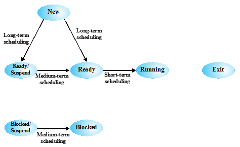

（1）长程调度决定把后备队列中的哪些作业调入内存，创建进程并加入相应的队列中

（2）中程调度按一定的算法将“外存”中已具备条件的进程换入内存中，而将内存中处于阻塞状态的某些进程换出至外存

（3）短程调度决定从就绪队列中哪一个进程应先获得处理器，并将处理机分配给选定的进程

4.长程调度和短程调度是“单向的”，中程调度是“双向的”

## 长程调度（也叫高级调度、作业调度）

（1）长程调度决定哪一个程序何时可以进入到系统中处理（2）决策1：何时创建一个新进程。由要求的系统并发度驱动。创建的进程越多，每个进程可以执行的时间百分比就越小（3）决策2：加入哪一个新进程。基于简单的先来先服务原则、基于管理的系统性能的工具等（优先级、期待执行时间和I/O需求）（4）执行的频率最低

## 中程调度（也叫中级调度）

（1）为提高系统吞吐量和内存利用率而引入的内外存对换功能（换出时，进程为挂起状态），主要涉及内存管理与扩充（2）将进程的部分或全部加载到内存中（3）换入决策基于管理多道程序并发程度的要求（4）执行的频率比长程调度要频繁些

## 短程调度（也叫低级调度、进程调度）

（1）执行得最频繁，要求在实现时达到高效率（2）短程调度程序也称作分派程序（3）主要任务：按照某种策略和方法选取一个处于就绪状态的进程占用处理机，包括-保存处理机现场信息-按某种算法选取进程-把处理机分配给进程（4）短程调度的三个基本机制：排队器、分派器、上下文切换机制

# 调度算法

## 决策模式

决策模式通常分为两类：非抢占、抢占

（1）非抢占：一旦进程处于运行状态，它就不断执行直到终止，或者为等I/O、或请求某些操作系统服务而阻塞自己

（2）抢占：当前正在运行的进程被操作系统中断，并转移到就绪状态。可能对所有进程提供较好的服务，因为它们避免任何一个进程独占处理器太长的时间

非抢占、抢占好理解。对于非抢占，进程一旦获得CPU使用权，除非自己放弃，任何进程不得剥夺它使用它的CPU使用权，反之就是抢占。要求：要能根据调度算法的执行过程判断它的决策模式。

## FCFS 先来先服务

原则：

（1）每个进程就绪后，加入就绪队列（2）当前正在运行的进程停止执行时，选择就绪队列中存在时间最长的进程运行

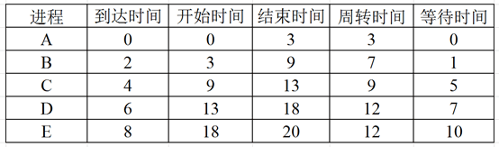

如果是决策模式是抢占，那么B到达时就应该做判断。 如果B的优先级比A高，那么B应该抢占CPU。一般来说，决策模式为抢占的调度比较复杂。很幸运，FCFS是非抢占的。什么意思？ 也就是说，除非A执行完毕，没有任何进程可以使用CPU。

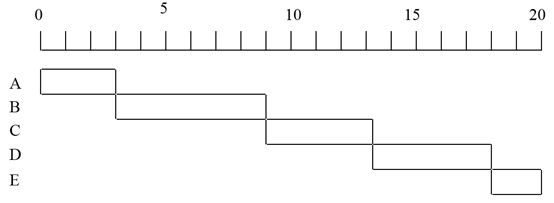

平均等待时间也一样。 吞吐量是指单位时间内所完成的进程数，就是“进程数”除以“总时间”

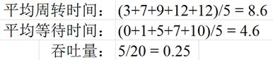

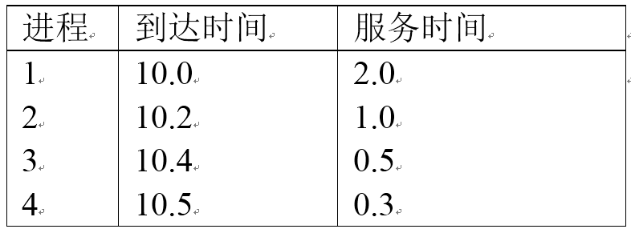

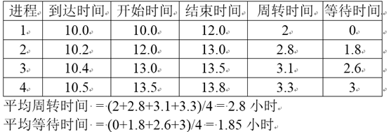

### 优点：

（1）简单。只需要记住进程的到达时间即可进行调度；

（2）公平性。进程最终都能获得调度，不会出现饥饿现象；

（3）只需要在进程运行结束时选择到达时间最早的进程，不需要估计服务时间。

我们来分析一下缺点。 大家想想，FCFS对长进程比较友好，还是对短进程比较友好？假设你要改个密码，需要1分钟；另外一个人要开户，需要1个小时。 很不巧，他比你早一秒钟到，怎么办？当然，在此刻，可见FCFS对长进程比较友好。

另外一个问题，FCFS对计算密集型进程比较友好，还是对IO密集型进程比较友好？ 什么叫“计算密集型进程”？就是大量使用CPU的进程，那么“IO密集型进程”就是大量使用IO的进程。

### 缺点：

我们来分析一下，在FCFS下，它们会遇到什么样的待遇呢？ 对于计算密集型进程，在FCFS下，一旦拿到CPU，它就可以长时间占用。很有可能，一次就执行完毕，对吧？ 而对于IO密集型进程，拿到了CPU，运行了一会儿，就会请求IO，产生中断，把CPU交出去。等中断结束，它又可以执行的时候，应该怎么办？
有同学可能会到这样的情况，在排队，突然要上厕所，怎么办？ 在FCFS下可以吗？很不幸，不行。中断的进程必须重新排队，那么会导致什么问题？一个IO密集型进程会花很多很多时间在排队上，因此FCFS对IO密集型进程是不友好的。

所以，通过上面两段分析，我们知道，FCFS的缺点包括：（1）FCFS更适用于长进程，不利于短进程，一个短进程在它能够执行之前，可能必须等待很长时间（2）有利于计算密集型的进程，而不利于I/O密集型的进程

## SPN 最短进程优先

那么我们接下来就来看看它。 SPN是什么的缩写？Shortest Process Next，大家要知道啊。 可以说，除了FCFS，就是SPN最简单了。也就是说，我们只需要在当前进程执行结束的时候选择下一个需要进行调度的进程。 选择的原则呢？也很简单，服务时间最短的那个。

还是A，因为它到达时，没有进程在使用CPU，也没有进程排队。 因为SPN是非抢占的，所以在时刻3。那么时刻3时，有几个进程在排队？ 只有一个，B。因此，B使用CPU，直到3+6=9时刻在时刻9，C、D、E在排队，应该选择哪个进程？ E，因为它最短嘛然后是C、D

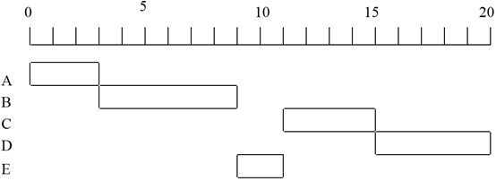

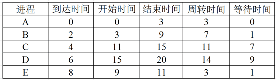

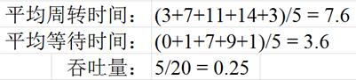

### 优点：

在所有非抢占的调度算法中，平均周转时间最短。
大家想想，SPN对长进程比较友好，还是对短进程比较友好？ 明显是短进程，因为如果短进程不停地达到，长进程可能一直处于饥饿状态

### 缺点：

此外，SPN需要估计进程的服务时间，这在很多情况下是无法实现的 进程运行过程中有很多随机因素，你怎么能知道服务时间是多少？

一种常见的解决办法是：先估计一个服务时间，如果执行过程中发现服务时间不正确，操作系统可能终止这个进程

主要包括：（1）无法保证公平性，长进程可能饥饿；（2）需要估计服务时间

## SRT 最短剩余时间

在最短剩余时间（SRT）中，调度程序总是选择“剩余时间最短”的进程大家想想，在SRT中，调度程序在哪个时间点做决策？每时每刻？其实不用，只需要在“进程结束时”和“进程到达时”，为什么？

（1）如果没有新进程到达，当前程序肯定是当前剩余时间最短的，为什么？ 因为选择它使用CPU时，它肯定是那个时刻剩余时间最短的随着时间的进行，别的进程剩余时间不变（因为没有运行），只有它的剩余时间变短，因此不会有进程的剩余时间比它短
（2）进程结束时，需要调度 显然，不用解释
（3）进程到达时，需要调度。 因为新进程的“服务时间”可能比当前正在执行的进程的“剩余时间”短，所以需要切换

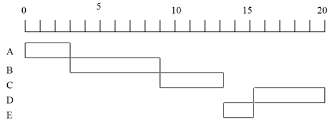

## 轮转（RR）调度算法

每个进程在被抢占前都给定一个时间片运行，当中断发生（即时间片用完）时，当前运行进程转移至就绪队列，然后以FCFS策略选择下一个就绪进程运行读起来有点抽象，我们通过例子来描述一下

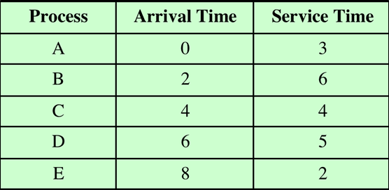

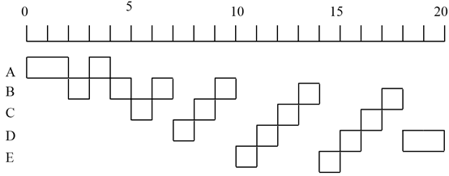

还有一个问题，时间片长度是不是只能是1个单位时间？ 比如，如果时间片长度是4，那么图就变成这样了

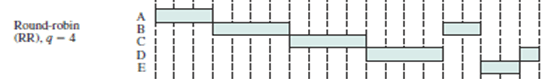

对于RR调度算法，大家觉得平均周转时间怎么样？对于RR调度算法，平均周转时间肯定不怎样，因为每个进程都需要等很长时间。特别是长进程，它需要频繁地排队。

有没有饥饿现象？好像没有饥饿现象，只要有耐心，总会分到时间片。此外，它还有一个突出的优点：不需要估计服务时间！ 我们前面说了，对于进程，很难准确估计服务时间，因此很多调度算法都是理论上的 而RR因为不需要估计服务时间，是一个在实际中经常采用的调度算法！

时间片的长度是长一点好，还是短一点好？过长 -> 退化为FCFS算法，进程在一个时间片内都执行完，无法满足交互用户需求过短 -> 有利于短进程，但是用户的一次请求需要多个时间片才能处理完，进程切换次数增加，增加系统开销

## FB反馈算法

只要把RR调度算法弄熟了，再多考虑几个就绪队列，就可以轻松画出图来
FB的特点包括：（1）多个就绪队列，各个队列具有不同优先级（越前面越高），队列中按FCFS方式执行（2）新进程首先插入第一个队列末尾，在规定的时间片内该进程若执行完，则撤离，如果被其它进程抢占，降至第二个队列排队……直到降至第n个队列（3）只有排前面的就绪队列为空时，才执行当前队列中的进程

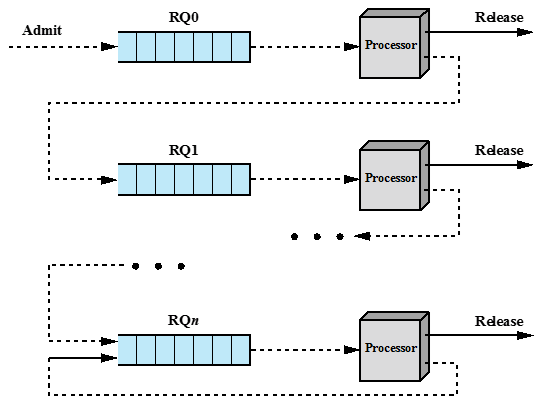

（2）点中，“如果被其它进程抢占，降至第二个队列排队”也就是说，如果没有别的进程，当前进程将一直待在第一个队列其实也好理解，没有人跟当前进程抢CPU，那么没有必要降低优先级

此外，对于特别长的进程，会一直处于第n个队列，可能会饿死
解决办法是，当进程在某个队列里长时间得不到调度时，可以主动提高优先级（前移一个队列中）当然，我们只需要知道有这种机制，不要求掌握

因此，反馈策略（FB）的性能：（1）长、短作业兼顾，有较好的响应时间（2）终端型作业一次完成（3）短批处理作业周转时间不长（4）长批处理作业不会长期不处理
为了简化情况，在后面的例子中，假设有无限多个就绪队列也就是说，不用考虑最后一个就绪队列里的特殊情况

### 特点

（1）多个就绪队列，各个队列具有不同优先级（越前面越高），队列中按FCFS方式执行（2）新进程首先插入第一个队列末尾，在规定的时间片内该进程若执行完，则撤离，如果被其它进程抢占，降至第二个队列排队……直到降至第n个队列（3）只有排前面的就绪队列为空时，才执行当前队列中的进程

首先，如果只有一个进程，那么它在哪？第一级我们认为，如果没有其它进程竞争CPU，那么这个进程没有必要降低自己的优先级（也就是下移队列）因此，我们认为，如果系统里只有一个进程，那么它将一直待在第一个队列。

第二个问题，“如果被其它进程抢占，降至第二个队列排队”，因为低优先级的进程无法抢占高优先级的，是不是意味着，对第一个队列里的进程来说，如果没有新的进程到达，它将一直待在第一个队列里？哪怕下面的队列有进程？ 不对，如果这样，大家想想，是不是变成“后来先服务”了？肯定不合理，所以“如果被其它进程抢占，降至第二个队列排队”的理解应该是，“只要有进程跟当前进程竞争CPU，那么当前进程使用完时间片后，就应该下降队列“

最后结果

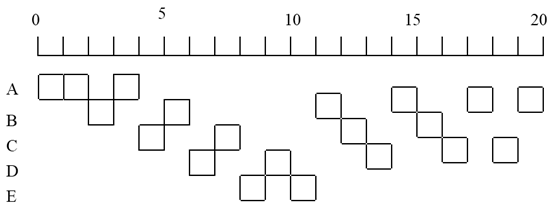

