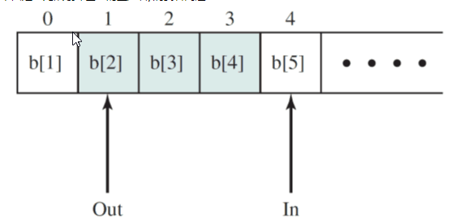

# 别人的概念

## 进程间通信方式

1. 管道(pipe)
2. 命名管道
3. 消息队列
4. 信号(Signal)
5. 共享内存
6. 信号量(Semaphore)：初始化操作、P操作、V操作；P操作：信号量-1，检测是否小于0，小于则进程进入阻塞状态；V操作：信号量+1，若小于等于0，则从队列中唤醒一个等待的进程进入就绪态
7. 套接字(Socket)

### 管道简单介绍

- 管道是半双工的，数据只能向一个方向流动；需要双方通信时，需要建立起两个管道；
- 一个进程向管道中写的内容被管道另一端的进程读出。写入的内容每次都添加在管道缓冲区的末尾，并且每次都是从缓冲区的头部读出数据；
- 只能用于父子进程或者兄弟进程之间(具有亲缘关系的进程)

## 进程同步问题

> 进程的同步是目的，而进程间通信是实现进程同步的手段

### 概念一 管程

管程将共享变量以及对这些共享变量的操作封装起来，形成一个具有一定接口的功能模块，这样只能通过管程提供的某个过程才能访问管程中的资源。进程只能互斥地使用管程，使用完之后必须释放管程并唤醒入口等待队列中的进程。

当一个进程试图进入管程时，在**入口等待队列**等待。若P进程唤醒了Q进程，则Q进程先执行，P在**紧急等待队列**中等待。（**HOARE管程**）

wait操作：执行wait操作的进程进入条件变量链末尾，唤醒紧急等待队列或者入口队列中的进程；signal操作：唤醒条件变量链中的进程，自己进入紧急等待队列，若条件变量链为空，则继续执行。（**HOARE管程**）

**MESA管程**：将HOARE中的signal换成了notify（或者broadcast通知所有满足条件的），进行通知而不是立马交换管程的使用权，在合适的时候，条件队列首位的进程可以进入，进入之前必须用while检查条件是否合适。优点：没有额外的进程切换

## 生产者消费者问题

> 问题描述：使用一个缓冲区来存放数据，只有缓冲区没有满，生产者才可以写入数据；只有缓冲区不为空，消费者才可以读出数据

伪代码描述

```cpp
// 伪代码描述 
// 定义信号量 full记录缓冲区物品数量 empty代表缓冲区空位数量 mutex为互斥量
semaphore full = 0, empty = n, mutex = 1;

// 生产者进程
void producer(){
	do{
   	  P(empty);
	  P(mutex);

     // 生产者进行生产
   
   	  V(mutex);
   	  V(full);
 	} while(1);
}

void consumer(){
	do{
	  P(full);
	  P(mutex);

    	// 消费者进行消费

	  V(mutex);
	  V(empty);
 	} while(1);
}
```

## 同步和互斥

- 同步：多个进程因为合作而使得进程的执行有一定的先后顺序。比如某个进程需要另一个进程提供的消息，获得消息之前进入阻塞态；
- 互斥：多个进程在同一时刻只有一个进程能进入临界区

## 并发、并行、异步的区别

并发：在一个时间段中同时有多个程序在运行，但其实任一时刻，只有一个程序在CPU上运行，宏观上的并发是通过不断的切换实现的；

多线程：并发运行的一段代码。是实现异步的手段

并行（和串行相比）：在多CPU系统中，多个程序无论宏观还是微观上都是同时执行的

异步（和同步相比）：同步是顺序执行，异步是在等待某个资源的时候继续做自己的事

## 线程同步有哪些方式

> 为什么需要线程同步：线程有时候会和其他线程共享一些资源，比如内存、数据库等。当多个线程同时读写同一份共享资源的时候，可能会发生冲突。因此需要线程的同步，多个线程按顺序访问资源。

- **互斥量** Mutex：互斥量是内核对象，只有拥有互斥对象的线程才有访问互斥资源的权限。因为互斥对象只有一个，所以可以保证互斥资源不会被多个线程同时访问；当前拥有互斥对象的线程处理完任务后必须将互斥对象交出，以便其他线程访问该资源；
- **信号量** Semaphore：信号量是内核对象，它允许同一时刻多个线程访问同一资源，但是需要控制同一时刻访问此资源的最大线程数量。信号量对象保存了**最大资源计数**和**当前可用资源计数**，每增加一个线程对共享资源的访问，当前可用资源计数就减1，只要当前可用资源计数大于0，就可以发出信号量信号，如果为0，则将线程放入一个队列中等待。线程处理完共享资源后，应在离开的同时通过`ReleaseSemaphore`函数将当前可用资源数加1。如果信号量的取值只能为0或1，那么信号量就成为了互斥量；
- **事件** Event：允许一个线程在处理完一个任务后，主动唤醒另外一个线程执行任务。事件分为手动重置事件和自动重置事件。手动重置事件被设置为激发状态后，会唤醒所有等待的线程，而且一直保持为激发状态，直到程序重新把它设置为未激发状态。自动重置事件被设置为激发状态后，会唤醒**一个**等待中的线程，然后自动恢复为未激发状态。
- **临界区** Critical Section：任意时刻只允许一个线程对临界资源进行访问。拥有临界区对象的线程可以访问该临界资源，其它试图访问该资源的线程将被挂起，直到临界区对象被释放。

### 互斥量和临界区有什么区别？

互斥量是可以命名的，可以用于不同进程之间的同步；而临界区只能用于同一进程中线程的同步。创建互斥量需要的资源更多，因此临界区的优势是速度快，节省资源。

## 什么是协程？

协程是一种用户态的轻量级线程，协程的调度完全由用户控制。协程拥有自己的寄存器上下文和栈。协程调度切换时，将寄存器上下文和栈保存到其他地方，在切回来的时候，恢复先前保存的寄存器上下文和栈，直接操作栈则基本没有内核切换的开销，可以不加锁的访问全局变量，所以上下文的切换非常快

### 协程与多线程的比较

1. 一个线程可以拥有多个协程，一个进程也可以单独拥有多个协程，这样python中则能使用多核CPU。
2. 线程进程都是同步机制，而协程则是异步
3. 协程能保留上一次调用时的状态，每次过程重入时，就相当于进入上一次调用的状态

# 并发

### 并发带来的设计问题

（1）进程间的通信（2）资源的共享与竞争（3）多个进程活动的同步（4）分配给进程的处理器时间

对于（1），多个进程完成一个任务，它们之间可能需要传递计算结果，所以需要通信

对于（2），我们前面讲的飞机票的例子，x就是共享资源

对于（3），我们后面会讲“生产者/消费者”问题，先提一下：生产者和消费者之间有一个“缓存”，消费者只有在生产者往缓存里放了东西后才能消费，生产者只有在消费者取走缓存里的东西后才能放东西，二者之间需要形成这样的默契，即“同步”

对于（4），也就是进程调度，我们前几次课介绍了这部分内容

### 并发带来的困难

（1）全局资源的共享充满了危险

（2）操作系统很难对资源进行最优化分配

（3）定位程序设计错误是非常困难的

（1）好理解，比如我们举的飞机票的例子对于（2），进程可能需要多个资源，但是它拿到部分资源后可能没办法马上开始工作，因此造成资源使用效率不高对于（3），进程并发执行，它们所处的环境是动态的，而且经常是不可重现的，因此一旦出现错误，很难进行定位

## 并发的几个概念

（1）同步：对多个相关进程在执行次序上进行协调，以使并发执行的诸进程之间能有效地共享资源和相互合作，从而使程序的执行具有可再现性通过“生产者/消费者”问题可以理解（2）互斥：同步的特例，当一个进程在临界区访问共享资源时，其他进程不能进入该临界区访问任何资源也就是排它性，任何时刻只能有一个进程进入临界区使用资源（3）临界资源（critical resource）：一次仅允许一个进程访问的资源

还有两个概念（4）死锁：两个或两个以上的进程因其中的每个进程都在等待其他进程做完某件事而不能继续执行

（5）饥饿：指一个可运行的进程尽管能继续执行，但被调度程序无限期地忽视，而不能被调度执行的情形

# 互斥

互斥有如下要求：（1）空闲让进：当没有进程在临界区中时，任何需要进入临界区的进程必须能够立即进入（2）忙则等待：在多个想要同时访问临界资源的进程中，一次只允许一个进程进入临界区（3）有限等待：不会死锁或饥饿（不允许出现需要访问临界区的进程被无限延迟的情况）（4）让权等待：当进程不能进入自己的临界区时，应立即释放处理机，以免陷入“忙等”
只有满足了以上4点，才能实现有效的互斥如果不能“空闲让进”，会导致资源闲置，利用率不高。 不满足互斥会出问题

## 互斥问题的解决办法

（1）由并发的进程利用软件的方法解决（2）利用硬件的支持解决（3）利用操作系统或程序设计语言提供的某种支持（例如信号量机制、管程、消息传递）解决

硬件方法包括：（1）中断禁用（2）专门的机器指令
因为中断导致两个进程可能同时访问临界资源，所以一种简单粗暴的方法就是：中断禁用
逻辑很简单，一旦一个进程禁用了中断，那么就不可能有其它进程打扰它进入临界区使用临界资源，所以可以保证临界资源的互斥使用。中断禁用虽然简单，但是缺点十分明显：（1）中断的提出就是为了使进程可以并发执行，提高资源的使用效率，现在你把中断关了，肯定会降低资源的使用效率（2）如果有一些紧急事件需要处理，由于中断已经禁用，那么肯定是没法实现的（3）不能用于多处理器

专门的机器指令指：（1）在一个单一指令周期中运行（2）不会受到其它指令的干扰（3）保证多个动作的原子性

**机器指令方法的优点**：（1）适用于在单处理器或共享内存的多处理器上的任何数目的进程（2）非常简单且易于证明（3）它能被用到支持多个临界区对于（3），只要设置多个类似于bolt这样的变量就可以了

**缺点**？（1）忙等：进程在等待进入临界区时，继续消耗处理器时间（2）可能饥饿（3）可能死锁

**互斥的要求**包括：（1）空闲让进：当没有进程在临界区中时，任何需要进入临界区的进程必须能够立即进入（2）忙则等待：在多个想要同时访问临界资源的进程中，一次只允许一个进程进入临界区（3）有限等待：不会死锁或饥饿（不允许出现需要访问临界区的进程被无限延迟的情况）（4）让权等待：当进程不能进入自己的临界区时，应立即释放处理机，以免陷入“忙等”

# 信号量

一般信号量上有三个操作：

（1）初始化操作一个信号量可以初始化成非负整数、阻塞队列初始化为空
（2）semWait操作semWait操作使信号量减1。如果值变成负数，则执行semWait的进程被阻塞
（3）semSignal操作semSignal操作使信号量加1。如果值不是正数，则因semWait操作阻塞的进程被解除阻塞

semWait操作：

```c
void semWait(semaphore s)
{
  s.count-- ;
  if (s.count < 0){
     /*把当前进程插入到s.queue队列当中*/
     /*阻塞当前进程*/
   }
}
```

semSignal操作：

```c
void semSignal(semaphore s)
{
  s.count++;
  if (s.count < = 0){
     /* 从s.queue队列中移除一个进程P*/        
     /*将进程P插入就绪队列*/
     }
}
```

首先，count是啥？ count表示当前可用的资源数目如果大于0，表示什么？ 表示还有资源小于0呢？ 阻塞

我们分情况讨论：

（1）count=n (n>1)，表示还有n个资源执行semWait操作，count减1，变成n-1，大于0，还有资源（还有n-1个，n-1>0）不是负数，进程不用阻塞，使用资源

（2）count=1，表示还有1个资源执行semWait操作，count减1，变成0不是负数，进程不用阻塞，使用资源（因为之前count=1）

（3）count=0，表示没有资源，也没有进程被阻塞执行semWait操作，count减1，变成-1是负数，进程变成第一个被阻塞的进程

（4）count=-n，表示没有资源，n个进程被阻塞执行semWait操作，count减1，变成-(n+1)进程变成第n+1个被阻塞的进程


## 机器指令方法优点：

（1）适用于在单处理器或共享内存的多处理器上的任何数目的进程

（2）非常简单且易于证明

（3）它能被用到支持多个临界区

缺点包括：

（1）忙等：进程在等待进入临界区时，继续消耗处理器时间

（2）可能饥饿

（3）可能死锁

## 两种信号量

（1）一般信号量包括：一个整型变量、使用队列来保存在信号量上等待的进程

（2）二元信号量包括：信号量的值只能是0或1、使用队列来保存在信号量上等待的进程

一般信号量称常用来进行资源的管理，实现同步。二元信号量常用来进行资源的互斥

# 生产者，消费者问题

（1）资源：计算机系统中的每个进程都可以消费（使用）或生产（释放）某类资源这些资源可以是硬件资源，也可以是软件资源

（2）消费者：当某一进程使用某一资源时，可以看作是消费，称该进程为消费者

（3）生产者：当某一进程释放某一资源时，它就相当于生产者

（4）缓冲区生产：一个或多个的生产者产生某种类型的数据，并放置在缓冲区中消费：一个或多个消费者从缓冲区中取数据，每次取一项

代码实现：

```c
/* program producerconsumer */
semaphore n = 0, s = 1;

void producer()
{
  while (true) {
    produce();
    semWait(s);
    append();
    semSignal(s);
    semSignal(n);
    }
}

void consumer()
{
  while (true) {
    semWait(n);
    semWait(s);
    take();
    semSignal(s);
    consume();
    }
}
void main(){ parbegin (producer,consumer); }
```

一些问题：

（1）semWait(n)和semSignal(n)不在一个程序内

semSignal(n)是生产者的行为，使n=n+1，如果有进程阻塞（被阻塞的消费者等着消费），可以解除阻塞，让它使用资源，semWait(n)是消费者的行为，使n=n-1，如果为负，表示没有资源，需要阻塞自己可见，两个操作的执行主体不同，因此不在一个程序内 但是它们还是成对出现的


（3）如果在一个程序内，对同一信号量的semWait()在semSignal()之前
这个也好理解，否则会怎么样？
parbegin (producer,consumer); 表示两个进程并发执行 并不是顺序执行

（4）请求资源时，对同步信号量的semWait(n)在对互斥信号量的semWait(s)之前；释放资源时，对互斥信号量的semSignal(s)在对同步信号量的semSignal(n)之前大家想想，这是为什么？请求资源时，如果对同步信号量的semWait(n)在对互斥信号量的semWait(s)之后，会出现什么问题？死锁打个比方，你要去图书馆占位置，放本书就占了有人走，座位就空了但是，任何时刻，只能有一个人进去或出来，也就是说，拿到互斥信号量s的才能访问图书馆，你拿到s了，进去一看，没位置，只能阻塞自己，等空位有同学想出来，但是s被你拿了，你一直不释放，所以想出来的同学只能等你这样一来，就死锁了这就是请求资源时，如果对同步信号量的semWait(n)在对互斥信号量的semWait(s)之后，会出现死锁的原因

为了提高临界资源的使用效率，必须尽量晚地申请，尽量早地释放从而保证占用的时间尽量短所以，比较合理的方式就是：对互斥信号量的semSignal(s)在对同步信号量的semSignal(n)之前

## “无限缓冲区”的生产者/消费者问题



假设有多个生产者和多个消费者，它们在执行生产活动和消费活动中要对缓冲区进行操作，实现同步（即不能消费“空的缓冲区”）在本题中，需要两个信号量：（1）由于缓冲区是一个临界资源，必须互斥使用，所以需要设置一个互斥信号量s，其初值为１（2）一个同步信号量n，表明缓冲区中已放入产品数量，初值置为0实现伪代码如下：


可知：
（1）semWait(n)和semSignal(n)不在一个程序内semSignal(n)是生产者的行为，使n=n+1，如果有进程阻塞（被阻塞的消费者等着消费），可以解除阻塞，让它使用资源semWait(n)是消费者的行为，使n=n-1，如果为负，表示没有资源，需要阻塞自己可见，两个操作的执行主体不同，因此不在一个程序内
（2）semWait()和semSignal()是成对出现的
（3）如果在一个程序内，对同一信号量的semWait()在semSignal()之前
否则会怎么样？ 无法互斥
（4）请求资源时，对同步信号量的semWait(n)在对互斥信号量的semWait(s)之前；释放资源时，对互斥信号量的semSignal(s)在对同步信号量的semSignal(n)之前
难点来了：请求资源时，如果对同步信号量的semWait(n)在对互斥信号量的semWait(s)之后，会出现什么问题？死锁这时，缓冲区被这个阻塞的消费者占用，消费者在阻塞期间是无法释放缓冲区的因此，哪怕生产者生成了资源，也放不进去（拿不到缓冲区的使用权），所以出现了死锁
append()就是释放资源
如果一个消费者（A）对互斥信号量的semWait(s)成功，拿到了缓冲区的使用权，结果发现对同步信号量的semWait(n)失败（没有资源可用），那么它会阻塞（等生产者B生产） A等B 缓冲区被这个阻塞的A占用，A在阻塞期间是无法释放缓冲区的哪怕生产者B生成了资源，也放不进去（拿不到缓冲区的使用权），所以出现了死锁

## 有限循环缓冲区 生产者/消费者问题

问题描述如下：（1）通过一个有限循环缓冲区可以把生产者和消费者联系起来（2）只要缓冲区未满，生产者就可以把产品送入缓冲区（3）只要缓冲区未空，消费者就可以从缓冲区中取走产品（4）需要互斥地访问缓冲区


绿色部分表示有产品如果In在第n个位置，填完后，它应该去哪？ 如何用公式实现？取模： In = (In mod n) + 1（+1是因为编号是从1开始的）第一个情况里面编号是1...n（上面这个图）

如果是0到n-1，就是第二种情况（就是下面这种）-》 b[0], b[1],...,b[n-1]如果编号是从0到n-1，怎么实现？ %(n-1)现在是n-2 下一个是哪个位置？（ (n-1)%(n-1)=0）In = (In + 1) mod n -》 mod n保证有n个不同的数
mod (n-1)只有n-1个。 mod (n-1)的可能结果在0, 1, ..., n-2中间 -》 只有n-1个可能的数
好，下面开始分析这个问题首先确定需要的信号量
（1）缓冲区是互斥访问的，因此互斥信号量s是需要的（2）消费者需要等缓冲区中有数据才能访问，因此需要同步信号量n，表示当前资源数足够了吗？ 在无限缓冲区的例子中，有无限多的空缓冲。 因此，无论什么时候，生产者都可以把数据放进缓冲区中那么在有限缓冲区中，还是这样吗？ 不行，如果缓冲区满了，需要等消费者消费了数据后，有了空缓冲，才能放数据

用同步信号量n可以实现吗？ 好像可以 如果缓冲区的大小为N，那么N-n就是空缓冲的数量，对吧？那么如何实现呢？ 能不能在信号量上同时阻塞消费者和生产者呢？ 好像不行（3）一不做二不休，再加一个同步信号量e，表示当前空缓冲的数量专门用来阻塞生产者，是不是可以？ 如果e=0，表示没有空缓冲，生产者就在同步信号量上阻塞。 可认为e是empty的缩写，帮助记忆。 如果消费者消费了数据，释放空缓冲，可以执行semSignal(e)，解除阻塞的生产者，对吧？

因此，需要三个信号量：一个互斥信号量s，两个同步信号量n、en表示已用缓冲的数量（即数据的数量），初值为０。 e表示空缓冲的数量，初值为缓冲区的大小sizeofbuffer。 代码实现如下：


有同学有疑问，为什么生产者里面有两个函数：produce()、append()，消费者里面也有两个：take()、consume()？而只有append()和take()需要放在semWait(s)和semSignal(s)之间？
整个过程中，货架是互斥的，所以只有append()和take()需要放在semWait(s)和semSignal(s)之间如果把produce()和consume()也放在semWait(s)和semSignal(s)之间，行不行？可以，能实现互斥和同步，运行不会出问题
但是有什么缺点？ 效率很低，因为produce()花的时间远远大于append()consume()花的时间远远大于take()这样会导致s（比如货架）被长时间、无意义地锁定，影响系统运行效率
好，回到伪代码，注意：（1）在每个程序中用于实现互斥的semWait(s)和semSignal(s)必须成对地出现 这个好理解，实现互斥嘛（2）对资源信号量e和n的semWait和semSignal操作，同样需要成对地出现，但它们分别处于不同的程序中 


一个释放，一个申请 释放的可能解除阻塞的进程
（3）在每个程序中的多个semWait操作顺序不能颠倒。应先执行对资源信号量的semWait操作，然后再执行对互斥信号量的semWait操作否则会怎么样？ 引起死锁
（4）semSignal操作的次序倒是无关紧要理由我们在无限缓冲区的生成者/消费者问题中描述过了，道理是一样的

## 简单例子

（1）如果只有一个生产者、一个消费者、一个单缓冲，怎么办？


对于只有一个生产者、一个消费者、一个单缓冲，是不是只要实现互斥就行了？不行，还需要实现同步，确保“满不放”、“空不取”怎么实现？ 很简单，只要让“有限循环缓冲区的生产者/消费者问题”中e（空闲缓冲数目）的初始值为1就行了


> 很多教材会用P操作和V操作，这里的P就是semWait，V就是semSignal

以上伪代码是否正确？注意到，任何时刻，S1和S2中至多一个为1（可能两个同时为0）


假定系统有3个并发进程get、copy和put共享缓冲器B1和B2。进程get负责从输入设备上读信息，每读出一条记录后放到B1中。进程copy从缓冲器B1中取出一条记录拷贝后存入B2。进程put取出B2中的记录打印输出。B1和B2每次只能存放一条记录。要求3个进程协调完成任务，使打印出来的与读入的记录个数、次序完全一样。请用记录型信号量写出并发程序。

大家回忆一下，对于“一个生产者、一个消费者、一个单缓冲”，需要几个信号量？2个这个需要2*2=4个所以信号量情况为：（1）empty1对应空闲的缓冲区1，其初值为1（2）full1对应缓冲区1中的记录，其初值为0（3）empty2对应空闲的缓冲区2，其初值为1（4）full2对应缓冲区2中的记录，其初值为0

```c
get( ){
    while(1){
        从输入设备读入一条记录;
        P(empty1);
        将记录存入缓冲区1;
        V(full1);
    }
}
```

```c
copy( ){
    while(1){
        P(full1);
        从缓冲区1中取出一条记录;
        V(empty1);
        P(empty2);
        将取出的记录存入缓冲区2;
        V(full2);
    }
}
```

```c
put( ){
    while(1){
        P(full2);
        从缓冲区2中取出一条记录;
        V(empty2);
        将取出的记录打印出来；
    }
}
```

## 司机售票员问题


## 啤酒问题

某班同学组织了自助聚餐活动，活动场所有一个冷室专门存放酒水（啤酒或果汁），由学生自取。冷室的容量最多只够存放10份酒水，一开始啤酒和果汁各5瓶。现场由老板和老板娘提供服务，老板负责向冷室里放入啤酒，老板娘负责向冷室放入果汁，男同学只喝啤酒，女同学只喝果汁。有如下规则：（1）冷室只允许一人访问，无论是放还是取。（2）冷室空时，不允许取。（3）冷室满时，不允许放。请在1号空里设置和初始化信号量，在2~7号中填入一个或多个P、V（即wait、signal）操作，以实现上述过程的同步。（注：啤酒英文为beer，果汁英文为juice）


# 读写者问题

因此，对于读者/写者问题，定义如下：有一个许多进程共享的数据区，满足条件：（1）任意多的读进程可以同时读这个文件（2）一次只有一个写进程可以往文件中写（3）如果一个写进程正在往文件中写，禁止任何读进程读文件

对于读者/写者问题也类似，可分为如下两种情况：（1）读者优先（2）写者优先
对于读者优先，如果有读进程在读数据，哪怕有写进程在等，后来的读进程也可以直接进去（有熟人在里面嘛）对于写者优先，如果有写进程在写数据，哪怕有读进程在等，后来的写进程也可以插队，排在读进程前面


# 管程（Monitor）

其基本思想是将共享变量（临界资源）和对它们的操作集中在一个模块中 ： 也就是说，管程是一个软件模块：
（1）由一个或多个过程、一个初始化序列和局部数据组成（2）描述共享资源的数据结构和在数据结构上的共享资源管理程序


（1）进程通过调用管程的一个“过程”进入管程（2）任何时刻，只能有一个进程在管程中执行，其他的在入口处排队（阻塞）（3）进来的进程通过“过程”访问局部数据变量（临界资源）（4）如果cwait失败，进程在对应的条件队列上阻塞（左边）（5）csignal后，进程解除阻塞，考虑到当前可能有进程正在管程中执行，所以进程需要排队不过进程不需要重新去入口处排队，而在紧急队列排队（左下）紧急队列优先级高于入口处的队列，优先访问临界资源

# 消息传递

消息传递以一对原语的形式提供：send(destination, message)receive(source, message)
注意到：（1）对于send原语，需要知道destination，才能将message送往destination（2）对于receive原语，可以知道source，也可以不知道source如果知道source，receive将消息从source取回，放入message中如果不知道source，receive将消息取回，将原地址放入source，将消息放入message

## 利用消息传递解决互斥问题


