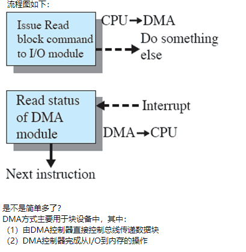

## 什么是IO多路复用？怎么实现？

IO多路复用（IO Multiplexing）是指单个进程/线程就可以同时处理多个IO请求。

实现原理：用户将想要监视的文件描述符（File Descriptor）添加到select/poll/epoll函数中，由内核监视，函数阻塞。一旦有文件描述符就绪（读就绪或写就绪），或者超时（设置timeout），函数就会返回，然后该进程可以进行相应的读/写操作

### select/poll/epoll三者的区别？

- `select`：将文件描述符放入一个集合中，调用select时，将这个集合从用户空间拷贝到内核空间（缺点1：每次都要复制，**开销大**），由内核根据就绪状态修改该集合的内容。（缺点2）**集合大小有限制**，32位机默认是1024（64位：2048）；采用水平触发机制。select函数返回后，需要通过遍历这个集合，找到就绪的文件描述符（缺点3：**轮询的方式效率较低**），当文件描述符的数量增加时，效率会线性下降；
- `poll`：和select几乎没有区别，区别在于文件描述符的存储方式不同，poll采用链表的方式存储，没有最大存储数量的限制；
- `epoll`：通过内核和用户空间共享内存，避免了不断复制的问题；支持的同时连接数上限很高（1G左右的内存支持10W左右的连接数）；文件描述符就绪时，采用回调机制，避免了轮询（回调函数将就绪的描述符添加到一个链表中，执行epoll_wait时，返回这个链表）；支持水平触发和边缘触发，采用边缘触发机制时，只有活跃的描述符才会触发回调函数。

总结，区别主要在于：

- 一个线程/进程所能打开的最大连接数
- 文件描述符传递方式（是否复制）
- 水平触发 or 边缘触发
- 查询就绪的描述符时的效率（是否轮询）

### 什么时候使用select/poll，什么时候使用epoll？

当连接数较多并且有很多的不活跃连接时，epoll的效率比其它两者高很多；但是当连接数较少并且都十分活跃的情况下，由于epoll需要很多回调，因此性能可能低于其它两者。

### 有哪些常见的IO模型？

- 同步阻塞IO（Blocking IO）：用户线程发起IO读/写操作之后，线程阻塞，直到可以开始处理数据；对CPU资源的利用率不够；
- 同步非阻塞IO（Non-blocking IO）：发起IO请求之后可以立即返回，如果没有就绪的数据，需要不断地发起IO请求直到数据就绪；不断重复请求消耗了大量的CPU资源；
- IO多路复用
- 异步IO（Asynchronous IO）：用户线程发出IO请求之后，继续执行，由内核进行数据的读取并放在用户指定的缓冲区内，在IO完成之后通知用户线程直接使用。

过程：磁头（找到对应的盘面）；磁道（一个盘面上的同心圆环，寻道时间）；扇区（旋转时间）。为减小寻道时间的调度算法：

- 先来先服务
- 最短寻道时间优先
- 电梯算法：电梯总是保持一个方向运行，直到该方向没有请求为止，然后改变运行方向

## 磁盘调度算法

- FCFS
  - 先进先出的调度策略，这个策略具有公平的优点，因为每个请求都会得到处理，并且是按照接收到的顺序进行处理。
- SSTF(Shortest-seek-time First 最短寻道时间优先)
  - 选择使磁头从当前位置开始移动最少的磁盘I/O请求，所以 SSTF 总是选择导致最小寻道时间的请求。
  - 总是选择最小寻找时间并不能保证平均寻找时间最小，但是能提供比 FCFS 算法更好的性能，会存在饥饿现象。
- SCAN
  - SSTF+中途不回折，每个请求都有处理机会。
  - SCAN 要求磁头仅仅沿一个方向移动，并在途中满足所有未完成的请求，直到它到达这个方向上的最后一个磁道，或者在这个方向上没有其他请求为止。
  - 由于磁头移动规律与电梯运行相似，SCAN 也被称为电梯算法。
  - SCAN 算法对最近扫描过的区域不公平，因此，它在访问局部性方面不如 FCFS 算法和 SSTF 算法好。
- C-SCAN
  - SCAN+直接移到另一端，两端请求都能很快处理。
  - 把扫描限定在一个方向，当访问到某个方向的最后一个磁道时，磁道返回磁盘相反方向磁道的末端，并再次开始扫描。
  - 其中“C”是Circular（环）的意思。
- LOOK 和 C-LOOK
  - 釆用SCAN算法和C-SCAN算法时磁头总是严格地遵循从盘面的一端到另一端，显然，在实际使用时还可以改进，即磁头移动只需要到达最远端的一个请求即可返回，不需要到达磁盘端点。这种形式的SCAN算法和C-SCAN算法称为LOOK和C-LOOK调度。这是因为它们在朝一个给定方向移动前会查看是否有请求。

## IO发展历史

（1）处理器直接控制外部设备也就是说，CPU直接与外部设备交互由于需要处理外部设备接口的具体细节，可扩展性不好

（2）程序控制I/O方式增加了控制器或I/O模块，处理器使用没有中断的“程序”控制I/O优点是：程序来控制外部设备，处理器不需要处理外部设备接口的具体细节缺点是：没有中断，又称忙-等待方式
（3）中断驱动I/O控制器或I/O模块采用了中断，处理器不再需要花费时间等待执行一个I/O操作也就是说，不需要“忙-等待”，提高了效率
（4）DMA（Direct Memory Access，直接存储器访问）控制方式I/O模块通过DMA直接控制存储器从主存中移出或往主存移入一块数据，不需要处理器参与，仅仅在传送开始和结束时需要用到处理器

（5）I/O通道控制方式I/O模块被增强成一个单独的处理器，有专门为I/O设计的指令集I/O模块有自己的局部存储器，本身就是一个计算机，也称作I/O处理器特点：是DMA方式的发展，可进一步减少CPU对数据读取的干预，实现CPU、通道和I/O设备三者的并行工作，从而有效地提高整个系统的资源利用率

### 程序控制I/O

对于程序控制I/O，处理器代表进程给I/O模块发送一个I/O命令，该进程进入忙等待，等待操作的完成，然后才可以继续执行

我们结合如下例子来理解：（1）CPU执行一条指令，要从I/O设备读取一块数据（2）CPU发出请求后，I/O设备需要一定的时间来准备（3）期间，CPU不停地检查I/O设备，看数据是否已经准备好（4）数据准备好后，CPU先读数据，再写入内存可见，CPU需花时间不断查询I/O状态（检查I/O模块的状态寄存器中的忙/闲标志）因此，CPU资源浪费极大

比如，CPU请求数据花了100ms，其中真正读取数据的时间可能只有0.1ms，而99.9ms都在忙等

### 中断驱动

处理器代表进程发送一个I/O命令，然后继续执行后续指令，当I/O模块完成工作后，处理器被该模块中断  流程图如下：

（1）CPU向I/O发命令，然后返回执行其它任务（2）数据准备好后，I/O中断产生，CPU转相应中断处理程序虽然这种方式比程序控制I/O要快，但是有如下缺点：CPU每“字节”干预一次，即每“字节”传送产生一次中断，效率不高 什么意思： 假设IO设备每次准备一个字节，CPU每次只读一个字节 那么每传一个字节，就需要遍历以上的过程

### DMA（直接存储器存取）

从流程图可知，为传送一块数据，处理器给DMA模块发请求，只有当整个数据块传送结束后，处理器才被中断

# IO缓冲

为什么要引入I/O缓冲呢？
是因为I/O设备存在以下问题：（1）速度的差异计算机系统中的各种设备（包括CPU）的运行速度差异甚大CPU的运行速度是以纳秒计，而有些设备的运行速度则是以毫秒甚至以秒计就好像生产者和消费者：生产者生产产品的速度很快，消费者消费不了，需要有缓冲来暂存这些产品
（2）负荷不均匀有时CPU进行大量的计算工作，没有I/O操作，有时又会进行大量的I/O操作这两个极端都会造成系统中的一些设备过于繁忙，一部分设备过于空闲导致要么CPU等外设，要么外设等CPU，严重地影响CPU与外设的并行工作
因此，引入缓冲技术可以达到以下目的：（1）匹配CPU与设备的速度的差异（2）提高处理机与外设的并行程度

缓冲的实现方式有两种：

（1）硬件缓冲区：如设备控制器中的数据寄存器  一般来说，这种方式成本高，因而数量有限

（2）软件缓冲区：内存中划出的一块专门空间

下面我们来学习3种常用的缓冲技术（一）单缓冲（二）双缓冲（三）循环缓冲

我们知道，内存被一分为二：一部分给OS使用，一部分给用户进程使用

## 单缓冲

对于（一）单缓冲，当一个用户进程发出I/O请求时，OS给该操作分配一个位于OS内存空间中的缓冲区

我们来分析一下，处理一块数据需要多少时间假设I/O设备的输入（称为输入操作）耗时为T，进程处理数据块（称为处理操作）耗时为C对于无缓冲的情况，单块数据的平均处理时间为多少？ t+c
对于无缓冲的情况，我们知道：因为互斥性，输入操作和处理操作不能并行因此单块数据的平均处理时间为：T+C

对于单缓冲的情况，假设将数据从系统存储空间移动到用户空间（称为移动操作）耗时为M可知，一旦移动操作完成，缓冲空闲，可以继续下一次的输入操作单块数据的平均处理时间为多少？
看文字有些抽象，我们来看时序图相应的时序图如下：

## 双缓冲

对于（二）双缓冲，给I/O操作分配两个系统缓冲区，当一个进程往一个缓冲区中传送数据（或从这个缓冲区中取数据）时，操作系统可以清空（或填充）另一个缓冲区，实现并行操作

所以，单块数据的平均处理时间是T
当然，这是因为M+C<T   
如果M+C>T，单块数据的平均处理时间是多少？（ M+C）
因为M+C>T单块数据的平均处理时间是M+C
所以，最后的答案是：  Max[M+C, T]
一般情况下，M+C<T  所以双缓冲的Max[M+C, T]=T  优于单缓冲的Max[C, T]＋M=T+M

## 循环缓冲

对于（三）循环缓冲，可以使用多于两个的缓冲区，每一个缓冲区是这个循环缓冲区的一个单元，使相关I/O操作能够跟得上这个进程

# 磁盘调度

## 磁盘结构

（1）固定头磁盘：每个磁道设置一个磁头，变换磁道时不需要磁头的机械移动，速度快但成本高打个比方，一个盘面上可能有100个磁道，因此一个盘面需要100个磁头如果有2个盘片，则有4个盘面，一共需要400个磁头，成本相当高（2）移动头磁盘：一个盘面只有一个磁头，变换磁道时需要移动磁头，速度慢但成本低以下为移动头磁盘的运行状况图：

所以，对于磁盘：（1）信息记录在磁道上，多个盘片，正反两面都用来记录信息，每面一个磁头（2）所有盘面中处于同一磁道号上的所有磁道组成一个柱面（3）一般来说，每个扇区大小为512字节

一个扇区为一块，是最小的数据单位所以扇区的物理地址为：柱面号、磁头号、扇区号（一定要记住）

磁盘的访问过程由3个动作组成：（1）寻道：磁头移动定位到指定磁道（2）旋转：等待指定的扇区旋转到磁头处（3）数据传输：数据在磁盘与内存之间的实际传输
通过分析这3个动作，我们来讨论一下磁盘的性能参数我们知道，为了读写数据，磁头必须定位于期望的磁道和该磁道中期望的扇区的开始处

那么需要两部分时间：

（1）寻道时间：磁头定位磁道所需要的时间一般来说，典型的硬盘的平均寻道时间小于10ms
这个很简单，不深入讨论了

（2）旋转延迟：扇区到达磁头的时间（磁头不动，盘片旋转）假设磁头已经在期望的磁道上，那么转到期望的扇区，需要多久呢？ 平均需要转半圈
大家算一下，如果磁盘速度为15000r/m，平均旋转延迟为多少？ round/minute：转/分钟
因此，平均旋转延迟为0.5/15000*60=0.002秒=2毫秒

下面我们来分析（3）数据传输时间一旦磁头定位，并且扇区旋转到磁头下，就开始执行读或写操作令b为待读写数据的大小，N为一个磁道数据量的大小，r为转速
此外，假设数据连续存放（放在相邻的扇区中）可知，b/N表示存放数据需要多少个磁道

假设一磁盘平均寻道时间为4ms，转速为7500rpm，每个磁道500个扇区，每个扇区512个字节。假设读取一个包含2500个扇区的文件，请估计传送的总时间？（1）平均寻道时间为4ms（2）平均旋转延迟为0.5/7500*60*1000=4ms（3）读取1个磁道（500个扇区）的传送时间为1/7500*60*1000=8ms
所以，总平均存取时间为4+4+8*5=48ms，对吧？
但是没法做： 因为没有指明这2500个扇区是顺序存放的，还是随机存放的你怎么知道读完一个磁道，跨到下一个磁道就能马上读取数据？可能还要旋转到指定扇区才能开始呢
所以，总平均存取时间为4+(4+8)*5=64ms

对于随机存放，读取1个扇区的耗时如下：（1）平均寻道时间为4ms（2）平均旋转延迟为0.5/7500*60*1000=4ms（3）传送时间为1/500/7500*60*1000=0.016ms
所以，总平均存取时间为(4+4+0.016)*2500=20040ms
从这个例子可以看出，20040ms远远大于64ms时间为什么这么不同 两个假设，一个数据连续存放，一个随机存放

那么，如果多个进程同时访问磁盘由于它们不可能读取相同的数据，因此访问的扇区相对分散，不可能连续
那么磁盘的访问效率肯定十分低下能不能对这部分进行优化呢？ 可以
下面开始学习磁盘调度策略  这部分内容不难，但是是必考知识点之一，请大家务必重视

我们能做的，就是降低（1）寻道时间寻道时间是产生性能差异的原因之一对于单个磁盘，磁盘访问请求队列中可能有来自多个进程的许多I/O请求（读和写）

如果按随机顺序从队列中选择项目，那么磁道完全是被随机访问的，这种情况下的性能最差就像前一个例子中的2500个扇区随机存放

## 调度算法

（1）先进先出（First-in, first-out，FIFO）（2）最短服务时间优先（Shortest Service Time First，SSTF）（3）SCAN（电梯算法）（4）C-SCAN（循环扫描）

### 先进先出

为了熟悉磁盘调度策略，我们将采用以下例子：假设磁头位于磁道号为100的磁道，磁盘请求按照先后顺序，分别位于以下磁道：55、58、39、18、90、160、150、38、184磁道。请计算在给定磁盘调度策略下，磁头平均寻道长度（或者磁头横跨的磁道数）
我们先来看先进先出（First-in, first-out，FIFO）老朋友了，对吧？只是之前叫先来先服务（FCFS）
其实意思是一样，按访问请求到达的先后次序服务对于磁道请求序列55、58、39、18、90、160、150、38、184
一开始，磁头在100 下一次呢 55下一个请求是58，横跨了58-55=3个磁道下一个请求是39，横跨了58-39=19个磁道按照这个过程计算下去，最后加起来，就是总的磁道数总的磁道数除以请求的个数，就是平均寻道长度 55.3

可知，FIFO的优点是：对于所有的进程都很公平不会出现饥饿现象缺点：如果有多个进程竞争一个磁盘，这种技术在性能上往往接近于随机调度，因此性能很差

### 最短服务优先

最短服务时间优先（Shortest Service Time First，SSTF）就是这样的算法在SSTF中，选择使磁头从当前位置开始移动最少的磁盘I/O请求也就是说，采用贪心策略，总是选择最小寻道时间的请求
还是之前的例子，磁头位于100，请求为55、58、39、18、90、160、150、38、184过程如下： 哪个离100最近？ 9090，所以跨越100-90=10个磁道离90最近的请求是？ 58，跨越90-58=32个磁道

我们知道，进程调度中的最短服务时间优先能保证平均周转时间最短那么这里的最短服务时间优先（SSTF）是不是也能保证平均寻道时间最短呢？ 很不巧，并不能
我们来看一个例子： 磁头在5，访问序列为1、6、7、8、9、10、11、12、……、100根据SSTF，应该访问完6、7、8、9、10、11、12、……、100后，再访问1所以SSTF能提供比FIFO更好的性能，但是不能保证平均寻道时间最短此外，如果部分请求集中在相邻的磁道，那么磁头就会在这几个磁道来回移动，远处的磁道将无法访问，出现饥饿现象

### 电梯算法

SCAN（电梯算法），它可以避免饥饿现象大家回忆一下，电梯运行有什么规则？你从1楼上电梯，目标楼层是10层
这时，有人在4楼按了电梯，他想往上走请问，电梯在4楼停不停？
电梯在4楼停如果这个人想下楼，按了电梯，电梯在4楼停不停？
不停，不过电梯会在折返时停

对于SCAN（电梯算法）（1）要求磁头臂仅仅沿一个方向移动，并在途中满足所有未完成的请求，直到它到达这个方向上的最后一个磁道，或者在这个方向上没有别的请求为止，后一种改进有时候称作LOOK策略（2）然后倒转服务方向，沿相反方向扫描，同样按顺序完成所有请求
还是之前的例子，磁头位于100，请求为55、58、39、18、90、160、150、38、184
注意到，下一次访问哪个磁道，跟磁头当前的移动方向有关假设当前磁头是往磁道号大的方向移动
可知，过程如下：下一个访问150，所以跨越150-100=50个磁道下一个访问160，所以跨越160-150=10个磁道注意到，一旦访问完184，磁头往反方向移动

可知，在一个方向未扫描完毕之前，磁头移动方向固定，避免了饥饿现象

### 循环扫描

现在考虑一个问题：如果磁头从磁道号最小的磁道扫描到磁道号最大的磁道，时间为t，对于新到达的请求，服务的最大延迟时间是多少？ 2t

有没有办法可以降低这个延时呢？有，C-SCAN（循环扫描）在C-SCAN（循环扫描）中，把扫描限定在一个方向（比如，磁道号从小到大）

当沿某个方向访问到最后一个磁道时，磁头返回到磁盘的另一端（返回过程不访问磁道，因此速度很快），并再次开始扫描对于之前的例子，磁头位于100，请求为55、58、39、18、90、160、150、38、184磁头扫描限定在从磁道号小往磁道号大的方向
可知，过程如下：下一个访问150，所以跨越150-100=50个磁道下一个访问160，所以跨越160-150=10个磁道注意到，一旦访问完184，磁头往反方向移动，访问18

假设磁头从一端快速移动到另一端的时间为Smax考虑到Smax < t所以C-SCAN的最大请求延迟时间为t+Smax < 2t
因此，与SCAN相比，C-SCAN可以减少了新请求的最大延迟

