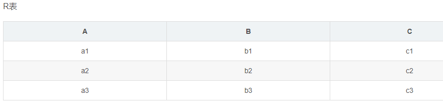
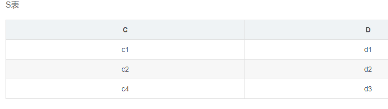
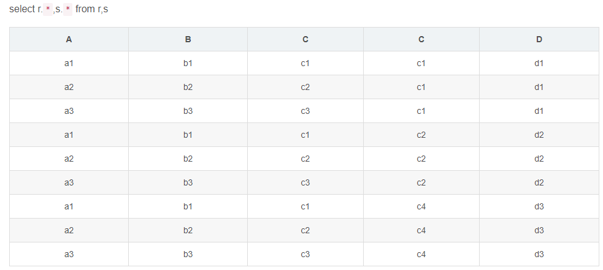
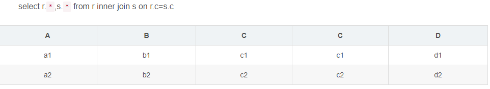
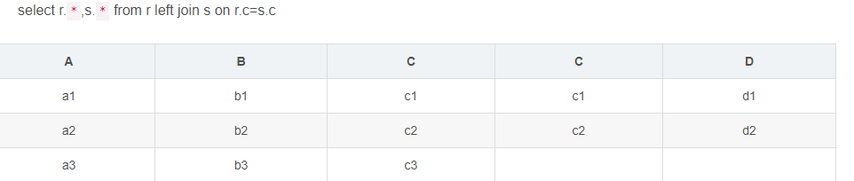
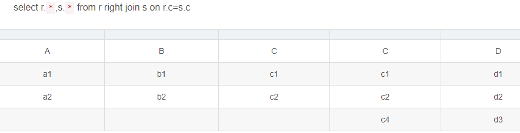
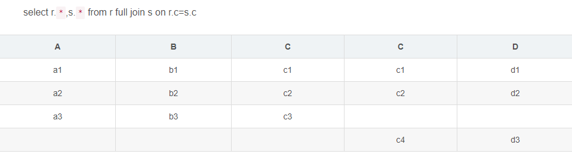
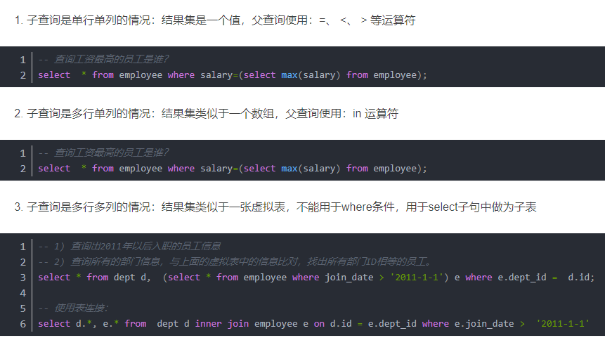

# SQL语句主要分为哪几类

数据定义语言DDL（Data Ddefinition Language）CREATE，DROP，ALTER

主要为以上操作 即对逻辑结构等有操作的，其中包括表结构，视图和索引。

数据查询语言DQL（Data Query Language）SELECT

这个较为好理解 即查询操作，以select关键字。各种简单查询，连接查询等 都属于DQL。

数据操纵语言DML（Data Manipulation Language）INSERT，UPDATE，DELETE

主要为以上操作 即对数据进行操作的，对应上面所说的查询操作 DQL与DML共同构建了多数初级程序员常用的增删改查操作。而查询是较为特殊的一种 被划分到DQL中。

数据控制功能DCL（Data Control Language）GRANT，REVOKE，COMMIT，ROLLBACK

主要为以上操作 即对数据库安全性完整性等有操作的，可以简单的理解为权限控制等。

# 有哪些约束类型？

约束（Constraint）类型：主键（Primary Key）约束，唯一约束（Unique），检查约束，非空约束，外键（Foreign Key）约束。

# 超键、候选键、主键、外键分别是什么？

- 超键：在关系中能唯一标识元组的属性集称为关系模式的超键。一个属性可以为作为一个超键，多个属性组合在一起也可以作为一个超键。超键包含候选键和主键。
- 候选键：是最小超键，即没有冗余元素的超键。
- 主键：数据库表中对储存数据对象予以唯一和完整标识的数据列或属性的组合。一个数据列只能有一个主键，且主键的取值不能缺失，即不能为空值（Null）。
- 外键：在一个表中存在的另一个表的主键称此表的外键。

# SQL约束有几种

- NOT NULL: 用于控制字段的内容一定不能为空（NULL）。
- UNIQUE: 控件字段内容不能重复，一个表允许有多个 Unique 约束。
- PRIMARY KEY: 也是用于控件字段内容不能重复，但它在一个表只允许出现一个。
- FOREIGN KEY: 用于预防破坏表之间连接的动作，也能防止非法数据插入外键列，因为它必须是它指向的那个表中的值之一。
- CHECK: 用于控制字段的值范围。

# 关联查询

- 交叉连接（CROSS JOIN）
- 内连接（INNER JOIN）
- 外连接（LEFT JOIN/RIGHT JOIN）
- 联合查询（UNION与UNION ALL）
- 全连接（FULL JOIN）
- 交叉连接（CROSS JOIN）

## 内连接分为三类

等值连接：ON A.id=B.id
不等值连接：ON A.id > B.id
自连接：SELECT * FROM A T1 INNER JOIN A T2 ON T1.id=T2.pid

## 外连接（LEFT JOIN/RIGHT JOIN）

左外连接：LEFT OUTER JOIN, 以左表为主，先查询出左表，按照ON后的关联条件匹配右表，没有匹配到的用NULL填充，可以简写成LEFT JOIN
右外连接：RIGHT OUTER JOIN, 以右表为主，先查询出右表，按照ON后的关联条件匹配左表，没有匹配到的用NULL填充，可以简写成RIGHT JOIN

## 联合查询（UNION与UNION ALL）

```sql
SELECT * FROM A UNION SELECT * FROM B UNION ...
```

- 就是把多个结果集集中在一起，UNION前的结果为基准，需要注意的是联合查询的列数要相等，相同的记录行会合并
- 如果使用UNION ALL，不会合并重复的记录行
- 效率 UNION 高于 UNION ALL

## 全连接（FULL JOIN）

- MySQL不支持全连接
- 可以使用LEFT JOIN 和UNION和RIGHT JOIN联合使用

```sql
SELECT * FROM A LEFT JOIN B ON A.id=B.id UNIONSELECT * FROM A RIGHT JOIN B ON A.id=B.id
```

## 例题





### 交叉连接(笛卡尔积):



### 内连接



### 左连接结果



### 右连接结果



### 全表连接结果（MySql不支持，Oracle支持）



# 子查询

1. 条件：一条SQL语句的查询结果做为另一条查询语句的条件或查询结果
2. 嵌套：多条SQL语句嵌套使用，内部的SQL查询语句称为子查询。

## 子查询的三种情况



# mysql中 in 和 exists 区别

mysql中的in语句是把外表和内表作hash 连接，而exists语句是对外表作loop循环，每次loop循环再对内表进行查询。一直大家都认为exists比in语句的效率要高，这种说法其实是不准确的。这个是要区分环境的。

- 如果查询的两个表大小相当，那么用in和exists差别不大。
- 如果两个表中一个较小，一个是大表，则子查询表大的用exists，子查询表小的用in。
- not in 和not exists：如果查询语句使用了not in，那么内外表都进行全表扫描，没有用到索引；而not extsts的子查询依然能用到表上的索引。所以无论那个表大，用not exists都比not in要快。

# varchar与char的区别

## char的特点

- char表示定长字符串，长度是固定的；

- 如果插入数据的长度小于char的固定长度时，则用空格填充；

- 因为长度固定，所以存取速度要比varchar快很多，甚至能快50%，但正因为其长度固定，所以会占据多余的空间，是空间换时间的做法；

- 对于char来说，最多能存放的字符个数为255，和编码无关

## varchar的特点

- varchar表示可变长字符串，长度是可变的；

- 插入的数据是多长，就按照多长来存储；

- varchar在存取方面与char相反，它存取慢，因为长度不固定，但正因如此，不占据多余的空间，是时间换空间的做法；

- 对于varchar来说，最多能存放的字符个数为65532

总之，结合性能角度（char更快）和节省磁盘空间角度（varchar更小），具体情况还需具体来设计数据库才是妥当的做法。

## varchar(50)中50的含义

最多存放50个字符，varchar(50)和(200)存储hello所占空间一样，但后者在排序时会消耗更多内存，因为order by col采用fixed_length计算col长度(memory引擎也一样)。在早期 MySQL 版本中， 50 代表字节数，现在代表字符数。

## int(20)中20的含义

是指显示字符的长度。20表示最大显示宽度为20，但仍占4字节存储，存储范围不变；

不影响内部存储，只是影响带 zerofill 定义的 int 时，前面补多少个 0，易于报表展示

## mysql为什么这么设计

对大多数应用没有意义，只是规定一些工具用来显示字符的个数；int(1)和int(20)存储和计算均一样；

## mysql中int(10)和char(10)以及varchar(10)的区别

int(10)的10表示显示的数据的长度，不是存储数据的大小；chart(10)和varchar(10)的10表示存储数据的大小，即表示存储多少个字符。

int(10) 10位的数据长度 9999999999，占32个字节，int型4位
char(10) 10位固定字符串，不足补空格 最多10个字符
varchar(10) 10位可变字符串，不足补空格 最多10个字符

char(10)表示存储定长的10个字符，不足10个就用空格补齐，占用更多的存储空间

varchar(10)表示存储10个变长的字符，存储多少个就是多少个，空格也按一个字符存储，这一点是和char(10)的空格不同的，char(10)的空格表示占位不算一个字符

# FLOAT和DOUBLE的区别是什么？

- FLOAT类型数据可以存储至多8位十进制数，并在内存中占4字节。
- DOUBLE类型数据可以存储至多18位十进制数，并在内存中占8字节。

## Drop/Delete/Truncate的区别？

- **Delete**用来删除表的全部或者**部分数据**，执行delete之后，用户**需要提交**之后才会执行，会触发表上的DELETE**触发器**（包含一个OLD的虚拟表，可以只读访问被删除的数据），DELETE之后表结构还在，删除很慢，一行一行地删，因为会记录日志，可以利用日志还原数据；
- **Truncate**删除表中的所有数据，这个操作**不能回滚**，也不会触发这个表上的触发器。操作比DELETE快很多（直接把表drop掉，再创建一个新表，删除的数据不能找回）。如果表中有自增（AUTO_INCREMENT）列，则重置为1；
- **Drop**命令从数据库中**删除表**，所有的数据行，索引和约束都会被删除；不能回滚，不会触发触发器；

# UNION与UNION ALL的区别？

- 如果使用UNION ALL，不会合并重复的记录行
- 从效率上说，UNION ALL 要比UNION快很多，所以，如果可以确认合并的两个结果集中不包含重复数据且不需要排序时的话，那么就使用UNION ALL。

