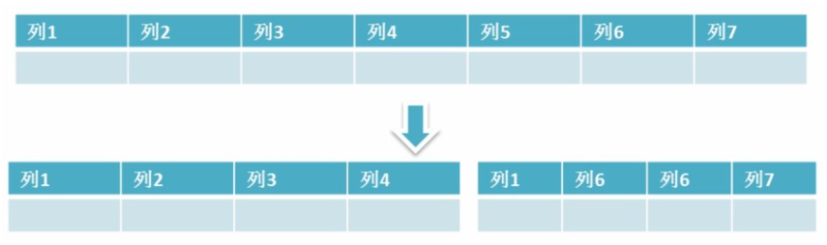
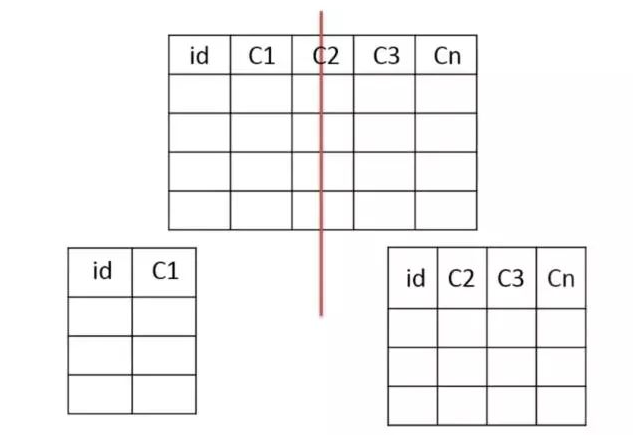
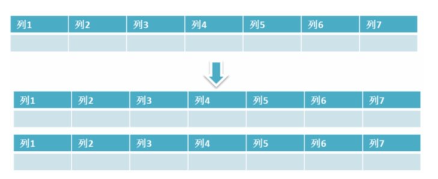
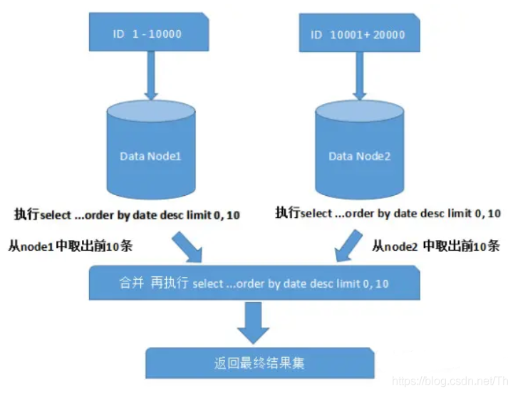
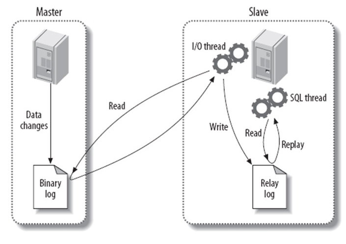

# 数据库优化

## 1.SQL语句优化

> 分析慢查询日志：记录了在MySQL中响应时间超过阀值long_query_time的SQL语句，通过日志去找出IO大的SQL以及发现未命中索引的SQL

> 使用 Explain 进行分析：通过explain命令可以得到表的读取顺序、数据读取操作的操作类型、哪些索引可以使用、**哪些索引被实际使用**、表之间的引用以及**被扫描的行数**等问题；

- 应尽量避免在 where 子句中使用`!=`、`<`、`>`操作符或对字段进行null值判断，否则将引擎放弃使用索引而进行全表扫描；
- 只返回必要的列：最好不要使用 SELECT * 语句；
- 只返回必要的行：使用 LIMIT 语句来限制返回的数据；
- 将一个大连接查询分解成对每一个表进行一次单表查询，然后在应用程序中进行关联，这样做的好处有：
  - 让缓存更高效。对于连接查询，如果其中一个表发生变化，那么整个查询缓存就无法使用。而分解后的多个查询，即使其中一个表发生变化，对其它表的查询缓存依然可以使用；
  - 分解成多个单表查询，这些单表查询的缓存结果更可能被其它查询使用到，从而减少冗余的查询；
  - 减少锁竞争

## 2.索引优化

注意会引起索引失效的情况，以及在适合的地方建立索引

## 3.数据库表结构的优化

- 设计表时遵循**三大范式**；
- 选择合适的**数据类型**：尽可能不要存储NULL字段；使用简单的数据类型（int, varchar/ text）；
- 表的**水平切分**（Sharding）：将同一个表中的记录拆分到多个结构相同的表中（策略：哈希取模；根据ID范围来分）。当一个表的数据不断增多时，Sharding 是必然的选择，它可以将数据分布到集群的不同节点上，从而缓解单个数据库的压力；
- 表的**垂直切分**：将一张表按列切分成多个表。可以将不常用的字段单独放在同一个表中；把大字段独立放入一个表中；或者把经常使用的字段（关系密切的）放在一张表中。垂直切分之后业务更加清晰，系统之间整合或扩展容易，数据维护简单

## 4.系统配置优化

- 操作系统：增加TCP支持的队列数；
- MySQL配置文件优化：缓存池大小和个数设置

## 5.硬件优化

- 磁盘性能：固态硬盘；
- CPU：多核且高频；
- 内存：增大内存

# SQL语句安全性

（1）防止sql注入，对特殊字符进行转义，过滤或者使用预编译sql语句绑定
（2）使用最小权限原则，特别是不要使用root账户，对不同的操作建立不同的账户
（3）不要把数据库出错的信息暴露到客户端

# 为什么要优化

- 系统的吞吐量瓶颈往往出现在数据库的访问速度上
- 随着应用程序的运行，数据库的中的数据会越来越多，处理时间会相应变慢
- 数据是存放在磁盘上的，读写速度无法和内存相比

优化原则：减少系统瓶颈，减少资源占用，增加系统的反应速度。

# 数据库结构优化

一个好的数据库设计方案对于数据库的性能往往会起到事半功倍的效果。

需要考虑数据冗余、查询和更新的速度、字段的数据类型是否合理等多方面的内容。

**将字段很多的表分解成多个表**

对于字段较多的表，如果有些字段的使用频率很低，可以将这些字段分离出来形成新表。

因为当一个表的数据量很大时，会由于使用频率低的字段的存在而变慢。

**增加中间表**

对于需要经常联合查询的表，可以建立中间表以提高查询效率。

通过建立中间表，将需要通过联合查询的数据插入到中间表中，然后将原来的联合查询改为对中间表的查询。

**增加冗余字段**

设计数据表时应尽量遵循范式理论的规约，尽可能的减少冗余字段，让数据库设计看起来精致、优雅。但是，合理的加入冗余字段可以提高查询速度。

表的规范化程度越高，表和表之间的关系越多，需要连接查询的情况也就越多，性能也就越差。

注意：

冗余字段的值在一个表中修改了，就要想办法在其他表中更新，否则就会导致数据不一致的问题。

# MySQL数据库cpu飙升到500%的话他怎么处理？

当 cpu 飙升到 500%时，先用操作系统命令 top 命令观察是不是 mysqld 占用导致的，如果不是，找出占用高的进程，并进行相关处理。

如果是 mysqld 造成的， show processlist，看看里面跑的 session 情况，是不是有消耗资源的 sql 在运行。找出消耗高的 sql，看看执行计划是否准确， index 是否缺失，或者实在是数据量太大造成。

一般来说，肯定要 kill 掉这些线程(同时观察 cpu 使用率是否下降)，等进行相应的调整(比如说加索引、改 sql、改内存参数)之后，再重新跑这些 SQL。

也有可能是每个 sql 消耗资源并不多，但是突然之间，有大量的 session 连进来导致 cpu 飙升，这种情况就需要跟应用一起来分析为何连接数会激增，再做出相应的调整，比如说限制连接数等

# 大表优化

> 大表怎么优化？某个表有近千万数据，CRUD比较慢，如何优化？分库分表了是怎么做的？分表分库了有什么问题？有用到中间件么？他们的原理知道么？

当MySQL单表记录数过大时，数据库的CRUD性能会明显下降，一些常见的优化措施如下：

- 限定数据的范围： 务必禁止不带任何限制数据范围条件的查询语句。比如：我们当用户在查询订单历史的时候，我们可以控制在一个月的范围内。；
- 读/写分离： 经典的数据库拆分方案，主库负责写，从库负责读；
- 缓存： 使用MySQL的缓存，另外对重量级、更新少的数据可以考虑使用应用级别的缓存；

还有就是通过分库分表的方式进行优化，主要有垂直分表和水平分表

## 垂直分表

**根据数据库里面数据表的相关性进行拆分。** 例如，用户表中既有用户的登录信息又有用户的基本信息，可以将用户表拆分成两个单独的表，甚至放到单独的库做分库。

**简单来说垂直拆分是指数据表列的拆分，把一张列比较多的表拆分为多张表。** 如下图所示，这样来说大家应该就更容易理解了。

**垂直拆分的优点：** 可以使得行数据变小，在查询时减少读取的Block数，减少I/O次数。此外，垂直分区可以简化表的结构，易于维护。

**垂直拆分的缺点：** 主键会出现冗余，需要管理冗余列，并会引起Join操作，可以通过在应用层进行Join来解决。此外，垂直分区会让事务变得更加复杂；

适用场景
1、如果一个表中某些列常用，另外一些列不常用
2、可以使数据行变小，一个数据页能存储更多数据，查询时减少I/O次数
缺点
有些分表的策略基于应用层的逻辑算法，一旦逻辑算法改变，整个分表逻辑都会改变，扩展性较差
对于应用层来说，逻辑算法增加开发成本
管理冗余列，查询所有数据需要join操作

## 水平分表

保持数据表结构不变，通过某种策略存储数据分片。这样每一片数据分散到不同的表或者库中，达到了分布式的目的。 水平拆分可以支撑非常大的数据量。

水平拆分是指数据表行的拆分，表的行数超过200万行时，就会变慢，这时可以把一张的表的数据拆成多张表来存放。举个例子：我们可以将用户信息表拆分成多个用户信息表，这样就可以避免单一表数据量过大对性能造成影响。

水品拆分可以支持非常大的数据量。需要注意的一点是:分表仅仅是解决了单一表数据过大的问题，但由于表的数据还是在同一台机器上，其实对于提升MySQL并发能力没有什么意义，所以 水平拆分最好分库 。

水平拆分能够 支持非常大的数据量存储，应用端改造也少，但 分片事务难以解决 ，跨界点Join性能较差，逻辑复杂。

《Java工程师修炼之道》的作者推荐 尽量不要对数据进行分片，因为拆分会带来逻辑、部署、运维的各种复杂度 ，一般的数据表在优化得当的情况下支撑千万以下的数据量是没有太大问题的。如果实在要分片，尽量选择客户端分片架构，这样可以减少一次和中间件的网络I/O。

表很大，分割后可以降低在查询时需要读的数据和索引的页数，同时也降低了索引的层数，提高查询次数

适用场景
1、表中的数据本身就有独立性，例如表中分表记录各个地区的数据或者不同时期的数据，特别是有些数据常用，有些不常用。
2、需要把数据存放在多个介质上。
水平切分的缺点
1、给应用增加复杂度，通常查询时需要多个表名，查询所有数据都需UNION操作
2、在许多数据库应用中，这种复杂度会超过它带来的优点，查询时会增加读一个索引层的磁盘次数
下面补充一下数据库分片的两种常见方案：

客户端代理： 分片逻辑在应用端，封装在jar包中，通过修改或者封装JDBC层来实现。 当当网的 Sharding-JDBC 、阿里的TDDL是两种比较常用的实现。
中间件代理： 在应用和数据中间加了一个代理层。分片逻辑统一维护在中间件服务中。 我们现在谈的 Mycat 、360的Atlas、网易的DDB等等都是这种架构的实现。

## 分库分表后面临的问题

**事务支持** 分库分表后，就成了分布式事务了。如果依赖数据库本身的分布式事务管理功能去执行事务，将付出高昂的性能代价； 如果由应用程序去协助控制，形成程序逻辑上的事务，又会造成编程方面的负担。

**跨库join**

只要是进行切分，跨节点Join的问题是不可避免的。但是良好的设计和切分却可以减少此类情况的发生。解决这一问题的普遍做法是分两次查询实现。在第一次查询的结果集中找出关联数据的id,根据这些id发起第二次请求得到关联数据。 分库分表方案产品

**跨节点的count,order by,group by以及聚合函数问题** 这些是一类问题，因为它们都需要基于全部数据集合进行计算。多数的代理都不会自动处理合并工作。解决方案：与解决跨节点join问题的类似，分别在各个节点上得到结果后在应用程序端进行合并。和join不同的是每个结点的查询可以并行执行，因此很多时候它的速度要比单一大表快很多。但如果结果集很大，对应用程序内存的消耗是一个问题。

**数据迁移，容量规划，扩容等问题** 来自淘宝综合业务平台团队，它利用对2的倍数取余具有向前兼容的特性（如对4取余得1的数对2取余也是1）来分配数据，避免了行级别的数据迁移，但是依然需要进行表级别的迁移，同时对扩容规模和分表数量都有限制。总得来说，这些方案都不是十分的理想，多多少少都存在一些缺点，这也从一个侧面反映出了Sharding扩容的难度。

**ID问题**

一旦数据库被切分到多个物理结点上，我们将不能再依赖数据库自身的主键生成机制。一方面，某个分区数据库自生成的ID无法保证在全局上是唯一的；另一方面，应用程序在插入数据之前需要先获得ID,以便进行SQL路由. 一些常见的主键生成策略

UUID 使用UUID作主键是最简单的方案，但是缺点也是非常明显的。由于UUID非常的长，除占用大量存储空间外，最主要的问题是在索引上，在建立索引和基于索引进行查询时都存在性能问题。 Twitter的分布式自增ID算法Snowflake 在分布式系统中，需要生成全局UID的场合还是比较多的，twitter的snowflake解决了这种需求，实现也还是很简单的，除去配置信息，核心代码就是毫秒级时间41位 机器ID 10位 毫秒内序列12位。

**跨分片的排序分页**

般来讲，分页时需要按照指定字段进行排序。当排序字段就是分片字段的时候，我们通过分片规则可以比较容易定位到指定的分片，而当排序字段非分片字段的时候，情况就会变得比较复杂了。为了最终结果的准确性，我们需要在不同的分片节点中将数据进行排序并返回，并将不同分片返回的结果集进行汇总和再次排序，最后再返回给用户。如下图所示：

# MySQL的复制原理以及流程

主从复制：将主数据库中的DDL和DML操作通过二进制日志（BINLOG）传输到从数据库上，然后将这些日志重新执行（重做）；从而使得从数据库的数据与主数据库保持一致。

## 主从复制的作用

1. 主数据库出现问题，可以切换到从数据库。
2. 可以进行数据库层面的读写分离。
3. 可以在从数据库上进行日常备份。

## MySQL主从复制解决的问题

- 数据分布：随意开始或停止复制，并在不同地理位置分布数据备份
- 负载均衡：降低单个服务器的压力
- 高可用和故障切换：帮助应用程序避免单点失败
- 升级测试：可以用更高版本的MySQL作为从库

## MySQL主从复制工作原理

- 在主库上把数据更高记录到二进制日志
- 从库将主库的日志复制到自己的中继日志
- 从库读取中继日志的事件，将其重放到从库数据中

## 基本原理流程，3个线程以及之间的关联

主：binlog线程——记录下所有改变了数据库数据的语句，放进master上的binlog中；

从：io线程——在使用start slave 之后，负责从master上拉取 binlog 内容，放进自己的relay log中；

从：sql执行线程——执行relay log中的语句；

Binary log：主数据库的二进制日志

Relay log：从服务器的中继日志

第一步：master在每个事务更新数据完成之前，将该操作记录串行地写入到binlog文件中。

第二步：salve开启一个I/O Thread，该线程在master打开一个普通连接，主要工作是binlog dump process。如果读取的进度已经跟上了master，就进入睡眠状态并等待master产生新的事件。I/O线程最终的目的是将这些事件写入到中继日志中。

第三步：SQL Thread会读取中继日志，并顺序执行该日志中的SQL事件，从而与主数据库中的数据保持一致。

# 读写分离有哪些解决方案？

读写分离是依赖于主从复制，而主从复制又是为读写分离服务的。因为主从复制要求slave不能写只能读（如果对slave执行写操作，那么show slave status将会呈现Slave_SQL_Running=NO，此时你需要按照前面提到的手动同步一下slave）。

## 方案一

使用mysql-proxy代理

优点：直接实现读写分离和负载均衡，不用修改代码，master和slave用一样的帐号，mysql官方不建议实际生产中使用

缺点：降低性能， 不支持事务

## 方案二

使用AbstractRoutingDataSource+aop+annotation在dao层决定数据源。
如果采用了mybatis， 可以将读写分离放在ORM层，比如mybatis可以通过mybatis plugin拦截sql语句，所有的insert/update/delete都访问master库，所有的select 都访问salve库，这样对于dao层都是透明。 plugin实现时可以通过注解或者分析语句是读写方法来选定主从库。不过这样依然有一个问题， 也就是不支持事务， 所以我们还需要重写一下DataSourceTransactionManager， 将read-only的事务扔进读库， 其余的有读有写的扔进写库。

## 方案三

使用AbstractRoutingDataSource+aop+annotation在service层决定数据源，可以支持事务.

缺点：类内部方法通过this.xx()方式相互调用时，aop不会进行拦截，需进行特殊处理。

# mysql备份

> 备份计划，mysqldump以及xtranbackup的实现原理

(1)备份计划

视库的大小来定，一般来说 100G 内的库，可以考虑使用 mysqldump 来做，因为 mysqldump更加轻巧灵活，备份时间选在业务低峰期，可以每天进行都进行全量备份(mysqldump 备份出来的文件比较小，压缩之后更小)。

100G 以上的库，可以考虑用 xtranbackup 来做，备份速度明显要比 mysqldump 要快。一般是选择一周一个全备，其余每天进行增量备份，备份时间为业务低峰期。

(2)备份恢复时间

物理备份恢复快，逻辑备份恢复慢

这里跟机器，尤其是硬盘的速率有关系，以下列举几个仅供参考

20G的2分钟（mysqldump）

80G的30分钟(mysqldump)

111G的30分钟（mysqldump)

288G的3小时（xtra)

3T的4小时（xtra)

逻辑导入时间一般是备份时间的5倍以上

(3)备份恢复失败如何处理

首先在恢复之前就应该做足准备工作，避免恢复的时候出错。比如说备份之后的有效性检查、权限检查、空间检查等。如果万一报错，再根据报错的提示来进行相应的调整。

(4)mysqldump和xtrabackup实现原理

mysqldump

mysqldump 属于逻辑备份。加入–single-transaction 选项可以进行一致性备份。后台进程会先设置 session 的事务隔离级别为 RR(SET SESSION TRANSACTION ISOLATION LEVELREPEATABLE READ)，之后显式开启一个事务(START TRANSACTION /*!40100 WITH CONSISTENTSNAPSHOT */)，这样就保证了该事务里读到的数据都是事务事务时候的快照。之后再把表的数据读取出来。如果加上–master-data=1 的话，在刚开始的时候还会加一个数据库的读锁(FLUSH TABLES WITH READ LOCK),等开启事务后，再记录下数据库此时 binlog 的位置(showmaster status)，马上解锁，再读取表的数据。等所有的数据都已经导完，就可以结束事务

Xtrabackup:

xtrabackup 属于物理备份，直接拷贝表空间文件，同时不断扫描产生的 redo 日志并保存下来。最后完成 innodb 的备份后，会做一个 flush engine logs 的操作(老版本在有 bug，在5.6 上不做此操作会丢数据)，确保所有的 redo log 都已经落盘(涉及到事务的两阶段提交

概念，因为 xtrabackup 并不拷贝 binlog，所以必须保证所有的 redo log 都落盘，否则可能会丢最后一组提交事务的数据)。这个时间点就是 innodb 完成备份的时间点，数据文件虽然不是一致性的，但是有这段时间的 redo 就可以让数据文件达到一致性(恢复的时候做的事

情)。然后还需要 flush tables with read lock，把 myisam 等其他引擎的表给备份出来，备份完后解锁。这样就做到了完美的热备。

# 数据表损坏的修复方式有哪些？

使用 myisamchk 来修复，具体步骤：

1）修复前将mysql服务停止。
2）打开命令行方式，然后进入到mysql的/bin目录。
3）执行myisamchk –recover 数据库所在路径/*.MYI
使用repair table 或者 OPTIMIZE table命令来修复，REPAIR TABLE table_name 修复表 OPTIMIZE TABLE table_name 优化表 REPAIR TABLE 用于修复被破坏的表。 OPTIMIZE TABLE 用于回收闲置的数据库空间，当表上的数据行被删除时，所占据的磁盘空间并没有立即被回收，使用了OPTIMIZE TABLE命令后这些空间将被回收，并且对磁盘上的数据行进行重排（注意：是磁盘上，而非数据库）

