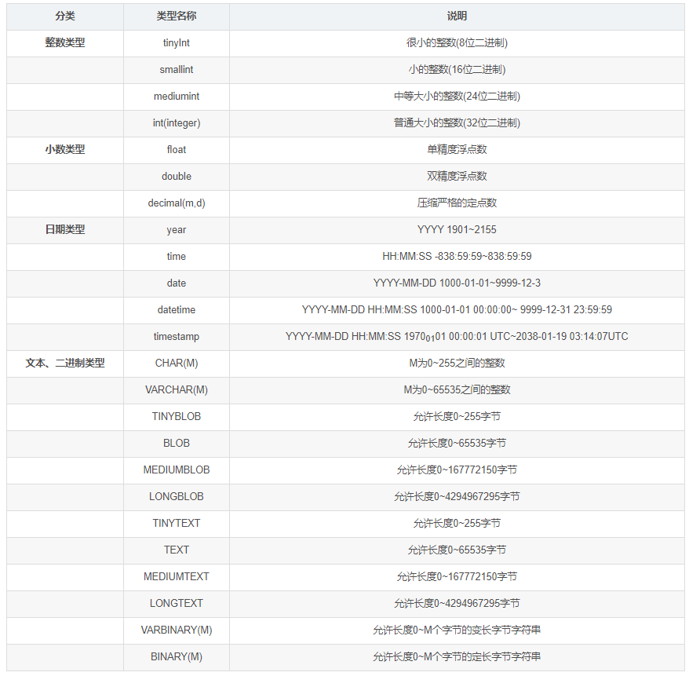

1、整数类型，包括TINYINT、SMALLINT、MEDIUMINT、INT、BIGINT，分别表示1字节、2字节、3字节、4字节、8字节整数。任何整数类型都可以加上UNSIGNED属性，表示数据是无符号的，即非负整数。
长度：整数类型可以被指定长度，例如：INT(11)表示长度为11的INT类型。长度在大多数场景是没有意义的，它不会限制值的合法范围，只会影响显示字符的个数，而且需要和UNSIGNED ZEROFILL属性配合使用才有意义。
例子，假定类型设定为INT(5)，属性为UNSIGNED ZEROFILL，如果用户插入的数据为12的话，那么数据库实际存储数据为00012。

2、实数类型，包括FLOAT、DOUBLE、DECIMAL。
DECIMAL可以用于存储比BIGINT还大的整型，能存储精确的小数。
而FLOAT和DOUBLE是有取值范围的，并支持使用标准的浮点进行近似计算。
计算时FLOAT和DOUBLE相比DECIMAL效率更高一些，DECIMAL你可以理解成是用字符串进行处理。

3、字符串类型，包括VARCHAR、CHAR、TEXT、BLOB
VARCHAR用于存储可变长字符串，它比定长类型更节省空间。
VARCHAR使用额外1或2个字节存储字符串长度。列长度小于255字节时，使用1字节表示，否则使用2字节表示。
VARCHAR存储的内容超出设置的长度时，内容会被截断。
CHAR是定长的，根据定义的字符串长度分配足够的空间。
CHAR会根据需要使用空格进行填充方便比较。
CHAR适合存储很短的字符串，或者所有值都接近同一个长度。
CHAR存储的内容超出设置的长度时，内容同样会被截断。

使用策略：
对于经常变更的数据来说，CHAR比VARCHAR更好，因为CHAR不容易产生碎片。
对于非常短的列，CHAR比VARCHAR在存储空间上更有效率。
使用时要注意只分配需要的空间，更长的列排序时会消耗更多内存。
尽量避免使用TEXT/BLOB类型，查询时会使用临时表，导致严重的性能开销。

4、枚举类型（ENUM），把不重复的数据存储为一个预定义的集合。
有时可以使用ENUM代替常用的字符串类型。
ENUM存储非常紧凑，会把列表值压缩到一个或两个字节。
ENUM在内部存储时，其实存的是整数。
尽量避免使用数字作为ENUM枚举的常量，因为容易混乱。
排序是按照内部存储的整数

5、日期和时间类型，尽量使用timestamp，空间效率高于datetime，
用整数保存时间戳通常不方便处理。
如果需要存储微妙，可以使用bigint存储。
看到这里，这道真题是不是就比较容易回答了。