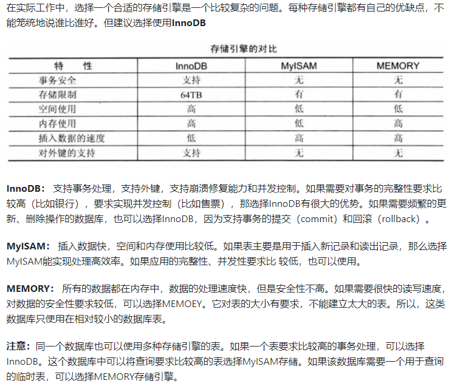
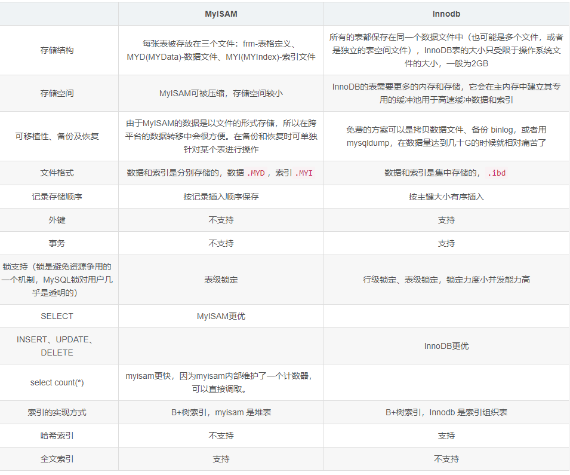

# MySQL三种存储引擎的区别

- InnoDB**支持事务**，可以进行Commit和Rollback；
- MyISAM 只支持表级锁，而 InnoDB 还**支持行级锁**，提高了并发操作的性能；
- InnoDB **支持外键**；
- MyISAM **崩溃**后发生损坏的概率比 InnoDB 高很多，而且**恢复的速度**也更慢；
- MyISAM 支持**压缩**表和空间数据索引，InnoDB需要更多的内存和存储；
- InnoDB 支持在线**热备份**

## 详细区别

# InnoDB引擎的4大特性

- 插入缓冲（insert buffer)
- 二次写(double write)
- 自适应哈希索引(ahi)
- 预读(read ahead)

# 应用场景

- **MyISAM** 管理非事务表。它提供高速存储和检索（MyISAM强调的是性能，每次查询具有原子性，其执行速度比InnoDB更快），以及全文搜索能力。如果表比较小，或者是只读数据（有大量的SELECT），还是可以使用MyISAM；
- **InnoDB** 支持事务，并发情况下有很好的性能，基本可以替代MyISAM

