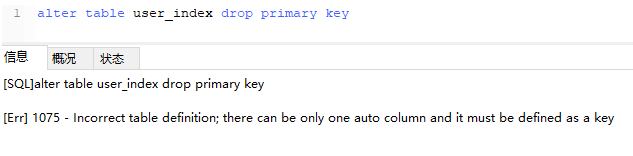
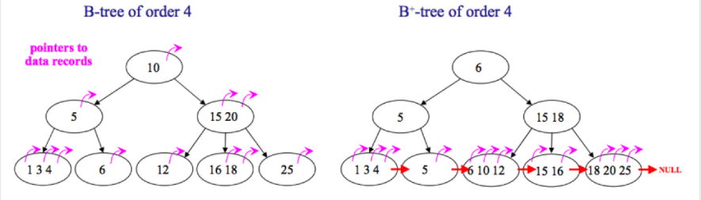
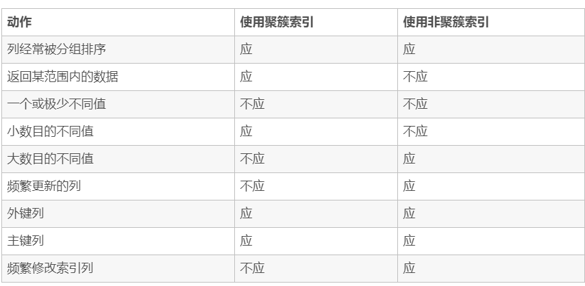

# 什么是索引

索引是一种特殊的文件(InnoDB数据表上的索引是表空间的一个组成部分)，它们包含着对数据表里所有记录的引用指针。

索引是一种数据结构。数据库索引，是数据库管理系统中一个排序的数据结构，以协助快速查询、更新数据库表中数据。索引的实现通常使用B树及其变种B+树。

更通俗的说，索引就相当于目录。为了方便查找书中的内容，通过对内容建立索引形成目录。索引是一个文件，它是要占据物理空间的。

# 数据库索引的实现原理（B+树）

### 使用B树和B+树的比较

InnoDB的索引使用的是B+树实现，B+树对比B树的好处：

- IO次数少：B+树的中间结点只存放索引，数据都存在叶结点中，因此中间结点可以存更多的数据，让索引树更加矮胖；
- 范围查询效率更高：B树需要中序遍历整个树，只B+树需要遍历叶结点中的链表；
- 查询效率更加稳定：每次查询都需要从根结点到叶结点，路径长度相同，所以每次查询的效率都差不多

### 使用B树索引和哈希索引的比较

哈希索引能以 O(1) 时间进行查找，但是只支持精确查找，无法用于部分查找和范围查找，无法用于排序与分组；B树索引支持大于小于等于查找，范围查找。哈希索引遇到大量哈希值相等的情况后查找效率会降低。哈希索引不支持数据的排序。

# 使用索引的优点

- 大大加快了数据的**检索速度**；
- 可以显著减少查询中**分组和排序**的时间；
- 通过创建唯一性索引，可以保证数据库表中每一行数据的唯一性；
- 将随机 I/O 变为**顺序 I/O**（B+Tree 索引是有序的，会将相邻的数据都存储在一起）

缺点：建立和维护索引耗费时间空间，更新索引很慢。

# 哪些情况下索引会失效？

- 以“%(表示任意0个或多个字符)”开头的LIKE语句；
- OR语句前后没有同时使用索引；
- 数据类型出现隐式转化（如varchar不加单引号的话可能会自动转换为int型）；
- 对于多列索引，必须满足 **最左匹配原则**/最左前缀原则 (最左优先，eg：多列索引col1、col2和col3，则 索引生效的情形包括 col1或col1，col2或col1，col2，col3)；
- 如果MySQL估计全表扫描比索引快，则不使用索引（比如非常小的表）

# 在哪些地方适合创建索引？

- 某列经常作为最大最小值；
- 经常被查询的字段；
- 经常用作表连接的字段；
- 经常出现在ORDER BY/GROUP BY/DISDINCT后面的字段

# 创建索引时的注意事项

- 只应建立在**小字段**上，而不要对大文本或图片建立索引（一页存储的数据越多一次IO操作获取的数据越大效率越高）；
- 建立索引的字段应该**非空**，在MySQL中，含有空值的列很难进行查询优化，因为它们使得索引、索引的统计信息以及比较运算更加复杂。应该用0、一个特殊的值或者一个空串代替NULL；
- 选择**数据密度大**（唯一值占总数的百分比很大）的字段作索引
- 适合索引的列是出现在where子句中的列，或者连接子句中指定的列
- 基数较小的类，索引效果较差，没有必要在此列建立索引
- 使用短索引，如果对长字符串列进行索引，应该指定一个前缀长度，这样能够节省大量索引空间
- 不要过度索引。索引需要额外的磁盘空间，并降低写操作的性能。在修改表内容的时候，索引会进行更新甚至重构，索引列越多，这个时间就会越长。所以只保持需要的索引有利于查询即可。
- 最左前缀匹配原则，组合索引非常重要的原则，mysql会一直向右匹配直到遇到范围查询(>、<、between、like)就停止匹配，比如a = 1 and b = 2 and c > 3 and d = 4 如果建立(a,b,c,d)顺序的索引，d是用不到索引的，如果建立(a,b,d,c)的索引则都可以用到，a,b,d的顺序可以任意调整。
- 较频繁作为查询条件的字段才去创建索引
- 更新频繁字段不适合创建索引
- 若是不能有效区分数据的列不适合做索引列(如性别，男女未知，最多也就三种，区分度实在太低)
- 尽量的扩展索引，不要新建索引。比如表中已经有a的索引，现在要加(a,b)的索引，那么只需要修改原来的索引即可。
- 定义有外键的数据列一定要建立索引。
- 对于那些查询中很少涉及的列，重复值比较多的列不要建立索引。
- 对于定义为text、image和bit的数据类型的列不要建立索引。

# 索引的分类

- 普通索引
- 唯一索引 UNIQUE：索引列的值必须唯一，但允许有空值；
- 主键索引 PRIMARY KEY：必须唯一，不允许空值（是一种特殊的唯一索引；MySQL创建主键时默认为聚集索引，但主键也可以是非聚集索引）；
- 单列索引和多列索引/复合索引（Composite）：索引的列数；
- 覆盖（Covering）索引：索引包含了所有满足查询所需要的数据，查询的时候只需要读取索引而不需要回表读取数据；
- 聚集（Clustered）索引/非聚集索引：对磁盘上存放数据的物理地址重新组织以使这些数据按照指定规则排序的一种索引（数据的物理排列顺序和索引排列顺序一致）。因此每张表只能创建一个聚集索引（因为要改变物理存储顺序）。优点是查询速度快，因为可以直接按照顺序得到需要数据的物理地址。缺点是进行修改的速度较慢。对于需要经常搜索范围的值很有效。非聚集索引只记录逻辑顺序，并不改变物理顺序；
- 分区索引（？）
- 虚拟索引（Virtual）：模拟索引的存在而不用真正创建一个索引，用于快速测试创建索引对执行计划的影响。没有相关的索引段，不增加存储空间的使用

# 索引覆盖

覆盖索引（covering index）指一个查询语句的执行只用从索引中就能够取得，不必从数据表中读取。也可以称之为实现了索引覆盖。
 如果一个索引包含了（或覆盖了）满足查询语句中字段与条件的数据就叫做覆盖索引。

如果要查询的字段都建立过索引，那么引擎会直接在索引表中查询而不会访问原始数据（否则只要有一个字段没有建立索引就会做全表扫描），这叫索引覆盖。因此我们需要尽可能的在select后只写必要的查询字段，以增加索引覆盖的几率。

这里值得注意的是不要想着为每个字段建立索引，因为优先使用索引的优势就在于其体积小。

# 索引的基本原理

索引用来快速地寻找那些具有特定值的记录。如果没有索引，一般来说执行查询时遍历整张表。

索引的原理很简单，就是把无序的数据变成有序的查询

1. 把创建了索引的列的内容进行排序
2. 对排序结果生成倒排表
3. 在倒排表内容上拼上数据地址链
4. 在查询的时候，先拿到倒排表内容，再取出数据地址链，从而拿到具体数据

# 索引算法

索引算法有 BTree算法和Hash算法

## BTree算法

BTree是最常用的mysql数据库索引算法，也是mysql默认的算法。因为它不仅可以被用在=,>,>=,<,<=和between这些比较操作符上，而且还可以用于like操作符，只要它的查询条件是一个不以通配符开头的常量， 例如：

```sql
-- 只要它的查询条件是一个不以通配符开头的常量
select * from user where name like 'jack%'; 
-- 如果一通配符开头，或者没有使用常量，则不会使用索引，例如： 
select * from user where name like '%jack'; 
```

## Hash算法

Hash Hash索引只能用于对等比较，例如=,<=>（相当于=）操作符。由于是一次定位数据，不像BTree索引需要从根节点到枝节点，最后才能访问到页节点这样多次IO访问，所以检索效率远高于BTree索引。

# 创建索引

第一种方式：在执行CREATE TABLE时创建索引

```sql
CREATE TABLE user_index2 (
	id INT auto_increment PRIMARY KEY,
	first_name VARCHAR (16),
	last_name VARCHAR (16),
	id_card VARCHAR (18),
	information text,
	KEY name (first_name, last_name),
	FULLTEXT KEY (information),
	UNIQUE KEY (id_card)
);

```

第二种方式：使用ALTER TABLE命令去增加索引

```sql
ALTER TABLE table_name ADD INDEX index_name (column_list);
```

ALTER TABLE用来创建普通索引、UNIQUE索引或PRIMARY KEY索引。

其中table_name是要增加索引的表名，column_list指出对哪些列进行索引，多列时各列之间用逗号分隔。

索引名index_name可自己命名，缺省时，MySQL将根据第一个索引列赋一个名称。另外，ALTER TABLE允许在单个语句中更改多个表，因此可以在同时创建多个索引。

第三种方式：使用CREATE INDEX命令创建

```sql
CREATE INDEX index_name ON table_name (column_list);
```

CREATE INDEX可对表增加普通索引或UNIQUE索引。（但是，不能创建PRIMARY KEY索引）

删除索引

根据索引名删除普通索引、唯一索引、全文索引：alter table 表名 drop KEY 索引名

```sql
alter table user_index drop KEY name;
alter table user_index drop KEY id_card;
alter table user_index drop KEY information;
```

删除主键索引：alter table 表名 drop primary key（因为主键只有一个）。这里值得注意的是，如果主键自增长，那么不能直接执行此操作（自增长依赖于主键索引）：



需要取消自增长再行删除：

```sql
alter table user_index drop KEY name;
alter table user_index drop KEY id_card;
alter table user_index drop KEY information;
```

但通常不会删除主键，因为设计主键一定与业务逻辑无关。

# 使用索引查询一定能提高查询的性能吗？为什么

通常，通过索引查询数据比全表扫描要快。但是我们也必须注意到它的代价。

索引需要空间来存储，也需要定期维护， 每当有记录在表中增减或索引列被修改时，索引本身也会被修改。 这意味着每条记录的INSERT，DELETE，UPDATE将为此多付出4，5 次的磁盘I/O。 因为索引需要额外的存储空间和处理，那些不必要的索引反而会使查询反应时间变慢。使用索引查询不一定能提高查询性能，索引范围查询(INDEX RANGE SCAN)适用于两种情况:
基于一个范围的检索，一般查询返回结果集小于表中记录数的30%
基于非唯一性索引的检索

# 百万级别或以上的数据如何删除

关于索引：由于索引需要额外的维护成本，因为索引文件是单独存在的文件,所以当我们对数据的增加,修改,删除,都会产生额外的对索引文件的操作,这些操作需要消耗额外的IO,会降低增/改/删的执行效率。所以，在我们删除数据库百万级别数据的时候，查询MySQL官方手册得知删除数据的速度和创建的索引数量是成正比的。

所以我们想要删除百万数据的时候可以先删除索引（此时大概耗时三分多钟）
然后删除其中无用数据（此过程需要不到两分钟）
删除完成后重新创建索引(此时数据较少了)创建索引也非常快，约十分钟左右。
与之前的直接删除绝对是要快速很多，更别说万一删除中断,一切删除会回滚。那更是坑了。

# 前缀索引

语法：index(field(10))，使用字段值的前10个字符建立索引，默认是使用字段的全部内容建立索引。

前提：前缀的标识度高。比如密码就适合建立前缀索引，因为密码几乎各不相同。

实操的难度：在于前缀截取的长度。

我们可以利用select count(*)/count(distinct left(password,prefixLen));，通过从调整prefixLen的值（从1自增）查看不同前缀长度的一个平均匹配度，接近1时就可以了（表示一个密码的前prefixLen个字符几乎能确定唯一一条记录）

# 什么是最左前缀原则？什么是最左匹配原则

顾名思义，就是最左优先，在创建多列索引时，要根据业务需求，where子句中使用最频繁的一列放在最左边。
最左前缀匹配原则，非常重要的原则，mysql会一直向右匹配直到遇到范围查询(>、<、between、like)就停止匹配，比如a = 1 and b = 2 and c > 3 and d = 4 如果建立(a,b,c,d)顺序的索引，d是用不到索引的，如果建立(a,b,d,c)的索引则都可以用到，a,b,d的顺序可以任意调整。
=和in可以乱序，比如a = 1 and b = 2 and c = 3 建立(a,b,c)索引可以任意顺序，mysql的查询优化器会帮你优化成索引可以识别的形式

# B树和B+树的区别

- 在B树中，你可以将键和值存放在内部节点和叶子节点；但在B+树中，内部节点都是键，没有值，叶子节点同时存放键和值。
- B+树的叶子节点有一条链相连，而B树的叶子节点各自独立。



## 使用B树的好处

B树可以在内部节点同时存储键和值，因此，把频繁访问的数据放在靠近根节点的地方将会大大提高热点数据的查询效率。这种特性使得B树在特定数据重复多次查询的场景中更加高效。

## 使用B+树的好处

由于B+树的内部节点只存放键，不存放值，因此，一次读取，可以在内存页中获取更多的键，有利于更快地缩小查找范围。 B+树的叶节点由一条链相连，因此，当需要进行一次全数据遍历的时候，B+树只需要使用O(logN)时间找到最小的一个节点，然后通过链进行O(N)的顺序遍历即可。而B树则需要对树的每一层进行遍历，这会需要更多的内存置换次数，因此也就需要花费更多的时间

## Hash索引和B+树所有有什么区别或者说优劣呢?

首先要知道Hash索引和B+树索引的底层实现原理：

hash索引底层就是hash表，进行查找时，调用一次hash函数就可以获取到相应的键值，之后进行回表查询获得实际数据。B+树底层实现是多路平衡查找树。对于每一次的查询都是从根节点出发，查找到叶子节点方可以获得所查键值，然后根据查询判断是否需要回表查询数据。

那么可以看出他们有以下的不同：

hash索引进行等值查询更快(一般情况下)，但是却无法进行范围查询。
因为在hash索引中经过hash函数建立索引之后，索引的顺序与原顺序无法保持一致，不能支持范围查询。而B+树的的所有节点皆遵循(左节点小于父节点，右节点大于父节点，多叉树也类似)，天然支持范围。

hash索引不支持使用索引进行排序，原理同上。
hash索引不支持模糊查询以及多列索引的最左前缀匹配。原理也是因为hash函数的不可预测。AAAA和AAAAB的索引没有相关性。
hash索引任何时候都避免不了回表查询数据，而B+树在符合某些条件(聚簇索引，覆盖索引等)的时候可以只通过索引完成查询。
hash索引虽然在等值查询上较快，但是不稳定。性能不可预测，当某个键值存在大量重复的时候，发生hash碰撞，此时效率可能极差。而B+树的查询效率比较稳定，对于所有的查询都是从根节点到叶子节点，且树的高度较低。
因此，在大多数情况下，直接选择B+树索引可以获得稳定且较好的查询速度。而不需要使用hash索引。

## 数据库为什么使用B+树而不是B树

B树只适合随机检索，而B+树同时支持随机检索和顺序检索；
B+树空间利用率更高，可减少I/O次数，磁盘读写代价更低。一般来说，索引本身也很大，不可能全部存储在内存中，因此索引往往以索引文件的形式存储的磁盘上。这样的话，索引查找过程中就要产生磁盘I/O消耗。B+树的内部结点并没有指向关键字具体信息的指针，只是作为索引使用，其内部结点比B树小，盘块能容纳的结点中关键字数量更多，一次性读入内存中可以查找的关键字也就越多，相对的，IO读写次数也就降低了。而IO读写次数是影响索引检索效率的最大因素；
B+树的查询效率更加稳定。B树搜索有可能会在非叶子结点结束，越靠近根节点的记录查找时间越短，只要找到关键字即可确定记录的存在，其性能等价于在关键字全集内做一次二分查找。而在B+树中，顺序检索比较明显，随机检索时，任何关键字的查找都必须走一条从根节点到叶节点的路，所有关键字的查找路径长度相同，导致每一个关键字的查询效率相当。
B-树在提高了磁盘IO性能的同时并没有解决元素遍历的效率低下的问题。B+树的叶子节点使用指针顺序连接在一起，只要遍历叶子节点就可以实现整棵树的遍历。而且在数据库中基于范围的查询是非常频繁的，而B树不支持这样的操作。
增删文件（节点）时，效率更高。因为B+树的叶子节点包含所有关键字，并以有序的链表结构存储，这样可很好提高增删效率。

## B+树在满足聚簇索引和覆盖索引的时候不需要回表查询数据

在B+树的索引中，叶子节点可能存储了当前的key值，也可能存储了当前的key值以及整行的数据，这就是聚簇索引和非聚簇索引。 在InnoDB中，只有主键索引是聚簇索引，如果没有主键，则挑选一个唯一键建立聚簇索引。如果没有唯一键，则隐式的生成一个键来建立聚簇索引。

当查询使用聚簇索引时，在对应的叶子节点，可以获取到整行数据，因此不用再次进行回表查询。

# 聚簇索引

- 聚簇索引：将数据存储与索引放到了一块，找到索引也就找到了数据
- 非聚簇索引：将数据存储于索引分开结构，索引结构的叶子节点指向了数据的对应行，myisam通过key_buffer把索引先缓存到内存中，当需要访问数据时（通过索引访问数据），在内存中直接搜索索引，然后通过索引找到磁盘相应数据，这也就是为什么索引不在key buffer命中时，速度慢的原因
  澄清一个概念：innodb中，在聚簇索引之上创建的索引称之为辅助索引，辅助索引访问数据总是需要二次查找，非聚簇索引都是辅助索引，像复合索引、前缀索引、唯一索引，辅助索引叶子节点存储的不再是行的物理位置，而是主键值

何时使用聚簇索引与非聚簇索引



非聚簇索引一定会回表查询吗？
不一定，这涉及到查询语句所要求的字段是否全部命中了索引，如果全部命中了索引，那么就不必再进行回表查询。

举个简单的例子，假设我们在员工表的年龄上建立了索引，那么当进行select age from employee where age < 20的查询时，在索引的叶子节点上，已经包含了age信息，不会再次进行回表查询。

# 联合索引

MySQL可以使用多个字段同时建立一个索引，叫做联合索引。在联合索引中，如果想要命中索引，需要按照建立索引时的字段顺序挨个使用，否则无法命中索引。

具体原因为:

MySQL使用索引时需要索引有序，假设现在建立了"name，age，school"的联合索引，那么索引的排序为: 先按照name排序，如果name相同，则按照age排序，如果age的值也相等，则按照school进行排序。

当进行查询时，此时索引仅仅按照name严格有序，因此必须首先使用name字段进行等值查询，之后对于匹配到的列而言，其按照age字段严格有序，此时可以使用age字段用做索引查找，以此类推。因此在建立联合索引的时候应该注意索引列的顺序，一般情况下，将查询需求频繁或者字段选择性高的列放在前面。此外可以根据特例的查询或者表结构进行单独的调整。