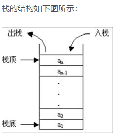
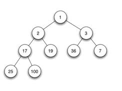

## 堆和栈的区别

栈是一种受限的线性表，如下图所示



堆是二叉树的结构，堆是一种常用的树形结构，是一种特殊的完全二叉树，当且仅当满足所有节点的值总是不大于或不小于其父节点的值的完全二叉树被称之为堆。堆的这一特性称之为堆序性。因此，在一个堆中，根节点是最大（或最小）节点。如果根节点最小，称之为小顶堆（或小根堆），如果根节点最大，称之为大顶堆（或大根堆）。堆的左右孩子没有大小的顺序。下面是一个小顶堆示例：



## 链队

链式队列，简称"链队列"，即使用链表实现的队列存储结构。链式队列的存储结构如下：

```cpp
typedef struct QNode {
  
    ElemType data;
    struct QNode *next;
} QNode;

typedef struct {
  
    QNode *front;   //队列头指针
    QNode *rear;    //队列尾指针
}LinkQueue;
```

