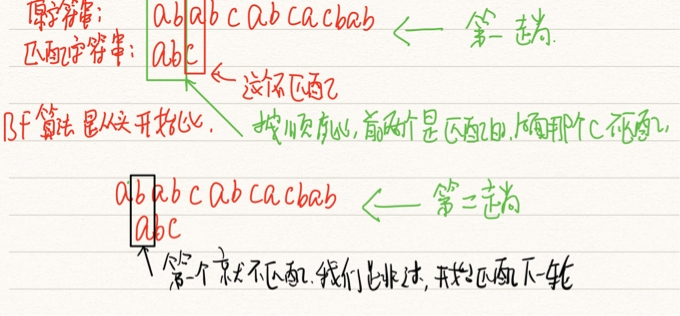

## 字符串的匹配算法

1.BF算法

BF算法是一个古典的算法，算法主要思想如下图所示



按顺序一位一位进行比较，如果有一位不匹配，那么原字符串+1

2.KMP算法

KMP最难的地方就在于计算next数组，具体可以参考这篇文章。

https://www.cnblogs.com/SYCstudio/p/7194315.html

next数组的详解


```go
func strStr(haystack string, needle string) int {
	// 获取两个字符串的长度
	n := len(haystack)
	m := len(needle)
	if m == 0 {
		return 0
	}
	if n < m {
		return -1
	}
	/*
		计算next数组 这个数组也叫匹配表数组（这个数组的长度就是haystck的长度）

		这里解释一下这个数组的意思 解释之前先理解一下前缀和后缀的概念
		前缀: 例如”Harry”的前缀包括{”H”, ”Ha”, ”Har”, ”Harr”}
		后缀：例如，”Potter”的后缀包括{”r”,”er”,”ter”,”tter”,”otter”}
		这个两个其实一个是正过来一个个的往后加 后缀就是反过来的

		然后我们计算的这个表就是每位所包含的相同前后缀的最长的长度
		对于字符串”ababa”，它的前缀集合为{”a”, ”ab”, ”aba”, ”abab”}，它的后缀集合为{”baba”, ”aba”, ”ba”, ”a”}， 两个集合的交集为{”a”, ”aba”}，其中最长的元素为”aba”，长度为3。
		我们拿ababa来举例 这个表有5位，第一为就是a的前后缀的最长长度 第二个就是ab 第三就是 aba 第四个是 abab 第五个是 ababa 就这样就算下去

	*/
	next := computeNext(needle)

	q := 0
	// 遍历字符串开始进行匹配
	for i := 0; i < n; i++ {
		// 如果不匹配，并且q不为0，那么我们就让q等于上一位的最短匹配长度
		for q > 0 && haystack[i] != needle[q] {
			q = next[q-1]
		}
		// 如果发现字符串匹配，那么就匹配下一位
		if haystack[i] == needle[q] {
			q++
		}
		// 如果发现q=m 就说明匹配完毕，我们这里计算一下匹配的位置
		if q == m {
			return i + 1 - m
		}
	}
	return -1
}

// 计算next的值
func computeNext(pattern string) []int {
	// 获取next里面的长度
	n := len(pattern)
	// 创建next数组
	next := make([]int, n)
	k := 0
	// 遍历字符串
	for q := 1; q < n; q++ {
		// 这里开始匹配k是从0开始，相当于计算前缀
		// q从1开始相当于计算后缀 这里默认就是开始匹配最长的前后缀
		// 如果不匹配那么最长的前缀就是上一个最长的前缀
		for k > 0 && (pattern[k] != pattern[q]) {
			k = next[k-1]
		}
		// 开始计算
		if pattern[k] == pattern[q] {
			k++
		}
		// 直接把第q为的值赋值进去
		next[q] = k
	}
	return next
}
```

