# 基础概念

## 二叉树的遍历

1.先序遍历：根结点 ---> 左子树 ---> 右子树

2.中序遍历：左子树---> 根结点 ---> 右子树

3.后序遍历：左子树 ---> 右子树 ---> 根结点

4.层次遍历：只需按层次遍历即可

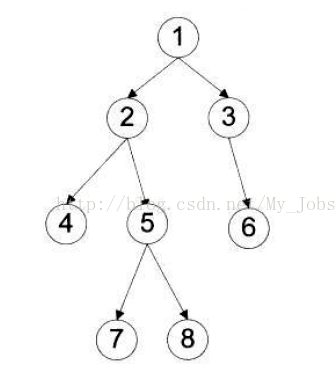

比如上面这张图，遍历的结果如下所示

先序遍历：1 2 4 5 7 8 3 6

中序遍历：4 2 7 5 8 1 3 6

后序遍历：4 7 8 5 2 6 3 1

层次遍历：1 2 3 4 5 6 7 8

这里我简单解释一下先序遍历。

我们可以看到1是根节点，所以先是1，然后左子树是2，这里我们到2可以看到2是下一课树的根节点，所以左子树是4，这个时候已经不能往下了，所以我们遍历右子树5往下就是左子树7，然后右子树8，到这个时候，我们的1的那个左子树已经遍历完了然后我们向右。后面就不说了

## 二叉树的性质

1.在二叉树的第i层上至多有2^(i-1)个节点

2.深度为k的二叉树至多有2^(k) - 1

3.对于任何一棵二叉树T如果其终端结点数为n0度为2的节点为n2，则n0=n2+1

## 满二叉树

深度为k且含有2^k-1个节点的二叉树，其实就是最后一层可以不满，但是上一层必须摆满。

# B+树，B树，红黑树

## 红黑树

一种二叉查找树,但在每个节点增加一个存储位表示节点的颜色,可以是red或black. 通过对任何一条从根到叶子的路径上各个节点着色的方式的限制,红黑树确保没有一条路径会比其它路径长出两倍.它是一种弱平衡二叉树(**由于是若平衡,可以推出,相同的节点情况下,AVL树的高度低于红黑树**),相对于要求严格的AVL树来说,它的旋转次数变少,所以对于搜索,插入,删除操作多的情况下,我们就用红黑树.

性质：

- 每个节点非红即黑.
- 根节点是黑的。
- 每个叶节点(**叶节点即树尾端NUL指针或NULL节点**)都是黑的.
- 如果一个节点是红的,那么它的两儿子都是黑的.
- 对于任意节点而言,其到叶子点树NIL指针的每条路径都包含相同数目的黑节点.

应用

- 广泛用于C++的STL中,map和set都是用红黑树实现的.
- 著名的linux进程调度[Completely Fair Scheduler](https://en.wikipedia.org/wiki/Completely_Fair_Scheduler),用红黑树管理进程控制块,进程的虚拟内存区域都存储在一颗红黑树上,每个虚拟地址区域都对应红黑树的一个节点,左指针指向相邻的地址虚拟存储区域,右指针指向相邻的高地址虚拟地址空间.
- IO多路复用epoll的实现采用红黑树组织管理sockfd，以支持快速的增删改查.
- ngnix中,用红黑树管理timer,因为红黑树是有序的,可以很快的得到距离当前最小的定时器.
- java中TreeMap的实现.

## B+树和B树

> 更具体的查看算法笔记里面的查找算法

B+树更适合用于文件索引，比如MySQL的innodb就是使用的B+数来进行索引

后面参考这个：https://segmentfault.com/a/1190000020416577

# 线索二叉树

[理解线索二叉树 - 简书 (jianshu.com)](https://www.jianshu.com/p/deb1d2f2549a)

遍历二叉树的其实就是以一定规则将二叉树中的结点排列成一个线性序列，得到二叉树中结点的先序序列、中序序列或后序序列。这些线性序列中的每一个元素都有且仅有一个**前驱结点**和**后继结点**。

但是当我们希望得到二叉树中某一个结点的前驱或者后继结点时，普通的二叉树是无法直接得到的，只能通过遍历一次二叉树得到。每当涉及到求解前驱或者后继就需要将二叉树遍历一次，非常不方便。

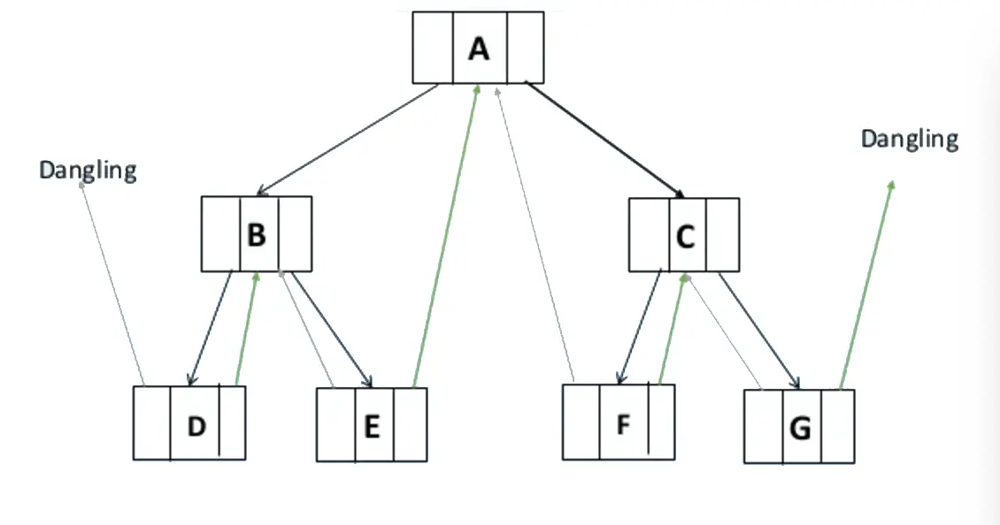

观察二叉树的结构，我们发现指针域并没有充分的利用，有很多“NULL”，也就是存在很多空指针。

对于一个有n个结点的二叉链表，每个节点都有指向左右孩子的两个指针域，一共有**2n**个指针域。而n个结点的二叉树又有**n-1**条分支线数(除了头结点，每一条分支都指向一个结点)，也就是存在**2n-(n-1)=n+1**个空指针域。这些指针域只是白白的浪费空间。因此, 可以用空链域来存放结点的前驱和后继。线索二叉树就是利用n+1个空链域来存放结点的前驱和后继结点的信息。


但是这样还是有一个问题，我们如何知道某一结点的lchild是指向他的左孩子还是指向前驱结点？rchild是指向右孩子还是后继结点？显然我们要对他的指向增设标志来加以区分。

因此，我们在每一个结点都增设两个标志域**LTag**和**RTag**，它们只存放0或1的布尔型变量，占用的空间很小。于是结点的结构如图所示。


> LTag为0是指向该结点的左孩子，为1时指向该结点的前驱
>
> RTag为0是指向该结点的右孩子，为1时指向该结点的后继

因此，实际的二叉链表图如下所示：

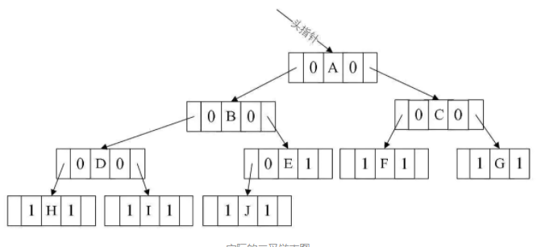

## 二叉树线索化

对普通二叉树以某种次序遍历使其成为线索二叉树的过程就叫做**线索化**。因为前驱和后继结点只有在二叉树的遍历过程中才能得到，所以线索化的具体过程就是在**二叉树的遍历中修改空指针**。

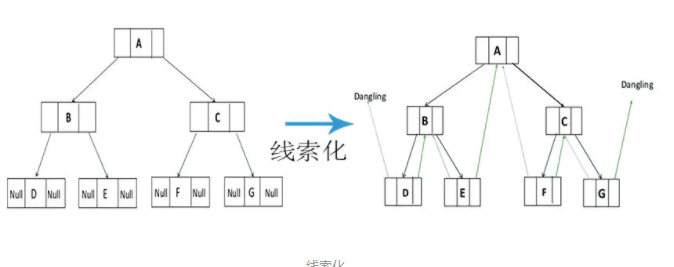

## 线索化具体实现

以中序二叉树的线索化为例，线索化的具体实现就是将中序二叉树的遍历进行修改，把原本打印函数的代码改为指针修改的代码就可以了。

我们设置一个pre指针，永远指向遍历当前结点的前一个结点。若遍历的当前结点左指针域为空，也就是无左孩子，则把左孩子的指针指向pre(相对当前结点的前驱结点)。

右孩子同样的，当pre的右孩子为空，则把pre右孩子的指针指向当前结点(相对pre结点为后继结点)。

最后把当前结点赋给pre，完成后续的递归遍历线索化。

中序遍历线索化的递归函数代码如下：

```c
void InThreading(BiThrTree B,BiThrTree *pre) {
  if(!B) return;

  InThreading(B->lchild,pre);   
//--------------------中间为修改空指针代码---------------------

  if(!B->lchild){                   //没有左孩子 
    B->LTag = Thread;               //修改标志域为前驱线索
    B->lchild = *pre;               //左孩子指向前驱结点
  }

  if(!(*pre)->rchild){              //没有右孩子
    (*pre)->RTag = Thread;          //修改标志域为后继线索
    (*pre)->rchild = B;             //前驱右孩子指向当前结点
  }

  *pre = B;                         //保持pre指向p的前驱
//---------------------------------------------------------
  InThreading(B->rchild,pre);
}
```

## 增设头节点

线索化后的二叉树，就如同操作一个双向链表。于是我们想到为二叉树增设一个头结点，这样就和双向链表一样，即能够从第一个结点正向开始遍历，也可以从最后一个结点逆向遍历。

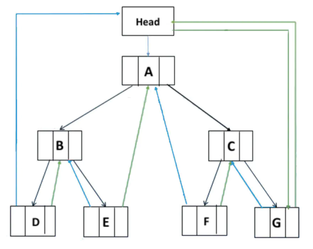

如上图，在线索二叉链表上添加一个head结点，并令其lchild域的指针指向二叉树的根结点(A)，其rchild域的指针指向中序遍历访问的最后一个结点(G)。同样地，二叉树中序序列的第一个结点中，lchild域指针指向头结点，中序序列的最后一个结点rchild域指针也指向头结点。

于是从头结点开始，我们既可以从第一个结点顺后继结点遍历，也可以从最后一个结点起顺前驱遍历。就和双链表一样。

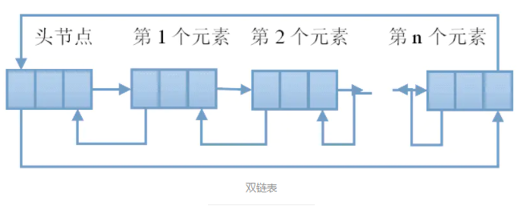

# 树和森林

注意：这个树不是二叉树，二叉树是一种特殊的树，不要理解错误

## 树的三种表示方法

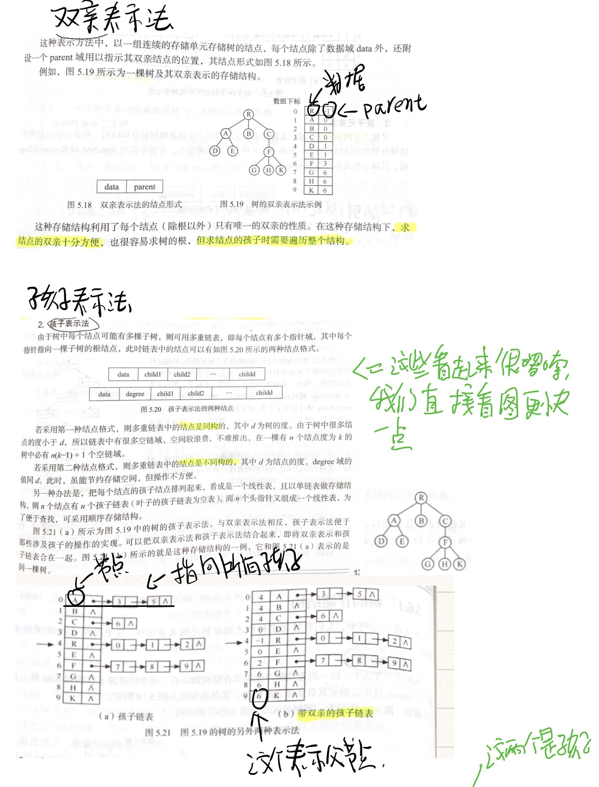

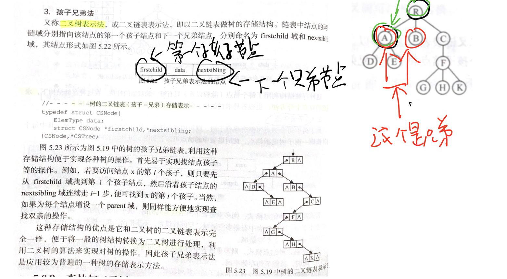

# 哈夫曼树

哈夫曼树也被称为最优树

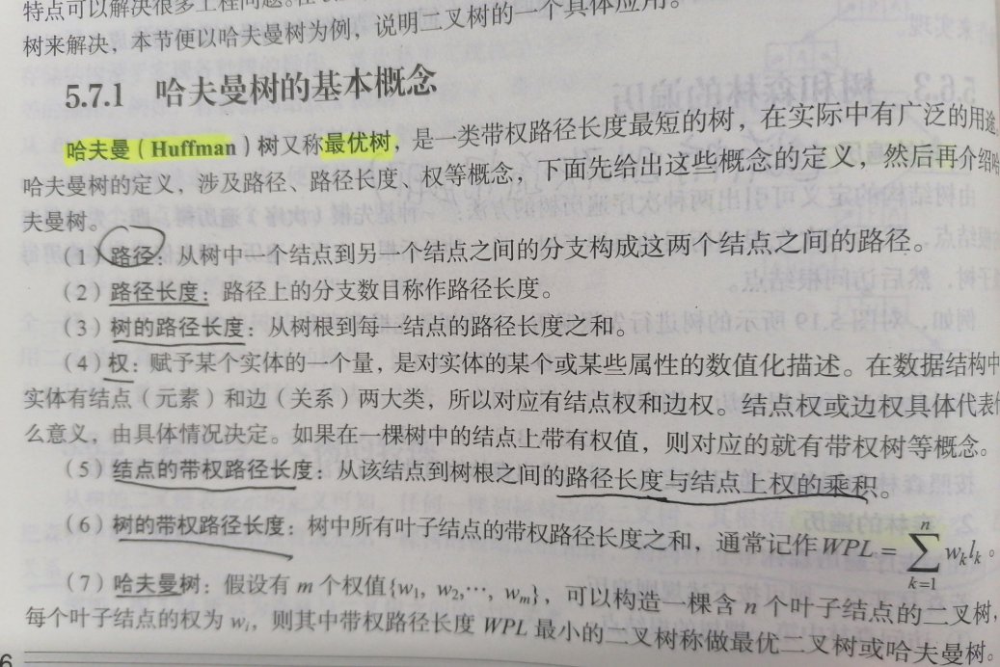

如何判断一棵树是否为哈夫曼树？

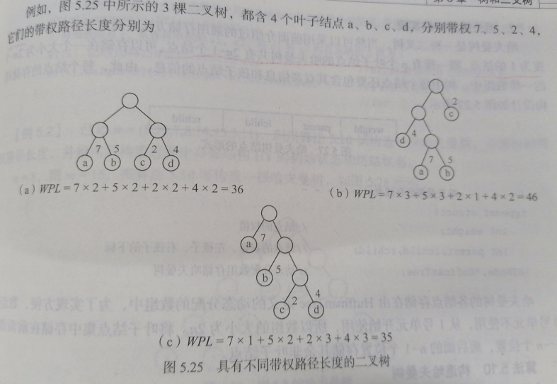

c 的带权路径长度最小，可以验证c恰好为哈夫曼树。

   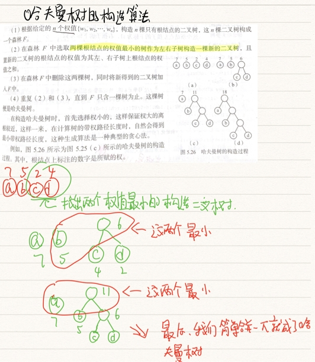

# 二叉树的课后习题

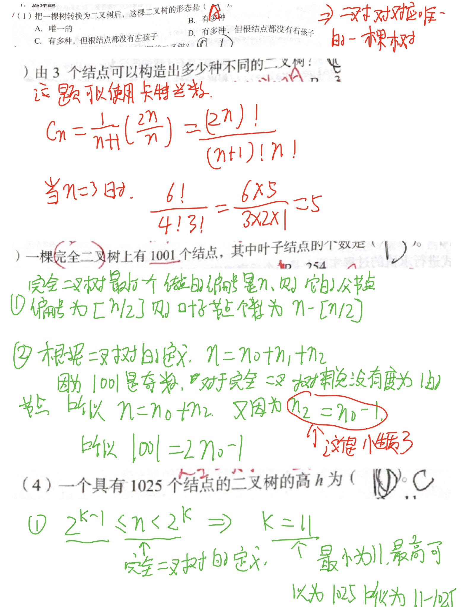

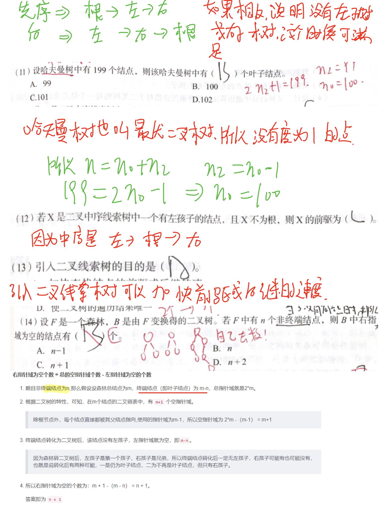


