# 图的定义和基本术语

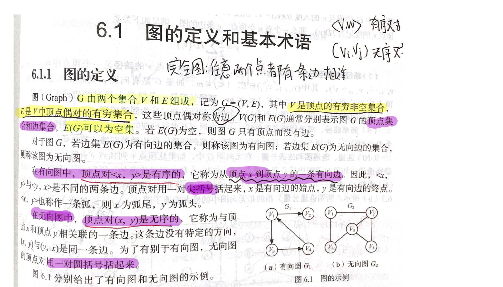

## 图的基本术语

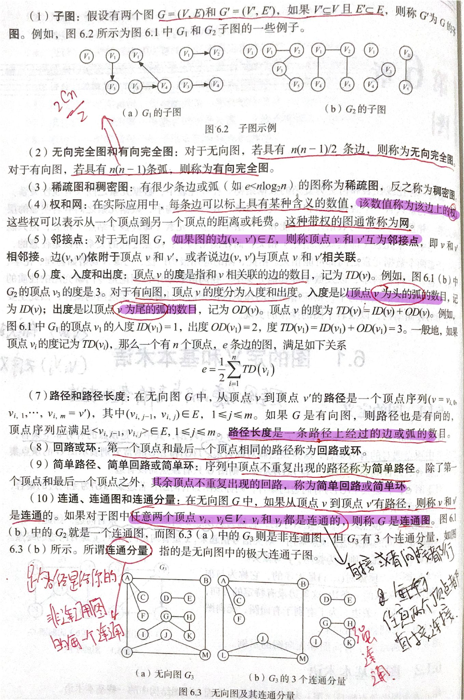

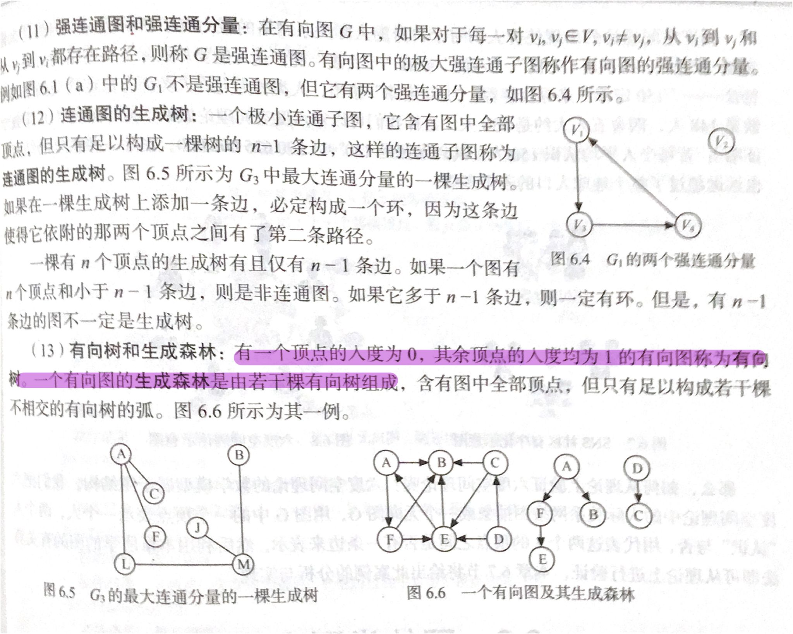

# 图的表示方法

## 临接矩阵表示法

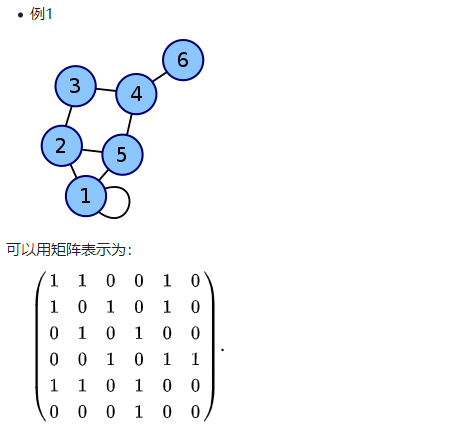

对于带权的图，可以使用无穷来表示无连接

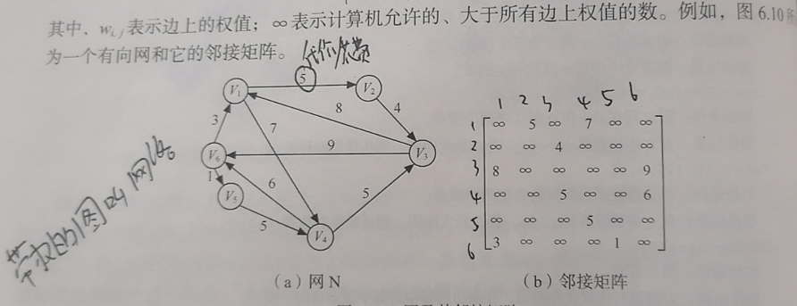

### 优缺点

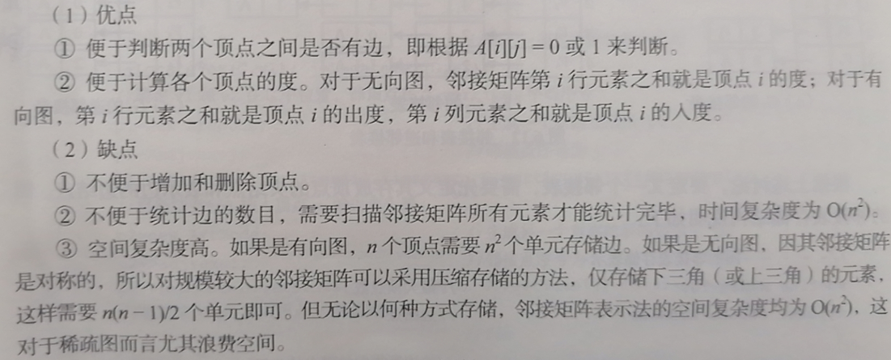

## 临接表表示

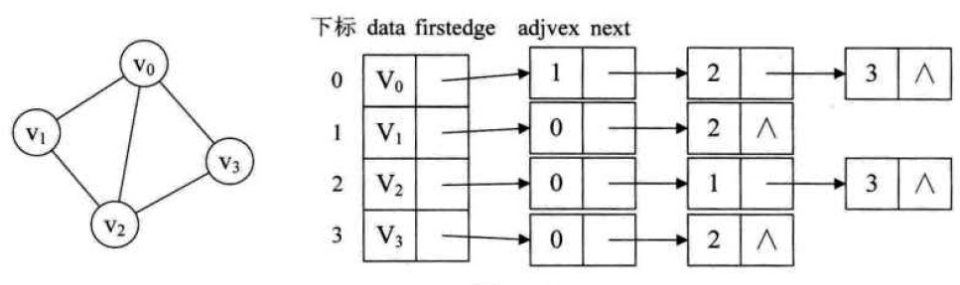

有向图的表示

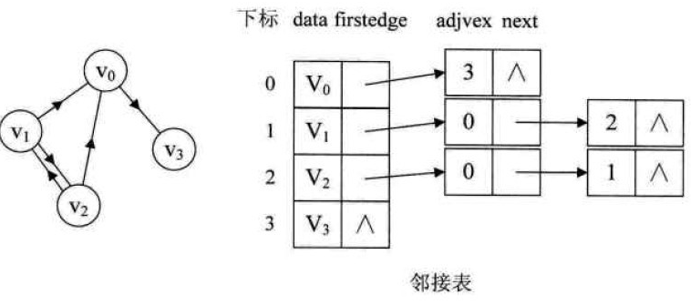

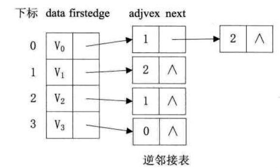

### 优缺点

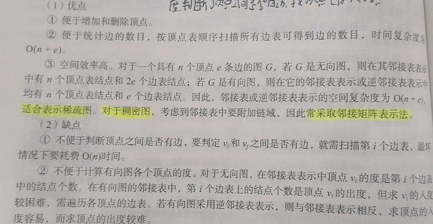

## 十字链表

把邻接表与逆邻接表结合起来，即有向图的一种存储方法**十字链表**(Orthogonal  List)

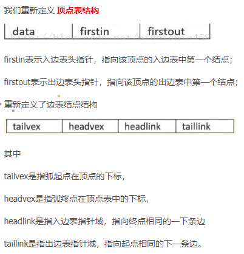

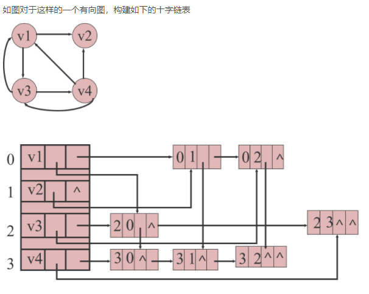

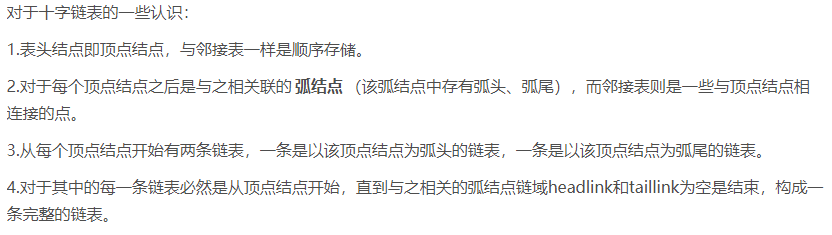

## 邻接多重表

十字链表主要针对有向图，而临接多重表则适用于无向图

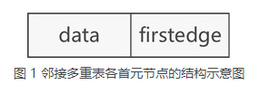

- data：存储此顶点的数据；
- firstedge：指针域，用于指向同该顶点有直接关联的存储其他顶点的节点。

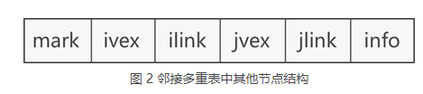

- mark：标志域，用于标记此节点是否被操作过，例如在对图中顶点做遍历操作时，为了防止多次操作同一节点，mark 域为 0 表示还未被遍历；mark 为 1 表示该节点已被遍历；
- ivex 和 jvex：数据域，分别存储图中各边两端的顶点所在数组中的位置下标；
- ilink：指针域，指向下一个存储与 ivex 有直接关联顶点的节点；
- jlink：指针域，指向下一个存储与 jvex 有直接关联顶点的节点；
- info：指针域，用于存储与该顶点有关的其他信息，比如无向网中各边的权；

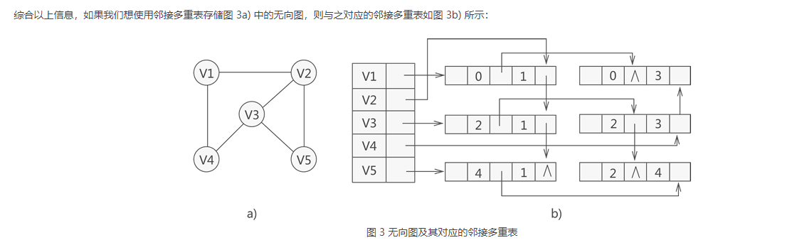

# 图的遍历

## 深度优先搜索 DFS

图的深度优先搜索(Depth First Search)，和树的先序遍历比较类似。

它的思想：假设初始状态是图中所有顶点均未被访问，则从某个顶点v出发，首先访问该顶点，然后依次从它的各个未被访问的邻接点出发深度优先搜索遍历图，直至图中所有和v有路径相通的顶点都被访问到。 若此时尚有其他顶点未被访问到，则另选一个未被访问的顶点作起始点，重复上述过程，直至图中所有顶点都被访问到为止。

### 无向图的深度优先搜索

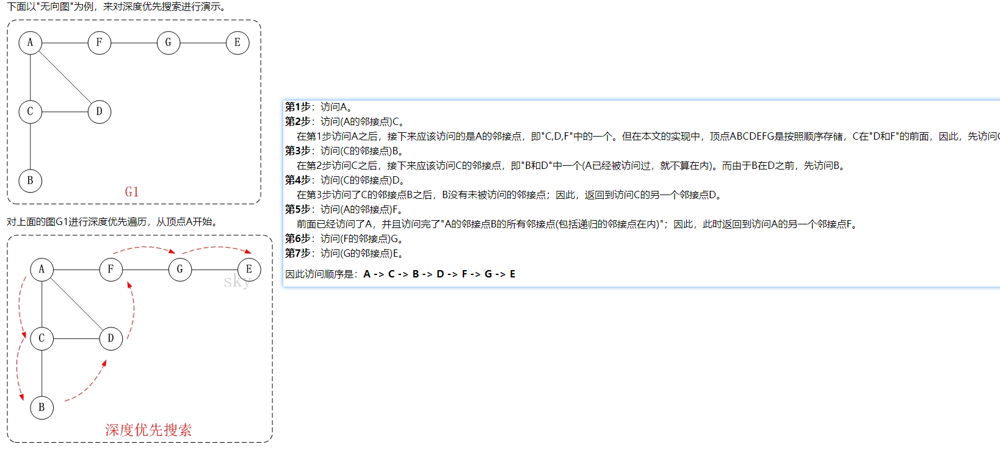

### 有向图的深度优先搜索

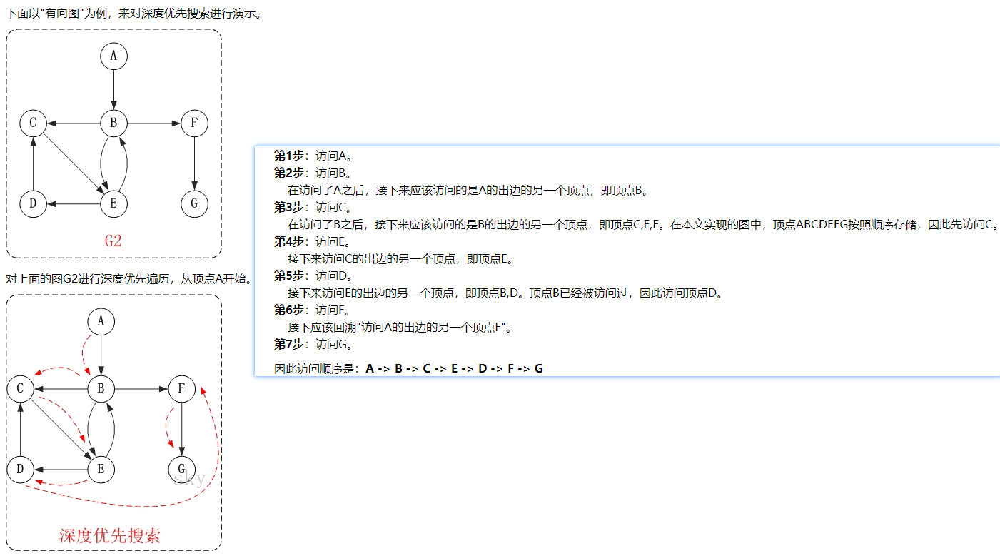

## 广度优先搜索 BFS

广度优先搜索算法(Breadth First Search)，又称为"宽度优先搜索"或"横向优先搜索"，简称BFS。

它的思想是：从图中某顶点v出发，在访问了v之后依次访问v的各个未曾访问过的邻接点，然后分别从这些邻接点出发依次访问它们的邻接点，并使得“先被访问的顶点的邻接点先于后被访问的顶点的邻接点被访问，直至图中所有已被访问的顶点的邻接点都被访问到。如果此时图中尚有顶点未被访问，则需要另选一个未曾被访问过的顶点作为新的起始点，重复上述过程，直至图中所有顶点都被访问到为止。

换句话说，广度优先搜索遍历图的过程是以v为起点，由近至远，依次访问和v有路径相通且路径长度为1,2...的顶点。

### 无向图的广度优先搜索

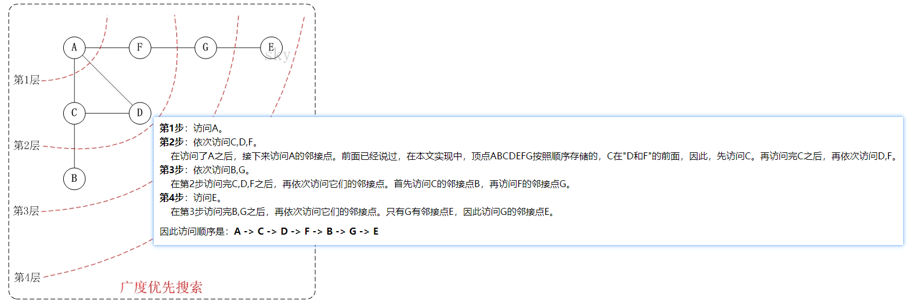

### 有向图的广度优先搜索

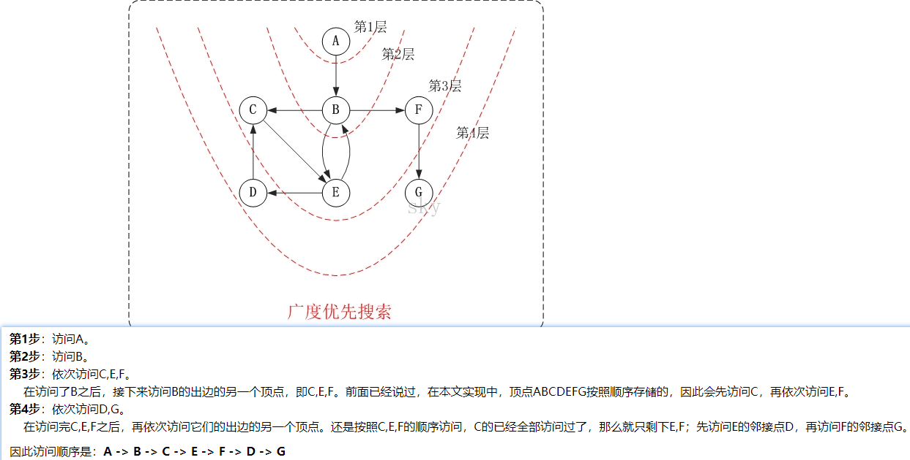

# 图的运用

## 最小生成树

设要在n个城市之间建立通信联络网，则连通n个城市只需要n-1条线路。这时，自然会考虑这样一个问题，如何在最节省经费的前提下建立这个通信网

在每两个城市之间都可设置一条线路，相应地都要付出一定的经济代价。n个城市之间，要多可能设置m(n-1)2条线路，那么，如何在这些可能的线路中选择n一1条，以使总的耗费最少呢?

可以用连通网来表示n个城市，以及n个城市间可能设置的通信线路，其中网的顶点表示城市，边表示两城市之间的线路，赋予边的权值表示相应的代价。对于n个顶点的连通网可以建立许多不同的生成树，每一棵生成树都可以是一个通信网。最合理的通信网应该是代价之和最小的生成树。在一个连通网的所有生成树中，各边的代价之和最小的那棵生成树称为该连通网的最小代价生成树(Minimum Cost Spanning Tree) ， 简称为最小生成树。

构造最小生成树有多种算法， 其中多数算法利用了最小生成树的下列一种简称为MST的性质：假设N=(V，E)是一个连通网，U是顶点集V的一个非空子集。若(u，v)是一条具有最小双值(代价) 的边， 其中u 属于U， v属于V-U， 则必存在一棵包含边(u， u) 的最小生成树。

### 普里姆算法（加点法）

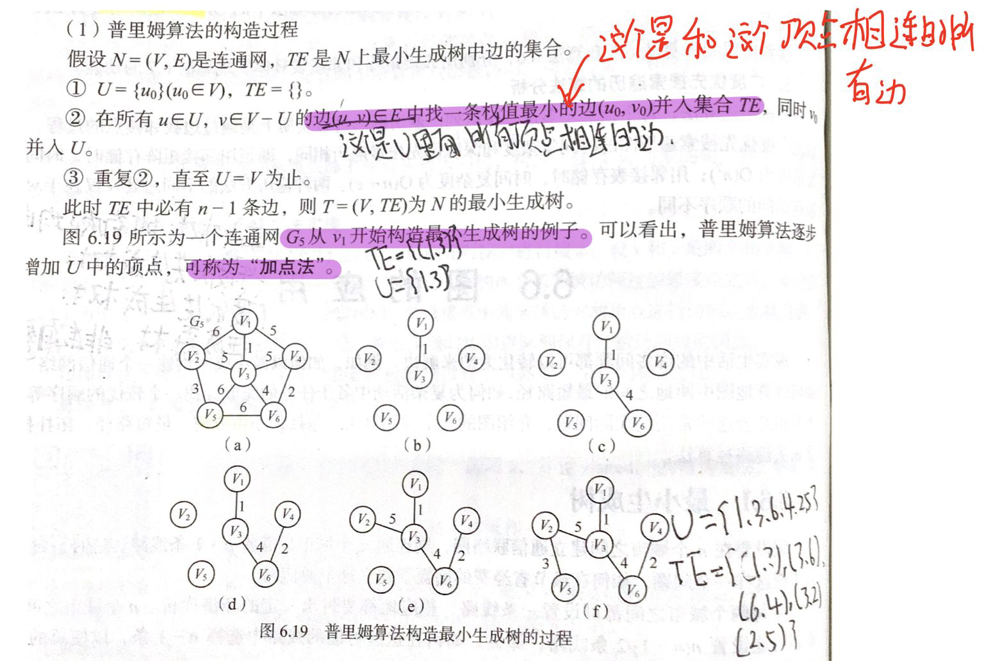

### 克鲁斯卡尔算法（加边法）

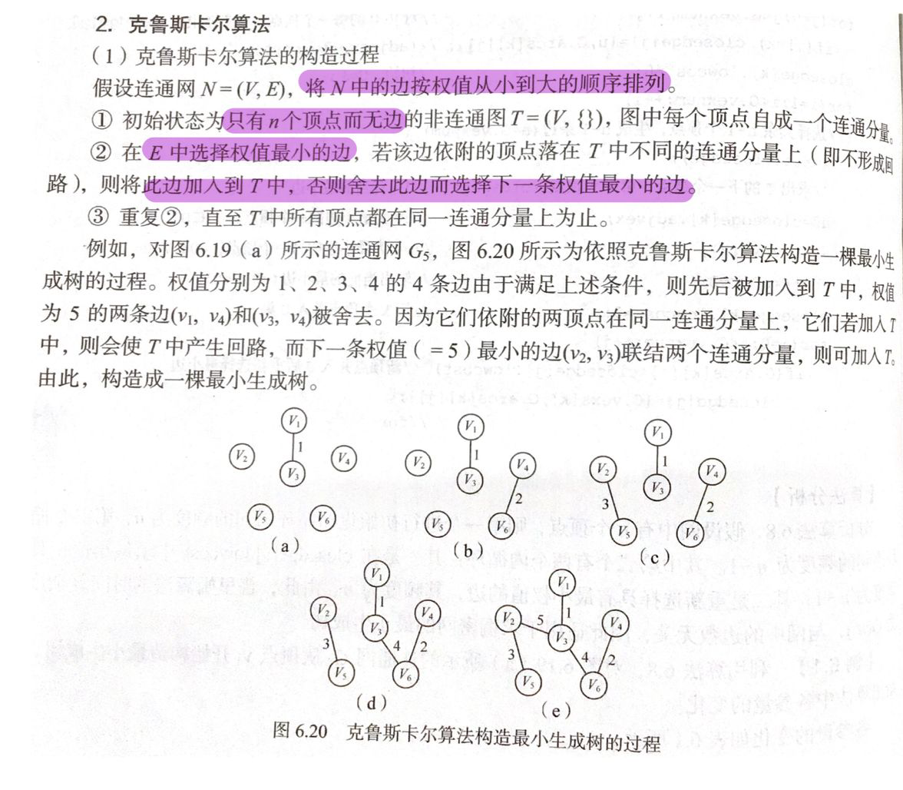

## 最短路径

### 迪杰斯拉特算法（从某源点到其余各顶点的最短路径）

迪科斯彻算法使用了广度优先搜索解决赋权有向图或者无向图的单源最短路径问题，算法最终得到一个最短路径树。该算法常用于路由算法或者作为其他图算法的一个子模块。

比如我们来求下面这个图

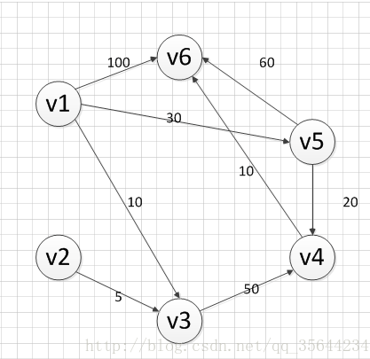

首先初始化dis数组，其中v1和v3，v5，v6是之间相连的，所以可以先写出距离

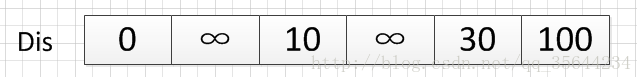

我们的顶点集T的初始化为：T={v1}

既然是求 v1顶点到其余各个顶点的最短路程，那就**先找一个离 1 号顶点最近的顶点**。通过数组 dis 可知当前离v1顶点最近是 v3顶点。当选择了 2 号顶点后，dis[2]（下标从0开始）的值就已经从“估计值”变为了“确定值”，**即 v1顶点到 v3顶点的最短路程就是当前 dis[2]值。将V3加入到T中。**

既然确定了一个顶点的最短路径，下面我们就要根据这个新入的顶点V3会有出度，发现以v3 为弧尾的有： < v3,v4 >,那么我们看看路径：**v1–v3–v4的长度是否比v1–v4短，其实这个已经是很明显的了，因为dis[3]代表的就是v1–v4的长度为无穷大，而v1–v3–v4的长度为：10+50=60**，所以更新dis[3]的值,得到如下结果：

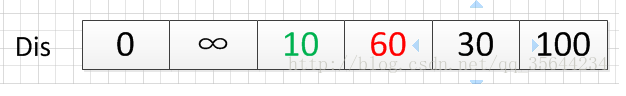

> 因此 dis[3]要更新为 60。这个过程有个专业术语叫做“松弛”。即 v1顶点到 v4顶点的路程即 dis[3]，通过 < v3,v4> 这条边松弛成功。这便是 Dijkstra 算法的主要思想：通过“边”来松弛v1顶点到其余各个顶点的路程。

然后，我们又从**除dis[2]和dis[0]外的其他值中寻找最小值，发现dis[4]的值最小**，通过之前是解释的原理，可以知道**v1到v5的最短距离就是dis[4]的值**，然后，我们**把v5加入到集合T中**，然后，考虑v5的出度是否会影响我们的数组dis的值，**v5有两条出度：< v5,v4>和 < v5,v6>,然后我们发现：v1–v5–v4的长度为：50，而dis[3]的值为60**，所以我们要更新dis[3]的值.另外，**v1-v5-v6的长度为：90，而dis[5]为100，所以我们需要更新dis[5]的值。**更新后的dis数组如下图：

然后，继续从**dis中选择未确定的顶点的值中选择一个最小的值，发现dis[3]的值是最小的**，所以把v4加入到集合T中，此时**集合T={v1,v3,v5,v4}**,然后，考虑v4的出度是否会影响我们的数组dis的值，v4有一条出度：**< v4,v6>,然后我们发现：v1–v5–v4–v6的长度为：60，而dis[5]的值为90**，所以我们要更新dis[5]的值，更新后的dis数组如下图：

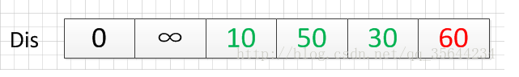

然后，我们使用同样原理，分别确定了v6和v2的最短路径，最后dis的数组的值如下：

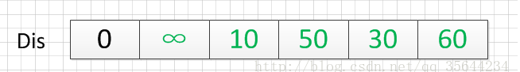

### 弗洛伊德算法（每一对顶点之间的最短路径）

弗洛伊德算法是解决任意两点间的最短路径的一种算法，可以正确处理有向图或有向图或负权（但不可存在负权回路)的最短路径问题，同时也被用于计算有向图的传递闭包。

待补充

## 拓扑排序

### AOV网

一个无环的有向图称作有向无环图(Directed A cyclin e Graph) ， 简称DAG图。有向无环图是描述一项工程或系统的进行过程的有效工具。通常把计划、施工过程、生产流程、程序流程等都当成一个工程。除了很小的工程外， 一般的工程都可分为若干个称做活动(Activity) 的子工程，而这些子工程之间，通常受着一定条件的约束，如其中某些子工程的开始必须在另一些子工程完成之后。例如，一个软件专业的学生必须学习一系列基本课程(见表6.6)，其中有些课程是基础课，独立于其他课程，如《高等数学》；而另一些课程必须在学完作为其基础的先修课程才能开始。比如，在《程序设计基础》和《离散数学》学完之前就不能开始学习《数据结构》。这些先决条件定义了课程之间的领先(优先)关系。这个关系可以用有向图更清楚地表示，如图6.26所示。图中顶点表示课程，有向弧表示先决条件。若课程i是课程j的先决条件，则图中有弧<i，j>。

### 拓扑排序

就是把AOV网中所有的顶点排成一个线性的序列

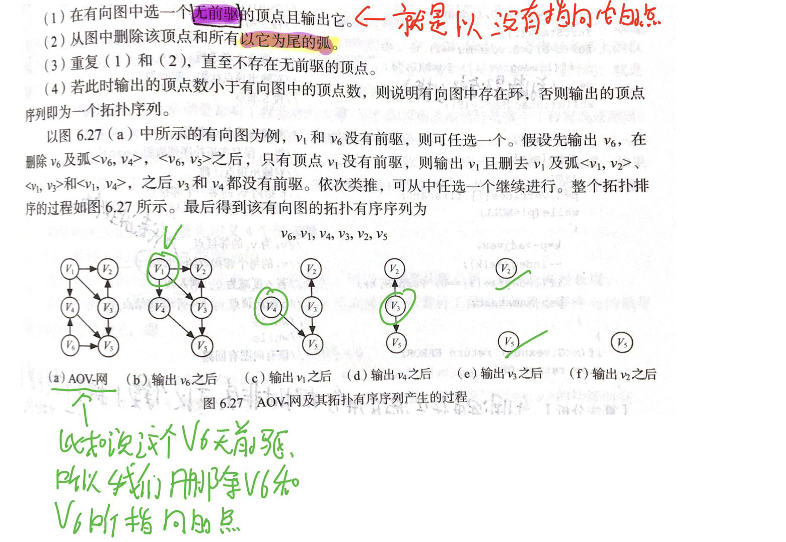

## 关键路径

### AOE网

与AOV-网相对应的是AOE-网(Activity On Edge) ， 即以边表示活动的网。AOE-网是一个带权的有向无环图， 其中， 顶点表示事件， 弧表示活动， 权表示活动持续的时间。通常， AOE-网用于估算工程的完成时间

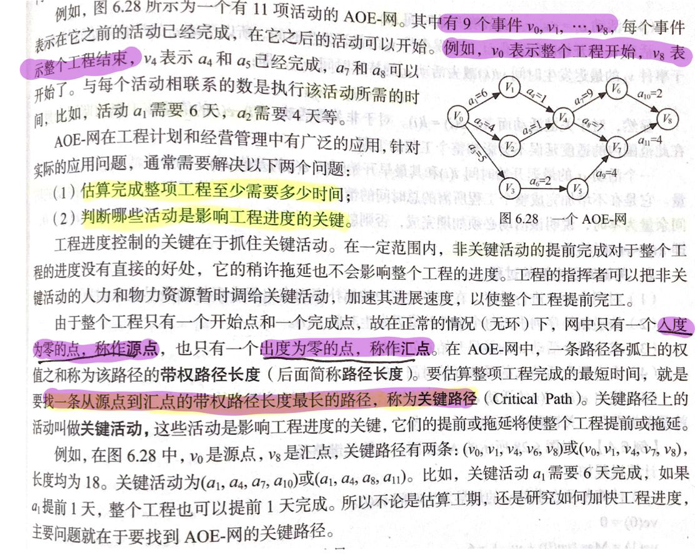

#### AOE网的四个描述量

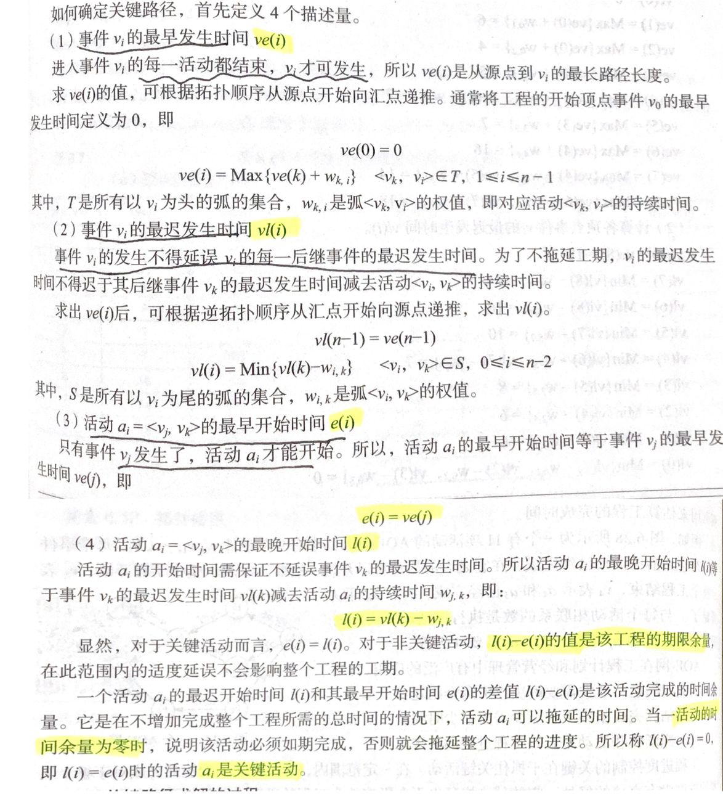

#### 计算

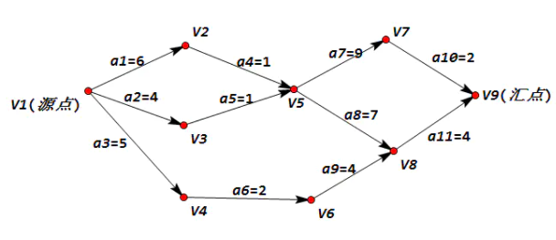

**首先我们求出各个状态的最早时间**

这个过程是要从源点开始向汇点顺推：

1. V1是源点，其最早开始时间是0。
2. V2、V3、V4最早时间分别是是6、4、5。
3. 对于V5而言，V2到V5所花费时间是6+1=7，而V3到V5所花费时间是4+1=5。我们要按**最大计**，也就是V5最早时间是max{7,5}=7，按**最大计**是因为只有活动a4和a5同时完成了，才能到达V5状态。V3到V5需要5分钟，但是此时a4活动尚未完成（7分钟），所以都不能算到达V5，故而要按最大计。
4. V6只有从V4到达，所以V6的最早完成时间是（5+2=）7。
5. 同理，V7最早完成时间是16。
6. 对于V8而言，和V5处理方法一致。V8=max{V5+7,V6+4}={7+7,7+4}=14。
7. V9可算出是18。

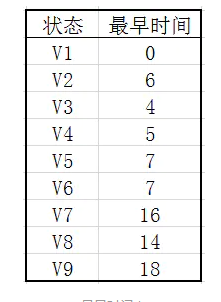

**然后我们求各个状态最晚时间**

##### 这个过程是要从汇点开始向源点逆推：

V9完成时间为18，最V7**最迟开始**时间是（18-2=）16

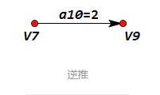

因为活动a10所需时间2。如果V7开始时间比16晚，则V9完成时间就会比18晚，这显然不对。

同理，V8**最迟开始**时间为14。

对于V5而言，可以从V7、V8两个点开始向前推算，此时要按**最小计**，即V5(最晚)=min{V7-9,V8-7}=min{16-9,14-7}=7。
 **请注意！！**，min{V7-9,V8-7}中，V7、V8取的都是前面算出的最迟开始时间（而不是最早开始时间）。

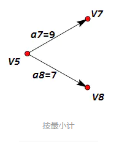

1. 按**最小计**，是因为如果按最大计去计算V5的最晚开始时间，那么加上a7和a8的活动时间后，V7、V8至少有一个会比之前逆推算得出的最晚时间还要晚，这就发生了错误。
2. 同理，可计算出剩下的点

这样，我们可以得到各个状态的最晚时间的表

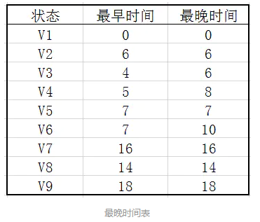

事实上，源点和汇点的最晚时间和最早时间必定是相同的。

**3.求出关键路径**

------

**求出关键活动，则关键活动所在路径即为关键路径**

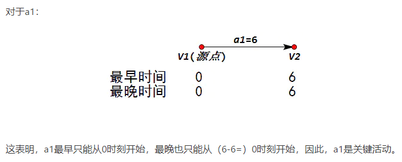

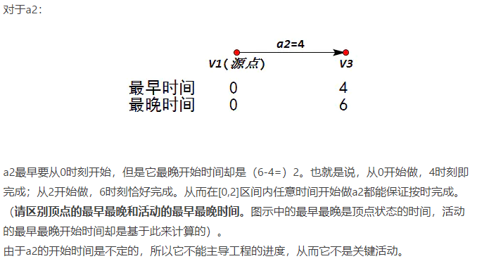

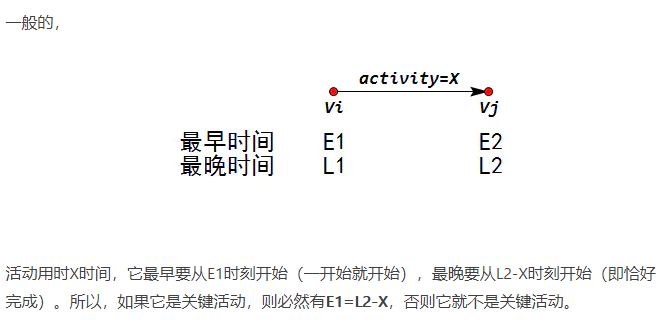

> **值得注意的是**，顶点的最早开始时间等于最晚开始时间 是 该顶点处于关键路径 的 不充分不必要条件。

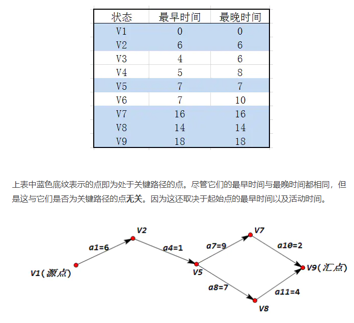

> 参考：

[数据结构——关于图的存储中十字链表和邻接多重表的理解和思考 - 王陸 - 博客园 (cnblogs.com)](https://www.cnblogs.com/wkfvawl/p/9985083.html)

[图的遍历之 深度优先搜索和广度优先搜索 - 如果天空不死 - 博客园 (cnblogs.com)](https://www.cnblogs.com/skywang12345/p/3711483.html)

[最短路径问题---Dijkstra算法详解_William-CSDN博客_dijkstra](https://blog.csdn.net/qq_35644234/article/details/60870719)

[最短路径问题---Floyd算法详解_William-CSDN博客_floyd算法](https://blog.csdn.net/qq_35644234/article/details/60875818)

[关键路径算法演示（AOE网） - 简书 (jianshu.com)](https://www.jianshu.com/p/1857ed4d8128)