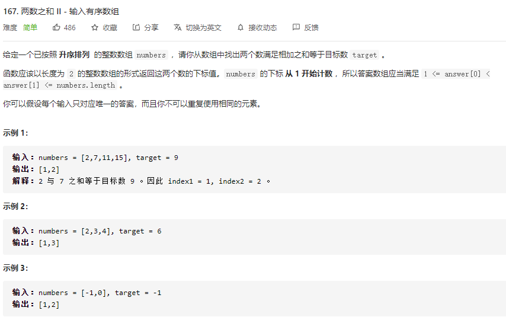
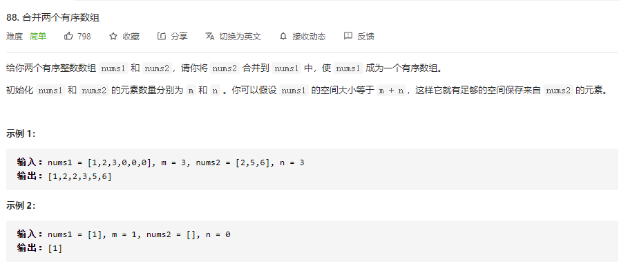
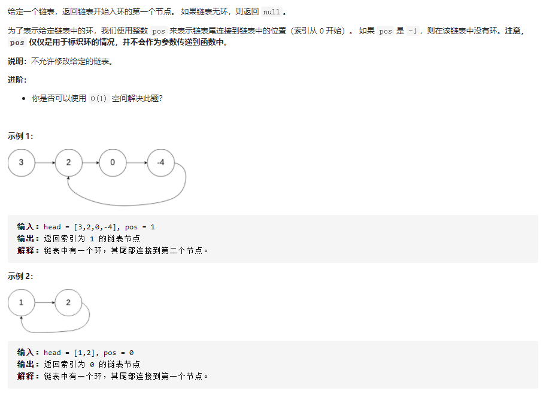
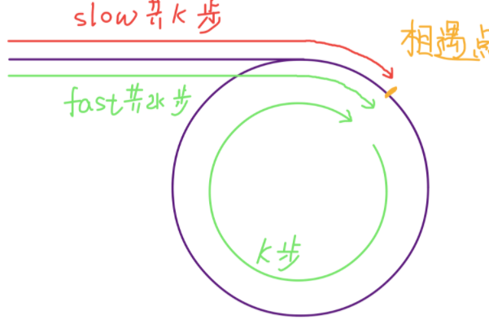
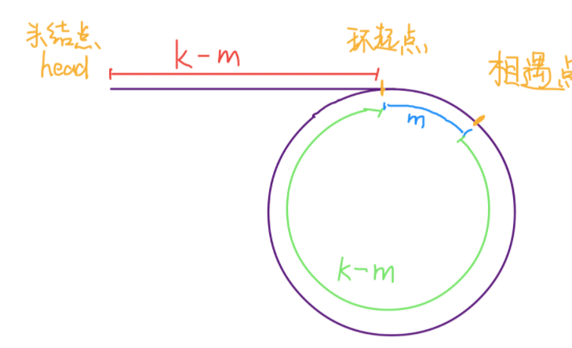
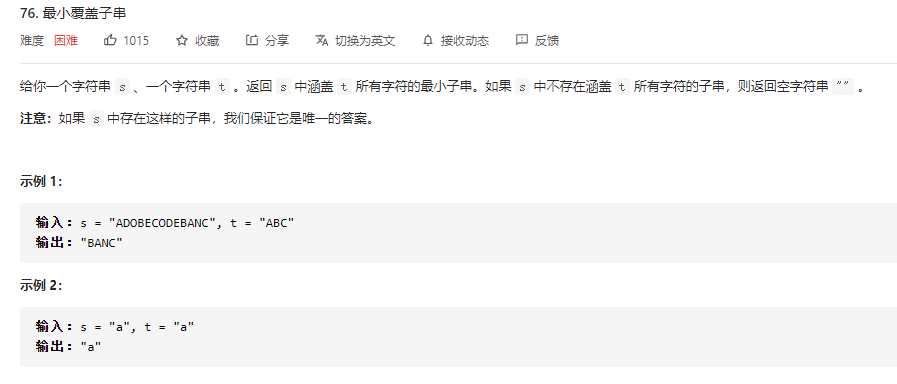

# 算法解释

双指针主要用于遍历数组，两个指针指向不同的元素，从而协同完成任务。也可以延伸到多个数组的多个指针。 若两个指针指向同一数组，遍历方向相同且不会相交，则也称为滑动窗口（两个指针包围的 区域即为当前的窗口），经常用于区间搜索。 若两个指针指向同一数组，但是遍历方向相反，则可以用来进行搜索，待搜索的数组往往是排好序的。

# C++的指针

## 指针与常量

```c++
int x;
int * p1 = &x; // 指针可以被修改，值也可以被修改
const int * p2 = &x; // 指针可以被修改，值不可以被修改（const int）
int * const p3 = &x; // 指针不可以被修改（* const），值可以被修改
const int * const p4 = &x; // 指针不可以被修改，值也不可以被修改
```

## 指针函数与函数指针

```c++
// addition是指针函数，一个返回类型是指针的函数
int* addition(int a, int b) {
int* sum = new int(a + b);
return sum;
}
int subtraction(int a, int b) {
return a - b;
}
int operation(int x, int y, int (*func)(int, int)) {
return (*func)(x,y);
}
// minus是函数指针，指向函数的指针
int (*minus)(int, int) = subtraction;
int* m = addition(1, 2);
int n = operation(3, *m, minus);
```

# 两数和问题

## 两数和

[167. 两数之和 II - 输入有序数组 - 力扣（LeetCode） (leetcode-cn.com)](https://leetcode-cn.com/problems/two-sum-ii-input-array-is-sorted/)



### 思路

这题居然被我想出来了哈哈，不过这是简单题，所以自己的实力还一般般吧~

其实思路很简单，就是使用两个指针，一个指向最低位一个指向最高位，然后两个指针进行相加，如果值大了，说明我们的high要减小，如果小了low就要加大，最后当low和high相等的时候我们就退出循环，这里我们还利用了有序数组这个东西

### 题解

```go
// 双指针算法
func twoSum(numbers []int, target int) []int {
	// 这里我们使用两个指针，一个执行0，一个指向数组的最高端
	low,high:=0,len(numbers)-1
	// 当low指针大于high指针的时候我们就可以退出循环了
	// （我们没有必要两边都走一遍，因为当low等于high的时候，我们就已经把整个数组遍历完了）
	for low < high {
		// 当两个指针的值大于我们的目标时，说明值大了，我们就需要把high指针减小
		sum := numbers[low] + numbers[high]
		if sum == target{
			break
		} else if sum  > target {
			high --
		} else if sum < target { // 当两个指针的值小于我们的目标时，说明值小了，我们需要加大low指针
			low ++
		}
	}
	// 上面我们已经计算完了，直接返回数据
	return []int{low+1,high+1}
}
```

# 归并有序数组

## 合并两个有序数组



### 思路

这个题目其实一点就通，我一开始是想从小到大进行插入，但是实际上我们还需要移动指针来避免值被覆盖的问题。所以我一开始还自己单独新建了一个数组，既然我们正的排不行，就不能从大到小排？刚好第一个数组的后面部分都是空的，还不用担心覆盖问题，而且就算数组2全部大于数组1，这也是刚好覆盖。所以解题就很简单了

### 题解

```
// 个人解法
func merge(nums1 []int, m int, nums2 []int, n int)  {
	// 这里我们同样使用双指针
	if n == 0 {
		return
	}
	// 这里我为了方便在创建一个数组
	var re []int
	// 使用两个指针来表示两个数组
	i,j:=0,0
	// 下面我们开始遍历
	for i < m && j < n {
		if  nums1[i] > nums2[j] {
			re = append(re,nums2[j])
			j++
		} else {
			re = append(re,nums1[i])
			i++
		}
	}
	// 合并剩下的部分
	for ;i<m;i++{
		re = append(re,nums1[i])
	}
	for ;j<n;j++{
		re = append(re,nums2[j])
	}
	copy(nums1,re)
}

// 别人的解法
func merge(nums1 []int, m int, nums2 []int, n int)  {
	// 这里其实很简单，我们的数组已经排好序了，正的不好排，我们可以从大到小排
	// 合理利用逆向思维,可以让我们的题目变简单
	pos:=m+n-1;m--;n--
	for m>=0 && n>=0{
		// 我们把最大的那个值插入num1的末尾
		if nums2[n] > nums1[m] {
			nums1[pos] = nums2[n]
			n--
		} else {
			nums1[pos] = nums1[m]
			m--
		}
		pos --
	}
	// 遍历剩余部分
	for n >= 0{
		nums1[pos] = nums2[n]
		n--;pos--
	}
}
```

# 快慢指针

## 环形链表

[142. 环形链表 II - 力扣（LeetCode） (leetcode-cn.com)](https://leetcode-cn.com/problems/linked-list-cycle-ii/)

[fucking-algorithm/双指针技巧.md at master · labuladong/fucking-algorithm (github.com)](https://github.com/labuladong/fucking-algorithm/blob/master/算法思维系列/双指针技巧.md)



### 思路

注意，链表找环问题一般使用快慢指针来进行解决，具体原理就是快指针每次走二步，然后慢指针每次只走一步，当快慢指针相遇的时候，我们就让快指针跳到开头，然后慢指针和快指针每次都只走一步，最后相遇的地方就是我们链表环的位置。原理可以看下图分析

第一次相遇时，假设慢指针 slow 走了 k 步，那么快指针 fast 一定走了 2k 步，也就是说比 slow 多走了 k 步（也就是环的长度）。



设相遇点距环的起点的距离为 m，那么环的起点距头结点 head 的距离为 k - m，也就是说如果从 head 前进 k - m 步就能到达环起点。

巧的是，如果从相遇点继续前进 k - m 步，也恰好到达环起点。



### 代码

```go
func detectCycle(head *ListNode) *ListNode {
	slow,fast:=head,head
	for  {
		// 首先必须要判断fast和fast.next指针不能为空
		if fast == nil || fast.Next == nil {
			return nil
		}
		// fast前进两次，slow前进一次
		fast = fast.Next.Next
		slow = slow.Next
		// 当我们的fast指针和slow指针相遇时，我们跳出循环
		if slow == fast {
			break
		}
	}
	// 此时，我们的fast指针回到原点
	fast = head
	// 然后我们继续遍历直到fast和slow再次相遇,这个点就是我们要找的点
	for slow != fast {
		slow = slow.Next
		fast = fast.Next
	}
	return slow
}
```

# 滑动窗口

## 最小覆盖子串

[76. 最小覆盖子串 - 力扣（LeetCode） (leetcode-cn.com)](https://leetcode-cn.com/problems/minimum-window-substring/)

[0076. Minimum Window Substring | LeetCode Cookbook (halfrost.com)](https://books.halfrost.com/leetcode/ChapterFour/0001~0099/0076.Minimum-Window-Substring/)



### 思路

这种滑动窗口的题目一般都是用于字符串匹配中，我们可以通过两个指针首先第一个指针先移动，当把子串包含在内时，我们就可以滑动第二个指针，来缩小范围，同时确保包含。

这题的时间复杂度为O(n)

### 代码

```go
func minWindow(s string, t string) string {
	// 当s和t都为空时我们返回空字符串
	if s == "" || t == "" {
		return ""
	}
	// 使用两个数组来存储t和s字符串出现的次数
	var tCount,sCount [256]int
	// result表示最后的结果
	// left表示滑动窗口的左指针，right表示滑动窗口的右指针
	// finalLeft表示最后的左指针，finalRight表示最后的右指针，我们通过这两个指针得到最后的结果
	// minW表示滑动窗口最小的宽度
	// count表示
	result,left,right,finalLeft,finalRight,minW,count:="",0,-1,-1,-1,len(s)+1,0
	// 先统计t字符串里面每个字符出现的次数
	for _,v:=range t{
		tCount[v] ++
	}
	// 遍历整个s
	for left < len(s) {
		// 首先我们需要让右指针进行遍历，直到找出完全包含T的字符串时停止
		if right+1 < len(s) && count < len(t) {
			right++
			// 统计一下字符
			sCount[s[right]]++
			// 这里当sCount比tCount小时，我们就让count++
			// 只要当前我们遍历所在位置的字符比t小时，我们就让count+1，否则不加，避免重复计数
			if sCount[s[right]] <= tCount[s[right]] {
				count ++
			}
		} else {
		// 经过上面的操作，这我们的右指针就已经包含所有的t了
		// 这个时候我们就需要更新左指针，来获取最小字符串

			// 当我们的左右指针小于最小窗口值，同时又满足包含t字符时
			if right-left+1<minW && count == len(t) {
				// 这里我们就可以更新一下最小窗口了
				minW = right - left +1
				// 同时我们更新一下最后的左指针和右指针
				finalLeft = left
				finalRight = right
			}
			// 当left指针所指向的字符串包含t中的字符串时，我们就必须要把count-1操作
			// 因为我们的窗口要包含t所有的子串
			if sCount[s[left]] == tCount[s[left]]{
				count--
			}
			// sCount-1操作，说明我们的左指针移动了一位
			sCount[s[left]]--
			left ++
		}
	}
	// 当我们最后的左指针不为-1时，就说明我们找到了相等的子串
	if finalLeft!=-1 {
		// 这里我们把我们的结果贴上去
		result = s[finalLeft:finalRight+1]
	}
	return result
}
```

# 练习

基础难度 633. Sum of Square Numbers (Easy) Two Sum 题目的变形题之一。 680. Valid Palindrome II (Easy) Two Sum 题目的变形题之二。 524. Longest Word in Dictionary through Deleting (Medium) 归并两个有序数组的变形题。

 进阶难度 340. Longest Substring with At Most K Distinct Characters (Hard) 需要利用其它数据结构方便统计当前的字符状态。

