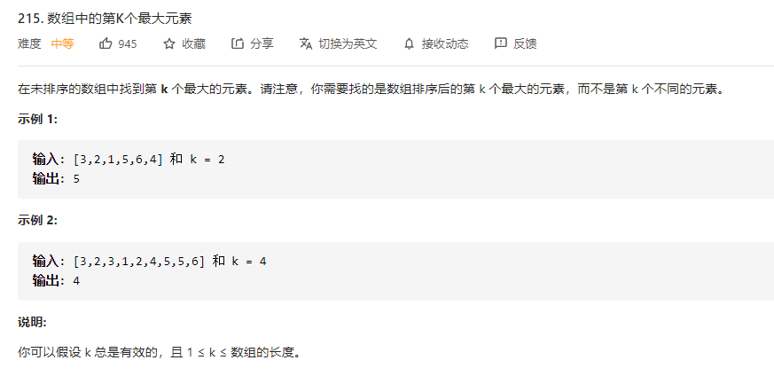
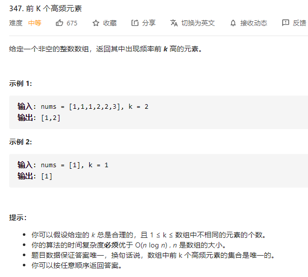

# 常用的排序算法

以下是一些最基本的排序算法。虽然在 C++ 里可以通过 std::sort() 快速排序，而且刷题 时很少需要自己手写排序算法，但是熟习各种排序算法可以加深自己对算法的基本理解，以及解 出由这些排序算法引申出来的题目。

关于常用的排序算法可以移步到 [排序算法.md](..\算法总结\排序算法.md) 

# 快速选择

## 数组中的第K个最大元素

[215. 数组中的第K个最大元素 - 力扣（LeetCode） (leetcode-cn.com)](https://leetcode-cn.com/problems/kth-largest-element-in-an-array/)



这个题目其实很简单，就是自己先对数组进行排序，然后找到k的最大的元素就可以了（第一次手写快排哈哈~，，居然让我蒙对了好多）

```go
func findKthLargest(nums []int, k int) int {
	// 先对数组进行排序
	quickSort(nums,0,len(nums)-1)
	return nums[len(nums)-k]
}

// 快速排序找到中点
func finMid(arr []int,low int,high int) int  {
	// 我们就使用第一个作为临时点
	tmp:=arr[low]
	for low < high {
		// 错误一：这里必须要low<high
		for low < high && arr[high] >= tmp {
			high --
		}
		arr[low] = arr[high]
		for low < high && arr[low] <= tmp {
			low ++
		}
		arr[high] = arr[low]
	}
	arr[low] = tmp
	return low
}

// 快速排序
func quickSort(arr []int,low int,high int)  {
	//错误2 这里是要确保low<high
	if low < high {
		mid:=finMid(arr,low,high)
		quickSort(arr,low,mid-1)
		quickSort(arr,mid+1,high)
	}
}
```

# 桶排序

## 前k个高频元素



