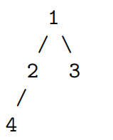
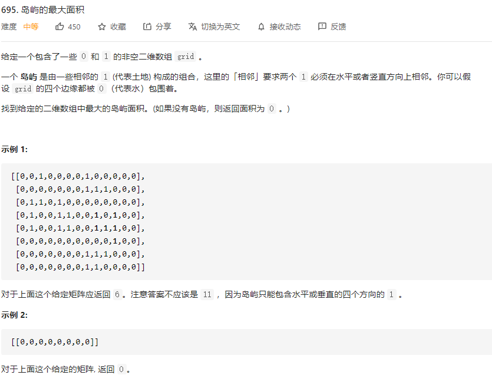

# 解释

深度优先搜索和广度优先搜索是两种最常见的优先搜索方法，它们被广泛地运用在图和树等 结构中进行搜索。

# 深度优先搜索

深度优先搜索（depth-first seach，DFS）在搜索到一个新的节点时，立即对该新节点进行遍 历；因此遍历需要用先入后出的栈来实现，也可以通过与栈等价的递归来实现。对于树结构而言， 由于总是对新节点调用遍历，因此看起来是向着“深”的方向前进。 考虑如下一颗简单的树。我们从 1 号节点开始遍历，假如遍历顺序是从左子节点到右子节点， 那么按照优先向着“深”的方向前进的策略，假如我们使用递归实现，我们的遍历过程为 1（起 始节点）->2（遍历更深一层的左子节点）->4（遍历更深一层的左子节点）->2（无子节点，返回 父结点）->1（子节点均已完成遍历，返回父结点）->3（遍历更深一层的右子节点）->1（无子节 点，返回父结点）-> 结束程序（子节点均已完成遍历）。如果我们使用栈实现，我们的栈顶元素 的变化过程为 1->2->4->3。 



 深度优先搜索也可以用来检测环路：记录每个遍历过的节点的父节点，若一个节点被再次遍 历且父节点不同，则说明有环。我们也可以用之后会讲到的拓扑排序判断是否有环路，若最后存 在入度不为零的点，则说明有环。 有时我们可能会需要对已经搜索过的节点进行标记，以防止在遍历时重复搜索某个节点，这 种做法叫做状态记录或记忆化（memoization）。

## 岛屿最大面积

[695. 岛屿的最大面积 - 力扣（LeetCode） (leetcode-cn.com)](https://leetcode-cn.com/problems/max-area-of-island/)



思路一：使用栈，因为这个题目其实就是要我们遍历整个二维数组，比如我们遇到一个点，那么我们就可以把这个点放入栈中，然后把这点置为空。然后我们对当前点进行上下左右判断，如果为1，就把值放入栈中，并把这个点置为0。我们一直遍历直到栈为空为止，这里我们用到了一个技巧，对于四个方向的遍历，我们可以创造一个数组[-1,0,1,0,-1]每相邻两个就是上下左右这四个方向

```go
var direction = []int{-1, 0, 1, 0, -1}
// 使用栈的写法
func maxAreaOfIsland(grid [][]int) int {
	m:=len(grid)
	if m==0 {
		return 0
	}
	n:= len(grid[0])
	area, localArea :=0,0
	var x,y int
	// 遍历数组
	for i := 0; i < m; i++ {
		for j := 0; j < n; j++ {
			// 如果当前节点为1，我们就可以进行遍历了
			if grid[i][j] ==1 {
				localArea = 1
				grid[i][j] = 0
				// 自己定义一个栈
				island:=Stack{}
				// 把当前值放入栈中
				island.Push([]int{i,j})
				// 遍历直到栈为空位置
				for !island.Empty() {
					// 获取当前栈顶的值
					r,c:=island.Pop()
					// 我们分别依次判断当前值的上下左右是否为空
					for k := 0; k < 4; k++ {
						// 这里我们使用了一个小技巧，每相邻两位即为上下左右四个方向之一
						x =r+ direction[k];y = c+direction[k+1]
						// 这里我们还需要判断一下x，y的范围是否在矩形内，以免越界
						if x >= 0 && x < m && y >= 0 && y < n && grid[x][y] == 1 {
							// 这里我们就把grid置为0，然后把这个点放入栈中
							grid[x][y] = 0
							localArea++
							island.Push([]int{x,y})
						}
					}
				}
				if localArea > area {
					area= localArea
				}
			}
		}
	}
	return area
}

// 自己定义一个简单的栈
type Stack struct {
	i 	 int
	data [][]int
}
func (s *Stack) Push(k []int)  {
	s.data = append(s.data, k)
	s.i = len(s.data)-1
}
func (s *Stack) Pop() (x int,y int) {
	x = s.data[s.i][0]
	y = s.data[s.i][1]
	s.i--
	return
}
func (s *Stack) Empty() bool {
	return s.i < 0
}
```

使用递归的方法也很简单，我简单看了一下别人的代码，然后把辅助函数写出来了哈哈

原理很简单，我们同样遍历整个矩阵，如果当前节点的值不为0，那么我们就可以对当前节点进行dfs操作，获取当前这个节点的区域值。然后dfs的代码也很简单，直接使用我们上个的栈的方法，我们同样对当前点的上下左右进行递归操作，最后就可以得出结果，关键部分在于理解dfs函数

```go
var direction = []int{-1, 0, 1, 0, -1}
// 使用递归的写法
func maxAreaOfIsland(grid [][]int) int {
   // 当grid大小为0时，我们就退出循环
   if len(grid)==0 || len(grid[0])==0 {
      return 0
   }
   // 当前最大区域为0
   maxArea:=0
   // 我们开始遍历整个grid数组
   for i := 0; i < len(grid); i++ {
      for j := 0; j < len(grid[i]); j++ {
         // 当当前这个点为1的时候，我们就获取一下当前的区域信息
         if grid[i][j] == 1 {
            // 使用dfs来获取当前的地域信息
            area:=dfs(grid,i,j)
            // 更新最大的区域
            if area > maxArea {
               maxArea = area
            }
         }
      }
   }
   return maxArea
}
// 使用一个辅函数，这个就是我们的关键部分了
func dfs(grid [][]int,r int,c int) int {
   // 因为是递归函数，所以我们需要设置一个递归的条件
   if grid[r][c] == 0 {
      return 0
   }
   // 如果r，c所在的值不为0，那么当前区域值就为1，同时把当前区域值置为0
   area:= 1
   var x,y int
   grid[r][c] = 0
   // 对当前位置进行遍历，判断上下左右四个方向
   for k := 0; k < 4; k++ {
      // 这里我们通过direction数组来实现获取当前位置的上下左右
      x=direction[k]+r
      y=direction[k+1]+c
      // 确保这个值在矩阵的范围内
      if x>=0 && y>=0 && x<len(grid) && y<len(grid[0]) {
         // 注意这我们不需要判断当前位置是否为0，因为dfs会自己计算，如果为0就会返回0
         area+=dfs(grid,x,y)
      }
   }
   return area
}
```

