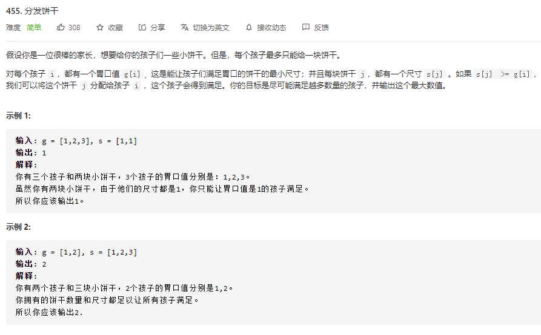
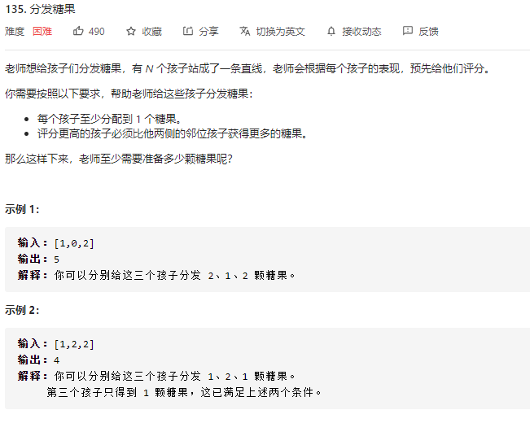

# 算法解释

顾名思义，贪心算法或贪心思想采用贪心的策略，保证每次操作都是局部最优的，从而使最 后得到的结果是全局最优的。 举一个最简单的例子：小明和小王喜欢吃苹果，小明可以吃五个，小王可以吃三个。已知苹 果园里有吃不完的苹果，求小明和小王一共最多吃多少个苹果。在这个例子中，我们可以选用的 贪心策略为，每个人吃自己能吃的最多数量的苹果，这在每个人身上都是局部最优的。又因为全 局结果是局部结果的简单求和，且局部结果互不相干，因此局部最优的策略也同样是全局最优的 策略。

# 分配问题

## 分发饼干

[455. 分发饼干 - 力扣（LeetCode） (leetcode-cn.com)](https://leetcode-cn.com/problems/assign-cookies/)



### 思路

因为饥饿度最小的孩子最容易吃饱，所以我们先考虑这个孩子。为了尽量使得剩下的饼干可 以满足饥饿度更大的孩子，所以我们应该把大于等于这个孩子饥饿度的、且大小最小的饼干给这 个孩子。满足了这个孩子之后，我们采取同样的策略，考虑剩下孩子里饥饿度最小的孩子，直到 没有满足条件的饼干存在。

我们可以通过排序来简单的进行匹配

### 代码

```go
// 解题思路：就是我们要优先用最小的饼干来满足最小的要求
// 所以我们可以通过排序，让最小的孩子和最小的饼干进行测试，然后我们优先满足最小需求的孩子
func findContentChildren(g []int, s []int) int {
	// 首先我们给g和s进行排序
	sort.Ints(g)
	sort.Ints(s)
	// 分别用i，j来表示孩子和饼干
	i,j:=0,0
	// 当任意一个不满足时，我们就可以退出了
	for i<len(g) && j <len(s) {
		// 判断当前饼干是否满足当前孩子，如果满足孩子+1
		if g[i] <= s[j] {
			i ++
		}
		// 无论是否满足，饼干都要后移
		j++
	}
	return i
}
```

## 分发糖果



### 思路


### 题解