[手把手带你刷二叉树（第一期） - labuladong的算法小抄 (gitbook.io)](https://labuladong.gitbook.io/algo/shu-ju-jie-gou-xi-lie/shou-ba-shou-shua-er-cha-shu-xun-lian-di-gui-si-wei/er-cha-shu-xi-lie-1)

# 翻转二叉树

```
输入
	 4
   /   \
  2     7
 / \   / \
1   3 6   9

输出：

     4
   /   \
  7     2
 / \   / \
9   6 3   1

```

代码如下：

```java
// 将整棵树的节点翻转
static TreeNode invertTree(TreeNode root) {
    // base case
    if (root == null) {
        return null;
    }

    /**** 前序遍历位置 ****/
    // root 节点需要交换它的左右子节点
    TreeNode tmp = root.left;
    root.left = root.right;
    root.right = tmp;
    // 让左右子节点继续翻转它们的子节点
    invertTree(root.left);
    invertTree(root.right);
    return root;
}

public static void main(String[] args) {
    // 这里我们初始化树
    TreeNode root = new TreeNode(1);
    root.left = new TreeNode(2);
    root.right = new TreeNode(7);
    root.left.left = new TreeNode(1);
    root.left.right = new TreeNode(3);
    root.right.left = new TreeNode(6);
    root.right.right = new TreeNode(9);

    TreeNode result = invertTree(root);
    System.out.println(result);
}
```

这个题目是递归的巧妙运用

# 填充二叉树节点的右侧指针

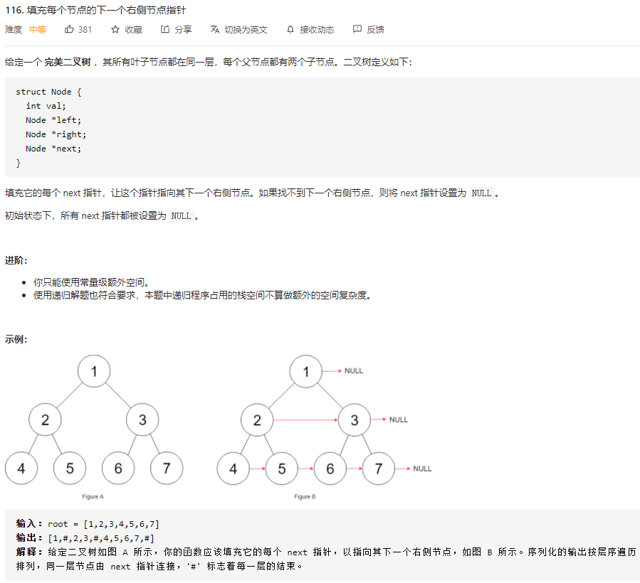

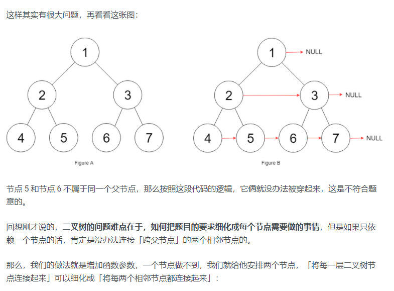

我们的函数定义如下

```
// 主函数
Node connect(Node root) {
    if (root == null) return null;
    connectTwoNode(root.left, root.right);
    return root;
}

// 辅助函数
void connectTwoNode(Node node1, Node node2) {
    if (node1 == null || node2 == null) {
        return;
    }
    /**** 前序遍历位置 ****/
    // 将传入的两个节点连接
    node1.next = node2;

    // 连接相同父节点的两个子节点
    connectTwoNode(node1.left, node1.right);
    connectTwoNode(node2.left, node2.right);
    // 连接跨越父节点的两个子节点
    connectTwoNode(node1.right, node2.left);
}
```


# 二叉树展开为链表

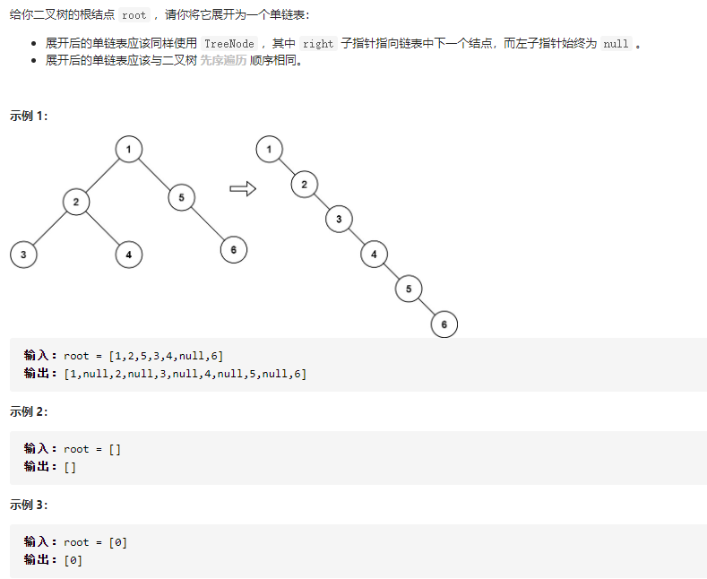

关键代码如下

```java
// 定义：将以 root 为根的树拉平为链表
void flatten(TreeNode root) {
    // base case
    if (root == null) return;

    flatten(root.left);
    flatten(root.right);

    /**** 后序遍历位置 ****/
    // 1、左右子树已经被拉平成一条链表
    TreeNode left = root.left;
    TreeNode right = root.right;

    // 2、将左子树作为右子树
    root.left = null;
    root.right = left;

    // 3、将原先的右子树接到当前右子树的末端
    TreeNode p = root;
    while (p.right != null) {
        p = p.right;
    }
    p.right = right;
}
```

你看，这就是递归的魅力，你说 `flatten` 函数是怎么把左右子树拉平的？说不清楚，但是只要知道 `flatten` 的定义如此，相信这个定义，让 `root` 做它该做的事情，然后 `flatten` 函数就会按照定义工作。另外注意递归框架是后序遍历，因为我们要先拉平左右子树才能进行后续操作。

[手把手带你刷二叉树（第二期） - labuladong的算法小抄 (gitbook.io)](https://labuladong.gitbook.io/algo/shu-ju-jie-gou-xi-lie/shou-ba-shou-shua-er-cha-shu-xun-lian-di-gui-si-wei/er-cha-shu-xi-lie-2)

# 最大二叉树

```java
    // 构建最大二叉树
    static TreeNode constructMaximumBinaryTree(int[] nums) {
        // 这里我们需要通过一个代理函数来进行构建，因为我们需要传入构建的 low节点和high节点
        return build(nums, 0, nums.length - 1);
    }

    /* 将 nums[lo..hi] 构造成符合条件的树，返回根节点 */
    static TreeNode build(int[] nums, int lo, int hi) {
        // base case
        // 当low 大于high的时候，跳出循环
        if (lo > hi) {
            return null;
        }

        // 找到数组中的最大值和对应的索引（为了避免maxval查找出错，我们使用Integer.MIN_VALUE来表示最小值）
        int index = -1, maxVal = Integer.MIN_VALUE;
        // 在我们指定的范围内找出最大值       
        for (int i = lo; i <= hi; i++) {
            if (maxVal < nums[i]) {
                index = i;
                maxVal = nums[i];
            }
        }
//        找到最大值后我们创建一个树节点
        TreeNode root = new TreeNode(maxVal);
        // 递归调用构造左右子树（这里我们就可以自动构建左子树和右子树了）
        root.left = build(nums, lo, index - 1);
        root.right = build(nums, index + 1, hi);

        return root;
    }


    public static void main(String[] args) {
        // 这里我们初始化树
//        TreeNode root = new TreeNode(1);
//        root.left = new TreeNode(2);
//        root.right = new TreeNode(5);
//        root.left.left = new TreeNode(3);
//        root.left.right = new TreeNode(4);
//        root.right.right = new TreeNode(6);
        int[] data = new int[]{3,2,1,6,0,5};
        TreeNode result = constructMaximumBinaryTree(new int[]{3,2,1,6,0,5});
        System.out.println(result);
    }
```

# 通过前序和中序遍历结果构造二叉树

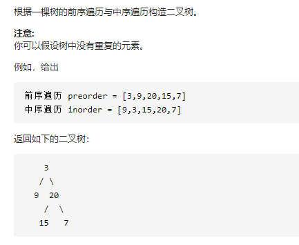

我们的实际代码如下：

```java
    static TreeNode build(int[] preorder, int preStart, int preEnd,
                   int[] inorder, int inStart, int inEnd) {
        // 当先序节点的值大于后续节点时，我们退出
        if (preStart > preEnd) {
            return null;
        }

        // root 节点对应的值就是前序遍历数组的第一个元素
        int rootVal = preorder[preStart];
        // rootVal 在中序遍历数组中的索引（因为树中没有重复的元素，所以我们可以快速定位在中序遍历前的位置）
        int index = 0;
        for (int i = inStart; i <= inEnd; i++) {
            if (inorder[i] == rootVal) {
                index = i;
                break;
            }
        }
        
        // 因为中序遍历是前面是左节点，中间是根节点，后面是右节点
        int leftSize = index - inStart;

        // 先构造出当前根节点
        TreeNode root = new TreeNode(rootVal);
        // 递归构造左右子树
        root.left = build(preorder, preStart + 1, preStart + leftSize,
                inorder, inStart, index - 1);

        root.right = build(preorder, preStart + leftSize + 1, preEnd,
                inorder, index + 1, inEnd);
        return root;
    }
    
    
    // 构建二叉树
    static public TreeNode buildTree(int[] preorder, int[] inorder) {
        // 这里我们对二叉树进行构建       
        return build(preorder, 0, preorder.length - 1,
                inorder, 0, inorder.length - 1);
    }


    public static void main(String[] args) {
        // 这里我们初始化树
//        TreeNode root = new TreeNode(1);
//        root.left = new TreeNode(2);
//        root.right = new TreeNode(5);
//        root.left.left = new TreeNode(3);
//        root.left.right = new TreeNode(4);
//        root.right.right = new TreeNode(6);
        TreeNode result = buildTree(new int[]{3,9,20,15,7},new int[]{9,3,15,20,7});
        System.out.println(result);
    }
```

可以看到，我们的算法其实啥都没有，却完成了二叉树的构建，这就是递归的神奇之处

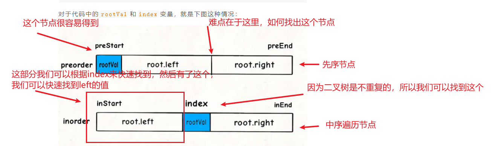

这个是根据先序遍历和中序遍历的定义来做的

自己写的go代码如下：

```go
// @Description https://leetcode-cn.com/problems/construct-binary-tree-from-preorder-and-inorder-traversal/
// @Author 小游
// @Date 2021/01/29
package main

import (
	"fmt"
)

type TreeNode struct {
	Val int
	Left *TreeNode
	Right *TreeNode
}

// 这里我们开始构造二叉树
func Build(preorder []int,preStart int,preEnd int,inorder []int,inStart int,inEnd int) *TreeNode {
	// 递归结束标志
	if preStart>preEnd{
		return nil
	}
	// 先确定最大值
	rootVal:=preorder[preStart]
	var index int
	// 找出最大值在inorder中的位置
	for k,v:=range inorder{
		if v == rootVal{
			index = k
		}
	}
	root:=new(TreeNode)
	root.Val = rootVal
	leftSize:= index-inStart
	root.Left = Build(preorder,preStart+1,preStart+leftSize,inorder,inStart,index-1)
	root.Right = Build(preorder,preStart+leftSize+1,preEnd,inorder,index+1,inEnd)
	return root
}

// 构造二叉树
func buildTree(preorder []int, inorder []int) *TreeNode {
	return Build(preorder,0,len(preorder)-1,inorder,0,len(inorder)-1)
}

func main()  {
	result:=buildTree([]int{3,9,20,15,7},[]int{9,3,15,20,7})
	fmt.Println(result)
}
```


[手把手带你刷二叉树（第三期） - labuladong的算法小抄 (gitbook.io)](https://labuladong.gitbook.io/algo/shu-ju-jie-gou-xi-lie/shou-ba-shou-shua-er-cha-shu-xun-lian-di-gui-si-wei/er-cha-shu-xi-lie-3)

# 寻找重复子树

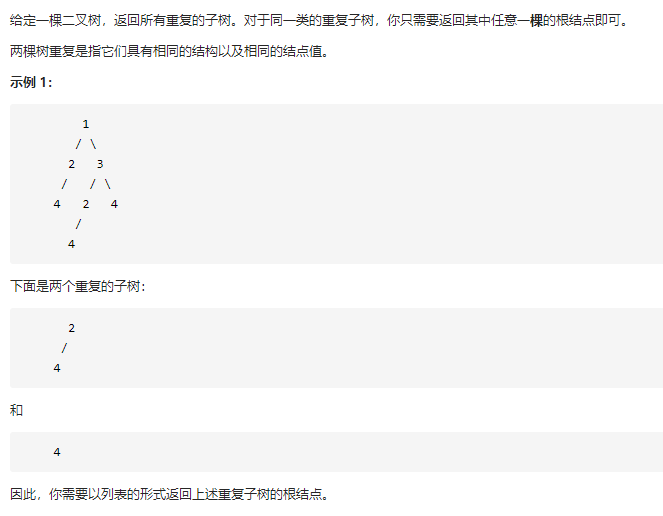

这个题目的难点在于如何寻找重复的值，答案里面别人用的是一个序列化的方式，然后通过比较字符串来进行判断。实际代码

```java
    // 记录所有子树以及出现的次数
    HashMap<String, Integer> memo = new HashMap<>();
    // 记录重复的子树根节点
    LinkedList<TreeNode> res = new LinkedList<>();

    /* 主函数 */
    List<TreeNode> findDuplicateSubtrees(TreeNode root) {
        traverse(root);
        return res;
    }

    /* 辅助函数 */
    String traverse(TreeNode root) {
//        当到达根节点的时候我们返回一个 #
        if (root == null) {
            return "#";
        }

        // 这一步是在对二叉树进行遍历
        String left = traverse(root.left);
        String right = traverse(root.right);
        // 这里是对二叉树进行序列化，我们
        String subTree = left + "," + right+ "," + root.val;
        // getOrDefault是获取map的值，如果map不存在就返回这个默认的值（我们这个map记录的是重复的数量）
        int freq = memo.getOrDefault(subTree, 0);
        // 多次重复也只会被加入结果集一次
        // 如果重复度为1，就说明这棵树有一个发生了重复
        if (freq == 1) {
            res.add(root);
        }
        // 给子树对应的出现次数加一
        memo.put(subTree, freq + 1);
        return subTree;
    }
```


# 二叉搜索树

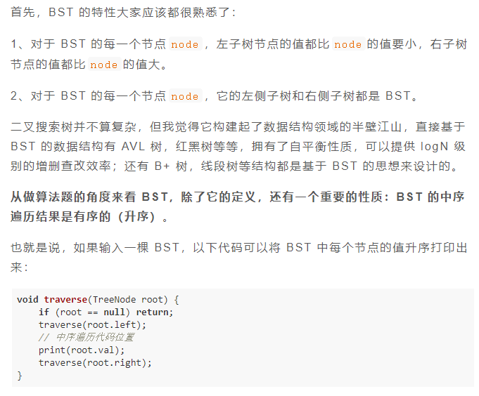

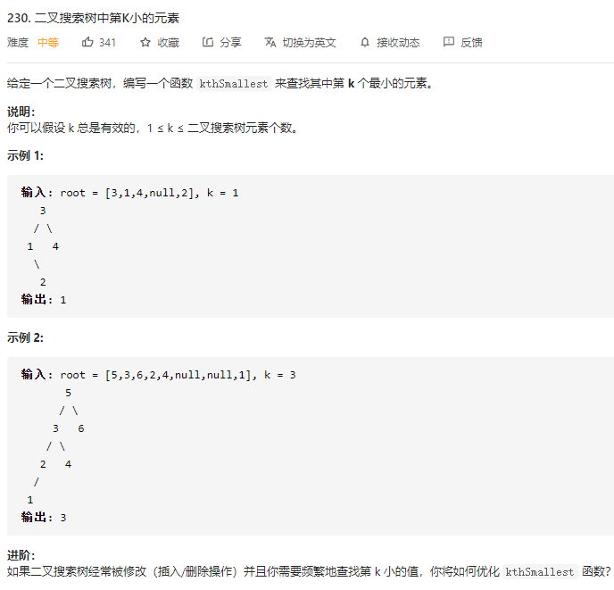

这个题目利用了BST二叉树的性质，中序遍历获取出排名

```java
int kthSmallest(TreeNode root, int k) {
    // 利用 BST 的中序遍历特性
    traverse(root, k);
    return res;
}

// 记录结果
int res = 0;
// 记录当前元素的排名
int rank = 0;
void traverse(TreeNode root, int k) {
    if (root == null) {
        return;
    }
    traverse(root.left, k);
    /* 中序遍历代码位置 */
    rank++;
    if (k == rank) {
        // 找到第 k 小的元素
        res = root.val;
        return;
    }
    /*****************/
    traverse(root.right, k);
}
```


# BST转化为累加树

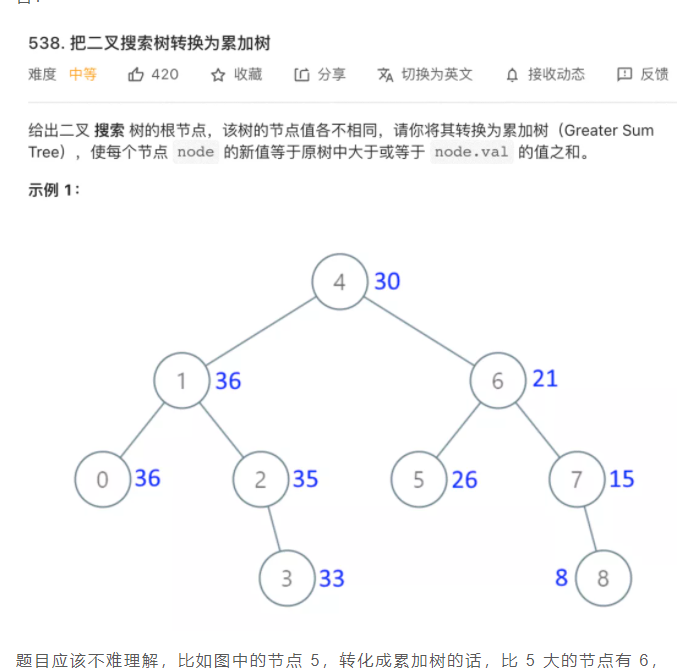


按照二叉树的通用思路，需要思考每个节点应该做什么，但是这道题上很难想到什么思路。

BST 的每个节点左小右大，这似乎是一个有用的信息，既然累加和是计算大于等于当前值的所有元素之和，那么每个节点都去计算右子树的和，不就行了吗？

这是不行的。对于一个节点来说，确实右子树都是比它大的元素，但问题是它的父节点也可能是比它大的元素呀？这个没法确定的，我们又没有触达父节点的指针，所以二叉树的通用思路在这里用不了。

**其实，正确的解法很简单，还是利用 BST 的中序遍历特性**。

## 升序和降序打印节点

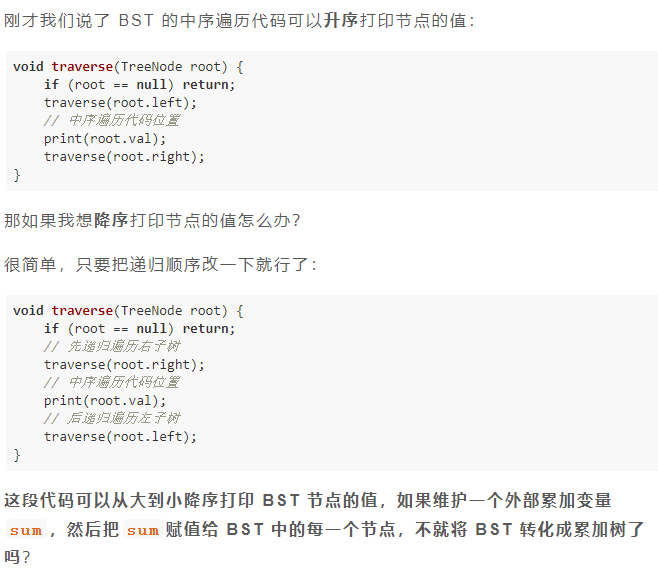

题目解答如下


```java
TreeNode convertBST(TreeNode root) {
    traverse(root);
    return root;
}

// 记录累加和
int sum = 0;
void traverse(TreeNode root) {
    if (root == null) {
        return;
    }
    traverse(root.right);
    // 维护累加和
    sum += root.val;
    // 将 BST 转化成累加树
    root.val = sum;
    traverse(root.left);
}
```

# BST的增删改查

验证BST

```go
type TreeNode struct {
   Val   int
   Left  *TreeNode
   Right *TreeNode
}

func isValidBST(root *TreeNode) bool {
   return ValidBST(root,nil,nil)
}

/*
BFS定义如下
1.节点的左子树只包含小于当前节点的数。
2.节点的右子树只包含大于当前节点的数。
3.所有左子树和右子树自身必须也是二叉搜索树。

所以我们在判断的时候需要确保左子树比最小的节点小，右子树比小大的节点大
*/

// 验证二叉树(因为要满足BST的定义,我们传入一个最小值和最大值)
func ValidBST(node *TreeNode,min *TreeNode,max *TreeNode) bool {
   // 跳出循环条件
   if node == nil{return true}
   // 验证一下root
   if min!=nil && node.Val <= min.Val{return false}
   if max!=nil && node.Val >= max.Val{return false}
   // 最后
   return ValidBST(node.Left,min,node) && ValidBST(node.Right,node,max)
}
```

对应的题目如下

[98. 验证二叉搜索树 - 力扣（LeetCode） (leetcode-cn.com)](https://leetcode-cn.com/problems/validate-binary-search-tree/)

这个东西的核心部分在于如何判断节点是否符合条件，不仅要确保根节点符合条件条件，好需要确保全局符合条件，比如下面这种情况

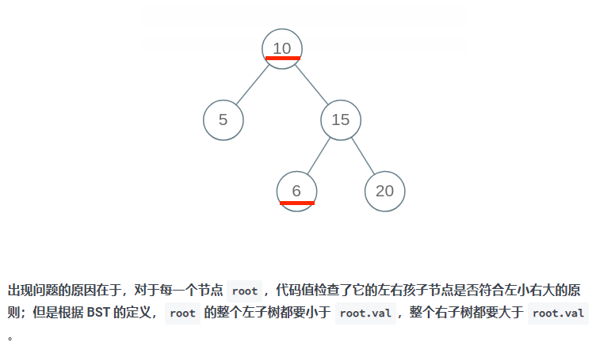

## 对二叉树进行搜索

默认情况下，我们可以使用最简单的遍历来去寻找一个值，比如下面这个最简单的穷举

```java
boolean isInBST(TreeNode root, int target) {
    if (root == null) return false;
    if (root.val == target) return true;
    // 当前节点没找到就递归地去左右子树寻找
    return isInBST(root.left, target)
        || isInBST(root.right, target);
}
```

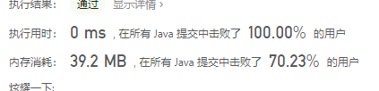

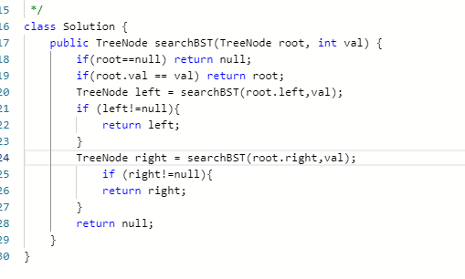

当然我们可以简化我们的算法，利用了 BST 左小右大的特性。来简化我们的算法

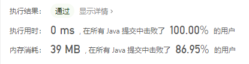

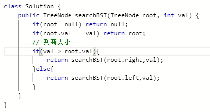

[手把手带你刷二叉搜索树（第二期） - labuladong的算法小抄 (gitbook.io)](https://labuladong.gitbook.io/algo/shu-ju-jie-gou-xi-lie/shou-ba-shou-shua-er-cha-shu-xun-lian-di-gui-si-wei/er-cha-sou-suo-shu-cao-zuo-ji-jin#zai-bst-zhong-cha-ru-yi-ge-shu)

对应题目：[701. 二叉搜索树中的插入操作 - 力扣（LeetCode） (leetcode-cn.com)](https://leetcode-cn.com/problems/insert-into-a-binary-search-tree/submissions/)

## 二叉树添加元素

我自己写的算法，我看了一下别人的算法，感觉都差不多

```java
class Solution {
    public TreeNode insertIntoBST(TreeNode root, int val) {
        if(root==null){
            return new TreeNode(val);
        }
        // 判断大小
        if(val > root.val){
            root.right = insertIntoBST(root.right,val);
        }else{
            root.left = insertIntoBST(root.left,val);
        }
        return root;
    }
}
```

```java
TreeNode insertIntoBST(TreeNode root, int val) {
    // 找到空位置插入新节点
    if (root == null) return new TreeNode(val);
    // if (root.val == val)
    //     BST 中一般不会插入已存在元素
    if (root.val < val) 
        root.right = insertIntoBST(root.right, val);
    if (root.val > val) 
        root.left = insertIntoBST(root.left, val);
    return root;
}
```

## 二叉树删除元素

删除元素的难点在于删除并不只是简单的删除就行，还要确保删除后整个二叉树可以维持自己的性质不变

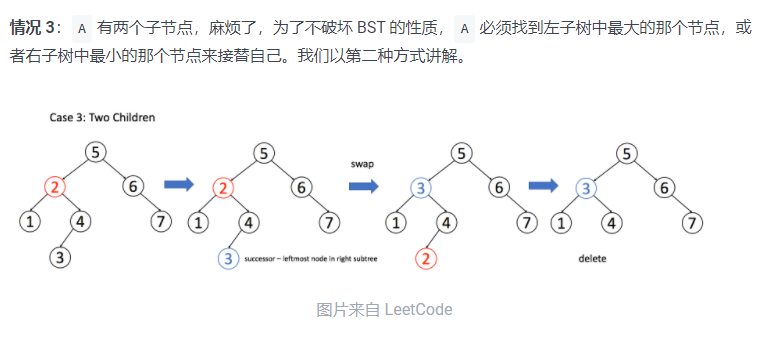

```java
TreeNode deleteNode(TreeNode root, int key) {
    if (root == null) return null;
    if (root.val == key) {
        // 这两个 if 把情况 1 和 2 都正确处理了
        if (root.left == null) return root.right;
        if (root.right == null) return root.left;
        // 处理情况 3， 首先要找出最小的节点，然后我们修改这个节点的值并删除最小的那个节点
        TreeNode minNode = getMin(root.right);
        root.val = minNode.val;
        root.right = deleteNode(root.right, minNode.val);
    } else if (root.val > key) {
        root.left = deleteNode(root.left, key);
    } else if (root.val < key) {
        root.right = deleteNode(root.right, key);
    }
    return root;
}

TreeNode getMin(TreeNode node) {
    // BST 最左边的就是最小的
    while (node.left != null) node = node.left;
    return node;
}
```

# 二叉树序列化

对应题目：[297. 二叉树的序列化与反序列化 - 力扣（LeetCode） (leetcode-cn.com)](https://leetcode-cn.com/problems/serialize-and-deserialize-binary-tree/)

对应笔记：[二叉树的序列化，就那几个框架，枯燥至极 - labuladong的算法小抄 (gitbook.io)](https://labuladong.gitbook.io/algo/shu-ju-jie-gou-xi-lie/shou-ba-shou-shua-er-cha-shu-xun-lian-di-gui-si-wei/er-cha-shu-de-xu-lie-hua)

微信公众号文章：[二叉树的题，就那几个框架，枯燥至极🤔 (qq.com)](https://mp.weixin.qq.com/s/DVX2A1ha4xSecEXLxW_UsA)

前序遍历解法：

```java
String SEP = ",";
String NULL = "#";

/* 主函数，将二叉树序列化为字符串 */
String serialize(TreeNode root) {
    StringBuilder sb = new StringBuilder();
    serialize(root, sb);
    return sb.toString();
}

/* 辅助函数，将二叉树存入 StringBuilder */
void serialize(TreeNode root, StringBuilder sb) {
    if (root == null) {
        sb.append(NULL).append(SEP);
        return;
    }

    /****** 前序遍历位置 ******/
    sb.append(root.val).append(SEP);
    /***********************/

    serialize(root.left, sb);
    serialize(root.right, sb);
}

/* 主函数，将字符串反序列化为二叉树结构 */
TreeNode deserialize(String data) {
    // 将字符串转化成列表
    LinkedList<String> nodes = new LinkedList<>();
    for (String s : data.split(SEP)) {
        nodes.addLast(s);
    }
    return deserialize(nodes);
}

/* 辅助函数，通过 nodes 列表构造二叉树 */
TreeNode deserialize(LinkedList<String> nodes) {
    if (nodes.isEmpty()) return null;

    /****** 前序遍历位置 ******/
    // 列表最左侧就是根节点
    String first = nodes.removeFirst();
    if (first.equals(NULL)) return null;
    TreeNode root = new TreeNode(Integer.parseInt(first));
    /***********************/

    root.left = deserialize(nodes);
    root.right = deserialize(nodes);

    return root;
}
```

序列化比较简单，只需要对数据进行前序遍历操作，然后把我们的数据拼接成字符串，

反序列化需要根据我们的遍历，反过来去推导最后的二叉树


