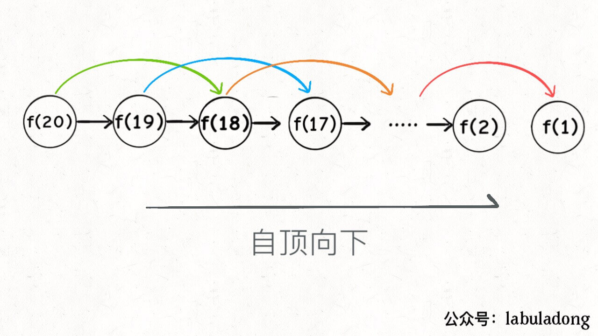

[动态规划解题套路框架 - labuladong的算法小抄 (gitbook.io)](https://labuladong.gitbook.io/algo/dong-tai-gui-hua-xi-lie/dong-tai-gui-hua-ji-ben-ji-qiao/dong-tai-gui-hua-xiang-jie-jin-jie)

# 基本概念

**首先，动态规划问题的一般形式就是求最值**。动态规划其实是运筹学的一种最优化方法，只不过在计算机问题上应用比较多，比如说让你求**最长**递增子序列呀，**最小**编辑距离呀等等。

既然是要求最值，核心问题是什么呢？**求解动态规划的核心问题是穷举**。因为要求最值，肯定要把所有可行的答案穷举出来，然后在其中找最值呗。

动态规划这么简单，就是穷举就完事了？我看到的动态规划问题都很难啊！

首先，动态规划的穷举有点特别，因为这类问题**存在「重叠子问题」**，如果暴力穷举的话效率会极其低下，所以需要「备忘录」或者「DP table」来优化穷举过程，避免不必要的计算。

而且，动态规划问题一定会**具备「最优子结构」**，才能通过子问题的最值得到原问题的最值。

另外，虽然动态规划的核心思想就是穷举求最值，但是问题可以千变万化，穷举所有可行解其实并不是一件容易的事，只有列出**正确的「状态转移方程」**才能正确地穷举。

以上提到的重叠子问题、最优子结构、状态转移方程就是动态规划三要素。具体什么意思等会会举例详解，但是在实际的算法问题中，**写出状态转移方程是最困难的**，这也就是为什么很多朋友觉得动态规划问题困难的原因，我来提供我研究出来的一个思维框架，辅助你思考状态转移方程：

**明确 base case -> 明确「状态」-> 明确「选择」 -> 定义 dp 数组/函数的含义**。

```java
# 初始化 base case
dp[0][0][...] = base
# 进行状态转移
for 状态1 in 状态1的所有取值：
    for 状态2 in 状态2的所有取值：
        for ...
            dp[状态1][状态2][...] = 求最值(选择1，选择2...)
```

下面通过斐波那契数列问题和凑零钱问题来详解动态规划的基本原理。前者主要是让你明白什么是重叠子问题（斐波那契数列没有求最值，所以严格来说不是动态规划问题），后者主要举集中于如何列出状态转移方程。

## 一、斐波那契数列

> 定义

斐波那契数，通常用 F(n) 表示，形成的序列称为 斐波那契数列 。该数列由 0 和 1 开始，后面的每一项数字都是前面两项数字的和。也就是：

```
F(0) = 0，F(1) = 1
F(n) = F(n - 1) + F(n - 2)，其中 n > 1
```

**1、递归解法**

最简单的递归解法，这个解法无非就是把所有的情况全部遍历一般去解决

```java
class Solution {
    int fib(int n) {
        if (n == 0) return 0;
        if (n == 1) return 1;
        return fib(n - 1) + fib(n - 2);
    }
}
```


**递归问题需要画递归树去解决，使用递归树可以方便的分析复杂度，分析低效的原因**


这个递归树怎么理解？就是说想要计算原问题 `f(20)`，我就得先计算出子问题 `f(19)` 和 `f(18)`，然后要计算 `f(19)`，我就要先算出子问题 `f(18)` 和 `f(17)`，以此类推。最后遇到 `f(1)` 或者 `f(2)` 的时候，结果已知，就能直接返回结果，递归树不再向下生长了。

**递归算法的时间复杂度怎么计算？就是用子问题个数乘以解决一个子问题需要的时间。**

首先计算子问题个数，即递归树中节点的总数。显然二叉树节点总数为指数级别，所以子问题个数为 O(2^n)。

然后计算解决一个子问题的时间，在本算法中，没有循环，只有 `f(n - 1) + f(n - 2)` 一个加法操作，时间为 O(1)。

所以，这个算法的时间复杂度为二者相乘，即 O(2^n)，指数级别，爆炸。

观察递归树，很明显发现了算法低效的原因：存在大量重复计算，比如 `f(18)` 被计算了两次，而且你可以看到，以 `f(18)` 为根的这个递归树体量巨大，多算一遍，会耗费巨大的时间。更何况，还不止 `f(18)` 这一个节点被重复计算，所以这个算法及其低效。

这就是动态规划问题的第一个性质：**重叠子问题**。下面，我们想办法解决这个问题。

**2、带备忘录的递归解法**

明确了问题，其实就已经把问题解决了一半。即然耗时的原因是重复计算，那么我们可以造一个「备忘录」，每次算出某个子问题的答案后别急着返回，先记到「备忘录」里再返回；每次遇到一个子问题先去「备忘录」里查一查，如果发现之前已经解决过这个问题了，直接把答案拿出来用，不要再耗时去计算了。

一般使用一个数组充当这个「备忘录」，当然你也可以使用哈希表（字典），思想都是一样的。

下面这个是C++的写法

```cpp
int fib(int N) {
    if (N < 1) return 0;
    // 备忘录全初始化为 0
    vector<int> memo(N + 1, 0);
    // 进行带备忘录的递归
    return helper(memo, N);
}

int helper(vector<int>& memo, int n) {
    // base case
    if (n == 1 || n == 2) return 1;
    // 如果当前值n在备忘录中存在，那么结果就不会为0，这个时候我们直接返回计算的结果
    if (memo[n] != 0) return memo[n];
    // 如果没有找到我们就把这个值存入备忘录录中，并返回当前备忘录的内容
    memo[n] = helper(memo, n - 1) + helper(memo, n - 2);
    return memo[n];
}
```

现在，画出递归树，你就知道「备忘录」到底做了什么。


实际上，带「备忘录」的递归算法，把一棵存在巨量冗余的递归树通过「剪枝」，改造成了一幅不存在冗余的递归图，极大减少了子问题（即递归图中节点）的个数。



**递归算法的时间复杂度怎么计算？就是用子问题个数乘以解决一个子问题需要的时间。**

子问题个数，即图中节点的总数，由于本算法不存在冗余计算，子问题就是 `f(1)`, `f(2)`, `f(3)` ... `f(20)`，数量和输入规模 n = 20 成正比，所以子问题个数为 O(n)。

解决一个子问题的时间，同上，没有什么循环，时间为 O(1)。

所以，本算法的时间复杂度是 O(n)。比起暴力算法，是降维打击。

至此，带备忘录的递归解法的效率已经和迭代的动态规划解法一样了。实际上，这种解法和迭代的动态规划已经差不多了，只不过这种方法叫做「自顶向下」，动态规划叫做「自底向上」。

啥叫「自顶向下」？注意我们刚才画的递归树（或者说图），是从上向下延伸，都是从一个规模较大的原问题比如说 `f(20)`，向下逐渐分解规模，直到 `f(1)` 和 `f(2)` 这两个 base case，然后逐层返回答案，这就叫「自顶向下」。

啥叫「自底向上」？反过来，我们直接从最底下，最简单，问题规模最小的 `f(1)` 和 `f(2)` 开始往上推，直到推到我们想要的答案 `f(20)`，这就是动态规划的思路，这也是为什么动态规划一般都脱离了递归，而是由循环迭代完成计算。

**3.dp数组迭代解法（是备忘录的反过程）**

有了上一步「备忘录」的启发，我们可以把这个「备忘录」独立出来成为一张表，就叫做 DP table 吧，在这张表上完成「自底向上」的推算岂不美哉！

```java
int fib(int N) {
    if (N < 1) return 0;
    if (N == 1 || N == 2) return 1;
    // 初始化dp表
    vector<int> dp(N + 1, 0);
    // 默认情况下，我们 f1为1 f2为1 这个是最开始的条件
    dp[1] = dp[2] = 1;
    // 我们对这个进行循环，根据我们的转移方程，可以算出每个递归值的值
    for (int i = 3; i <= N; i++)
        dp[i] = dp[i - 1] + dp[i - 2];
    // 最后我们可以根据传入的N，直接计算
    return dp[N];
}
```

整个算法的流程图如下


画个图就很好理解了，而且你发现这个 DP table 特别像之前那个「剪枝」后的结果，只是反过来算而已。实际上，带备忘录的递归解法中的「备忘录」，最终完成后就是这个 DP table，所以说这两种解法其实是差不多的，大部分情况下，效率也基本相同。

这里，引出「状态转移方程」这个名词，实际上就是描述问题结构的数学形式：


为啥叫「状态转移方程」？其实就是为了听起来高端。你把 `f(n)` 想做一个状态 `n`，这个状态 `n` 是由状态 `n - 1` 和状态 `n - 2` 相加转移而来，这就叫状态转移，仅此而已。

你会发现，上面的几种解法中的所有操作，例如 `return f(n - 1) + f(n - 2)`，`dp[i] = dp[i - 1] + dp[i - 2]`，以及对备忘录或 DP table 的初始化操作，都是围绕这个方程式的不同表现形式。可见列出「状态转移方程」的重要性，它是解决问题的核心。而且很容易发现，其实状态转移方程直接代表着暴力解法。

**千万不要看不起暴力解，动态规划问题最困难的就是写出这个暴力解，即状态转移方程**。只要写出暴力解，优化方法无非是用备忘录或者 DP table，再无奥妙可言。

这个例子的最后，讲一个细节优化。细心的读者会发现，根据斐波那契数列的状态转移方程，当前状态只和之前的两个状态有关，其实并不需要那么长的一个 DP table 来存储所有的状态，只要想办法存储之前的两个状态就行了。所以，可以进一步优化，把空间复杂度降为 O(1)：

```java
int fib(int n) {
    // 如果n小于0直接退出
    if (n < 1) return 0;
    // 如果n为2或1，那么可以直接返回1
    if (n == 2 || n == 1) 
        return 1;
    int prev = 1, curr = 1;
    // 如果是其他情况，我们可以发现，我们只需要存储两个值就行了，不需要单独再搞一个表来存储
    for (int i = 3; i <= n; i++) {
        int sum = prev + curr;
        prev = curr;
        curr = sum;
    }
    return curr;
}
```

## 二、凑零钱问题

涉及到了求最值的问题

先看下题目：给你 `k` 种面值的硬币，面值分别为 `c1, c2 ... ck`，每种硬币的数量无限，再给一个总金额 `amount`，问你**最少**需要几枚硬币凑出这个金额，如果不可能凑出，算法返回 -1 。算法的函数签名如下：

```java
// coins 中是可选硬币面值，amount 是目标金额
int coinChange(int[] coins, int amount);
```

比如说 `k = 3`，面值分别为 1，2，5，总金额 `amount = 11`。那么最少需要 3 枚硬币凑出，即 11 = 5 + 5 + 1。

你认为计算机应该如何解决这个问题？显然，就是把所有可能的凑硬币方法都穷举出来，然后找找看最少需要多少枚硬币。

**1、暴力递归**

首先，这个问题是动态规划问题，因为它具有「最优子结构」的。**要符合「最优子结构」，子问题间必须互相独立**

回到凑零钱问题，为什么说它符合最优子结构呢？比如你想求 `amount = 11` 时的最少硬币数（原问题），如果你知道凑出 `amount = 10` 的最少硬币数（子问题），你只需要把子问题的答案加一（再选一枚面值为 1 的硬币）就是原问题的答案。因为硬币的数量是没有限制的，所以子问题之间没有相互制，是互相独立的。

那么，既然知道了这是个动态规划问题，就要思考**如何列出正确的状态转移方程**？

1、**确定 base case**，这个很简单，显然目标金额 `amount` 为 0 时算法返回 0，因为不需要任何硬币就已经凑出目标金额了。

2、**确定「状态」，也就是原问题和子问题中会变化的变量**。由于硬币数量无限，硬币的面额也是题目给定的，只有目标金额会不断地向 base case 靠近，所以唯一的「状态」就是目标金额 `amount`。

3、**确定「选择」，也就是导致「状态」产生变化的行为**。目标金额为什么变化呢，因为你在选择硬币，你每选择一枚硬币，就相当于减少了目标金额。所以说所有硬币的面值，就是你的「选择」。

4、**明确** **`dp`** **函数/数组的定义**。我们这里讲的是自顶向下的解法，所以会有一个递归的 `dp` 函数，一般来说函数的参数就是状态转移中会变化的量，也就是上面说到的「状态」；函数的返回值就是题目要求我们计算的量。就本题来说，状态只有一个，即「目标金额」，题目要求我们计算凑出目标金额所需的最少硬币数量。所以我们可以这样定义 `dp` 函数：

`dp(n)` 的定义：输入一个目标金额 `n`，返回凑出目标金额 `n` 的最少硬币数量。

搞清楚上面这几个关键点，解法的伪码就可以写出来了：

```python
def coinChange(coins: List[int], amount: int):

    def dp(n):
        # base case
        if n == 0: return 0
        if n < 0: return -1
        # 求最小值，所以初始化为正无穷
        res = float('INF')
        for coin in coins:
            subproblem = dp(n - coin)
            # 子问题无解，跳过
            if subproblem == -1: continue
            res = min(res, 1 + subproblem)

        return res if res != float('INF') else -1

    return dp(amount)
```

实际的状态转移方程如下：


**2、备忘录的计算代码如下：**

```cpp
class Solution {
    vector<int>count;
    // 进行dp计算
    int dp(vector<int>& coins, int rem) {
        // 如果我们凑的零钱小于0 就返回-1 如果等于0 就返回0
        if (rem < 0) return -1;
        if (rem == 0) return 0;
        // n-1的时候，如果count这个备忘录里面有的话，我们就直接返回备忘录中的值
        if (count[rem - 1] != 0) return count[rem - 1];
        // 设min为int的最大值
        int Min = INT_MAX;
        // 我们遍历零钱的类型
        for (int coin:coins) {
            // 我们求出rem-coin的最优解
            int res = dp(coins, rem - coin);
            // 如果我们计算的这个最优解大于零并且小于min，那么我们就重置修改min，直到我们遍历完整个零钱类型，求出最优解（注意我们的res必须要+1，+1就相当于凑了一次零钱）
            if (res >= 0 && res < Min) {
                Min = res + 1;
            }
        }
        // 判断rem-1的最优解是否存在，存在就返回最优解，不存在就返回-1
        count[rem - 1] = Min == INT_MAX ? -1 : Min;
        // 返回最优解
        return count[rem - 1];
    }
public:
    int coinChange(vector<int>& coins, int amount) {
        // 如果金额为0，那么我们就直接返回0
        if (amount < 1) return 0;
        // 调整vector大小，修改数目为amount
        count.resize(amount);
        // 进行dp操作，找出凑零钱问题的解
        return dp(coins, amount);
    }
};
```

**3、自底向上的解法**

当然，我们也可以自底向上使用 dp table 来消除重叠子问题，关于「状态」「选择」和 base case 与之前没有区别，`dp` 数组的定义和刚才 `dp` 函数类似，也是把「状态」，也就是目标金额作为变量。不过 `dp` 函数体现在函数参数，而 `dp` 数组体现在数组索引：

**`dp`** **数组的定义：当目标金额为** **`i`** **时，至少需要** **`dp[i]`** **枚硬币凑出**。

根据我们文章开头给出的动态规划代码框架可以写出如下解法：

```cpp
int coinChange(vector<int>& coins, int amount) {
    // 数组大小为 amount + 1，初始值也为 amount + 1
    vector<int> dp(amount + 1, amount + 1);
    // base case
    dp[0] = 0;
    // 外层 for 循环在遍历所有状态的所有取值
    for (int i = 0; i < dp.size(); i++) {
        // 内层 for 循环在求所有选择的最小值
        for (int coin : coins) {
            // 子问题无解，跳过
            if (i - coin < 0) continue;
            dp[i] = min(dp[i], 1 + dp[i - coin]);
        }
    }
    return (dp[amount] == amount + 1) ? -1 : dp[amount];
}
```


PS：为啥 `dp` 数组初始化为 `amount + 1` 呢，因为凑成 `amount` 金额的硬币数最多只可能等于 `amount`（全用 1 元面值的硬币），所以初始化为 `amount + 1` 就相当于初始化为正无穷，便于后续取最小值。

## 三、总结

第一个斐波那契数列的问题，解释了如何通过「备忘录」或者「dp table」的方法来优化递归树，并且明确了这两种方法本质上是一样的，只是自顶向下和自底向上的不同而已。

第二个凑零钱的问题，展示了如何流程化确定「状态转移方程」，只要通过状态转移方程写出暴力递归解，剩下的也就是优化递归树，消除重叠子问题而已。

如果你不太了解动态规划，还能看到这里，真得给你鼓掌，相信你已经掌握了这个算法的设计技巧。

**计算机解决问题其实没有任何奇技淫巧，它唯一的解决办法就是穷举**，穷举所有可能性。算法设计无非就是先思考“如何穷举”，然后再追求“如何聪明地穷举”。

列出动态转移方程，就是在解决“如何穷举”的问题。之所以说它难，一是因为很多穷举需要递归实现，二是因为有的问题本身的解空间复杂，不那么容易穷举完整。

备忘录、DP table 就是在追求“如何聪明地穷举”。用空间换时间的思路，是降低时间复杂度的不二法门，除此之外，试问，还能玩出啥花活？

# 状态压缩

动态规划本身也是可以进行阶段性优化的，比如说我们常听说的「状态压缩」技巧，就能够把很多动态规划解法的空间复杂度进一步降低，由 O(N^2) 降低到 O(N)，

能够使用状态压缩技巧的动态规划都是二维`dp`问题，**你看它的状态转移方程，如果计算状态`dp[i][j]`需要的都是`dp[i][j]`相邻的状态，那么就可以使用状态压缩技巧**，将二维的`dp`数组转化成一维，将空间复杂度从 O(N^2) 降低到 O(N)。

什么叫「和`dp[i][j]`相邻的状态」呢，比如前文 [最长回文子序列](http://mp.weixin.qq.com/s?__biz=MzAxODQxMDM0Mw==&mid=2247484666&idx=1&sn=e3305be9513eaa16f7f1568c0892a468&chksm=9bd7faf2aca073e4f08332a706b7c10af877fee3993aac4dae86d05783d3d0df31844287104e&scene=21#wechat_redirect) 中，最终的代码如下：

```java
int longestPalindromeSubseq(string s) {
    int n = s.size();
    // dp 数组全部初始化为 0
    vector<vector<int>> dp(n, vector<int>(n, 0));
    // base case
    for (int i = 0; i < n; i++)
        dp[i][i] = 1;
    // 反着遍历保证正确的状态转移
    for (int i = n - 2; i >= 0; i--) {
        for (int j = i + 1; j < n; j++) {
            // 状态转移方程
            if (s[i] == s[j])
                dp[i][j] = dp[i + 1][j - 1] + 2;
            else
                dp[i][j] = max(dp[i + 1][j], dp[i][j - 1]);
        }
    }
    // 整个 s 的最长回文子串长度
    return dp[0][n - 1];
}
```

PS：我们本文不探讨如何推状态转移方程，只探讨对二维 DP 问题进行状态压缩的技巧。**技巧都是通用的，所以如果你没看过前文，不明白这段代码的逻辑也无妨，完全不会阻碍你学会状态压缩。**

你看我们对`dp[i][j]`的更新，其实只依赖于`dp[i+1][j-1], dp[i][j-1], dp[i+1][j]`这三个状态：


这就叫和`dp[i][j]`相邻，反正你计算`dp[i][j]`只需要这三个相邻状态，其实根本不需要那么大一个二维的 dp table 对不对？

**状态压缩的核心思路就是，将二维数组「投影」到一维数组**：


思路很直观，但是也有一个明显的问题，图中`dp[i][j-1]`和`dp[i+1][j-1]`这两个状态处在同一列，而一维数组中只能容下一个，那么当我计算`dp[i][j]`时，他俩必然有一个会被另一个覆盖掉，怎么办？

这就是状态压缩的难点，下面就来分析解决这个问题，还是拿「最长回文子序列」问题举例，它的状态转移方程主要逻辑就是如下这段代码：

/// 目前还没怎么看懂状态压缩，先跳过

[状态压缩技巧：动态规划的降维打击 (qq.com)](https://mp.weixin.qq.com/s?__biz=MzAxODQxMDM0Mw==&mid=2247485824&idx=1&sn=09caa56172729cf8cf1b53089e8dee55&chksm=9bd7f788aca07e9e4149f384ec5e279adadec75a2828a76066c56b4789209fb1cd54f9e63f9d&scene=21#wechat_redirect)

# 子类序列类型问题

## 最长公共子序列

不知道大家做算法题有什么感觉，**我总结出来做算法题的技巧就是，把大的问题细化到一个点，先研究在这个小的点上如何解决问题，然后再通过递归/迭代的方式扩展到整个问题**。

计算最长公共子序列（Longest Common Subsequence，简称 LCS）是一道经典的动态规划题目，大家应该都见过：给你输入两个字符串`s1`和`s2`，请你找出他们俩的最长公共子序列，返回这个子序列的长度。

原题链接：[1143. 最长公共子序列 - 力扣（LeetCode） (leetcode-cn.com)](https://leetcode-cn.com/problems/longest-common-subsequence/)


如果没有做过这道题，一个最简单的暴力算法就是，把`s1`和`s2`的所有子序列都穷举出来，然后看看有没有公共的，然后在所有公共子序列里面再寻找一个长度最大的。

显然，这种思路的复杂度非常高，你要穷举出所有子序列，这个复杂度就是指数级的，肯定不实际。

正确的思路是不要考虑整个字符串，而是细化到`s1`和`s2`的每个字符。前文 子序列解题模板 中总结的一个规律：

> 对于两个字符串求子序列的问题，都是用两个指针`i`和`j`分别在两个字符串上移动，大概率是动态规划思路。

最长公共子序列的问题也可以遵循这个规律，我们可以先写一个`dp`函数：

```java
// 定义：计算 s1[i..] 和 s2[j..] 的最长公共子序列长度
int dp(String s1, int i, String s2, int j)
```

这个`dp`函数的定义是：**`dp(s1, i, s2, j)`计算`s1[i..]`和`s2[j..]`的最长公共子序列长度**。

根据这个定义，那么我们想要的答案就是`dp(s1, 0, s2, 0)`，且 base case 就是`i == len(s1)`或`j == len(s2)`时，因为这时候`s1[i..]`或`s2[j..]`就相当于空串了，最长公共子序列的长度显然是 0：

```java
int longestCommonSubsequence(String s1, String s2) {
    return dp(s1, 0, s2, 0);
}
/* 主函数 */
int dp(String s1, int i, String s2, int j) {
    // base case
    if (i == s1.length() || j == s2.length()) {
        return 0;
    }
    // ...
```

**接下来，咱不要看`s1`和`s2`两个字符串，而是要具体到每一个字符，思考每个字符该做什么**。


我们只看`s1[i]`和`s2[j]`，**如果`s1[i] == s2[j]`，说明这个字符一定在`lcs`中**：（lcs就是最长子序列）


这样，就找到了一个`lcs`中的字符，根据`dp`函数的定义，我们可以完善一下代码：

```java
// 定义：计算 s1[i..] 和 s2[j..] 的最长公共子序列长度
int dp(String s1, int i, String s2, int j) {
    if (s1.charAt(i) == s2.charAt(j)) {
        // s1[i] 和 s2[j] 必然在 lcs 中，
        // 加上 s1[i+1..] 和 s2[j+1..] 中的 lcs 长度，就是答案
        return 1 + dp(s1, i + 1, s2, j + 1)
    } else {
        // ...
    }
}
```

刚才说的`s1[i] == s2[j]`的情况，但如果`s1[i] != s2[j]`，应该怎么办呢？

**`s1[i] != s2[j]`意味着，`s1[i]`和`s2[j]`中至少有一个字符不在`lcs`中**：


如上图，总共可能有三种情况，我怎么知道具体是那种情况呢？

其实我们也不知道，那就把这三种情况的答案都算出来，取其中结果最大的那个呗，因为题目让我们算「最长」公共子序列的长度嘛。

这三种情况的答案怎么算？回想一下我们的`dp`函数定义，不就是专门为了计算它们而设计的嘛！我们代码可以再进一步：

```java
// 定义：计算 s1[i..] 和 s2[j..] 的最长公共子序列长度
int dp(String s1, int i, String s2, int j) {
    if (s1.charAt(i) == s2.charAt(j)) {
        return 1 + dp(s1, i + 1, s2, j + 1)
    } else {
        // s1[i] 和 s2[j] 中至少有一个字符不在 lcs 中，
        // 穷举三种情况的结果，取其中的最大结果
        return max(
            // 情况一、s1[i] 不在 lcs 中
            dp(s1, i + 1, s2, j),
            // 情况二、s2[j] 不在 lcs 中
            dp(s1, i, s2, j + 1),
            // 情况三、都不在 lcs 中
            dp(s1, i + 1, s2, j + 1)
        );
    }
}
```

这里就已经非常接近我们的最终答案了，**还有一个小的优化，情况三「`s1[i]`和`s2[j]`都不在 lcs 中」其实可以直接忽略**。

因为我们在求最大值嘛，情况三在计算`s1[i+1..]`和`s2[j+1..]`的`lcs`长度，这个长度肯定是小于等于情况二`s1[i..]`和`s2[j+1..]`中的`lcs`长度的，因为`s1[i+1..]`比`s1[i..]`短嘛，那从这里面算出的`lcs`当然也不可能更长嘛。

同理，情况三的结果肯定也小于等于情况一。**说白了，情况三被情况一和情况二包含了**，所以我们可以直接忽略掉情况三，完整代码如下：

```java
// 备忘录，消除重叠子问题
int[][] memo;

/* 主函数 */
int longestCommonSubsequence(String s1, String s2) {
    int m = s1.length(), n = s2.length();
    // 备忘录值为 -1 代表未曾计算
    memo = new int[m][n];
    // 遍历数组，对数组进行填充
    for (int[] row : memo) 
        Arrays.fill(row, -1);
    // 计算 s1[0..] 和 s2[0..] 的 lcs 长度（我们这个i和j的目的是为了简化计算）
    return dp(s1, 0, s2, 0);
}

// 定义：计算 s1[i..] 和 s2[j..] 的最长公共子序列长度
int dp(String s1, int i, String s2, int j) {
    // 当i到达s1的结尾或j到达s2的结尾时，我们就可以结束了
    if (i == s1.length() || j == s2.length()) {
        return 0;
    }
    // 如果之前计算过，则直接返回备忘录中的答案
    if (memo[i][j] != -1) {
        return memo[i][j];
    }
    // 根据 s1[i] 和 s2[j] 的情况做选择
    if (s1.charAt(i) == s2.charAt(j)) {
        // 当两个字符相等的时候 s1[i] 和 s2[j] 必然在 lcs 中
        memo[i][j] = 1 + dp(s1, i + 1, s2, j + 1);
    } else {
        // s1[i] 和 s2[j] 至少有一个不在 lcs 中，根据我们之前画的图，我们可以在两个不同的结果之间找出一个最好的值
        memo[i][j] = Math.max(
            dp(s1, i + 1, s2, j),
            dp(s1, i, s2, j + 1)
        );
    }
    return memo[i][j];
}
```

> 自己的理解

这个题目关键在于如何理解最长子序列


这个题目需要我们进行简化，就如文章里面所说，如果第一个字符串相同，那么这个一定是出现在子序列中的，子序列长度就可以+1操作了。然后下面我们就可以同时移动i和j这两个指针，进行下一轮判断


现在我们遇到了第二个问题，如果这两个字符串不相同咋办？


这里我们就可以分三种情况了


## 编辑距离

题目定义如下


**思路**


# 背包类型问题

# 贪心类型问题

# 其他经典问题

