10大排序算法

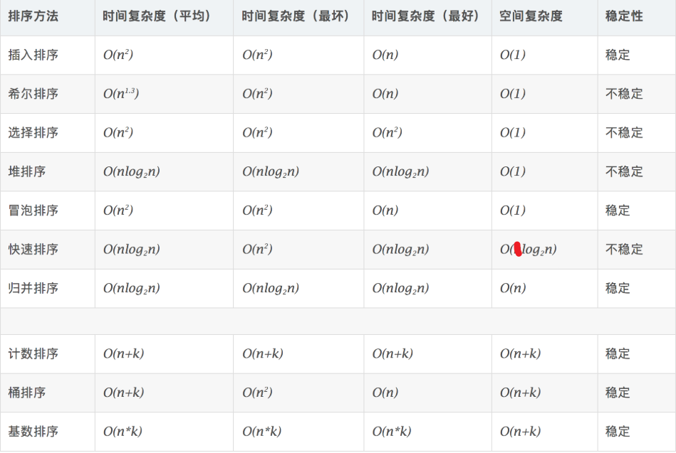

log的那个2可以省略，一般情况下可以直接使用nlogn

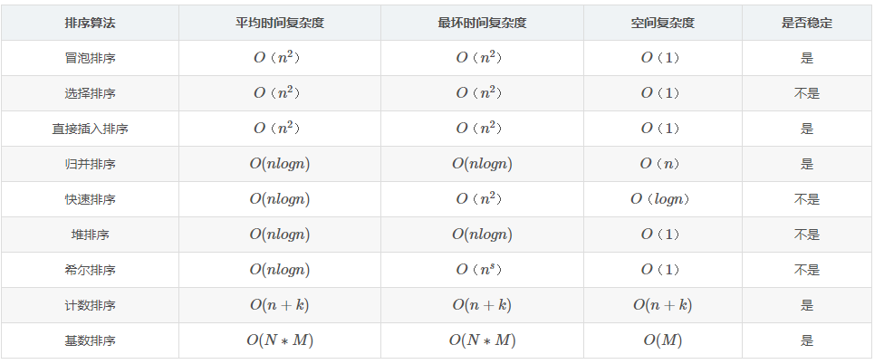

# 插入排序

## 直接插入排序

插入排序是最简单的，我们不断比较插入数据

```go
// 插入排序
// 时间复杂度 n^2
// 因为我们这里是两层for循环，运气好的话，如果是有序的那么只需要执行一层，时间复杂度就是n
// 运气不好的话时间复杂度就是 n^2 平均的时间复杂度为 n^2
// 空间复杂度 1 ，因为我们只使用了一个临时变量，然后就没申请其他的了，所以空间复杂度为 1
func insertSort(arr []int){
	// 使用j来表示当前排序的位置
	var j = 0
	for i:=1;i<len(arr);i++{
		// 使用临时变量存储
		tmp:=arr[i]
		// 这个就是核心部分，首先我们让j处于i上
		// 当j-1大于tmp也就是arr[i]的时候,我们就需要把数字向后移动
		for j = i ; j>0 && arr[j-1] > tmp ; j--{
			arr[j] = arr[j-1]
		}
		// for循环的顺序 就是先j=1，然后执行判断语句，成功的话我们就执行函数体，最后才执行j--
		// 所以我们这里移动后，j实际上减了1，这样我们就可以直接替换了
		arr[j] = tmp
	}
}
```

插入排序的思想如下

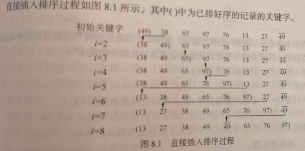

时间复杂度为o(n^2) 空间复杂度为o(1)

我的错误代码

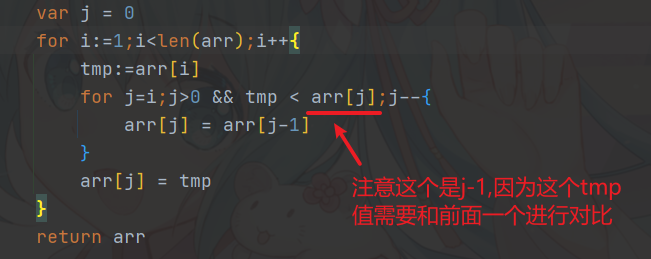

## 折半插入排序


```go
// 折半插入排序（这个不算10大排序算法）
// 时间复杂度为 n^2，为什么是n^2呢，外面这一层不必多说就是n
// 里面这层，虽然有两个for循环，但是实际情况下，这个执行的时间是随n线性变化的，所以也可以看成n
// 空间复杂度为 1 这里为什么不是3呢，因为我们这个空间复杂度反映的是一个趋势
// 无论我们的n是多大，我们始终只用了三个变量，所以空间复杂度为1
func bInsertSort(arr []int){
	var j = 0
	for i:=1;i<len(arr);i++{
		// 存储临时变量
		tmp := arr[i]
		// 赋值low和high，这里high等于i-1
		// 这里为什么i-1，因为我们最后计算的时候要确保low指针+1不会越界
		low,high,mid:=0,i-1,0
		// 我们使用指针来查找需要插入的位置
		for low <= high {
			mid = (low+high) /2
			if arr[mid] > tmp {
				high = mid - 1
			} else {
				low = mid + 1
			}
		}
		// 这里说一下为什么最后这个low就是我们应该放入的位置
		// low,high,mid的值是两个一组的，上一组是a[i]和a[mid]未经比较以前的，
		// 下一组是比较后，经过调整的。调整结果要么是low=mid+1，要么是high=mid-1。
		// 不知大家从上面的数据看出了什么。对！我们现在可以清楚的肯定：新元素的插入位置就是low。
		// 并且还发现high比low要小一，即high+1才与low相等。这是显然的，否则while循环如何结束。
		// 我想此刻大家的疑惑肯定是解开了。那么插入位置的写法就很随意了:low和high+1都行！
		// fmt.Println(low,mid,high)
		// 这里为什么要取low因为我们结束后j一定为是low，所以我们可以直接替换
		// 我也尝试过high不减一，low<high 但是就是调不出来，我也不知道为什么
		for j=i;j>low;j-- {
			arr[j] = arr[j-1]
		}
		arr[low] = tmp
	}
}
```

时间复杂度为o(n^2) 时间复杂度为O(1)

## 希尔排序

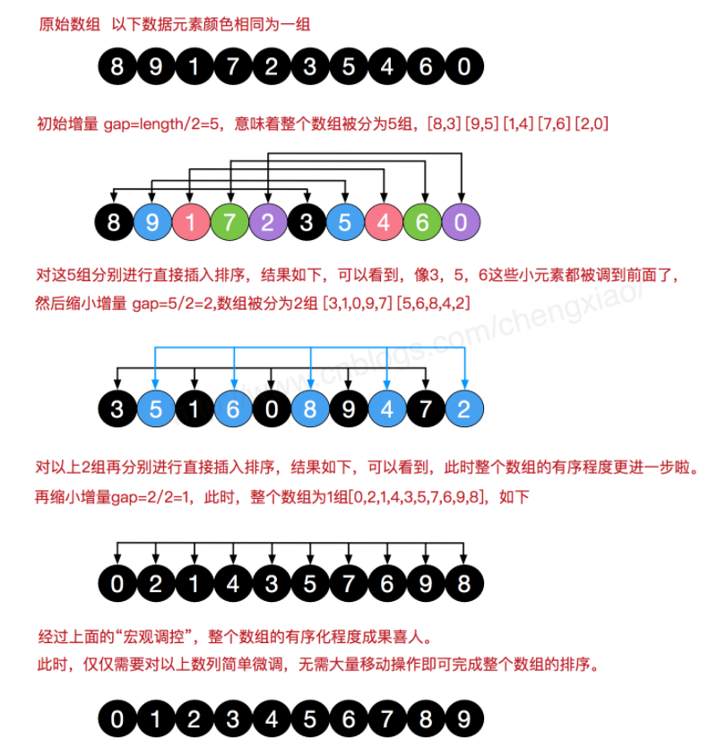

也叫缩小增量排序，通过把整个待排序记录序列分割成几组，从而减少需要排序的数据量


代码运行结果

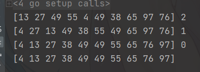


时间复杂度和空间复杂度

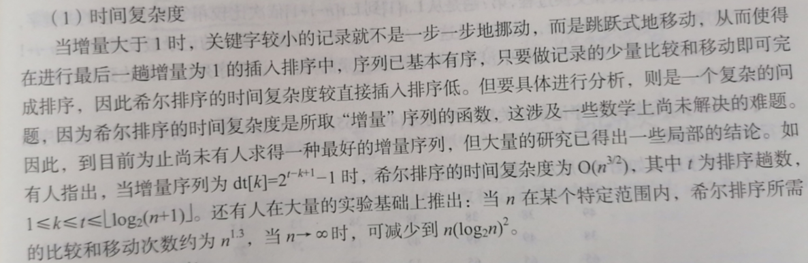

我们的代码如下：

```go
// 希尔排序
// 时间复杂度 n^1.3 这个是别人试验验证的结果
// 空间复杂度 不随n变化就是1
func shellSort(arr []int) {
	// 首先我们就是要确定增量大小，默认情况下，我们取n=len(arr)/2，后面我们的增量就会不断的缩小
	for gap:=len(arr)/2;gap>0;gap/=2{
		// 确定好增量后我们就从gap开始,这里为什么是i等于gap呢，因为我们后面是j-gap，所以我们需要从这个增量开始计算
		for i:=gap;i<len(arr);i++{
			// 用一个变量来暂存i的位置
			j:=i
			// 这里就开始比较了，我们是从gap开始的，j-gap 是我们比的第二个数字，然后我们进行交换
			for j-gap>=0 && arr[j] < arr[j-gap] {
				// 如果发现右边大于左边的，我们就交换一下
				arr[j],arr[j-gap] = arr[j-gap],arr[j]
				// 这一步其实是优化，要不要都一样，我们这里就是确保后面排序后再给前面排序，加快排序速度
				j-=gap
			}
		}
	}
}
```

# 交换排序

## 冒泡排序

代码如下：

```go
// 冒泡排序
// 时间复杂度 n^2 因为我们用了两层循环，这种两层循环的一般都是n^2
// 空间复杂度 1 这个和上面一样，不解释
func bubbleSort(arr []int)  {
	flag:=true
	// 首先我们直接设置i，i表示当前未排序的区间最大值,同时为了避免重复比较，设置一个flag来进行标记
	for i:=len(arr)-1;i>0 && flag;i-- {
		// 把flag置为false，如果没有排序那么我们就退出循环
		flag = false
		// 然后我们只需要按顺序排好i前面的就行了
		for j:=0;j<i;j++ {
			// 冒泡排序是比较相邻两个位置的元素
			if arr[j] > arr[j+1] {
				// flag置为true表示已经排过序了
				flag = true
				// 交换
				arr[j+1],arr[j] = arr[j],arr[j+1]
			}
		}
	}
}
```

算法思路如下

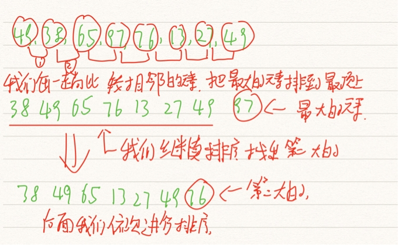

> 算法特点

(1)稳定排序。

(2)可用于链式存储结构。

(3)移动记录次数较多，算法平均时间性能比直接插入排序差。当初始记录无序，n较大时此算法不宜采用。

## 快速排序

快速排序(QuickSort) 是由冒泡排序改进而得的。在冒泡排序过程中， 只对相邻的两个记录进行比较，因此每次交换两个相邻记录时只能消除一个逆序。如果能通过两个(不相邻)记录的一次交换，消除多个逆序，则会大大加快排序的速度。快速排序方法中的一次交换可能消除多个逆序。

> 算法思想

一般我们取第一个作为枢纽，先进行简单排序，确保左边的比这个枢纽大，右边的比这更枢纽小，然后返回这更枢纽的位置，然后我们再通过递归遍历 枢纽的左右两部分

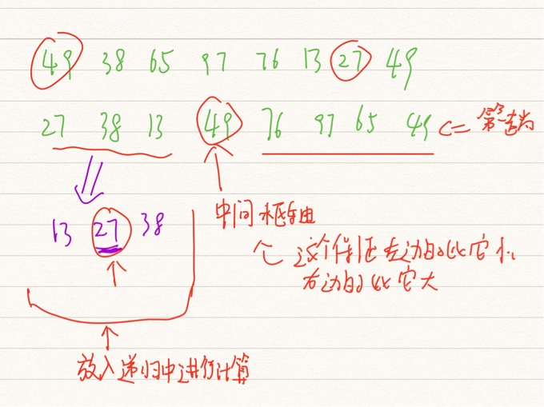

> 实际代码

```go
// 快速排序-返回枢纽位置并进行排序，传入一个low指针，一个high指针，然后给数组进行简单排序
// 这里我们的数组排序好后返回一个中间位置的指针
func partition(arr []int,low int,high int) int {
	// 一般情况下我们直接取low点作为枢纽，然后我们就要进行排序，把比low小的排左边，比low大的排右边
	tmp:=arr[low]
	// 当low大于high时我们的排序就已经好了,这个时候其实low就是high同时这个值为我们的枢纽
	for low < high {
		// 首先我们从high哪里往左遍历，找出第一个比tmp小的点
		for low < high && arr[high] >= tmp {
			high --
		}
		// 找到这个比tmp小的点后我们就替换过去，这个时候我们的high其实留了一个空
		arr[low] = arr[high]
		// 因为上面high有一个空，所以这时候我们就可以从low指针开始出发，找到一个比tmp大的
		for low < high && arr[low] <= tmp {
			low ++
		}
		// 找到后我们就可以替换了，这个时候我们就把high给替换了，此时low就没用了
		// 然后我们就可以进行下一轮比较了，然后我们可以继续把比tmp小的点放到low这里
		arr[high] = arr[low]
	}
	// fmt.Println(low,high)
	// 最后替换完后，low和high其实就指向同一个位置了，这时我们就可以把low换成tmp了
	arr[low] = tmp
	// 返回low指针
	return low
}

// 快速排序
// 时间复杂度 nlogn 这东西推导比较复杂
// 具体参考 https://www.zhihu.com/question/22393997
// 空间复杂度 最好情况nlogn（注意这个log以2为底），最坏情况就是n
func quickSort(arr []int,low int,high int)  {
	// 这里也要判断，要不然会堆栈溢出
	if low < high {
		// 给数组进行简单排序，同时留下一个mid位置的指针
		mid:=partition(arr,low,high)
		// 这里我们使用递归来分别递归左右两部分
		quickSort(arr,low,mid-1)
		quickSort(arr,mid+1,high)
	}
}
```

> 算法特点

(1)记录非顺次的移动导致排序方法是不稳定的。

(2)排序过程中需要定位表的下界和上界，所以适合用于顺序结构，很难用于链式结构。

(3)当n较大时，在平均情况下快速排序是所有内部排序方法中速度最快的一种，所以其适合初始记录无序、n较大时的情况。

# 选择排序

选择排序的基本思想是：每一趟从待排序的记录中选出关键字最小的记录，按顺序放在已排序的记录序列的最后，直到全部排完为止。本节首先介绍一种简单选择排序方法，然后给出另一种改进的选择排序方法——堆排序。

## 简单选择排序

> 代码实现

```go 
// 选择排序
// 时间复杂度 n^2 这个很简单，因为是for循环嵌套
// 空间复杂度为1 
func selectSort(arr []int){
	j:=0
	for i := 0; i < len(arr); i++ {
		// 记录最小值的位置
		min:=i
		// 找出最小的那个值，这里我们从i开始往后找，找到一个最小的
		for j=i+1;j<len(arr);j++{
			if arr[j] < arr[min]{
				min = j
			}
		}
		// 最小值进行替换一下
		arr[i],arr[min] = arr[min],arr[i]
	}
}
```

> 算法原理

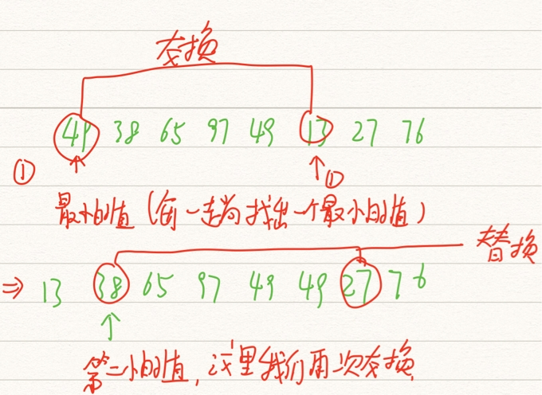

> 算法特点

(1)就选择排序方法本身来讲，它是一种稳定的排序方法，但图8.6所表现出来的现象是不稳定的，这是因为上述实现选择排序的算法采用“交换记录”的策略所造成的，改变这个策略，可以写出不产生“不稳定现象”的选择排序算法。

(2)可用于链式存储结构。

(3)移动记录次数较少，当每一记录占用的空间较多时，此方法比直接插入排序快。

## 堆排序

堆排序(HeapSort) 是一种树形选择排序， 在排序过程中， 将待排序的记录[.] 看成是一根完全二叉树的顺序存储结构、利用完全二叉树中双亲结点和孩子结点之间的内在关系、在当前无序的序列中选择关键字最大(或最小)的记录。

> 堆的定义

堆要满足下面这样的条件

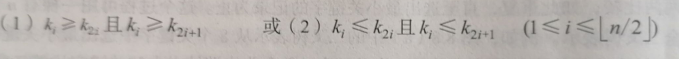

堆可以看成完全二叉树

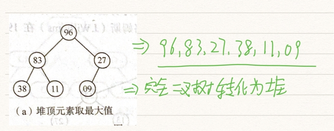

> 堆排序的步骤

首先需要建初堆，建初堆的目的是将无序序列调整为堆，然后我们不断交换堆顶和堆最后一个元素，然后重新调整堆

筛选法调整堆的算法步骤如下

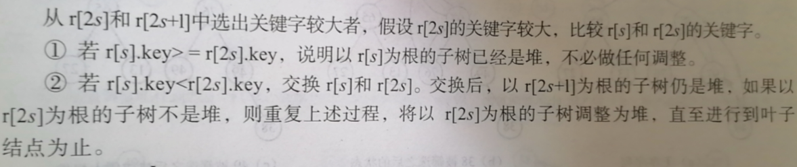

建初堆的步骤如下

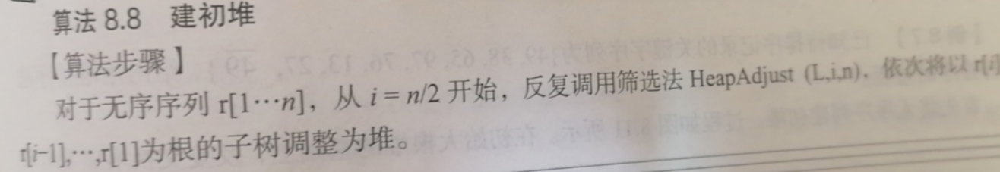

> 实际代码

```go
// 调整堆
func HeapAdjust(arr []int,s int,m int){
   rc:=arr[s]
   // 我们使用筛选法来调整堆
   for j:=2*s;j<=m;j*=2{
      if j<m && arr[j]<arr[j+1]{ j++ }
      if rc >= arr[j] { break}
      arr[s] = arr[j]
      s=j
   }
   arr[s] = rc
}

// 建初堆
func CreatHeap(arr []int)  {
   // 这里我们使用筛选法来建初堆，我们依次把、[n/2],[n/2]-1,....,1的节点都调整为堆即可
   n := len(arr) - 1
   for i :=n/2;i>=0;i--{
      HeapAdjust(arr,i,n)
   }
}

// 堆排序
func HeapSort(arr []int) {
   // 先建堆
   CreatHeap(arr)
   // 开始进行for循环
   for i:=len(arr)-1;i>0;i--{
      arr[0],arr[i] = arr[i],arr[0]
      HeapAdjust(arr,0,i-1)
   }
}

// 主函数
func main()  {
   arr:=[]int{49,38,65,97,49,13,27,76}
   HeapSort(arr)
   fmt.Println(arr)
}
```

> 算法原理

其实是利用了堆里面首部元素最大的特点

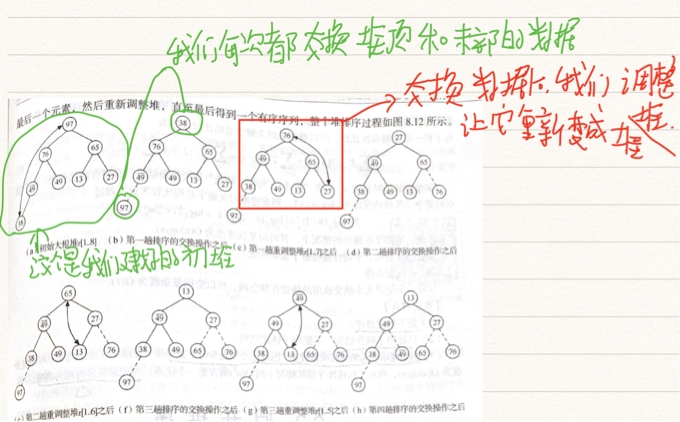

## 归并排序

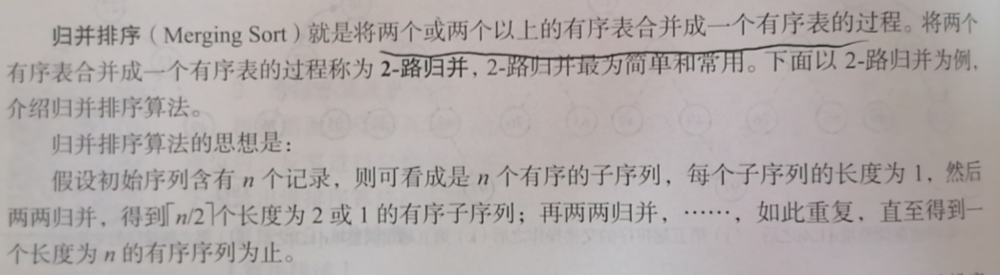

> 实际代码

```go
// 合并表
func Merge(arr1 []int,arr2 []int,low int,mid int,high int){
	i:=low;j:=mid+1;k:=low
	// 这里我们把arr1[low...mid]和 arr1[mid+1...high] 归并排序后放入 arr2[low...high]
	for i<= mid && j <= high {
		// 当arr1的记录由小到大的并入arr2中
		if arr1[i] <= arr1[j] {
			arr2[k] = arr1[i];k++;i++
		} else {
			arr2[k] = arr1[j];k++;j++
		}
	}
	// 把剩余的R[i...mid]复制到T中
	for i<=mid { arr2[k] = arr1[i];k++;i++  }
	// 把剩余的R[j...high]复制到T中
	for j<=high { arr2[k] = arr1[j];k++;j++  }
}

// 2-路归并排序
func MSort(arr1 []int,arr2 []int,low int,high int)  {
	if low == high {
		// 当low等于high的时候，我们把arr2的值放入arr1中
		arr2[low] = arr1[low]
	} else {
		// 求出中间值
		mid := (low+high) / 2
		arr3:= make([]int,high+1)
		// 对arr1[low..mid]进行排序，结果放入arr3[low...mid]中
		MSort(arr1,arr3,low,mid)
		// 对arr1[mid+1..high]进行排序，结果放入arr3[mid+1...high]中
		MSort(arr1,arr3,mid + 1,high)
		// 把arr3[low...mid] 和 arr3[mid+1...high] 归并到 arr2[low...high]中
		Merge(arr3,arr2,low,mid,high)
	}
}

// 归并排序
func MergeSort(arr []int)  {
	// 开始进行归并排序
	MSort(arr,arr,0,len(arr)-1)
}

// 主函数
func main()  {
	arr:=[]int{49,38,65,97,49,13,27,76}
	MergeSort(arr)
	fmt.Println(arr)
}
```

