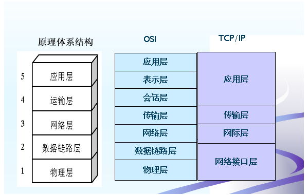
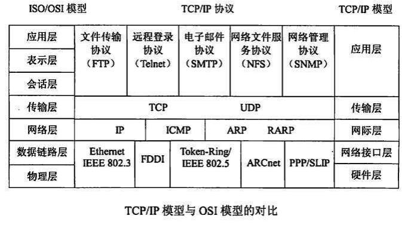

# 计算机网络体系结构

## 常见协议介绍

- 应用层：常见协议：
  - FTP(21端口)：文件传输协议
  - SSH(22端口)：远程登陆
  - TELNET(23端口)：远程登录
  - SMTP(25端口)：发送邮件
  - POP3(110端口)：接收邮件
  - HTTP(80端口)：超文本传输协议
  - DNS(53端口)：运行在UDP上，域名解析服务
- 传输层：TCP/UDP
- 网络层：IP、ARP、NAT、RIP...

## 常见问题说明

### 路由器和交换机分别位于那一层

- 路由器工作在网络层，根据IP地址进行寻址；
- 交换机数据链路层，根据MAC地址进行寻址

