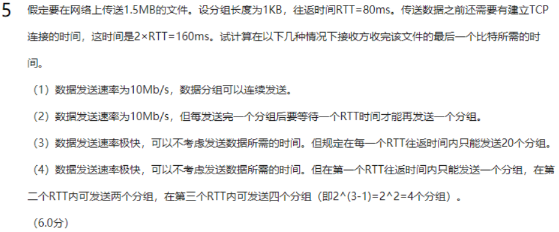

# 网络性能计算

## 利用率

## 比特发送时间

注意

1.这个发送文件的单位和发送速率的单位是不一样的，自己注意适当转换

2.这个传播时间包括TCP建立时间2*RTT，数据发送时间+传播时间（也就是最后一个分组发送的时间）

## 网络协议三要素

语法，语义，同步 P29

（1）语法：即数据与控制信息的结构或格式。

（2）语义：即需要发出何种控制信息，完成何种动作以及做出何种响应。

（3）同步：即事件实现顺序的详细说明。

## 互联网两大组成部分

## 协议和服务的区别

