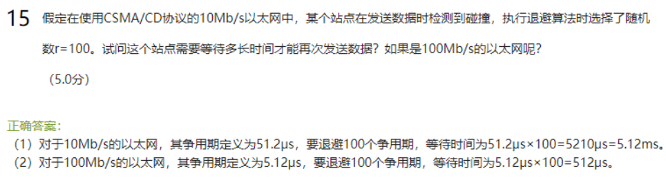

# 硬件层分为物理层和数据链路层

物理层的功能：比特流、屏蔽媒体差异、物理连接

# 物理层

## 三种通信方式

通信的三种基本方式：单工、半双工、双工 P43

## 物理层的几大特性

（1） 机械特性：指明接口所用接线器的形状和尺寸、引线数目和排列、固定和锁定装置等。

（2）电气特性：指明在接口电缆的各条线上出现的电压的范围。

（3）功能特性，指明某条线上出现的某一电平的电压的意义。

（4）过程特性：指明对于不同功能的各种可能事件的出现顺序

## 信道复用技术

频分复用、时分复用、统计时分复用、波分复用和码分复用

## 奈氏准则

## 香农公式

## 频带宽度

# 数据链路层

## 三个基本问题

## CRC差错检测

注意这个1001是根据多项式来生成的，因为x^3+1可以知道x的三次方和一次方为1，所以第三位和第0位为1，所以结果就是1001.然后这个因为最高位为三，所以我们的冗余码n就是3，最后要除数就是在发送数据补三个0.

注意这个除法运算

## CSMA/CD协议及其要点

CSMA/CD协议采用“先听后说，边说边听”机制，在网络负荷较轻时，协议灵活，利用率高；在网络负荷很重时，冲突加剧，效率下降。

## 碰撞

## CSMA争用期计算

注意这个争用期是事先定义好的，r就是退避的时间

## 最短帧长计算

注意这个传播时延要+2

## 以太网交换机

1.以太网交换机根据mac地址来转发数据包

2.以太网交换机组成的是广播域，但不是碰撞域

## 以太网交换机和集线器的区别

## 交换表

数据发送的时候，可以记下每台发送主机所在的接口号

## 数据链路层功能

1）链路控制的主要功能有：链路管理、封装成帧；透明传输；流量控制、差错检测、寻址等。

2）可靠的链路层的优点：可以使网络中的某个结点及早发现传输中出了差错，因而可以通过数据链路层的重传来纠正这个差错。对于干扰严重的信道，可靠的链路层可以将重传范围约束在局部链路，防止全网络的传输效率受损。缺点：有时高层协议使用的是不可靠的传输协议UDP。UDP并不要求重传有差错的数据，在这种情况下，如果做成可靠地数据链路层，那么并不会带来更多的好处。反而会增大资源开销，影响传输效率。

这三个问题为什么必须要加以解决？

封装成帧是分组交换的必然要求；透明传输是避免二进制比特流中出现与帧定界符相同的模式，使得节点错误识别帧；差错检测是为了避免接收到错误的信息和防止信道中出现的无效数据帧浪费后续路由上的传输和处理资源。

## PPP协议

