## TCP的三次握手

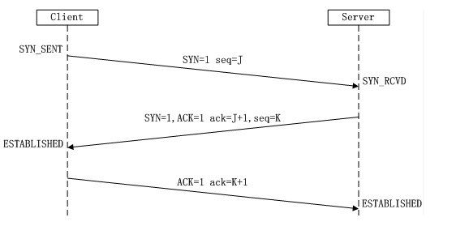

- 第一次握手：Client将SYN置1，随机产生一个初始序列号seq发送给Server，进入SYN_SENT状态；
- 第二次握手：Server收到Client的SYN=1之后，知道客户端请求建立连接，将自己的SYN置1，ACK置1，产生一个acknowledge number=sequence number+1，并随机产生一个自己的初始序列号，发送给客户端；进入SYN_RCVD状态；
- 第三次握手：客户端检查acknowledge number是否为序列号+1，ACK是否为1，检查正确之后将自己的ACK置为1，产生一个acknowledge number=服务器发的序列号+1，发送给服务器；进入ESTABLISHED状态；服务器检查ACK为1和acknowledge number为序列号+1之后，也进入ESTABLISHED状态；完成三次握手，连接建立。

### 问题1 TCP可以建立两次握手嘛

不可以。有两个原因：首先，可能会出现**已失效的连接请求报文段又传到了服务器端**。

> client 发出的第一个连接请求报文段并没有丢失，而是在某个网络结点长时间的滞留了，以致延误到连接释放以后的某个时间才到达 server。本来这是一个早已失效的报文段。但 server 收到此失效的连接请求报文段后，就误认为是 client 再次发出的一个新的连接请求。于是就向 client 发出确认报文段，同意建立连接。假设不采用 “三次握手”，那么只要 server 发出确认，新的连接就建立了。由于现在 client 并没有发出建立连接的请求，因此不会理睬 server 的确认，也不会向 server 发送数据。但 server 却以为新的运输连接已经建立，并一直等待 client 发来数据。这样，server 的很多资源就白白浪费掉了。采用 “三次握手” 的办法可以防止上述现象发生。例如刚才那种情况，client 不会向 server 的确认发出确认。server 由于收不到确认，就知道 client 并没有要求建立连接。

其次，两次握手无法保证Client正确接收第二次握手的报文（Server无法确认Client是否收到），也无法保证Client和Server之间成功互换初始序列号。

### 问题2 第三次握手中，如果客户端的ACK未送达服务器，会怎样？

Server端：
由于Server没有收到ACK确认，因此会重发之前的SYN+ACK（默认重发五次，之后自动关闭连接进入CLOSED状态），Client收到后会重新传ACK给Server。

Client端，两种情况：

1. 在Server进行超时重发的过程中，如果Client向服务器发送数据，数据头部的ACK是为1的，所以服务器收到数据之后会读取 ACK number，进入 establish 状态
2. 在Server进入CLOSED状态之后，如果Client向服务器发送数据，服务器会以RST包应答。

### 问题三 如果已经建立了连接，但客户端出现了故障怎么办？

服务器每收到一次客户端的请求后都会重新复位一个计时器，时间通常是设置为2小时，若两小时还没有收到客户端的任何数据，服务器就会发送一个探测报文段，以后每隔75秒钟发送一次。若一连发送10个探测报文仍然没反应，服务器就认为客户端出了故障，接着就关闭连接。

### 问题四 什么是初始序列号

TCP连接的一方A，随机选择一个32位的序列号（Sequence Number）作为发送数据的初始序列号（Initial Sequence Number，ISN），比如为1000，以该序列号为原点，对要传送的数据进行编号：1001、1002...三次握手时，把这个初始序列号传送给另一方B，以便在传输数据时，B可以确认什么样的数据编号是合法的；同时在进行数据传输时，A还可以确认B收到的每一个字节，如果A收到了B的确认编号（acknowledge number）是2001，就说明编号为1001-2000的数据已经被B成功接受。

## TCP的四次挥手

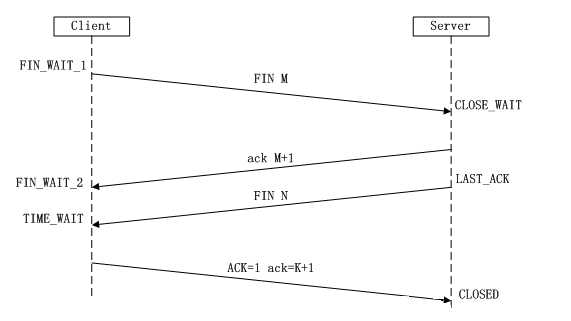

- 第一次挥手：Client将FIN置为1，发送一个序列号seq给Server；进入FIN_WAIT_1状态；
- 第二次挥手：Server收到FIN之后，发送一个ACK=1，acknowledge number=收到的序列号+1；进入CLOSE_WAIT状态。此时客户端已经没有要发送的数据了，但仍可以接受服务器发来的数据。
- 第三次挥手：Server将FIN置1，发送一个序列号给Client；进入LAST_ACK状态；
- 第四次挥手：Client收到服务器的FIN后，进入TIME_WAIT状态；接着将ACK置1，发送一个acknowledge number=序列号+1给服务器；服务器收到后，确认acknowledge number后，变为CLOSED状态，不再向客户端发送数据。客户端等待2*MSL（报文段最长寿命）时间后，也进入CLOSED状态。完成四次挥手。

### 问题1 为什么不能把服务器发送的ACK和FIN合并起来，变成三次挥手（CLOSE_WAIT状态意义是什么）？

因为服务器收到客户端断开连接的请求时，可能还有一些数据没有发完，这时先回复ACK，表示接收到了断开连接的请求。等到数据发完之后再发FIN，断开服务器到客户端的数据传送。

### 如果第二次挥手时服务器的ACK没有送达客户端，会怎样？

客户端没有收到ACK确认，会重新发送FIN请求。

### 客户端TIME_WAIT状态的意义是什么？

第四次挥手时，客户端发送给服务器的ACK有可能丢失，TIME_WAIT状态就是用来重发可能丢失的ACK报文。如果Server没有收到ACK，就会重发FIN，如果Client在2*MSL的时间内收到了FIN，就会重新发送ACK并再次等待2MSL，防止Server没有收到ACK而不断重发FIN。

MSL(Maximum Segment Lifetime)，指一个片段在网络中最大的存活时间，2MSL就是一个发送和一个回复所需的最大时间。如果直到2MSL，Client都没有再次收到FIN，那么Client推断ACK已经被成功接收，则结束TCP连接。

## 三次握手和四次挥手的介绍

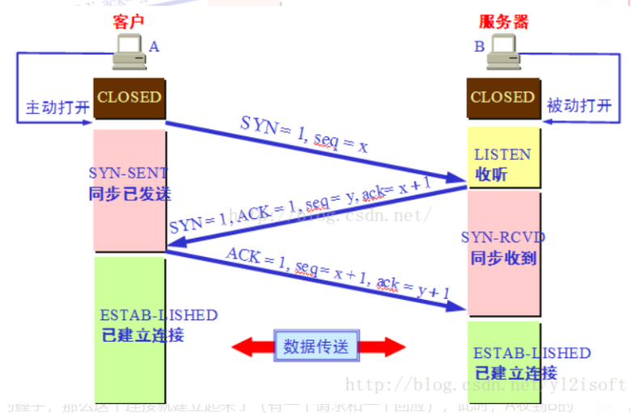

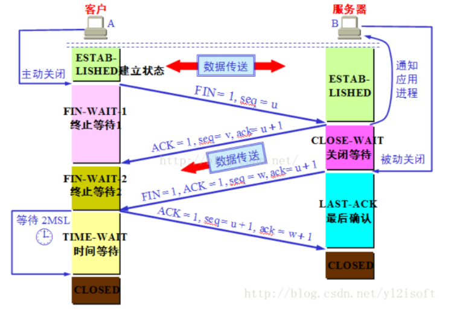

## TCP如何实现流量控制

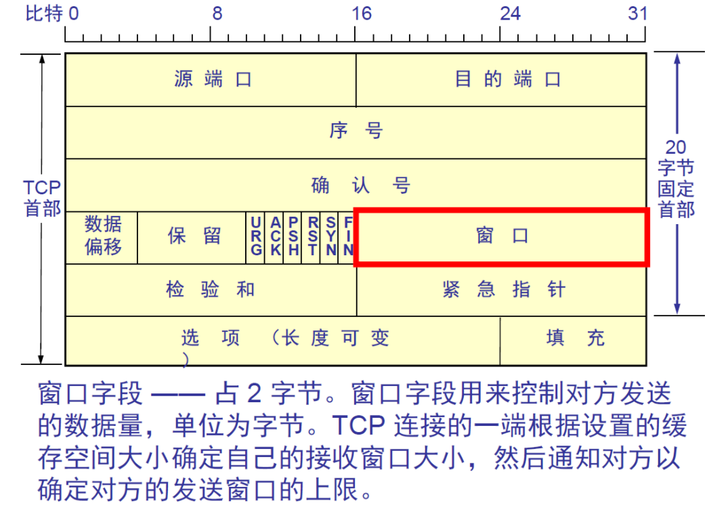

使用滑动窗口协议实现流量控制。防止发送方发送速率太快，接收方缓存区不够导致溢出。接收方会维护一个接收窗口 receiver window（窗口大小单位是字节），接受窗口的大小是根据自己的资源情况动态调整的，在返回ACK时将接受窗口大小放在TCP报文中的窗口字段告知发送方。发送窗口的大小不能超过接受窗口的大小，只有当发送方发送并收到确认之后，才能将发送窗口右移。

发送窗口的上限为接受窗口和拥塞窗口中的较小值。接受窗口表明了接收方的接收能力，拥塞窗口表明了网络的传送能力。

### 问题1 什么是零窗口（接收窗口设为0）

如果接收方没有能力接收数据，就会将接收窗口设置为0，这时发送方必须暂停发送数据，但是会启动一个持续计时器(persistence timer)，到期后发送一个大小为1字节的探测数据包，以查看接收窗口状态。如果接收方能够接收数据，就会在返回的报文中更新接收窗口大小，恢复数据传送。

## TCP阻塞控制

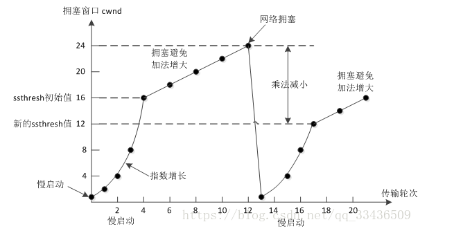

拥塞控制主要由四个算法组成：**慢启动（Slow Start）、拥塞避免（Congestion voidance）、快重传 （Fast Retransmit）、快恢复（Fast Recovery）**

## TCP和UDP的区别

1. TCP是面向连接的，UDP是无连接的（无连接就是UDP发送数据之前不需要建立连接）
2. TCP是可靠的，UDP是不可靠的（不可靠就是UDP接收方收到报文后，不需要给出任何确认）
3. TCP只支持点对点通信，UDP支持一对一、一对多、多对一、多对多；
4. TCP是面向字节流的，UDP是面向报文的；（面向字节流是指发送数据时以字节为单位，一个数据包可以拆分成若干组进行发送，而UDP一个报文只能一次发完。）
5. TCP有拥塞控制机制，UDP没有。网络出现的拥塞不会使源主机的发送速率降低，这对某些实时应用是很重要的，比如媒体通信，游戏；
6. TCP首部开销（20字节）比UDP首部开销（8字节）要大
7. UDP 的主机不需要维持复杂的连接状态表

### 问题1 什么时候选择TCP什么时候选择UDP

对某些实时性要求比较高的情况，选择UDP，比如游戏，媒体通信，实时视频流（直播），即使出现传输错误也可以容忍；其它大部分情况下，HTTP都是用TCP，因为要求传输的内容可靠，不出现丢失

HTTP不能选择UDP，因为HTTP需要基于可靠的传输协议，而UDP不可靠

### 问题2 面向连接和无连接的区别

无连接的网络服务（数据报服务）-- 面向连接的网络服务（虚电路服务）

虚电路服务：首先建立连接，所有的数据包经过相同的路径，服务质量有较好的保证；

数据报服务：每个数据包含目的地址，数据路由相互独立（路径可能变化）；网络尽最大努力交付数据，但不保证不丢失、不保证先后顺序、不保证在时限内交付；网络发生拥塞时，可能会将一些分组丢弃；

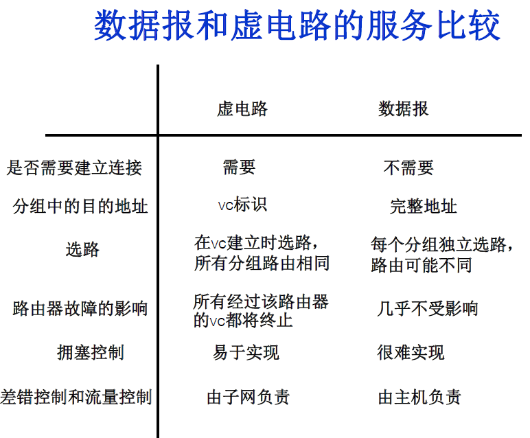

### 问题三 TCP如何保证传输的可靠

1. 数据包校验
2. 对失序数据包重新排序（TCP报文具有序列号）
3. 丢弃重复数据
4. 应答机制：接收方收到数据之后，会发送一个确认（通常延迟几分之一秒）；
5. 超时重发：发送方发出数据之后，启动一个定时器，超时未收到接收方的确认，则重新发送这个数据；
6. 流量控制：确保接收端能够接收发送方的数据而不会缓冲区溢出

# TCP

## TCP和UDP的区别

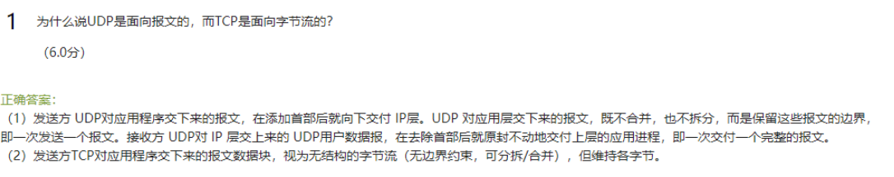

## TCP报文端

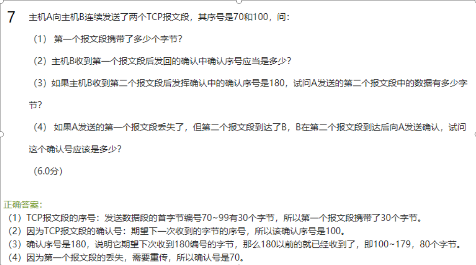

> 注意

这个序号是开始的序号，不是结束的序号

确认序号就是下次需要接收的序号

报文丢失的话需要重传

## TCP序号绕回

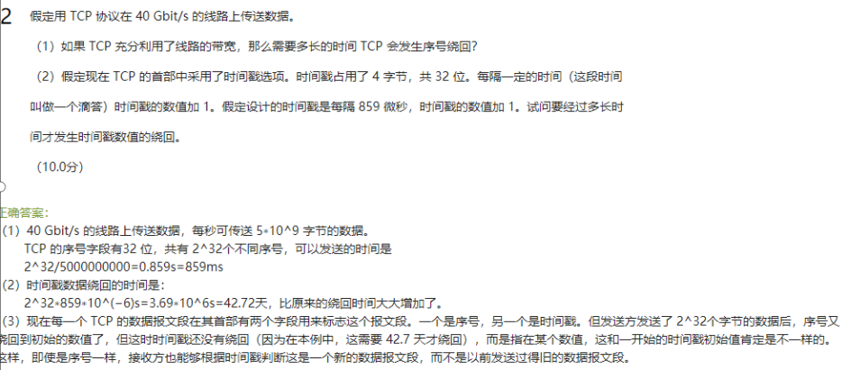

1.因为TCP序号段有4个字节，我们假设每次发送一个字节的数据

## TCP拥塞控制

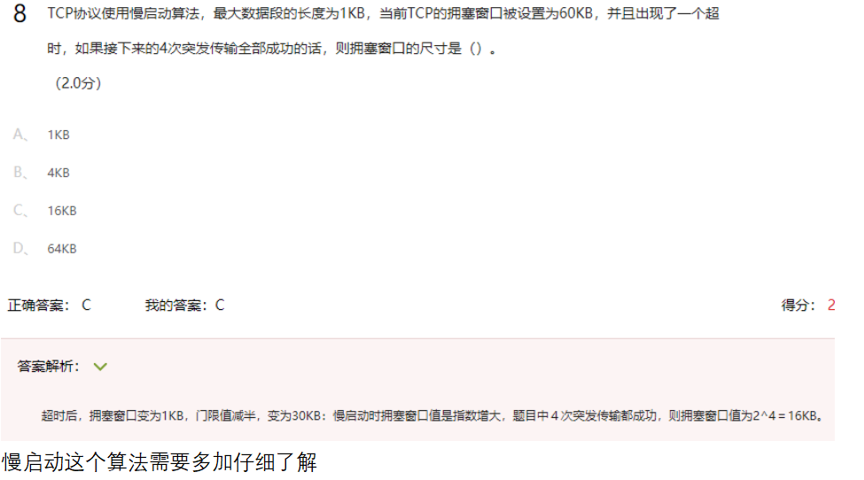

## TCP的连接管理

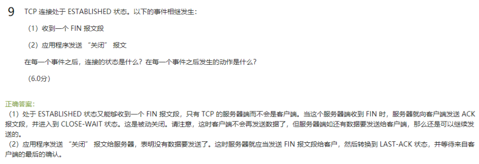

# UDP

UDP首部只有8个字节，书上的那12字节是伪首部（这个首部只用于计算校验和）

## UDP数据报

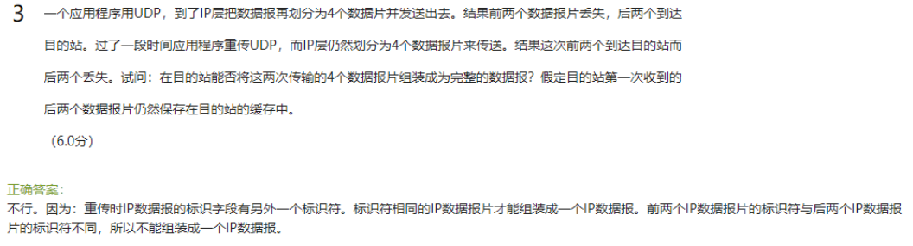

## UDP数据报需要封装成IP数据报

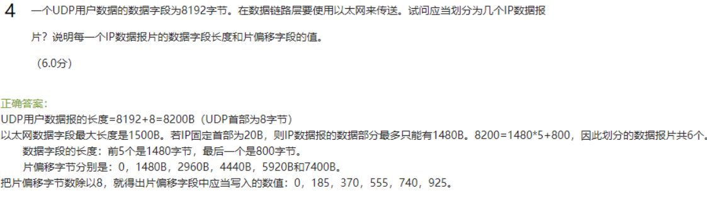

注意：

1. 以太网的最大数据发送长度为1500

2. IP数据报的固定长度为20，所以实际的发送数据只有1480B，然后我们可以依次划分数据

## UDP头部解析

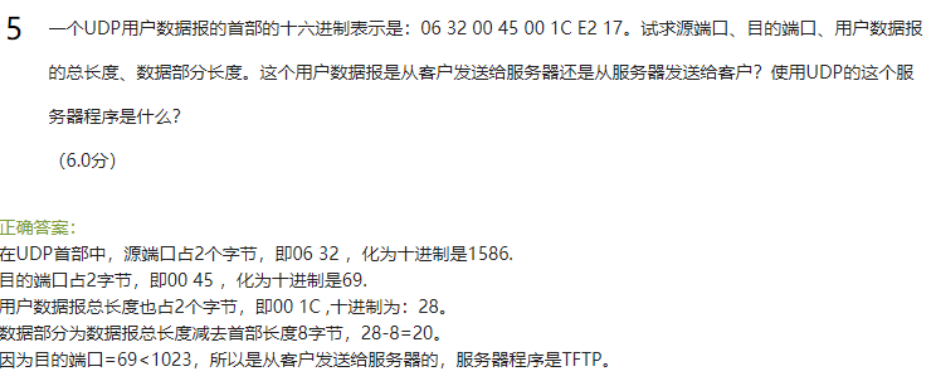

# ARQ协议

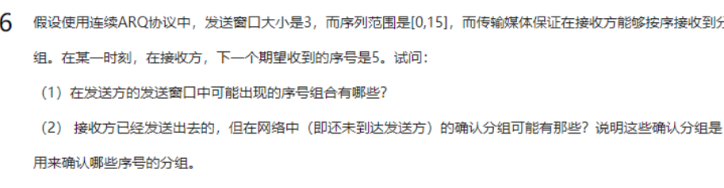