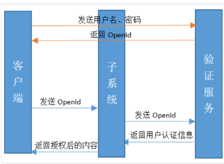
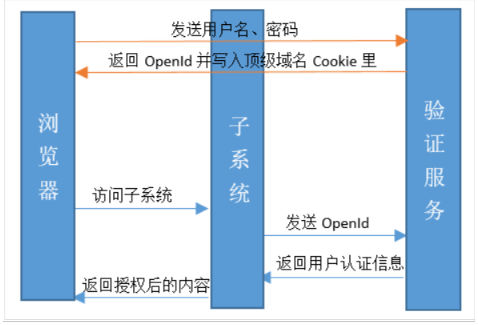

## 单点登录

单点登录也叫SSO，是比较流行的企业业务整合的解决方案之一。SSO的定义是在多个[应用](https://baike.baidu.com/item/应用/3994271)系统中，用户只需要登录一次就可以访问所有相互信任的应用系统。常见的单点登录的解决方案：

### 1.共享Session

一般都是通过redis来实现的，通过redis来存储session数据，然后多个应用之间进行数据共享

### 2.基于openid的单点登录

这种单点登录将用户的身份标识信息简化为OpenId存放于客户端，当用户登录某个子系统时，将OpenId传送到服务端，服务端根据OpenId构造用户验证信息，多用于C/S与B/S相结合的系统，流程如下：

### 3.基于Cookie的OpenId存储方案

我们知道，Cookie的作用在于充当一个信息载体在Server端和Browser端进行信息传递，而Cookie一般是以域名为分割的，例如a.xxx.com与b.xxx.com的Cookie是不能互相访问的，但是子域名是可以访问上级域名的Cookie的。即a.xxx.com和b.xxx.com是可以访问xxx.com下的Cookie的，于是就能将顶级域名的Cookie作为OpenId的载体。

## JWT

Json web token (JWT), 是为了在网络应用环境间传递声明而执行的一种基于JSON的开放标准（[(RFC 7519](https://link.jianshu.com/?t=https://tools.ietf.org/html/rfc7519)).该token被设计为紧凑且安全的，特别适用于分布式站点的单点登录（SSO）场景。JWT的声明一般被用来在身份提供者和服务提供者间传递被认证的用户身份信息，以便于从资源服务器获取资源，也可以增加一些额外的其它业务逻辑所必须的声明信息，该token也可直接被用于认证，也可被加密。

包括三部分：

常见的加密算法有**HMAC**和**RSA**算法