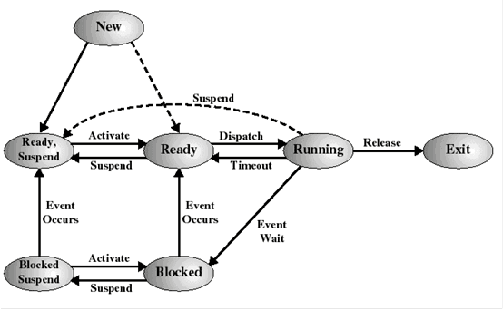
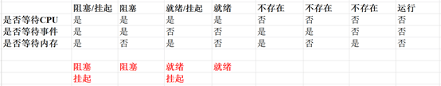
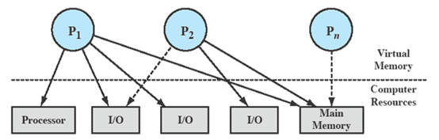
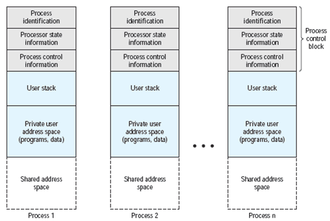
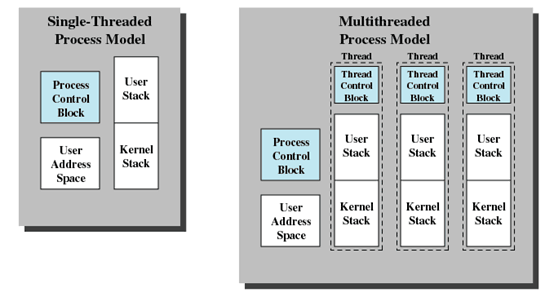
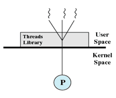
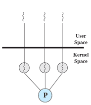
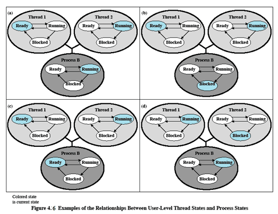
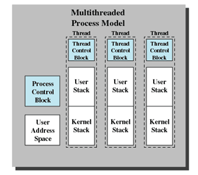

# 进程和线程的区别

- 进程（Process）是系统进行资源分配和调度的基本单位，线程（Thread）是CPU调度和分派的基本单位；
- 线程依赖于进程而存在，一个进程至少有一个线程；
- 进程有自己的独立地址空间，线程共享所属进程的地址空间；
- 进程是拥有系统资源的一个独立单位，而线程自己基本上不拥有系统资源，只拥有一点在运行中必不可少的资源(如程序计数器,一组寄存器和栈)，和其他线程共享本进程的相关资源如内存、I/O、cpu等；
- 在进程切换时，涉及到整个当前进程CPU环境的保存环境的设置以及新被调度运行的CPU环境的设置，而线程切换只需保存和设置少量的寄存器的内容，并不涉及存储器管理方面的操作，可见，进程切换的开销远大于线程切换的开销；
- 线程之间的通信更方便，同一进程下的线程共享全局变量等数据，而进程之间的通信需要以进程间通信(IPC)的方式进行；
- 多线程程序只要有一个线程崩溃，整个程序就崩溃了，但多进程程序中一个进程崩溃并不会对其它进程造成影响，因为进程有自己的独立地址空间，因此多进程更加健壮

### 问题1 同一进程中线程可以共享那些数据

- 进程代码段
- 进程的公有数据（全局变量、静态变量...）
- 进程打开的文件描述符
- 进程的当前目录
- 信号处理器/信号处理函数：对收到的信号的处理方式
- 进程ID与进程组ID

### 问题2 线程独占那些资源

- 线程ID
- 一组寄存器的值
- 线程自身的栈（堆是共享的）
- 错误返回码：线程可能会产生不同的错误返回码，一个线程的错误返回码不应该被其它线程修改；
- 信号掩码/信号屏蔽字(Signal mask)：表示是否屏蔽/阻塞相应的信号（SIGKILL,SIGSTOP除外）

## 进程有哪几种状态

- 就绪状态：进程已获得除处理机以外的所需资源，等待分配处理机资源
- 运行状态：占用处理机资源运行，处于此状态的进程数小于等于CPU数
- 阻塞状态： 进程等待某种条件，在条件满足之前无法执行

## 程序与进程的关系

程序是指令的有序集合，其本身没有任何运行的含义，是一个静态的概念。而进程是程序在处理机上的一次执行过程，它是一个动态的概念

程序可以作为一种软件资料长期存在，而进程是有一定生命期的。程序是永久的，进程是暂时的

进程更能真实地描述并发，而程序不能

进程是由程序和数据、进程控制块等组成的

进程具有创建其他进程的功能，而程序没有

同一程序同时运行于若干个数据集合上，它将属于若干个不同的进程。也就是说同一程序可以对应多个进程

# 七状态模型

1、空→新建：创建执行一个程序的新进程

2、新建→就绪：OS准备好再接纳一个进程时，为其分配资源

3、就绪→运行：从就绪进程表中选择一个进程进入运行态

4、运行→退出：进程完成或取消

5、运行→就绪：运行的进程到达了“允许不中断执行”的最大时间（时间片）或高优先级进程从阻塞状态变为就绪（抢占）

6、运行→阻塞：进程请求的事件未出现，如I/O未完成

7、阻塞→就绪：当所等待的事件发生时，如I/O完成，申请资源成功等

8、就绪/阻塞→退出：父进程终止一个子进程，或者父进程终止导致相关的所有子进程终止

因为现在竞争的有3中资源：CPU、IO、内存， 按照是否占有，理论上有多少种状态？ 2^3，应该有8种
只是不存在占有CPU，等待另外两种的情况， 这四种分别对应了：就绪/挂起、阻塞/挂起、就绪/没挂起、阻塞/没挂起（阻塞 没io   挂起 没内存）

（1）阻塞 --> 阻塞/挂起：当所有进程都阻塞，为了新进程（或处于就绪/挂起状态的进程）能进入内存，需要将某个阻塞的进程移出内存时

（2）阻塞/挂起 --> 就绪/挂起：当等待的事件发生时

（3）就绪/挂起 --> 就绪：当内存中没有就绪进程时

（4）就绪 --> 就绪/挂起（较少见）：当没有被阻塞的进程，而为了性能上的考虑，必须释放一些内存时

## 课后作业1

状态5,6,7不存在，8是运行状态

等待I/O和内存是独立的：

（1）如果进程在等待事件，则处于阻塞态，否则处于就绪态，

（2）如果进程在等待内存，则处于挂起态（不存在“非挂起”态）。进程占用CPU的前提是I/O和内存的需求都已经得到满足。因此，状态5、6、7不存在；状态8是运行。 都分到cpu了，还不运行？新建不会等事件啊， 它还没进内存呢，所以没有新建。

操作系统对资源的管理

在上图中，实线表示占用，虚线表示等待。请大家说说以上三个进程分别处于什么状态？
可知：P1：正在运行，至少一部分在主存中，控制着两个I/O设备P2：被阻塞，正在等待分配给P1的I/O设备Pn：已经被换出，处于挂起状态

## 进程映像

进程映像”（process image）的定义。
1）进程映像是程序、数据、栈和属性的集合。

2）进程映像的位置依赖于使用的存储管理方案，进程表中包含一个指向进程映像的指针。

在（1）中，“进程映像是程序、数据、栈和属性的集合”。程序、数据、栈都好理解，那么什么是属性的集合？ 其实就是PCB。后面会详细介绍。

## PCB 进程控制块 

好，我们来看这pcb的三类信息。

（1）标识号是存储在PCB中的数字标识号，包括：进程标识号（简称进程ID）、创建这个进程的进程（父进程）的标识号、用户标识号（简称用户ID）。

（2）状态信息包括用户可见寄存器、控制和状态寄存器、栈指针。很复杂，大家看书了吗？

（3）控制信息包括：调度和状态信息（优先级情况、在等待的事件等）、链接关系（比如父进程是谁）、存储信息（位置）、资源的所有权和使用情况等

进程映像由下面这几部分组成：

上面是PCB，接下来是用户栈、私有用户地址空间、共享地址空间

# CPU执行模式

有些指令是特权指令，不能由用户进程随意调用，否则安全性得不到保证，所以操作系统将CPU执行模式分为“用户模式”和“内核模式”。

（1）用户模式是一种特权较少的模式，用户程序通常在该模式下运行。

（2）内核模式也叫系统模式或控制模式，是一种特权较多的模式，操作系统内核通常在该模式下运行。

打个比方，用户进程要修改自己的优先级，它应该怎么办？ 它提要求，调用系统功能，切换到内核模式，由操作系统内核来判断是否可以修改。如果可以，操作系统内核来修改。这样就安全多了。

## 进程切换和模式切换

如何区分进程切换和模式切换？用我们前面举过的例子来理解：进程修改自己的优先级，要进行什么切换啊？ 对，模式切换。为什么要从用户态切换到内核态啊？ 因为要使用一些只能由操作系统内核来执行的特权指令。模式切换不一定引起进程切换。

那么进程切换会不会引起模式切换呢？ 如果进程需要调用的系统服务是某个系统进程提供的，那么就会进行进程切换。保存现场需要将CPU的状态和进程的中间结果写进PCB。大家想想，这些操作能不能由进程自己来做？答案是不行，否则进程在这个过程中随便修改点啥（比如自己的优先级），出问题怎么办？ 所以，进程切换过程中的某些操作必须由内核来完成，这也是为什么要进行模式切换的原因

## 进程控制原语

原语，可能由一组操作构成，之所谓称为原语，表示这些操作要么全部执行，要不都不执行，不能执行一部分，否则结果会出问题。 打个比方，你去ATM机取钱，可能的步骤包括：读取余额、吐钱、写回余额。如果只执行了前两条，结果会怎样？原语的作用就是避免这种情况的出现。

操作系统中的进程控制原语包括：Process Switch，进程切换Create and Terminate，创建与终止Block and Wakeup，阻塞与唤醒Suspend and Activate，挂起与激活

# 线程

## 为什么需要线程

那么为什么要引入线程呢？进程不是挺好的吗？ 我们知道，在操作系统中，进程的引入提高了计算机资源的利用效率。这点好理解，因为多个进程竞争使用资源（比如CPU），可以提高资源的利用率。 但在进一步提高进程的并发性时，人们发现进程切换开销占的比重越来越大，同时进程间通信的效率也受到限制。线程的引入正是为了以小的开销来提高进程内的并发程度，并简化进程间的通信。

什么情况下需要引入进程。 可能包含：主程序、收消息模块、发消息模块，对吧？大家来想想，对于收消息模块，它是不是需要一直运行？ 它的模式是：监听端口，等待，消息到，送到主程序（用来显示），然后接着等待。发消息模块也类似。 那么问题来了，如果整个程序是一个进程，那么进程就会阻塞在收消息模块（或者发消息模块）。为什么？ 代码只能顺序执行，进程在等待消息达到这个事件。 从而阻塞了

可见，如果只用一个进程，这个程序无法正常运行。 可以由主程序（进程）创建两个线程，一个负责收消息，一个负责发消息，这样就不会出现阻塞整个进程的情况了。有同学可能会说，那我可以再创建两个进程啊。 的确，但是这三个进程之间共享资源、进行通信，就会很麻烦。可以派生进程，但是不能直接管理 只能通过消息的方式传播信息 效率很低，代价很大

## 线程的性质

既然线程是调度的单位，根据我们对进程管理的理解，线程应该有如下性质：

（1）有执行状态（运行、就绪等）

（2）不运行时保存上下文

（3）有一个执行栈

（4）有一些局部变量的静态存储空间

（5）可存取所在进程的内存和其他资源

（6）可以创建、撤消另一个线程

1-4点好理解，是跟执行相关的 第5点表示线程共享进程的资源 第6点没什么好说的，并发的需要

## 进程和线程结构上的区别

左边是单线程进程模型（也可以认为就是进程），右边是多线程进程模型，一个进程包含多个线程。大家看看线程的结构，每个线程都有一个TCB（线程控制块）。从大小来说，TCB比PCB小，而且线程可以共享用户地址空间中的内容。 大家回忆一下，用户地址空间中都有啥？ 对，程序和数据。

## 线程的优点

（1）在已有进程中创建一个新线程比创建一个全新进程所需的时间少

（2）终止一个线程比终止一个进程花费的时间少

（3）线程间切换比进程间切换花费的时间少

（4）由于在同一个进程中的线程共享存储空间和文件，它们无需调用内核就可以互相通信

# 线程分类

（1）用户级线程（ULT）

（2）内核级线程（KLT）

ULT和KLT是哪几个单词的缩写？ user level thread  Kernel Level Thread

大家猜猜，哪个是ULT？ 没错，第一个。那么这两个图是什么意思呢？ 顾名思义，ULT：在用户这一级的线程；KLT：在内核这一级的线程。层次不一样。

我们先来看ult 在这个图中，有一个线程库，在用户空间中（不在操作系统内核中）。它提供线程运行管理的功能，包括（1）创建、撤销线程（2）在线程之间传递消息和数据（3）调度线程执行（4）保护和恢复线程上下文
注意到，这里的线程是指用户级线程。调度、保护和恢复线程上下文等都由应用程序（在线程库中）来完成，不是CPU相关的调度和上下文。

## ULT与所在进程状态之间的关系

图a好理解，进程占用CPU，线程1就绪，线程2运行蓝色表示当前的状态

图b呢？什么情况？进程明明被阻塞了，线程2怎么可能运行？ 

没错实际情况可能是，线程2发起一个I/O调用，在它看来，数据正在被取回，且自己一直在“运行”状态。 因为它在用户层，看不到实际CPU的情况。可以认为，从调度程序（线程库中的）看，有一个虚拟的处理器。根据调度结果，现在就是线程2在运行。这也是我前面为什么称ult为虚拟线程的原因 至于内核层，进程发起I/O调用，自然要阻塞。

图c和d，可能是什么情况？线程库怎么不改他的状态？ 线程库看不到cpu的状态啊 这些是操作系统内核才能看到的信息 ult使用虚拟cpu，这个能理解吗？线程库认为，自己有一个CPU 实际上线程被阻塞了，只是线程库认为他还在运行吗（正确）
图c：进程用完了时间片，进入就绪态

图d：线程2需要线程1执行某个动作（比如等线程1的运行结果），所以阻塞

**在用户级线程，线程的状态跟进程是无关的。 这点一定要理解！**

## ULT的优点：

（1）线程切换不调用核心（因为通过应用程序来实现），没有模式切换（2）调度是应用程序特定的，可以选择最好的算法（3）ULT可运行在任何操作系统上（只需要线程库），可以在一个不支持线程的操作系统上实现

好比java虚拟机，它会虚拟出一个cpu 这个cpu跟实际的cpu有关系吗？没有直接关系

## ULT的缺点：

（1）大多数系统调用是阻塞的，因此核心阻塞进程，故进程中所有线程“实际上”将被阻塞（状态上不一定，比如上图的图b）（2）核心只将一个处理器分配给进程，在多CPU情况下，同一进程中的两个线程不能同时运行于两个处理器上

## 内核级线程

内核级线程也叫：（1）内核支持的线程（2）轻量级进程比较符合我们心目中线程的定义。

KLT让内核感知线程的存在：（1）内核为进程以及进程中的各个线程保存上下文环境信息（2）线程之间的切换需要内核来支持（3）调度是由内核基于线程来完成的（4）没有线程库，但对核心线程工具提供API（比如创建、撤销线程）Windwos、Linux、OS/2都有这种线程例子

## KLT的优点

（1）对多处理器，内核可以同时调度同一进程的多个线程（2）阻塞是在线程一级完成，进程中一个线程被阻塞，内核可以调度同一进程的另一个线程（3）内核例程自身可以是多线程的，因此可以提高效率

什么是例程？-》 例程和程序是一个意思（ 就是操作系统内核这个程序 ）

## KLT的缺点

在同一进程内的线程切换调用内核，导致速度下降

# 复习题

1、当一个进程处于（B  ）状态时，称为就绪状态。

A. 等待输入数据B. 等待调度C. 等待分配进程控制块 D. 等待进入内存

以上分别处于什么状态？A阻塞没错B就绪也没问题C应该是新建之前的状态D是新建或挂起

2、当一个进程处于下述（d  ）状态时，属于阻塞状态。

A. 进程被交换到外存B. 不再有执行资格C. 等待进程调度D. 在内存中等待输入

D是阻塞没错a是挂起 b是exit c是就绪

3、以下关于进程和线程的描述，错误的是（ D  ）。

A. 同一进程内的线程共享进程的资源 B. 线程是独立调度和分派的基本单位C. 不同进程中的线程可以并发D. 应用级线程因系统调用而阻塞，不会引起所在进程的阻塞

注意到，B里面的分派是什么意思？是分派“处理器”，不是分派“资源”。如果有同学没有认真听，可能会误以为是分派资源，一定要弄清楚基本概念。 因为资源分配的单位是进程如果写“B线程是独立调度和分配资源的基本单位”就是错的

4、进程被挂起的原因，可能是（ ABD）。

A. 系统负荷过重，内存空间紧张B. 终端用户请求C. I/O缓冲溢出D. 父进程请求

好像这三种情况我们以前都没遇到过B当终端用户在自己的程序运行期间发现有可疑问题时，希望暂停使自己的程序静止下来。亦即，使正在执行的进程暂停执行；若此时用户进程正处于就绪状态而未执行，则该进程暂不接受调度，以便用户研究其执行情况或对程序进行修改。我们把这种静止状态称为“挂起状态”。D有时父进程希望挂起自己的某个子 进程，以便考察和修改子进程，或者协调各子进程间的活动。BD是另外两种原因的挂起C会导致终止 不会导致挂起 i/o缓冲溢出是什么意思。。。 i/o缓冲溢出会导致进程终止 假设一个进程要收消息，给了一个缓冲区 来的消息比缓冲区大，导致溢出 进程就会出错，终止

5、( B )的切换、同步和通信无需操作系统内核的干预，可以运行在任何操作系统上。

 A. 进程B. 用户级线程C. 内核级线程D. 混合线程这个题考大家对用户级进程和系统级进程的理解

那么用户级线程的切换、同步和通信是由谁来实现的？用户空间的“线程库”，如下图所示

6、进程P创建若干个线程，这多个线程共享的是（ABC ）。

A. 进程P的全局变量B. 进程P打开的文件C. 进程P的I/O资源 D. 进程P中某线程的控制块'
ABC都是进程的资源，所以是ABC. TCB（线程控制块）是线程独享的，如下图所示 所以不包括D

7、PCB是进程存在的唯一标志，下列不属于PCB内容的是（d ）。

A. CPU控制寄存器内容B. 栈指针C. 进程优先级D. 全局变量

全局变量属于数据，存放在用户地址空间-> 变量分全局和局部 都属于数据 存放在用户地址空间

8、下列选项，导致进程从执行变为就绪状态的事件是（ d）。

A. 等待数据输入B. 访问文件失败C. 启动I/O设备D. CPU被抢占

9、进程映像是指（  d ）。

A. 一个独立的程序  B. 一个独立的程序所对应的数据C. PCB结构D. PCB结构、程序、数据以及栈的组合

10、以下状态转换，可能发生的是（ ABD  ）。

A. 就绪 -> 执行B. 执行 -> 就绪/挂起C. 就绪/挂起 -> 执行D. 阻塞 -> 阻塞/挂起

11、I/O中断必将导致进程的切换 x 

如果不需要别的进程提供服务，自然不需要进程切换啊
“I/O中断必将导致模式的切换”呢? v

12、应用级线程切换，不需要进行模式切换 v

内核级线程切换，不需要进行模式切换”呢？ v12题考大家对内核级进程和用户级进程的理解