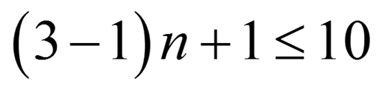
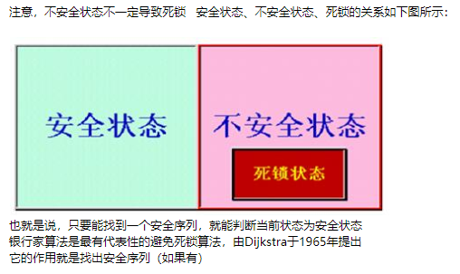
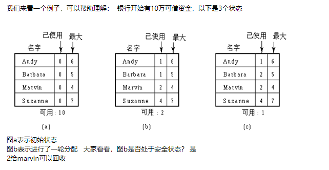
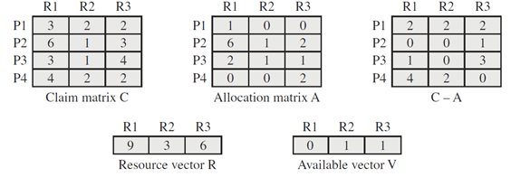
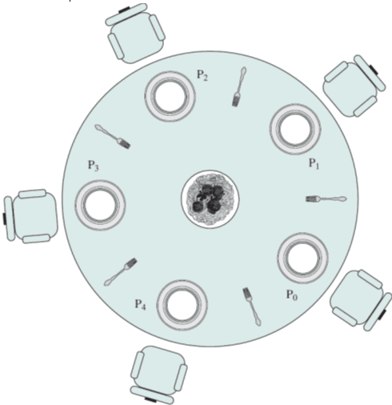
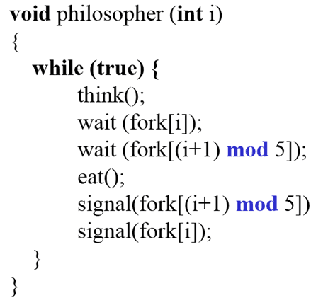
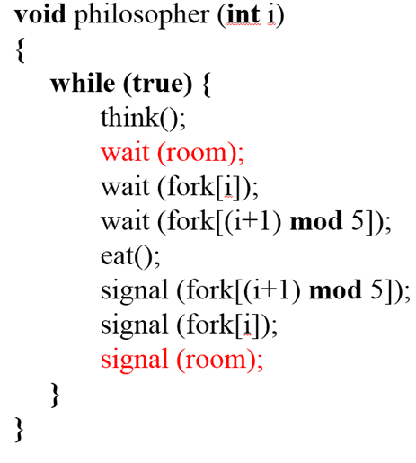
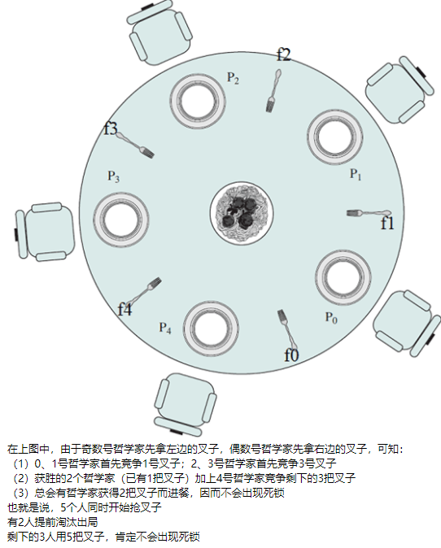
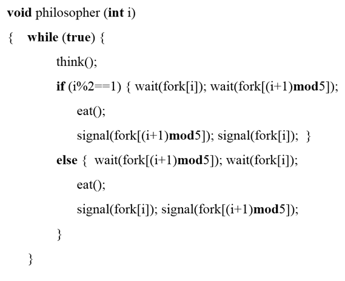

# 死锁

在两个或者多个并发进程中，每个进程持有某种资源而又等待其它进程释放它们现在保持着的资源，在未改变这种状态之前都不能向前推进，称这一组进程产生了死锁(deadlock)。

## 死锁产生的必要条件？

- **互斥**：一个资源一次只能被一个进程使用；
- **占有并等待**：一个进程至少占有一个资源，并在等待另一个被其它进程占用的资源；
- **非抢占**：已经分配给一个进程的资源不能被强制性抢占，只能由进程完成任务之后自愿释放；
- **循环等待**：若干进程之间形成一种头尾相接的环形等待资源关系，该环路中的每个进程都在等待下一个进程所占有的资源。

我们再来看一下这四个条件：（1）互斥（2）占有且等待（3）不可抢占（4）循环等待
如果条件（1）（2）（3）成立，是不是一定发生死锁？不一定，因为条件（1）（2）（3）在现实中经常出现，但是死锁出现的概率很小也就是说，条件（1）（2）（3）成立，死锁不一定出现反过来，死锁出现，条件（1）（2）（3）是不是一定成立？ 是的
所以条件（1）（2）（3）是死锁出现的必要非充分条件也就是说，4个必要条件加起来，才是充要条件

## 死锁有哪些处理方法？

（1）预防死锁通过设置某些限制条件，去破坏死锁四个充要条件中的一个或多个，来防止死锁较易实现，广泛使用，但由于所施加的限制往往太严格，可能导致系统资源利用率和系统吞吐量的降低
（2）避免死锁不事先采取限制去破坏产生死锁的条件，而是在资源的动态分配过程中，用某种方法去防止系统进入不安全状态，从而避免死锁的发生实现较难，只需要较弱的限制条件，可获得较高的资源利用率和系统吞吐量
（3）检测死锁事先并不采取任何限制，也不检查系统是否进入不安全区，允许死锁发生，但可通过检测机构及时检测出死锁的发生，并精确确定与死锁有关的进程和资源，然后采取适当措施，将系统中已发生的死锁清除掉
（4）解除死锁与检测死锁相配套，用于将进程从死锁状态解脱出来常用的方法是撤消或挂起一些进程，以回收一些资源，再将它们分配给处于阻塞状态的进程，使之转为就绪状态实现难度大，但可获得较好的资源利用率和系统吞吐量注意到，越往后，实现难度越大，但是系统效率越高

------

1.鸵鸟策略：直接忽略死锁。因为解决死锁问题的代价很高，因此鸵鸟策略这种不采取任务措施的方案会获得更高的性能。当发生死锁时不会对用户造成多大影响，或发生死锁的概率很低，可以采用鸵鸟策略。

2.死锁预防：

基本思想是破坏形成死锁的四个必要条件：

- 破坏互斥条件：允许某些资源同时被多个进程访问。但是有些资源本身并不具有这种属性，因此这种方案实用性有限；
- 破坏占有并等待条件：
  - 实行资源预先分配策略（当一个进程开始运行之前，必须一次性向系统申请它所需要的全部资源，否则不运行）；
  - 或者只允许进程在没有占用资源的时候才能申请资源（申请资源前先释放占有的资源）；
  - 缺点：很多时候无法预知一个进程所需的全部资源；同时，会降低资源利用率，降低系统的并发性；
- 破坏非抢占条件：允许进程强行抢占被其它进程占有的资源。会降低系统性能；
- 破坏循环等待条件：对所有资源统一编号，所有进程对资源的请求必须按照序号递增的顺序提出，即只有占有了编号较小的资源才能申请编号较大的资源。这样避免了占有大号资源的进程去申请小号资源。

3.死锁避免

动态地检测资源分配状态，以确保系统处于安全状态，只有处于安全状态时才会进行资源的分配。所谓安全状态是指：即使所有进程突然请求需要的所有资源，也能存在某种对进程的资源分配顺序，使得每一个进程运行完毕。

> 银行家算法

4.死锁解除

> 如何检测死锁：检测有向图是否存在环；或者使用类似死锁避免的检测算法。

死锁解除的方法：

- 利用抢占：挂起某些进程，并抢占它的资源。但应防止某些进程被长时间挂起而处于饥饿状态；
- 利用回滚：让某些进程回退到足以解除死锁的地步，进程回退时自愿释放资源。要求系统保持进程的历史信息，设置还原点；
- 利用杀死进程：强制杀死某些进程直到死锁解除为止，可以按照优先级进行。

## 死锁问题

一台计算机有10台磁带机被n个进程竞争，每个进程最多需要3台磁带机，那么n最多为_____时，系统没有死锁的危险？ 绝大部分同学的答案是3。 答案应该是4。公式如下

# 银行家算法

因为在有2万元资金可用的情况下，银行家可以延迟除Marvin之外的所有请求，这样便可以使Marvin运行结束，然后释放其所有的4万元资金如此这样下去便可以满足Suzanne或者Barbara的请求，等等
所以，一个可能的安全序列是Marvin-Suzanne-Barbara-Andy，因此图b是安全的大家看看，图b还有没有别的安全序列？

其实，以下都是安全序列：（1）Marvin-Suzanne-Barbara-Andy（2）Marvin-Suzanne-Andy-Barbara（3）Marvin-Barbara-Suzanne-Andy（4）Marvin-Barbara-Andy-Suzanne

只要找出任何一个就可以判断该状态是安全的

# 多个资源的情况

这里有R1、R2、R3三个资源，P1、P2、P3、P4四个进程
（1）需求矩阵C表示进程对资源的最大需求（2）分配矩阵A表示进程已分配的各种资源数（3）C-A表示进程还需要的各种资源数（4）资源总量向量R表示资源的总量（5）可用资源向量V表示未分配的各种可用资源数量

大家注意观察，可以发现：（1）C、A、C-A三者中，知道其中两者就够了（2）知道R、A，可以求得V
其实这跟前面的例子一样，只是多了几个资源R减去（A相加），就得到V了

# 哲学家进餐问题

（1）五个哲学家共用一张圆桌，桌上有五个盘子、五把叉子和一大盘面条（2）平时哲学家进行思考，想吃面时便试图取其左右最近的叉子，只有拿到两把叉子时他才能进餐。进餐完毕后，放下叉子继续思考（3）要求互斥使用叉子，并且没有死锁与饥饿

其实可以利用5个信号量构成的数组semaphore fork[5]来表示叉子，每个信号量初始化为1，这样将叉子视为临界资源，实现哲学家们对叉子的互斥使用

这个方法看起来好像挺好的具体过程是：每个哲学家首先拿起左边的叉子，然后拿起右边的叉子，吃完后，这两副叉子又被放回桌子有什么问题没有？ 有！存在死锁、饥饿

## 方法1：最多只允许4位哲学家同时进入餐厅

## 方法2：规定奇数号哲学家先拿他左边的叉子，然后再去拿右边的叉子；而偶数号哲学家则相反

