## 逻辑地址/物理地址/虚拟内存

所谓的逻辑地址，是指计算机用户(例如程序开发者)，看到的地址。例如，当创建一个长度为100的整型数组时，操作系统返回一个逻辑上的连续空间：指针指向数组第一个元素的内存地址。由于整型元素的大小为4个字节，故第二个元素的地址时起始地址加4，以此类推。事实上，逻辑地址并不一定是元素存储的真实地址，即数组元素的物理地址(在内存条中所处的位置)，并非是连续的，只是操作系统通过地址映射，将逻辑地址映射成连续的，这样更符合人们的直观思维。

另一个重要概念是虚拟内存。操作系统读写内存的速度可以比读写磁盘的速度快几个量级。但是，内存价格也相对较高，不能大规模扩展。于是，操作系统可以通过将部分不太常用的数据移出内存，“存放到价格相对较低的磁盘缓存，以实现内存扩展。操作系统还可以通过算法预测哪部分存储到磁盘缓存的数据需要进行读写，提前把这部分数据读回内存。虚拟内存空间相对磁盘而言要小很多，因此，即使搜索虚拟内存空间也比直接搜索磁盘要快。唯一慢于磁盘的可能是，内存、虚拟内存中都没有所需要的数据，最终还需要从硬盘中直接读取。这就是为什么内存和虚拟内存中需要存储会被重复读写的数据，否则就失去了缓存的意义。

现代计算机中有一个专门的转译缓冲区(Translation Lookaside Buffer，TLB)，用来实现虚拟地址到物理地址的快速转换。

## 分页和分段有什么区别？

- 页式存储：用户空间划分为大小相等的部分称为页（page），内存空间划分为同样大小的区域称为页框，分配时以页为单位，按进程需要的页数分配，逻辑上相邻的页物理上不一定相邻；
- 段式存储：用户进程地址空间按照自身逻辑关系划分为若干个段（segment）（如代码段，数据段，堆栈段），内存空间被动态划分为长度不同的区域，分配时以段为单位，每段在内存中占据连续空间，各段可以不相邻；
- 段页式存储：用户进程先按段划分，段内再按页划分，内存划分和分配按页。

区别：

- 目的不同：分页的目的是管理内存，用于虚拟内存以获得更大的地址空间；分段的目的是满足用户的需要，使程序和数据可以被划分为逻辑上独立的地址空间；
- 大小不同：段的大小不固定，由其所完成的功能决定；页的大小固定，由系统决定；
- 地址空间维度不同：分段是二维地址空间（段号+段内偏移），分页是一维地址空间（每个进程一个页表/多级页表，通过一个逻辑地址就能找到对应的物理地址）；
- 分段便于信息的保护和共享；分页的共享收到限制；
- 碎片：分段没有内碎片，但会产生外碎片；分页没有外碎片，但会产生内碎片（一个页填不满）

## 什么是虚拟内存？

每个程序都拥有自己的地址空间，这个地址空间被分成大小相等的页，这些页被映射到物理内存；但不需要所有的页都在物理内存中，当程序引用到不在物理内存中的页时，由操作系统将缺失的部分装入物理内存。这样，对于程序来说，逻辑上似乎有很大的内存空间，只是实际上有一部分是存储在磁盘上，因此叫做虚拟内存。

虚拟内存的优点是让程序可以获得更多的可用内存。

### 如何进行地址空间到物理内存的映射？

**内存管理单元**（MMU）管理着逻辑地址和物理地址的转换，其中的页表（Page table）存储着页（逻辑地址）和页框（物理内存空间）的映射表，页表中还包含包含有效位（是在内存还是磁盘）、访问位（是否被访问过）、修改位（内存中是否被修改过）、保护位（只读还是可读写）。逻辑地址：页号+页内地址（偏移）；每个进程一个页表，放在内存，页表起始地址在PCB/寄存器中。

## 有哪些页面置换算法？

在程序运行过程中，如果要访问的页面不在内存中，就发生缺页中断从而将该页调入内存中。此时如果内存已无空闲空间，系统必须从内存中调出一个页面到磁盘中来腾出空间。页面置换算法的主要目标是使页面置换频率最低（也可以说缺页率最低）。

- **最佳页面置换算法**OPT（Optimal replacement algorithm）：置换以后不需要或者最远的将来才需要的页面，是一种理论上的算法，是最优策略；
- **先进先出**FIFO：置换在内存中驻留时间最长的页面。缺点：有可能将那些经常被访问的页面也被换出，从而使缺页率升高；
- **第二次机会算法**SCR：按FIFO选择某一页面，若其访问位为1，给第二次机会，并将访问位置0；
- **时钟算法** Clock：SCR中需要将页面在链表中移动（第二次机会的时候要将这个页面从链表头移到链表尾），时钟算法使用环形链表，再使用一个指针指向最老的页面，避免了移动页面的开销；
- **最近未使用算法**NRU（Not Recently Used）：检查访问位R、修改位M，优先置换R=M=0，其次是（R=0, M=1）；
- **最近最少使用算法**LRU（Least Recently Used）：置换出未使用时间最长的一页；实现方式：维护时间戳，或者维护一个所有页面的链表。当一个页面被访问时，将这个页面移到链表表头。这样就能保证链表表尾的页面是最近最久未访问的。
- **最不经常使用算法**NFU：置换出访问次数最少的页面

### 局部性原理

- 时间上：最近被访问的页在不久的将来还会被访问；
- 空间上：内存中被访问的页周围的页也很可能被访问。

### 什么是颠簸现象

颠簸本质上是指频繁的页调度行为。进程发生缺页中断时必须置换某一页。然而，其他所有的页都在使用，它置换一个页，但又立刻再次需要这个页。因此会不断产生缺页中断，导致整个系统的效率急剧下降，这种现象称为颠簸。内存颠簸的解决策略包括：

- 修改页面置换算法；
- 降低同时运行的程序的数量；
- 终止该进程或增加物理内存容量。

## 内部碎片和外部碎片

内存碎片分为：内部碎片和外部碎片。

内部碎片就是已经被分配出去（能明确指出属于哪个进程）却不能被利用的内存空间；

内部碎片是处于区域内部或页面内部的存储块。占有这些区域或页面的进程并不使用这个存储块。而在进程占有这块存储块时，系统无法利用它。直到进程释放它，或进程结束时，系统才有可能利用这个存储块。

单道连续分配只有内部碎片。多道固定连续分配既有内部碎片，又有外部碎片。

外部碎片指的是还没有被分配出去（不属于任何进程），但由于太小了无法分配给申请内存空间的新进程的内存空闲区域。

外部碎片是出于任何已分配区域或页面外部的空闲存储块。这些存储块的总和可以满足当前申请的长度要求，但是由于它们的地址不连续或其他原因，使得系统无法满足当前申请。

# 进程分配算法

（1）最佳适配算法（最佳适应算法，best-fit）

（2）首次适配算法（首次适应算法，first-fit）

（3）下次适配算法（循环首次适应算法，next-fit）

（4）最坏适配算法（最坏适应算法，worst-fit）

1）最佳适配算法（最佳适应算法，best-fit）：按空闲分区容量从小到大排序形成空闲分区链选择与要求最接近的块也就是新增的外部碎片最小大家想想，这种方法好不好？ 
缺点：由于查找满足要求的最小块，结果会出现许多很小的碎片（外部碎片），以至于难以满足内存分配请求，因此需要更经常地进行内存压缩因为碎片小到一定程度就没法再用了

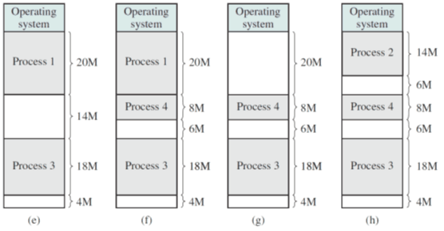

（2）首次适配算法（首次适应算法，first-fit）将空闲分区以地址递增的次序链接从头开始扫描存储器，选择大小足够的第一个可用块（所以称为首次）优点：最简单的，通常也是最好和最快的缺点：该算法可以使较大的空闲分区被保留在内存高端，但随着低端分区不断划分而产生较多小分区（外部碎片），每次分配时查找时间开销会增大

（3）下次适配算法（循环首次适应算法，next-fit）与首次适配算法类似，将空闲分区以地址递增的次序链接

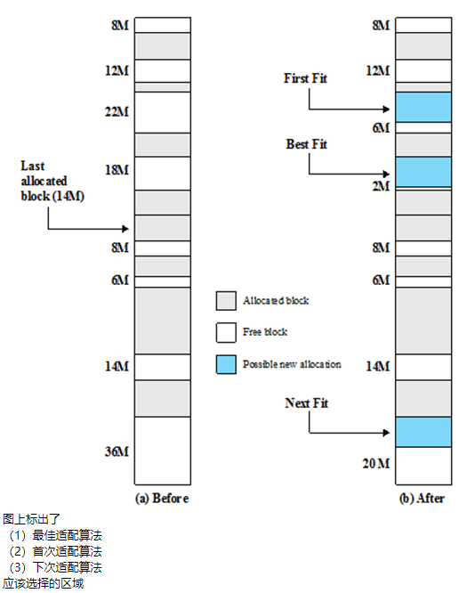

## 课后习题

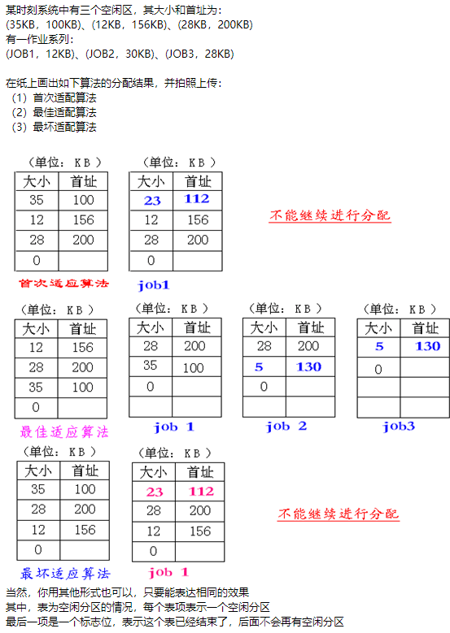

# 内存三大类分配方式

（一）连续分配方式（分配连续内存空间）

（二）离散分配方式（不要求连续内存空间）

（三）虚拟存储系统（利用辅存，比如硬盘，在逻辑上扩充内存容量）

## 连续分配方式：

（1）单一连续分配方式（单分区分配）（2）分区式分配方式，包括：a）固定分区分配方式b）动态分区分配方式（可变分区）c）可重定位分区分配方式（紧缩技术解决外碎片）

对于单一连续分配方式：（1）内存分为两个区域：系统区，用户区（2）应用程序装入到用户区，可使用用户区全部空间这种方式最简单，适用于单用户、单任务的OS优点：不需要硬件支持，易于管理缺点：单道，内存浪费，CPU利用率低
对于固定分区分配方式：（1）把内存区域分为一些大小相等或不等的分区（partition）（2）每个应用进程占用一个或几个分区（3）回收时，将分区标记为“未分配”即可优点：这种方式实现简单，系统开销小缺点：分区固定，存在内部碎片，浪费大量的空间
其中，“大小不等的固定分区方式”的内部碎片稍好于“大小相等的固定分区方式”，但是还是比较严重对于动态分区：（1）分区长度和数目是可变的（2）当一个进程被装入主存时，给它分配它正好需要的存储空间（就像买猪肉，要多少切多少）（3）回收时，根据空闲分区相邻情况进行合并优点：无内部碎片缺点：随着空闲空间不停地分配、回收，会产生许多比较小的空闲空间，无法被其他进程使用，称为外部碎片虽然可以采用压缩技术（也称紧凑技术），使小的空闲分区（外部碎片）合并，但是相当耗费时间

### 重定位（把逻辑地址转换为物理地址）

（1）绝对装入（2）静态重定位（3）动态重定位

1）绝对装入适用于单道系统（只有一个用户进程）编译后，装入前已产生了绝对地址（内存地址），装入时不再作地址重定位这是因为只装入一个进程，且初始的物理地址已知通过简单的加法就能实现逻辑地址到物理地址的转换
2）静态重定位：与绝对装入类似，只不过可以装入多个进程重定位在装入时完成，主要工作是对相对地址中的指令和数据地址的调整过程

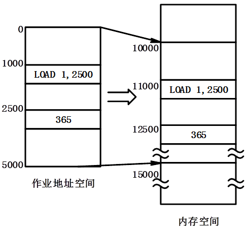

（3）动态重定位动态重定位一般在执行时才完成相对地址到绝对地址的转换与静态重定位一般可以由软件完成不同，动态重定位需要有硬件的支持，能保证进程的可移动性（换入换出）优点：某些模块直到被调用时才会装入，内存利用率更高
动态重定位需要以下寄存器：（1）基址寄存器：进程的开始地址（2）界限寄存器：进程的终止位置
当程序被装入内存，或当该进程的映像被换入时，必须设置这些值使用过程如下：（1）基地址寄存器的值加上相对地址产生一个绝对地址（2）得到的结果与界限寄存器的值相比较（3）如果这个地址不在界限范围内，操作系统将产生一个中断（访问越界中断）

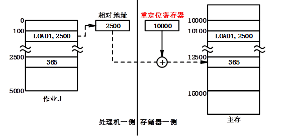

## 离散分配方式

离散分配方式包括：（1）分页存储管理（2）分段存储管理方式（3）段页式存储管理

### 分页式存储

（1）主存被划分成大小固定相等的块，且块相对比较小，每个进程也被划分成同样大小的小块

（2）一个进程中的小块被称为页，主存中的小块被称为页框（帧），页框可以保存一页数据

（3）操作系统为每个进程维护一个页表，页表给出了该进程的每一页对应的页框位置

（4）逻辑地址包括一个页号和页的偏移量，CPU使用页表产生物理地址（页框号，偏移量）

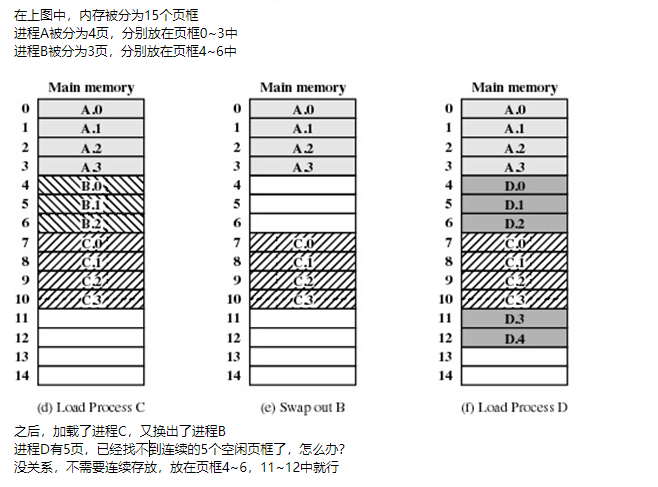

这样放有什么好处啊？（1）没有内部碎片（除了最后一页）（2）没有外部碎片

不知道同学们有没有疑问：既然进程被大卸八块了，怎么管理呢？前面提到，“操作系统为每个进程维护一个页表，页表给出了该进程的每一页对应的页框位置”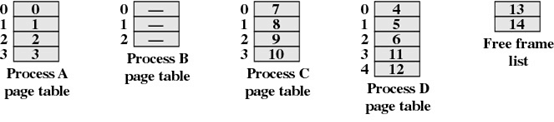

我们通过例子来理解一下：一个进程的长度为2700字节，采用16位的地址，选择的页大小为1KB=1024B，请将相对地址1502转换为逻辑地址（页号+偏移量）
同学们糊涂了，之前不是说：相对地址和逻辑地址一个意思吗？前面提到，相对地址是针对某个“点”进行定义的（比如进程的起始位置），而逻辑地址没有这个意思，在这里是“页号+偏移量”
我们先来看是怎么算的，再来体会它们之间的区别将进程分页，页大小为1024，那么：
0号页的范围是从0~10231号页的范围是从1024~20472号页的范围是从2048~3071
其中，2号页没有占满，有内部碎片可知，1502在1号页里，偏移量为多少？
1502除以1024，余数是478，所以偏移量是478所以它的逻辑地址是(1, 478)，前面是页号，后面是偏移量

好，下面我们从另外一个角度看第一步，将1502转换为二进制就是将1502不断地除以2，把余数倒着排列，就得到了答案应该是000001 0111011110
我特意将前6位和后10位分开，大家看出什么门道没？前6位换成10进制就是1，刚好是页号后10位换成10进制就是478，刚好是页内偏移
也就是说，相当于把地址切成两段，第一段是页号，第二段是页内偏移

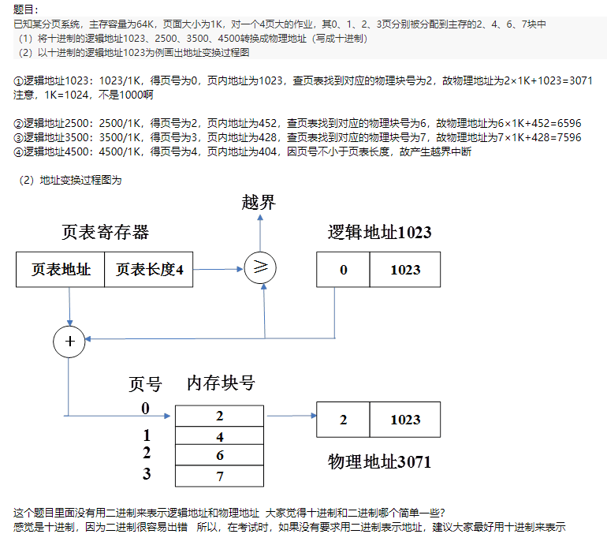

### 分段存储管理方式

（1）分段技术细分用户程序，可以把程序和相关数据划分为几个段

（2）所有程序的所有段不要求具有相同的长度，有一个最大段长度（段长度的最大限度）

（3）逻辑地址由两部分组成：段号+偏移量

注意到：（1）由于使用大小不等的段，因而分段类似于动态分区（2）但分段方案中，一个程序可以占用多个分区，并且这些分区不要求连续

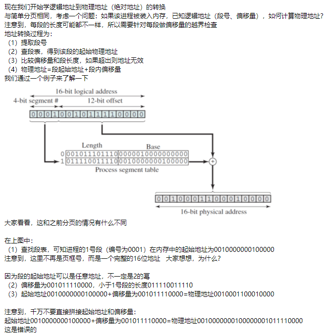

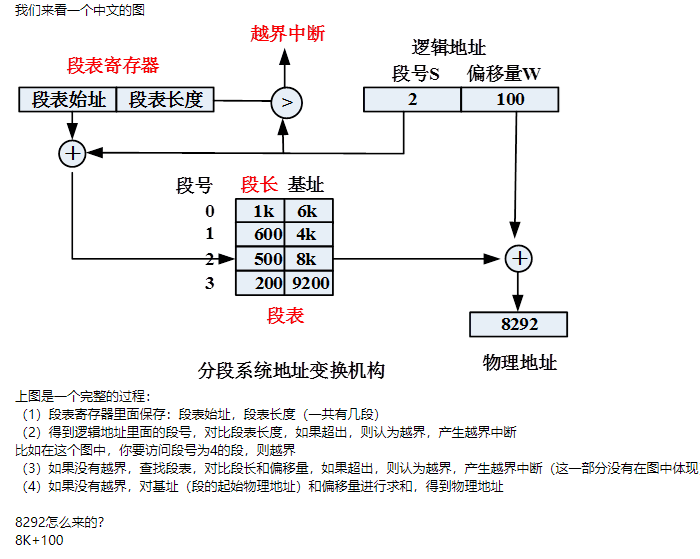

好，我们来了解一下分段的特点：（1）消除了内部碎片，但有外部碎片（2）对程序员是可见的（分页对程序员透明）（3）采用大小不等的段，使逻辑地址和物理地址之间不再有简单的对应关系（4）对用户而言，分段是2维的（段号+段内地址）到目前为止，我们学完了（1）和（2）我们知道：（1）简单分页没有外部碎片，但是不方便共享和保护（2）简单分段方便共享和保护，但是有外部碎片有没有可以取长补短，既没有外部碎片，又方便共享和保护的离散分配方式？

**这里有两个关键的数据结构：页表、段表它们的结构不同，用法也不一样，一个可以直接拼接地址，一个不行此外，什么时候要做越界检查，大家一定要弄清楚**

### 虚拟内存

简而言之，就是用外存（辅存，如磁盘等）扩充内存（主存），其中：

（1）将进程中经常使用的部分放在内存，不经常使用的部分放在外存

（2）需要时，将外存部分调入内存

（3）由于存在访问局部性原理，这种结构具有较高的命中率，所以访问速度接近内存，存储容量接近外存
因此，得到一个“虚拟内存”（内存+外存），其作用：（1）使用户感觉到的一个更大的内存（2）允许更有效的多道程序设计，缓解了用户的内存限制

前面我们说了：“由于存在访问局部性原理，这种结构具有较高的命中率，所以访问速度接近内存，存储容量接近外存”也就是说，如果命中率不高，考虑到磁盘的访问速度远远慢于内存，那么系统访问速度就会大大降低，甚至慢到无法忍受“甘蔗没有两头甜”，所以大家视情况选择虚拟内存

虚拟存储器在离散分配存储管理（分页、分段、段页式）的基础上增加了“请求调入”功能和“置换”功能，因而可以采用3种方式实现：①请求分页系统 ← 简单分页系统②请求分段系统 ← 简单分段系统③请求段页式系统 ← 简单段页式系统只要有请求二字，就是有虚拟内存请大家务必分清楚

#### 工作原理

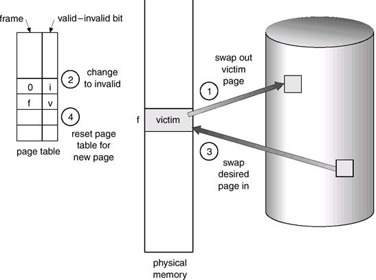

由图可知：

步骤①：B为受害者，页框号为f，需要换出（从内存换到外存）步骤②：在页表中，将B的页框号设置为0，并将标志设置为无效（B已经不在内存中）步骤③：将A换入内存，放入页框号为f的页框中步骤④：在页表中，将A的页框号设置为f，并将标志设置为有效（A已经在内存中）

#### 限制

虚拟存储器的容量受两方面的限制：（1）指令中地址的字长（地址结构）比如：若CPU的有效地址长度为32位，则程序可以寻址范围是0至2^32-1，即虚存容量为4GB也就是说，如果系统是32位的，你从磁盘里划8G出来作为虚拟内存，有意义吗？没有意义，因为虚拟内存的访问空间最多只能为4G现在的操作系统都是64位的，不存在这个问题
（2）外存的容量虚拟存储器的容量与主存的实际大小没有直接的关系，而是由主存与辅存的容量之和确定的虚拟存储器的特征包括①离散性：部分装入内存②多次性：多次调入内存③交换性：内外存交换④虚拟性：逻辑上扩大了内存

#### 执行过程

在虚拟存储器，进程的执行过程如下：（1）一个新进程装入内存时，操作系统仅读取包含程序开始处的一个或几个块（2）“常驻集”为进程执行任何时候都在内存中的部分（这是一个重要的概念）（3）当进程执行时，只要所有的内存访问都是访问常驻集中的单元，执行就可以顺利进行（4）如果处理器遇到了一个不在内存中的逻辑地址，则它产生一个中断，表示一次内存访问故障（5）操作系统把被中断的进程置于阻塞状态，并取得控制（6）操作系统把包含引发访问故障的逻辑地址的进程块读入内存，具体过程如下：
①操作系统产生一个磁盘I/O读请求②当执行磁盘I/O期间操作系统可以分配另一个进程运行③当想要的块被读入内存，则产生一个中断，控制被交回操作系统，操作系统把缺少该块而阻塞的进程置为就绪状态

#### 涉及的一些概念

要实现虚拟内存，必须提供相应的硬件支持，包括：（1）扩充页表项（2）缺页中断机构（3）地址变换机构（4）快表（转换检测缓冲区）

#### 扩充页表

页表项除了页号对应的页框号外，还要增加存在位、修改位、控制位等：
（1）存在位（P）：每个页表项需要有一位来表示它所对应的页当前是否在内存中可知，访问某页时，如果该页不在内存中，产生缺页中断（2）修改位（M）：该页是否被修改过将页换出时，如果该页被修改，则需要写回外存（3）其它控制位：在页一级控制保护和共享因此，请求分页式系统的页表项如下

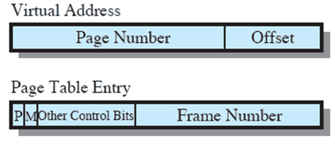

可知：（1）虚拟地址包括页号和页内偏移（2）根据页号，查找页表，对应的页表项里包括存在位、修改位、控制位、页框号

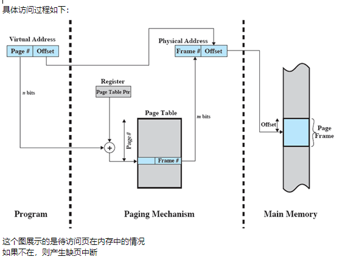

#### 分层页表

我们知道，每个进程都有一个页表直观上，页表应该很小，且放在内存中，这样才能保证高速访问实际情况是这样吗？  并不是

在1978年，DEC公司建立了第一个基于VAX（virtual address extension，虚拟地址扩展）的计算机体系VAX系统中，一个进程的虚存空间2^31=2GB。如果页大小=2^9=512，那么一个进程最多有多少页表项？2^22=4M  如果一个页表项占4个字节，那么一个进程的页表可能会有16MB（16M但是非常大）
所以，如果页表放置在内存中，由于进程数量比较多，整个页表可能占用很多的内存空间（甚至无法接受）

解决方案为：（1）大多数虚存方案都在虚存中保存页表，而不是在实存中（页表被切成很多块，构成页，和进程的其它页一样服从页面调度）（2）当一个进程运行时，它的页表至少有一部分必须在内存中，这一部分包括正在运行的页的页表项

对于32位地址，4K（2^12）字节的页面：（1）如果采用一层页表，则结构为：20位页号+12位偏移量，页表4MB（2）如果采用两层页表：对页表进行分页，即20位页号进一步分为外层页号（10位）、外层页内地址（10位）两层页表逻辑地址结构可描述如下：

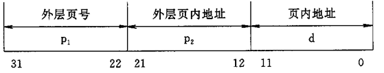

注意到，在两层页表中，进程最大还是2^20页，一个页表项4个字节，页表最大4M将4M的页表再分页（每页4K），建立页表的索引（页表项），一共需要1K项，占用4K字节，刚好一页
所以可以把页表的索引（刚好一页）放在内存中，先查找对应的页表项（包含在某页中）是否在内存中（1）如果在，查找，访问（2）如果不在，调入，查找，访问

为啥每页4k? 页内地址12位 2^12=4K

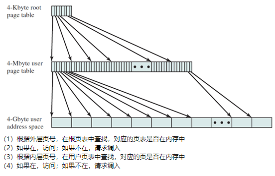

#### 快表

转换检测缓冲区（快表）

为了简单，现在只考虑一层页表，即所有页表都在内存中理想情况下，即使所有的内容（页表、程序）都在内存中，每个虚存访问仍然需要两次物理内存访问

（1）一次取相应的页表项（获得数据所在页的页框地址）（2）一次取想要的数据
内存虽然已经很快了，但是跟高速缓存（在CPU里面）比起来，还是不够快为克服这个问题，大多数虚拟存储器方案为页表项使用一个特殊的高速缓存通常称作转换检测缓冲区（TLB，Translation Lookaside Buffer），也称为快表个人感觉，“转换检测缓冲区”叫起来比较拗口，快表的叫法更直观一些，或者直接叫TLB

因为根据局部性原理：访问过的页表项在不远的将来可能还会被访问（因为当前页的数据可能被连续访问）所以可以把最近用过的页表项存在高速缓存（快表）中因此，如果有快表，且命中率高，则不需要去内存取相应的页表项也就是说，访问内存的次数由2次减为1次，速度提高

我们来看看转换检测缓冲区（快表）的用法（1）给定一个虚地址，处理器首先检查TLB（高速缓存中）（2）如果想要的页表项在其中（TLB命中），则检索页框号并形成实地址（理想情况）（3）如果没有找到想要的页表项（TLB未命中），处理器用页号检索进程页表（在内存中），并检查相应的页表项（4）如果“存在位”已置位，则该页在内存中，处理器从页表项中检索页框号以形成实地址。处理器同时更新TLB，使其包含这个新的页表项（5）如果“存在位”没有置位，则想要的页不在内存中，因而产生一次内存访问故障（缺页中断），调用操作系统，由操作系统装入所需要的页，并更新页表

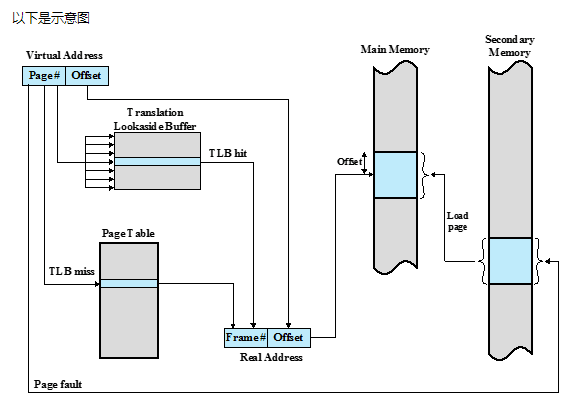

由图可知：（1）先查快表TLB，若有，则得出页框号（2）若无，则查页表，如果“存在位”置位（页在内存中），得出页框号，并更新快表（3）若页不在内存，则产生缺页中断，将要访问的页面调入内存

这个图有点问题，大家找找，在哪里？（1）如果页表项“存在位”置位，则直接生产物理地址（2）如果页表项“存在位”未置位，则产生缺页中断因此，Page fault的应该从Page Table的TLB miss后面出发也就是说，Page fault出发的位置没画对

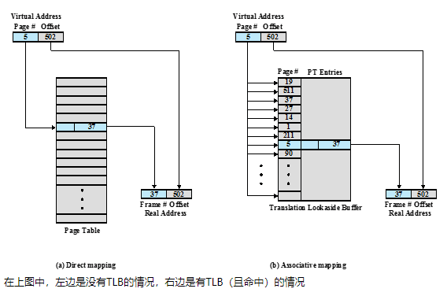

#### 题目

有一分页式系统，其页表存放在主存中：

①如果对主存的一次存取需要1.5μs，试问实现一次页面访问的存取时间是多少？

②如果系统有快表，平均命中率为85%，当页表项在快表中时，其查找时间忽略为0，试问此时的存取时间是多少？ 

若页表存放在主存中，则实现一次页面访问需两次访问主存：一次是访问页表，确定所存取页面的物理地址（称为定位），第二次才根据该地址存取页面数据页表在主存的存取访问时间=1.5*2=3μs

增加快表后的存取访问时间=0.85*1.5+(1-0.85)*2*1.5=1.725μs0.85*1.5（访问内存取数据）+(1-0.85)*2*1.5（访问内存取页表项+访问内存取数据）
下面我们来讨论一个问题：请求分页系统里面，页多大比较合适？我们知道，页小，存在以下缺点：（1）页越小，每个进程需要的页的数目就越多（2）每个进程的页数越多意味着更大的页表（3）更大的页表意味着页表中的更大的比例在虚存中（产生两次缺页） 页表如果在内存中放不下，就只能放在外存中（二级页表）  所以取页表项一次中断，取数据一次中断

但是，页小，也有优点：（1）页越小，内部碎片的总量越少（2）如果页大小非常小，那么每个进程在主存中有较多数目的页。一段时间后，内存中的页都包含有最近访问的部分，因此，缺页比率比较低但是，当页大小增加时，每一页包含的单元和任何一个最近访问过的单元越来越远（无效数据增加），缺页率开始增长

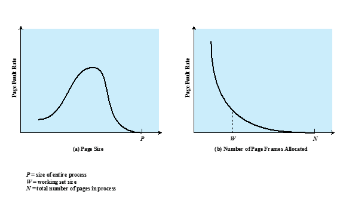

所以结论就是，页不能太大，页不能太小也就是说，内存中可以有大页，也可以有小页多种页大小为有效地使用TLB提供了很大的灵活性，因为：（1）程序指令可以使用数目较少的大页（具有较好的局部性） 对于程序指令，因为顺序访问的概率很高，局部性强，可以放在大块里（2）线程栈则可以使用小页（这部分数据局部性较差） 线程栈就是栈 栈的数据一般没有局部性  如果都放在一页里，很多数据用不着但是，为了简单，大多数商业操作系统仍然只支持一种页大小

下面是页面访问流程

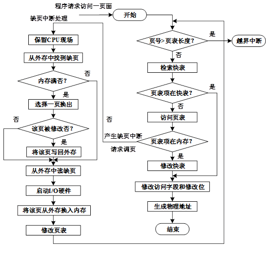

修改访问字段和修改位是啥意思？从这个图能看出来，一旦发生了缺页中断，必须等页面调入内存后，再启动访问请求快表大小有限，不经常访问的优先被覆盖 所以需要记录访问字段

#### 请求分段

好，请求分页就讲到这，下面开始介绍请求分段，也叫虚拟段式由于在实际中应用较少，所以我们只是简单介绍一下，中间有问题请举手其实，请求分段的“请求调入”和“置换”与请求分页类似，只不过调入调出的是“段”，而不是“页”我们知道：简单分段允许程序员把存储器看成由多个地址空间或段组成，段的大小是不相等的这种组织有许多优点，包括：（1）简化不断增长的数据结构的处理（段可以增长）（2）允许程序独立的改变或重新编译（3）有助于进程间的共享（4）有助于保护

在简单段式存储管理的基础上，增加“请求调段”和“段置换”功能，就得到了请求分段：（2）需要另一个修改位M，用于表明相应的段从上一次被装入主存到目前为止，其内容是否被改变

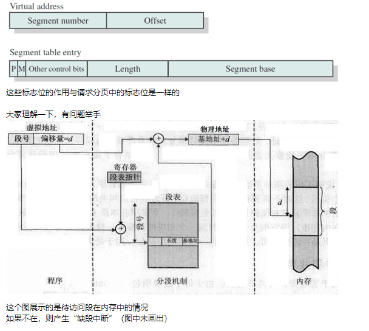

### 请求段页式

我们知道，分页和分段各有好处：（1）分页对程序员是透明的（2）分页消除了外部碎片（3）分段对程序员是可见的（4）分段具有处理不断增长的数据结构的能力，以及支持共享和保护的能力所以，对于请求段页式：（1）程序分成多个段（2）每个段依次划分成许多固定大小的页（3）每一段有一个页表，也就是说，一个程序可能有多个页表

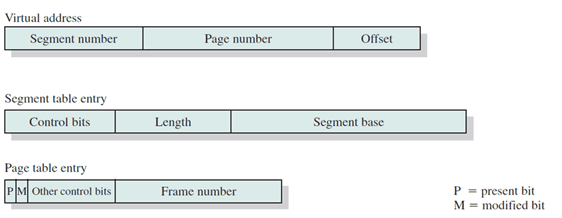

注意到：（1）段表的控制位用来保护、共享等（2）页表的P（存在位）和M（修改位）用来请求调入和置换 segment：段

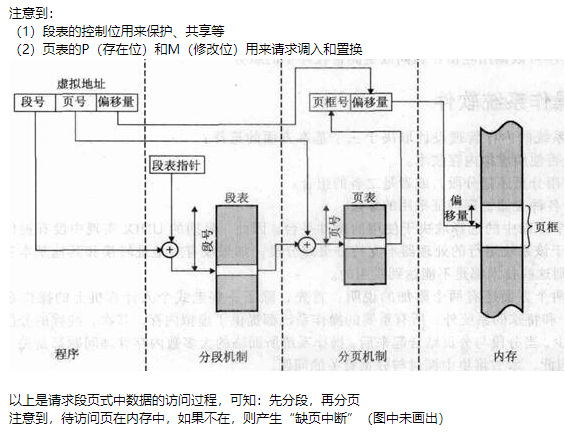

段表查完后有没有用到段长 需要检查是否越界 但是图上没画出来问大家两个问题第一个问题：请求段页式中是否会发生“缺段中断”？并不会，因为请求调入和置换的基本单位是页，不是段因此不会调入整个段，自然也不存在“缺段中断”第二个问题：请求段页式中段表和页表的数量分别是多少？对于一个进程而言 一个段表  很多页表页表数量是由什么决定的？  段的数量
前面我们提到：段表包含长度和段基址，易于保护与共享

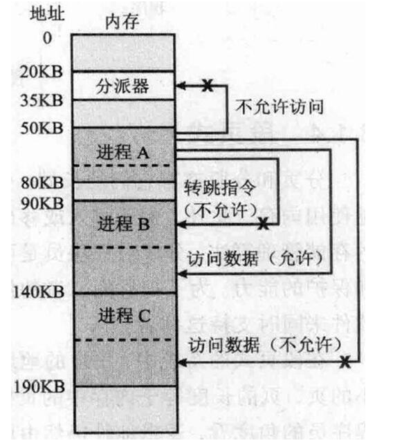

在上图的例子中，可知：（1）进程B的“数据段”与进程A共享，所以进程A可以访问进程B的数据也就是说，一个段可以在多个进程的段表中被引用（2）一般来说，“指令段”不能共享（图中，进程A不能访问进程B的指令）（3）进程B不能访问未共享的“数据段”

### 三个策略

（一）读取策略（二）放置策略（三）置换策略

#### 读取策略

实际上就是确定一个页何时读入内存常用的两种方法：（1）请求分页（2）预先分页
对于请求式分页，只有当访问到某页中的一个单元时才将该页读入内存可以说，这是一种最“懒”的方式

可知：（1）当一个进程第一次启动时，会出现大量的缺页（2）在一段时间后，缺页的数目会降低（页面的访问趋于稳定和集中）优点：容易实现   缺点：对外存I/O次数多，开销较大

我们知道，磁盘是高速转动的，磁头的移动速度相对于磁盘的转动速度而言要慢很多因此，有时候磁头移动需要的时间比读取某一个扇区的时间要多得多考虑到局部性原理，读取当前扇区时，下一个扇区可能马上也会用到我们为何不一次多读几个扇区呢？
因此，对于预先分页策略，在发生缺页需要调入某页时，一次调入该页以及相邻的几个页原因：如果一个进程的页被连续存储在辅存中，则一次读取许多连续的页，比隔一段时间读取一页要更有效
优点：提高调页的I/O效率缺点：基于预测，若调入的页在以后很少被访问，则效率低
预先分页策略常用于程序装入时的调页

#### 放置策略

（1）在请求分段中，如何对物理内存进行分配，可采用最佳适配、首次适配等（与动态分区类似）其实就是有多个空闲区域的时候，放在哪一个大家随口说几个首次，最佳，最坏，还有循环首次

大家说，在分页系统里，要不要考虑进程如何放置啊？（2）在请求分页和请求段页式中，地址变换最后通过地址转换硬件和内存访问硬件来完成因此，无论页放在哪个页框、多个页是否连续存放，访问速度都是一样所以，如何放置通常变得无关紧要（只要页框是空的，放哪个都可以）

#### 置换策略（重点）

通过前面的学习，我们知道，当内存满了，如果需要调入新页，则需要将内存中已经存在的某页调出，这就是“置换

置换策略的功能：需要调入新页面时，选择内存中哪个物理页面被置换，称为置换策略

目标：把未来不再使用的或短期内较少使用的页面调出

#### ->置换算法（最佳，最近最少使用，先进先出，时钟算法）

一般来说，通常会给你一个进程运行时的页面访问（引用）顺序（又称为页地址流，或引用串）让你根据特定的页面置换算法，画出页面的换入换出过程，并计算缺页率，检验页面置换算法性能显然，缺页率越低，页面置换算法越好

注意到：（1）页面置换算法好不好，是跟页地址流紧密相关的（2）可能某个页面置换算法在某个页地址流下性能很差，但是在另一个页地址流下性能很好

#### 最佳算法

我们先来看最佳算法（Optimal，OPT）原则：置换时淘汰“未来不再使用的”或“在离当前最远位置上出现的”页面为什么会有4和5？只给3个页框，也就是3个坑 有很多萝卜如果坑满了，要再放萝卜，就需要把已有的萝卜拿出来  这就叫置换我们学的就是置换算法原则：置换时淘汰“未来不再使用的”或“在离当前最远位置上出现的”页面

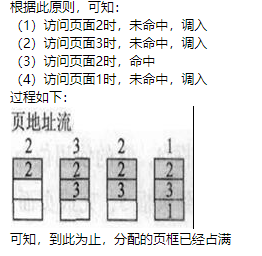

下面如果页面不存在那么就会产生缺页中断

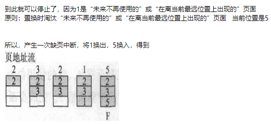

都没出现，就随便换一个
那么，缺页率如何计算？可知，一共访问了页面12次，有多少次缺页中断？
有同学可能会回答3次因为图上有3个F不对，是6次，因为开始填满页框时还有3次

通过对比可以发现，最佳置换的缺页中断是最少的但是这在现实中是无法实现的（因为页面的访问往往无法预测，或者说，预测的代价太大）既然最佳置换无法实现，那我们为什么还要学呢？一般来说，最佳置换可以用作其它置换算法性能评价的依据也就是说，其它置换算法性能越接近最佳置换，性能越好

#### 最少使用算法

原则：置换时淘汰最近一段时间最久没有使用的页面，即选择上次使用距当前最远的页面淘汰因为根据局部性原理：“刚访问过的”页面可能马上要访问，“很久没访问的”页面可能以后也很少访问

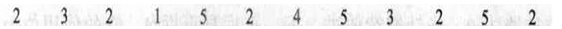

对于最佳算法（OPT），选择淘汰页面时，从5开始往“后”看，在2、3、1（已经在内存中）三个页面中，哪一个是“最后出现的”

而对于LRU，同样是从5开始，不过是往“前”看，在2、3、1（已经在内存中）三个页面中，哪一个是“最后出现的”

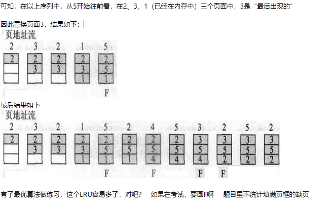

可知，缺页率是7/12=0.58
一般认为，LRU的性能接近最佳算法（在这个例子中，最佳算法的缺页率是6/12）这么看来，LRU应该在实际中经常采用，对吧？并不是经常采用，因为LRU实现复杂，需很多硬件支持，比如用移位寄存器或栈

如果使用移位寄存器：（1）为每个页面设置一个移位寄存器（2）进程访问某页时其移位寄存器的最高位置1，定时向右移动寄存器一位（比如每访问一个页面）（3）置换具有最小值的移位寄存器所对应的页面

举个例子，采用8位寄存器：（1）第一次访问后，页面寄存器的值为1000 0000（2）下一次，如果访问的不是该页，值变成0100 0000（3）下一次，如果访问的还不是该页，值变成0010 0000（4）下一次，如果访问该页，值变成1001 0000前面的1怎么来的  被访问了

如果使用栈：（1）用栈来记录最近使用的页（2）每次引用一个页，该页就从栈中移出并压入栈顶（3）这样，栈顶总是最近使用的页，栈底总是最近最久未使用的页

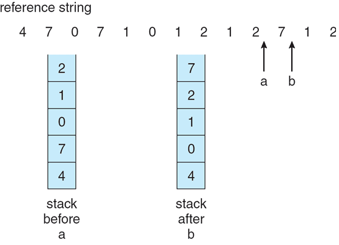

在这个例子中，编号为7的页被访问，所以移至栈顶用栈表示这么一个意思，实现的时候肯定要用队列
可以想象，需要建立一个栈，将内存中的每个页框的页框号都放进去，还有频繁的栈内数据弹出、移动的操作，开销也不小！那么有没有实现简单的置换算法呢？

下面开始学习先进先出算法（FIFO）原则：置换时淘汰最先进入内存的页面，即选择驻留在内存时间最长的页面被置换

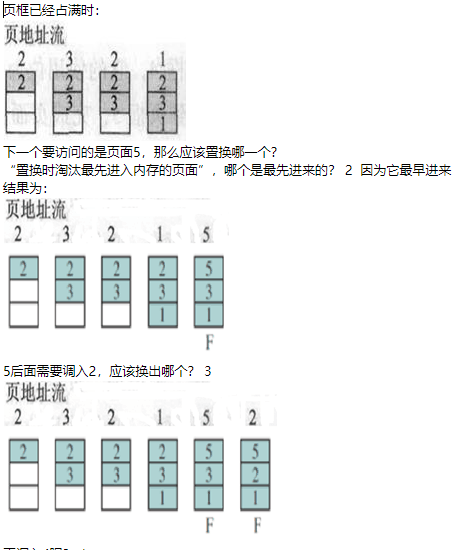

大家找到FIFO置换的规律没？循环换出
相当于标上一个箭头，每次置换箭头指向的页：（1）一开始箭头指向第一格（2）每置换一次，箭头下移一格（3）如果在最后一格，则下次移动到第一格

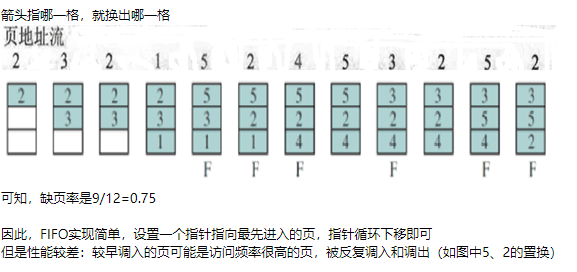

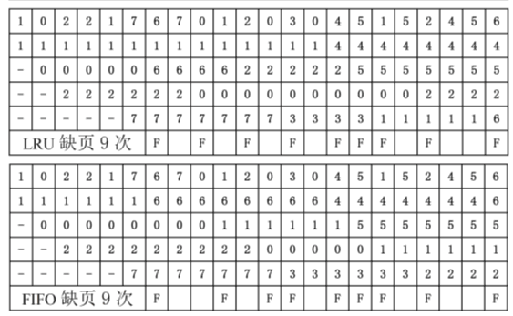

#### 时钟算法

下面来学习一个相对复杂的置换算法：时钟算法（Clock）它是LRU和FIFO的折衷
也就是说，实现简单，性能也比较好（1）LRU性能不错，但是需要记住上次访问的时间，代价大（2）FIFO实现简单，但是无法识别哪些是频繁使用的页（这些页不应该被置换）

时钟算法也采用FIFO的循环结构，只是需要置换某页的时候，多给它一次机会：（1）每页框有一个使用位（use bit）（2）若某页首次装入内存中的某页框，或以后被访问则置user bit=1（3）置换时采用一个指针，从当前指针位置开始按地址先后检查各页，寻找use bit=0的页面作为被置换页（最近没被访问，否则user bit=1）（4）指针经过的user bit=1的页都修改user bit=0（可能是频繁访问的页，所以暂时不换出，多给一次机会）（5）最后指针停留在被置换页的下一个页

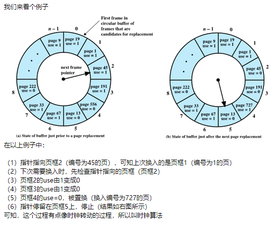

如果考试时让大家画这么一个图，显然费时费力为了方便，我们画图时不需要画时钟，只需要使用：（1）箭头，指向当前页框（2）*，表示use=1

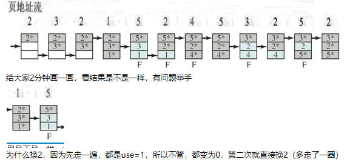

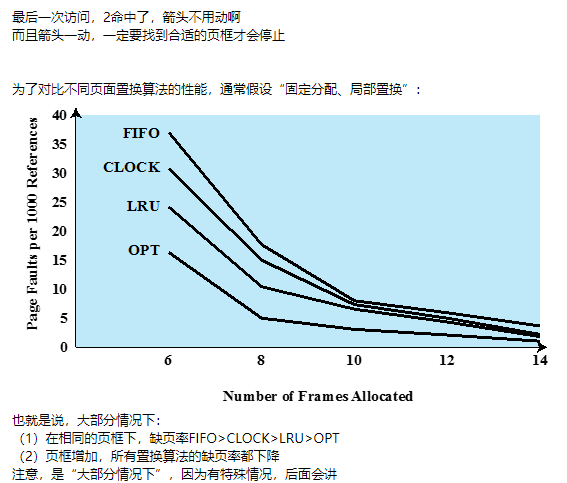

#### 页面缓冲算法

我们将学习“页面缓冲算法”（page buffering），它是对FIFO算法的改进通过建立“被置换页面”（也就是换出的页面）的缓冲，有机会找回刚被置换的页面什么意思呢？在CLOCK算法中，我们多给页面“一次机会”，下次再换出它在页面缓冲算法中，我们拿出内存中一定数量的页框（通常很少），作为“被置换页面”的缓冲当页面被置换时，直接换出它，但是并不急着覆盖它而是将它所在的页框挂到缓冲队列上去如果在不久的将来，该页面被用到，且还未被覆盖，则可以直接取回

那新的页怎么换入呢？从缓冲队列上取一个（可能是比较早换出的页框），覆盖也就是说，并不是指定哪些页框作为固定的缓冲，而是指定缓冲的数量（保持不变）

以前置换时，都是用新萝卜直接替换旧萝卜现在考虑到旧萝卜可能还能用，就暂存一下排个队，队列中的萝卜被访问时，直接从队列中移出否则就一个一个咔擦掉每次咔擦队列中的第一个对于经常被访问的，即使进了这个咔擦队列，也有可能被移出，所以开销比较小
下面我们来了解一下驻留集管理这里要讨论的问题是：分给每个进程多少物理页面，以及如何动态调整各进程的物理页面数“驻留集”指虚拟页式管理中给进程分配的物理页面数目可知，驻留集与缺页率的关系如下：（1）每个进程的驻留集越小，则同时驻留内存的进程就越多，可以提高并行度和处理器利用率；另一方面，进程的缺页率上升，使调页的开销增大（2）驻留集达到某个数目之后，再给它分配更多页面，缺页率不再明显下降。该数目是“缺页率-驻留集大小”曲线上的拐点

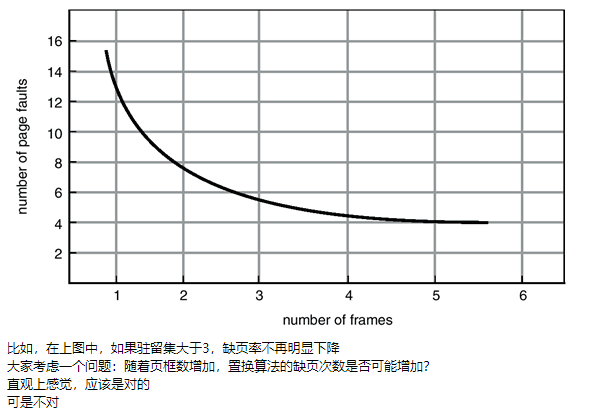

我们来动手算一个例子：对于页地址流：1, 2, 3, 4, 1, 2, 5, 1, 2, 3, 4, 5，采用FIFO算法，当页框数分别为3和4时，缺页次数是多少？
可知：（1）页框数为3时，缺页次数为9（2）页框数为4时，缺页次数为10

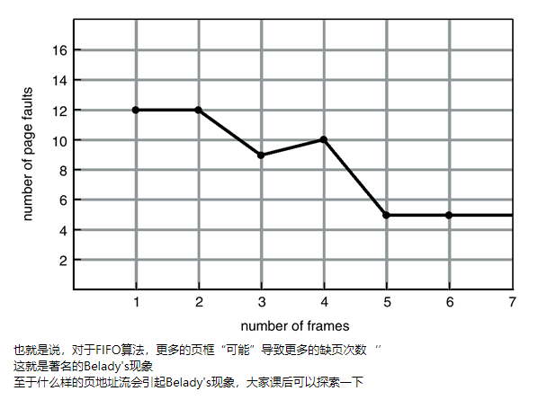

#### 课后习题

一个页式虚拟存储系统，其并发进程固定为4个。最近测试了它的CPU利用率和用于页面交换的磁盘的利用率，得到下列3组数据。请针对每一组数据，说明系统发生了什么情况。增加并发进程能提升CPU的利用率吗？（1）CPU利用率13%；磁盘利用率97%（2）CPU利用率87%；磁盘利用率3%（3）CPU利用率13%；磁盘利用率3%参考答案如下：（1）系统在抖动。增加并发进程数反而恶化系统性能（2）系统正常。CPU的利用率已相当高，不需要采取什么措施（3）CPU没有充分利用，磁盘利用率也非常低，应增加并发进程数

