### 什么是文件描述符？

文件描述符在形式上是一个非负整数。实际上，它是一个索引值，指向内核为每一个进程所维护的该进程打开文件的记录表。当程序打开一个现有文件或者创建一个新文件时，内核向进程返回一个文件描述符。

内核通过文件描述符来访问文件。文件描述符指向一个文件。

### 什么是水平触发？什么是边缘触发？

- 水平触发（LT，Level Trigger）模式下，只要一个文件描述符就绪，就会触发通知，如果用户程序没有一次性把数据读写完，下次还会通知；
- 边缘触发（ET，Edge Trigger）模式下，当描述符从未就绪变为就绪时通知一次，之后不会再通知，直到再次从未就绪变为就绪（缓冲区从不可读/写变为可读/写）。
- 区别：边缘触发效率更高，减少了被重复触发的次数，函数不会返回大量用户程序可能不需要的文件描述符。
- 为什么边缘触发一定要用非阻塞（non-block）IO：避免由于一个描述符的阻塞读/阻塞写操作让处理其它描述符的任务出现饥饿状态。

## 文件系统

Unix风格的文件系统利用树形结构管理文件。每个节点有多个指针，指向下一层节点或者文件的磁盘存储位置。文件节点还附有文件的操作信息(metadata)，包括修改时间，访问权限等等。

用户的访问权限通过访问控制表(Access Control List)和能力表(Capability List)实现。前者从文件角度出发，标注了每个用户可以对该文件进行何种操作。后者从用户角度出发，标注了某用户可以以什么权限操作哪些文件。

Unix的文件权限分为读、写和执行，用户组分为文件拥有者，组和所有用户。可以通过命令对三组用户分别设置权限。

**文件是由用户创建的一种数据集合**

## 常用术语

（1）域（field）域是基本数据单元  一个域包含一个值，如雇员的名字、日期通过数据类型（如字符串、二进制数）和长度来描述   其实就是数据库里面的字段

（2）记录（record）记录是一组相关的域可以看作是应用程序的一个单元例如，雇员记录，可能包括以下域：工号、名字、身份证号、工作类型、雇佣日期等其中一个域是关键字，是记录的唯一标识，这个域不能缺、不能重复

比如雇员记录中的工号数据库里叫主键
（3）文件（file）文件是一组相似的记录它被用户或应用程序视为一个实体有唯一的文件名，可以通过名字访问而且可以实施访问控制

（4）数据库（database）数据库是一组相关的数据，由一种或多种类型的文件组成其本质特征是数据单元间存在着明确关系，并且设计成可供不同的应用程序使用

数据库通常由单独的数据库管理系统管理，并独立于OS雇员记录，可能包括以下域：工号、名字、身份证号、工作类型、雇佣日期等
一条雇员记录，可能包括多个字段，每个字段就是一个域

文件管理系统是一组系统软件：（1）为使用文件的用户和应用程序提供服务（2）是用户或应用程序访问文件的唯一方式（3）使用户或程序员不需要为每个应用程序开发专用软件，并且给系统提供了控制最重要资源的方法

与文件管理相关的设计问题包括：（一）文件组织和访问方法（二）文件目录（三）文件管理的物理I/O特征（四）辅存管理和文件分配

下面我们依次来了解一下文件组织指文件中记录的逻辑结构，它由用户访问记录的方式确定
我们将了解5种文件组织：（重点）（1）堆（最简单的）（2）顺序文件（最常用的）（3）索引文件（4）索引顺序文件（5）直接文件或散列文件

堆是最简单的文件组织形式：（1）数据按它们到达的顺序被采集，每个记录由一串数据组成（2）目的是积累大量的数据并保存数据（3）堆文件没有结构，对记录的访问是通过穷举搜索的方式

以上是堆文件的示意图，可知：（1）记录的长度可以不一样（2）每条记录包含的域也可以不一样（3）记录是按照到达的先后顺序排列的（4）访问时需要遍历
打个比方，我们使用爬虫爬取了一个新闻网站的所有网页  爬回来的是网页数据，里面有新闻，也有广告等如果我们暂时不对这些数据进行处理，可以用堆保存这些原始数据

接下来看顺序文件顺序文件由一系列的记录构成：（1）每个记录都使用一种固定的格式（2）所有记录都具有相同的长度，并且由相同数目、长度固定的域按特定的顺序组成（3）每个域的域名和长度是该文件结构的属性顺序文件有点像数据库里的表

以上是顺序文件的示意图，可知：（1）记录中有关键字域（key field），是记录的唯一标识（2）记录按关键字顺序存储，比如：文本关键字按字母顺序，数字关键字按数字顺序（3）顺序文件通常用于批处理，但交互应用时“性能差”，因为它也需要通过遍历的方式访问数据（4）一个常用的处理过程是把新记录放在一个单独堆文件中，称作日志文件或事务文件，通过周期性地执行一个成批更新操作，把日志文件合并到主文件，并按正确的关键字顺序产生一个新文件但是它比堆要好，因为记录按关键字顺序存储，可以采用折半查找  时间复杂度多少？  O(logN)如果顺序查找，O(N)，因为平均需要N/2

打个比方，我们处理爬虫爬到的原始数据（可能存放在堆文件中）抽取网页中新闻的域，包括标题、时间、作者、关键字、内容等然后将这些域存进顺序文件中
再对新闻进行编号，作为关键字当然，在实际应用中，我们更多时候将这些结构化的数据存入数据库其实，顺序文件中记录的长度可以是定长的，也可以是变长的  如下图所示：

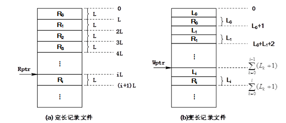

左边的图是定长的  已知单条记录长度为L  R是记录  L是长度
如果要访问第i条记录Ri，则只需要将顺序文件的首地址加上iL就可以了

右边的图是变长的  在每条记录之前，存放了这条记录的长度（假设这个长度变量长度为1），可知：（1）对于编号为0的记录，读取起始地址（假设为0）中的L0，知道这条记录的范围是1~L0紧接着0号记录的是1号记录（2）对于编号为1的记录，长度存在地址L0+1中，读到长度L1，所以这条记录的范围是L0+1+1~L0+1+L1（3）对于编号为2的记录，长度存在地址L0+L1+2中，读到长度L2，所以这条记录的范围是L0+L1+2+1~L0+L1+2+L2

以上部分是否能理解？啥是变量长度就是这个L0有多长，需要多少个单位的存储空间来保存  这里假设只需要一个单位存储空间一条记录R，长度为100，则在这条记录前，用一个单位的存储存上100这个值 这里假设只需要一个单位存储空间（R应该占L格）

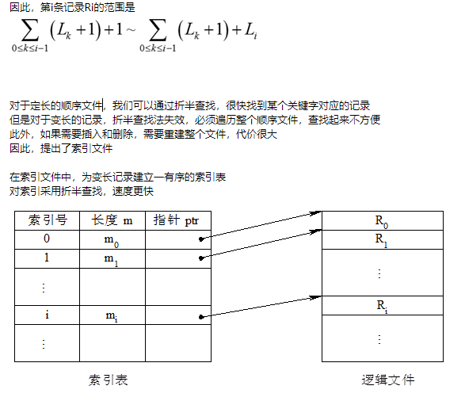

可知，每个记录都在索引表中有一项，索引号在此作为关键字通过对索引号的折半查找，可以得到记录指针，实现对记录的访问
索引文件的特点包括：（1）提高了访问速度，但是增加了存储开销（存放索引文件）（2）增、删记录时，对索引表作相应的修改即可，不需要重建整个文件
此外，我们还可以建立多个索引每种可能成为搜索条件的域都有一个索引，进一步加快查询速度比如，对于新闻，可以按时间建索引，也可以按作者姓名建索引不同的索引可以满足并加速不同的查询要求

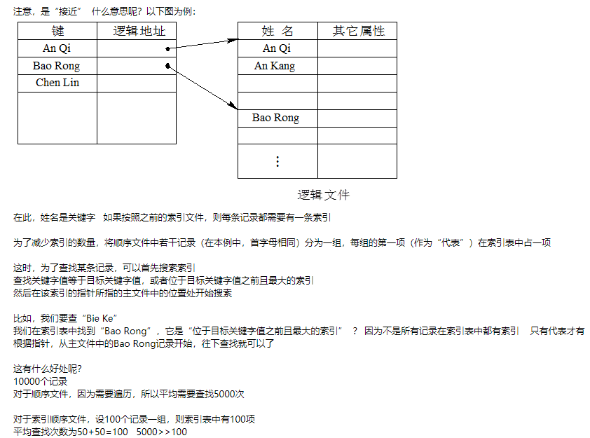

索引顺序文件中的溢出文件是用来加速合并操作的

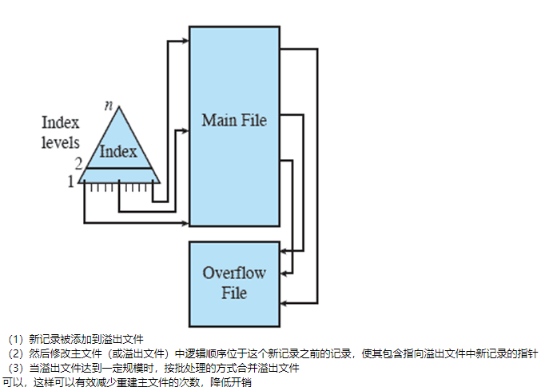

好，到目前为止，我们讲完了5种文件组织（1）堆（最简单的）（2）顺序文件（最常用的）（3）索引文件（4）索引顺序文件（5）直接文件或散列文件中的前4种

在以上文件组织形式中，或多或少都需要遍历，有的遍历主文件，有的遍历索引表虽然可以通过折半查找加速查询过程，但是还是比较费时间
下面介绍一种可以直接访问记录的文件组织形式：直接文件（或散列文件）（1）Hash，一般翻译做散列、杂凑，或音译为哈希，是把任意长度的输入（又叫做预映射pre-image）通过散列算法变换成固定长度的输出，该输出就是散列值（2）这种转换是一种压缩映射，也就是，散列值的空间通常远小于输入的空间，不同的输入可能会散列成相同的输出，所以不可能从散列值来确定唯一的输入值（3）简单的说就是一种将任意长度的消息压缩到某一固定长度的消息摘要的函数其实就是一种映射，尽量保证两个东西不会映射到一个目标上去

在直接文件（或散列文件）中，记录被直接映射到物理块，过程如下：（1）使用基于关键字的散列（hash）（2）根据hash值直接访问磁盘中一个地址已知的块优点是：速度快，常在要求快速访问时使用
缺点是：（1）记录的长度是固定的，通常一次只访问一条记录（2）会有大量的空间浪费

其实，hash与索引文件的区别就是：（1）索引文件需要查找索引表（费时间），才能找到物理地址（2）直接文件（或散列文件）通过hash算法，将关键字直接映射为物理地址通过一个函数直接计算就可以，不需要访问索引表，因此速度很快
5种文件组织（1）堆（最简单的）（2）顺序文件（最常用的）（3）索引文件（4）索引顺序文件（5）直接文件或散列文件一定要掌握至少知道是哪5种，结构如何，有什么特点

## 目录管理

我们知道，对文件建立索引，可以大大提高文件的访问效率目录其实就是这个作用
目录将文件名映射为外存的物理位置，使用户可以按名存取具体功能包括：（1）按名存取（2）提高检索速度（3）文件共享（4）允许文件重名 ？ 不同目录下可以有重名的文件
一般来说，目录包含有关文件的信息，包括：（1）属性（2）位置（3）所有权
目录自身是操作系统拥有的一个文件，并且可以被各种文件管理例程访问从用户的角度看，目录在用户所知道的文件名、应用和文件自身之间提供了一种映射

最简单的目录结构是一个目录项列表，每个文件一个目录项（相当于只有一级的目录）：（1）可以用于表示最简单的顺序文件，文件名用作关键字（2）在组织文件中不提供任何帮助（3）缺点是不能重名：强迫用户去注意不要对两种不同类型的文件使用相同的名字（4）如果目录中没有内在的结构，很难对用户隐藏整个目录的某些部分

因此，提出了（二）目录的两级方案每位用户都有一个目录，还有一个主目录：（1）主目录有每个用户目录的入口，并提供地址和访问控制信息（2）每个用户目录是该用户文件的简单列表（4）文件系统可以很容易地在目录上实行访问控制（5）缺点是：对于用户构造文件集合没有任何帮助
简单来说，就是：提高了速度、可重名、可共享（但不方便）

-1614134083772.png)

（1）每个用户在主目录中都有一项，指针指向用户目录（也就是子目录）（2）在每个子目录中，用户可以实现按名存取，但是文件名不能相同（3）不同用户的文件名可以相同

其实，我们知道，目前常用的目录结构是层次结构（或树状结构）：（1）有一个主目录，它的下面是许多用户目录（2）每个用户目录依次又有子目录和文件的入口，并且在任何一级都是这样如下图所示：

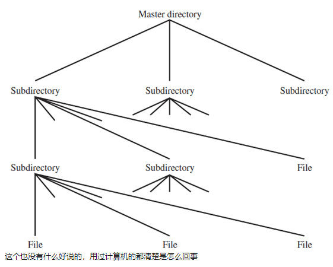

下面我们来了解一下文件的命名为了保证文件引用无二义性，文件需具有唯一的名字就像上课点名，如果两个同学名字相同，点名的时候就会比较尴尬
对于层次或者树状结构，系统中的任何文件可以按照从根目录（或主目录）向下到各个分支，最后到达该文件的路径来定位这一系列目录名和最后到达的文件名自身组成了该文件的路径名（绝对路径）比如：“D:\计算机操作系统_电子科技大学\Chap12.ppt”就是一个文件的路径名
这也是我们现在常用的方式注意到：因为同一目录下的目录不能重名、文件也不能重名，所以保证了路径名的唯一性大家通过下面这个图来了解一下路径的概念：

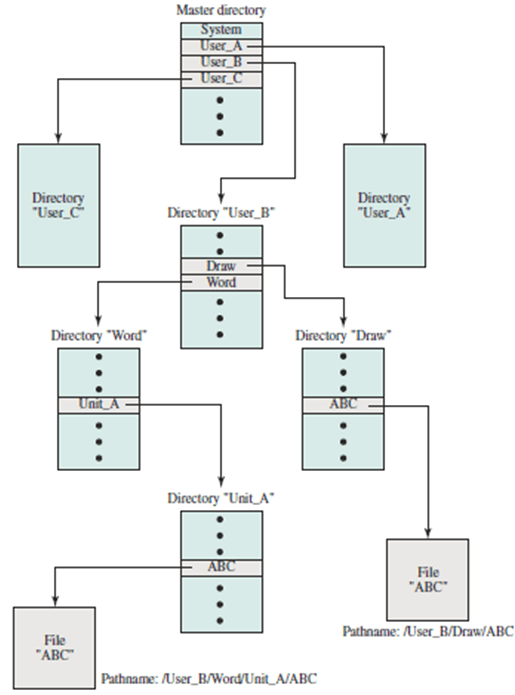

注意到，在这个图中，有两个文件的文件名都是ABC，但是它们的路径名不一样所以可以实现无二义的访问以上就是目录部分的介绍，大家理解一下，有问题举手

## 文件管理的物理I/O特征

我们知道，在磁盘中，一个扇区是一块，读取或写入的单位都是块可是，文件是有大有小的有可能一块放不下，也有可能一块放不满，怎么办？我们来看看文件管理是怎么做的
在文件管理中：（1）记录是访问文件的逻辑单元，而块是与辅存进行I/O的单位（2）为执行I/O，记录必须组织成块
对于给定的块大小，有三种组块方法：（1）固定组块（2）可变长度非跨越式组块（3）可变长度跨越式组块以下是“固定组块”的示意图：

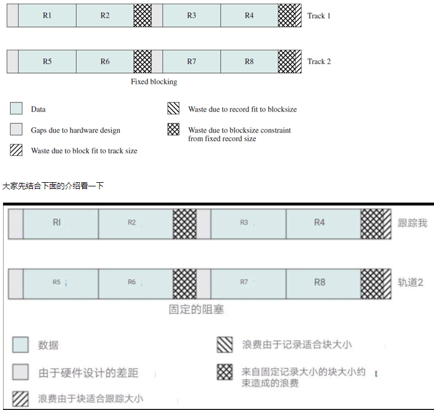

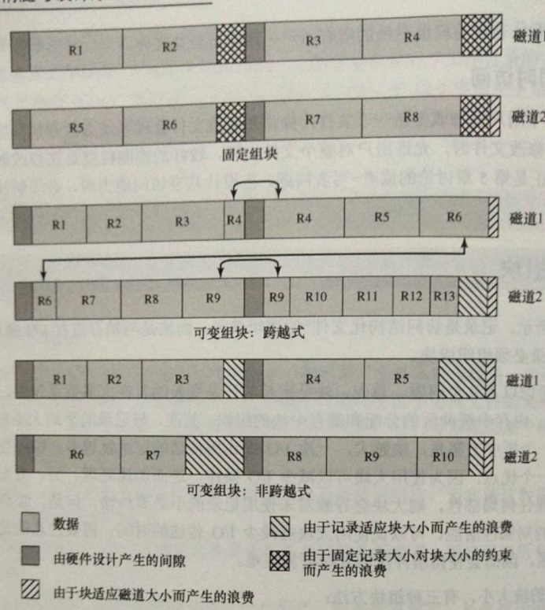

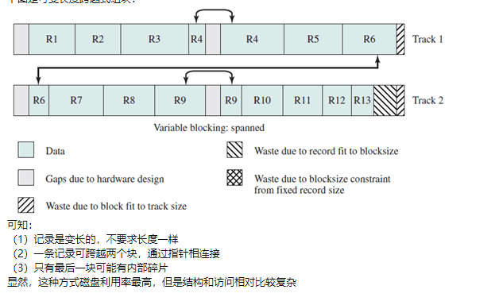

## 辅存管理

辅存管理需要解决两个问题：

（1）辅存中的空间如何分配给文件（文件分配）

（2）如何知道哪些空间可以分配（空闲空间管理）

一般来说，文件分配（文件物理组织）涉及的问题：

（一）当创建一个文件时，是否一次性分配最大空间？

（二）给文件分配的空间是一个还是多个连续的单元？

（三）为跟踪分配给文件的分区，应该使用哪种数据结构或表？

对于第一个问题：（一）当创建一个文件时，是否一次性分配最大空间？

可以采用“预分配”或“动态分配”

预分配要求在发出创建文件的请求时，声明该文件的大小 这个很好理解

但是，很多时候难以准确估计文件的大小

比如，进程还未结束，不知道产生的输出是多大 一般会将文件的大小多估计一些，以避免分配空间的不够用

相对而言，使用动态分配（按需要分配）要好一些

可以避免空间的浪费，但是需要根据需要相应地增加存储

对于第二个问题：（二）给文件分配的空间是一个还是多个连续的单元？

我们知道，分区（扇区）是磁盘分配的单元，因此首先要考虑分区大小

选择分区大小时需要折中地考虑单个文件的效率和整个系统的效率

（1）分区太大，内部碎片大，调入调出开销很大

（2）分区太小，管理起来很麻烦

对于是分配一个还是多个连续的单元，有两种选择方案：

（1）可变的大规模连续分区

（2）块（大小相同）

对于可变的大规模连续分区，就像我们之前遇到的动态分区：

（1）提供较好的性能

（2）大小可变，避免了浪费（无内部碎片）

（3）文件分配表（FAT）小（每个文件一项）

（4）缺点是：空间难以再次利用（有外部碎片）

对于块，就像我们之前遇到的分页：

（1）小的固定分区提供了更大的灵活性

（2）分配时可能需要较大的表或复杂的结构

（3）邻近性不是主要目标

（4）根据需要来分配块

对于第三个问题：（三）为跟踪分配给文件的分区，应该使用哪种数据结构或表？因为磁盘是基于块（扇区）的，因此我们在此背景下，来了解文件的分配方法
分配方法包括： （重点！！！！）（一）连续分配（二）链接分配（三）索引分配
对于（一）连续分配，在创建文件时，给文件分配一组连续的块在文件分配表（FAT）中每个文件只需要一个表项，用于说明起始块和文件的长度

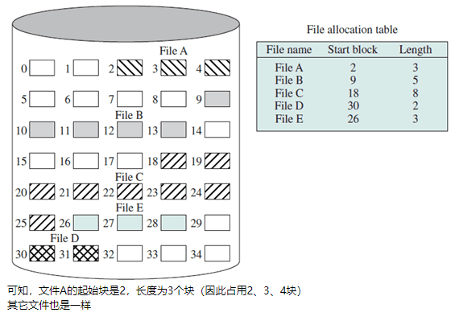

连续分配的优点：（1）可以提高顺序处理的I/O性能（2）检索容易
缺点：（1）需要在创建文件时声明文件的大小（2）会出现外部碎片（需要执行紧缩算法）
比如，在上图中，有大量不连续的空闲块我们知道，可以利用紧凑将空闲块合并上图紧凑以后，情况变成：

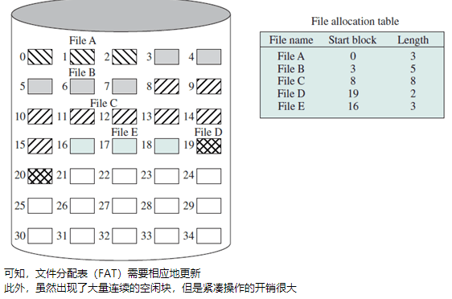

对于（二）链接分配，分配基于单个的块：（1）链中的每一块都包含指向下一块的指针（2）文件分配表中每个文件同样只需要一个表项，用于表明起始块和文件的长度以下图为例：

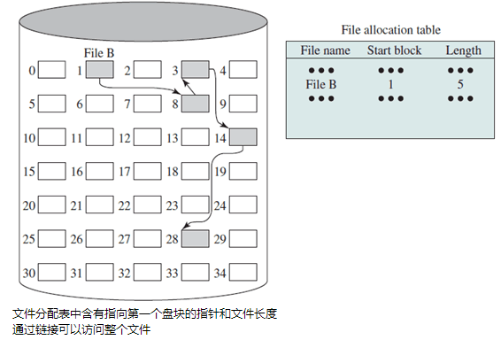

优点：（1）没有外部碎片，提高磁盘空间利用率（2）适合于顺序处理的顺序文件（3）有利于文件插入和删除（4）有利于文件动态扩充
缺点：（1）存取速度慢，不适于随机存取（查找时需要遍历数据）（2）可靠性问题，如指针出错（3）局部性原理不再适用，需要更多的寻道次数和寻道时间（4）链接指针占用一定的空间（5）需要周期性对文件进行合并

为什么需要周期性对文件进行合并合并类似于紧凑，就是将文件块顺序存放，可以提高访问时的效率比如，上图合并后，就变成：

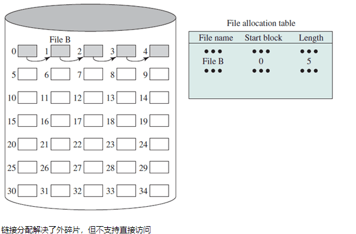

对于（三）索引分配，每个文件在文件分配表中有一个一级索引：（1）对于分配给文件的每个分区，索引中都包含一个表项（2）文件的索引（类似于页表）保存在一个单独的块中，文件分配表中该文件的表项指向这一块（3）索引分配既可以基于固定大小的块，也可以基于大小可变的分区以下是基于块的索引分配：

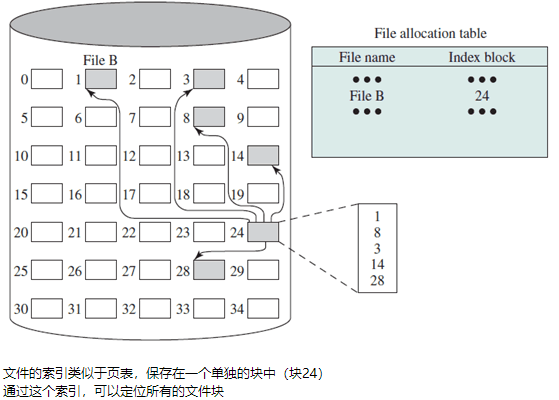

基于长度可变区域的索引分配

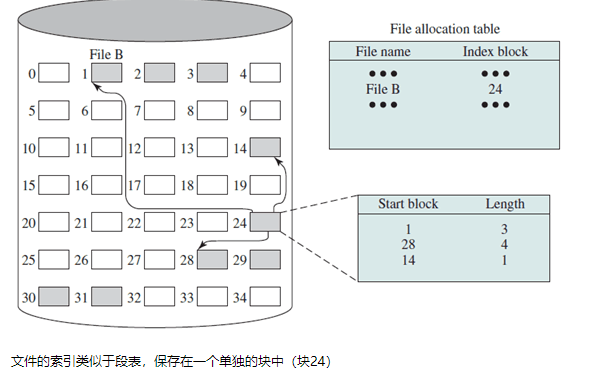

索引分配支持顺序访问和直接访问文件，应用最普遍优点：无外碎片，便于动态增长，可随机存取缺点：索引表占空间，需要先访问索引表，然后访问文件内容块（2次访问外存）一般认为，文件较大时，索引分配优于链接分配以上3种分配方式一定要理解啊
下面来看（四）辅存管理需要解决的两个问题（1）辅存中的空间如何分配给文件（文件分配）（2）如何知道哪些空间可以分配（空闲空间管理）中的最后一个对于空闲空间管理，如分配给文件的空间需要管理那样，没有分配的磁盘空间也需要管理

通常存在以下实现技术：（1）位表（2）链式空闲区（3）索引（4）空闲块列表
（2）（3）（4）都比较常见，大家想象一下就知道怎么回事了，在这里就不花时间解释了下面我们来了解一下是什么是位表（也叫位图）：（1）使用一个向量，向量的每一位对应于磁盘中的每一块（2）0表示空闲块，1表示已使用块

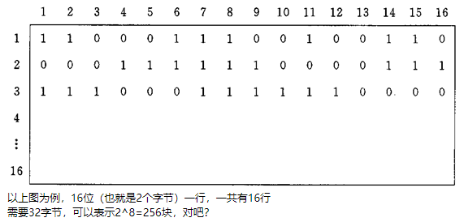

以上图为例，16位（也就是2个字节）一行，一共有16行需要32字节，可以表示2^8=256块，对吧？
假设磁盘一块（扇区）为512字节，则：（1）(1, 1)表示编号为0的块被占用（2）(1, 2)表示编号为1的块被占用（3）(1, 3)表示编号为2的块空闲如果采用空闲块列表，需要256项，如果每个表项2个字节，则需要512字节，刚好一块
以前一个整数需要两个字节，但是我们知道标志0和1只需要1位就可以了不需要用2字节，所以可以节约空间
大家以后找工作，可能会遇到一些变态的笔试题或面试题可能会用到位图
电话号码排序问题描述：输入：一个文件，包含n个正整数，每个正整数要小于n，这里n=1000万(7位)，这些数都不重复输出：以升序排序文件约束：至多(大概)只有1MB的可用内存，时限10s左右，外存不限制如果实在想不出来，可以参考下面的链接：

https://blog.csdn.net/sophie_wise8/article/details/7593624

好了，扯远了，再回到位图根据块号，我们可以迅速地算出行号和列号（大家课后可以研究一下怎么计算）
因此，（1）查找位表，可以确定该块是否空闲（2）如果需要连续的块，只要查找连续的0即可（3）回收时也很简单，只要将标志位置为0就行
因此，位表的优点：（1）空间分配的描述能力强，通过它可以比较容易地找到一个或一组连续的空闲块，适合任何文件分配方法（2）位图非常小，可复制到内存

