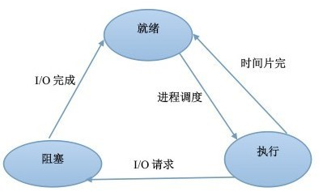

## 进程和线程的区别

- 进程（Process）是系统进行资源分配和调度的基本单位，线程（Thread）是CPU调度和分派的基本单位；
- 线程依赖于进程而存在，一个进程至少有一个线程；
- 进程有自己的独立地址空间，线程共享所属进程的地址空间；
- 进程是拥有系统资源的一个独立单位，而线程自己基本上不拥有系统资源，只拥有一点在运行中必不可少的资源(如程序计数器,一组寄存器和栈)，和其他线程共享本进程的相关资源如内存、I/O、cpu等；
- 在进程切换时，涉及到整个当前进程CPU环境的保存环境的设置以及新被调度运行的CPU环境的设置，而线程切换只需保存和设置少量的寄存器的内容，并不涉及存储器管理方面的操作，可见，进程切换的开销远大于线程切换的开销；
- 线程之间的通信更方便，同一进程下的线程共享全局变量等数据，而进程之间的通信需要以进程间通信(IPC)的方式进行；
- 多线程程序只要有一个线程崩溃，整个程序就崩溃了，但多进程程序中一个进程崩溃并不会对其它进程造成影响，因为进程有自己的独立地址空间，因此多进程更加健壮

### 问题1 同一进程中线程可以共享那些数据

- 进程代码段
- 进程的公有数据（全局变量、静态变量...）
- 进程打开的文件描述符
- 进程的当前目录
- 信号处理器/信号处理函数：对收到的信号的处理方式
- 进程ID与进程组ID

### 问题2 线程独占那些资源

- 线程ID
- 一组寄存器的值
- 线程自身的栈（堆是共享的）
- 错误返回码：线程可能会产生不同的错误返回码，一个线程的错误返回码不应该被其它线程修改；
- 信号掩码/信号屏蔽字(Signal mask)：表示是否屏蔽/阻塞相应的信号（SIGKILL,SIGSTOP除外）

## 进程有哪几种状态

- 就绪状态：进程已获得除处理机以外的所需资源，等待分配处理机资源
- 运行状态：占用处理机资源运行，处于此状态的进程数小于等于CPU数
- 阻塞状态： 进程等待某种条件，在条件满足之前无法执行

