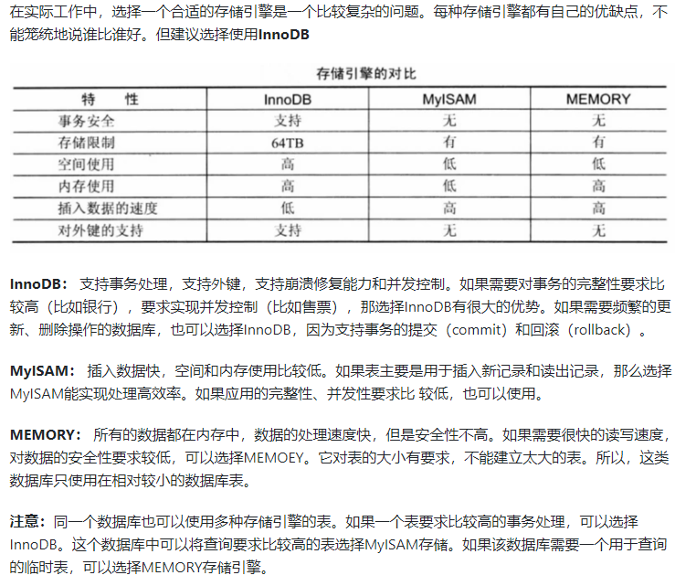

MySQL三种存储引擎的区别

- InnoDB**支持事务**，可以进行Commit和Rollback；
- MyISAM 只支持表级锁，而 InnoDB 还**支持行级锁**，提高了并发操作的性能；
- InnoDB **支持外键**；
- MyISAM **崩溃**后发生损坏的概率比 InnoDB 高很多，而且**恢复的速度**也更慢；
- MyISAM 支持**压缩**表和空间数据索引，InnoDB需要更多的内存和存储；
- InnoDB 支持在线**热备份**

### 应用场景

- **MyISAM** 管理非事务表。它提供高速存储和检索（MyISAM强调的是性能，每次查询具有原子性，其执行速度比InnoDB更快），以及全文搜索能力。如果表比较小，或者是只读数据（有大量的SELECT），还是可以使用MyISAM；
- **InnoDB** 支持事务，并发情况下有很好的性能，基本可以替代MyISAM

## 数据库优化

### 1.SQL语句优化

> 分析慢查询日志：记录了在MySQL中响应时间超过阀值long_query_time的SQL语句，通过日志去找出IO大的SQL以及发现未命中索引的SQL

> 使用 Explain 进行分析：通过explain命令可以得到表的读取顺序、数据读取操作的操作类型、哪些索引可以使用、**哪些索引被实际使用**、表之间的引用以及**被扫描的行数**等问题；

- 应尽量避免在 where 子句中使用`!=`、`<`、`>`操作符或对字段进行null值判断，否则将引擎放弃使用索引而进行全表扫描；
- 只返回必要的列：最好不要使用 SELECT * 语句；
- 只返回必要的行：使用 LIMIT 语句来限制返回的数据；
- 将一个大连接查询分解成对每一个表进行一次单表查询，然后在应用程序中进行关联，这样做的好处有：
  - 让缓存更高效。对于连接查询，如果其中一个表发生变化，那么整个查询缓存就无法使用。而分解后的多个查询，即使其中一个表发生变化，对其它表的查询缓存依然可以使用；
  - 分解成多个单表查询，这些单表查询的缓存结果更可能被其它查询使用到，从而减少冗余的查询；
  - 减少锁竞争

### 2.索引优化

注意会引起索引失效的情况，以及在适合的地方建立索引

### 3.数据库表结构的优化

- 设计表时遵循**三大范式**；
- 选择合适的**数据类型**：尽可能不要存储NULL字段；使用简单的数据类型（int, varchar/ text）；
- 表的**水平切分**（Sharding）：将同一个表中的记录拆分到多个结构相同的表中（策略：哈希取模；根据ID范围来分）。当一个表的数据不断增多时，Sharding 是必然的选择，它可以将数据分布到集群的不同节点上，从而缓解单个数据库的压力；
- 表的**垂直切分**：将一张表按列切分成多个表。可以将不常用的字段单独放在同一个表中；把大字段独立放入一个表中；或者把经常使用的字段（关系密切的）放在一张表中。垂直切分之后业务更加清晰，系统之间整合或扩展容易，数据维护简单

### 4.系统配置优化

- 操作系统：增加TCP支持的队列数；
- MySQL配置文件优化：缓存池大小和个数设置

### 5.硬件优化

- 磁盘性能：固态硬盘；
- CPU：多核且高频；
- 内存：增大内存

## SQL语句安全性

（1）防止sql注入，对特殊字符进行转义，过滤或者使用预编译sql语句绑定
（2）使用最小权限原则，特别是不要使用root账户，对不同的操作建立不同的账户
（3）不要把数据库出错的信息暴露到客户端