# 图的定义和基本术语

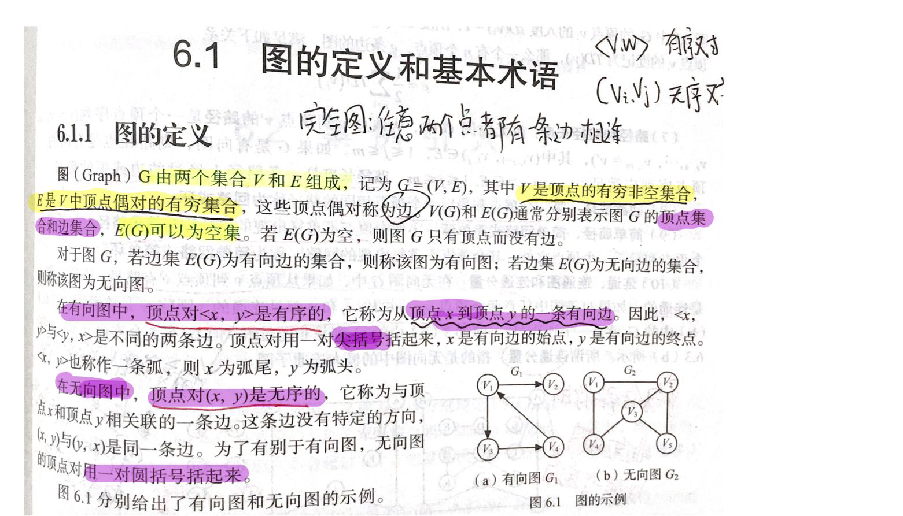

## 图的基本术语

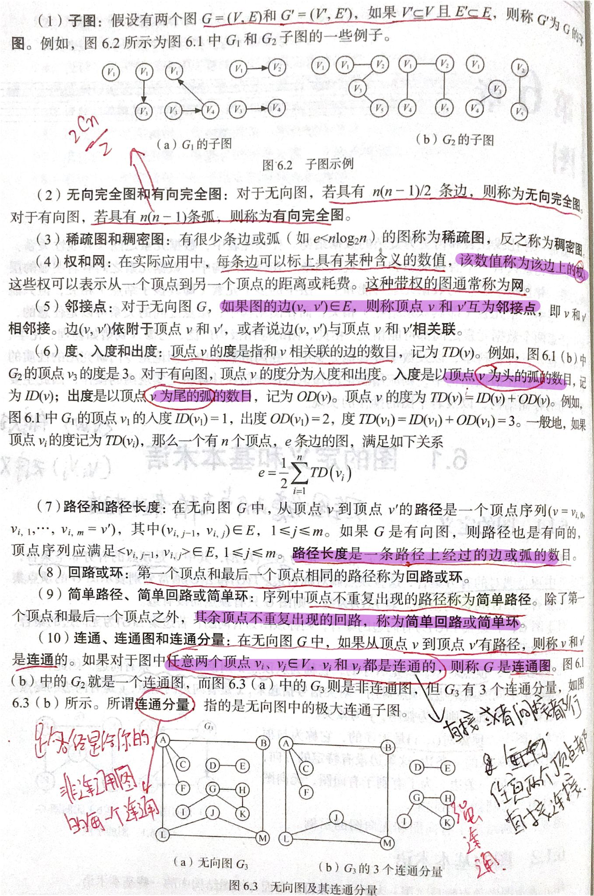

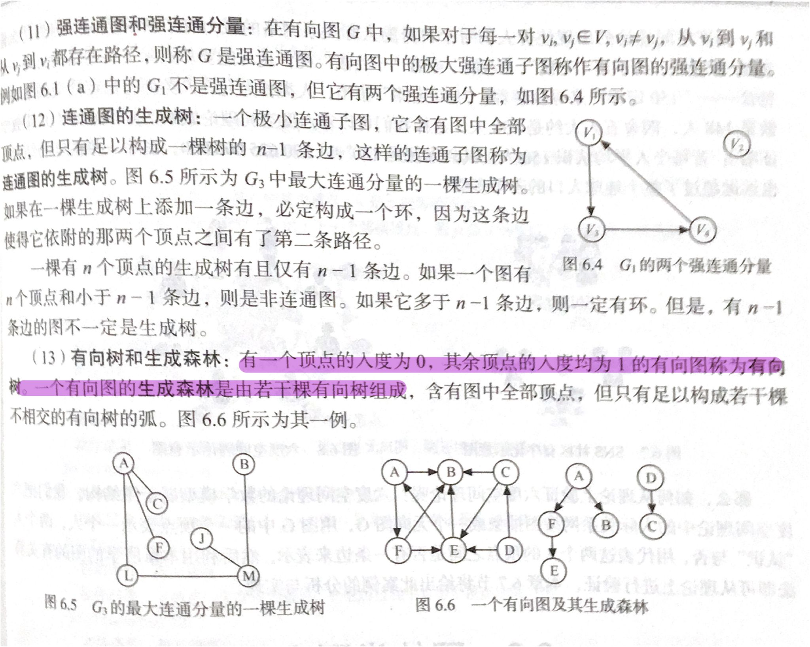

# 图的表示方法

## 临接矩阵表示法

对于带权的图，可以使用无穷来表示无连接

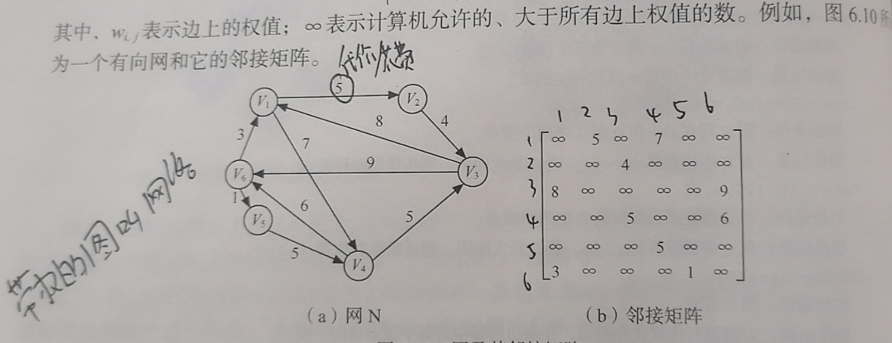

### 优缺点

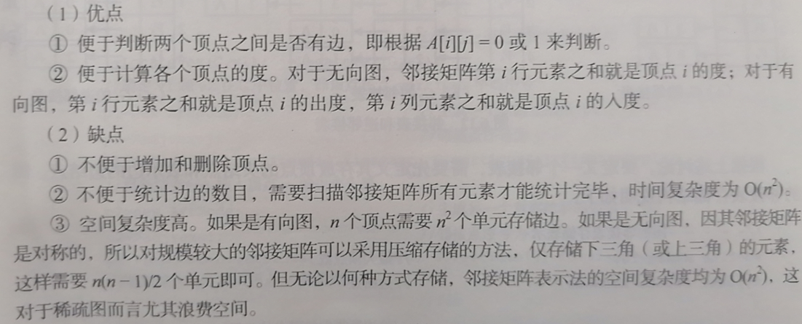

## 临接表表示

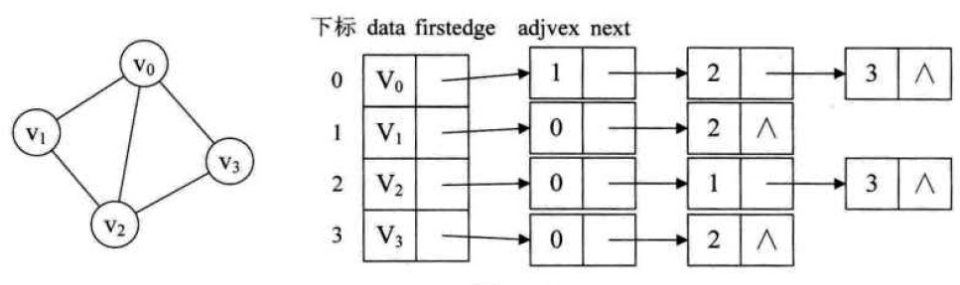

有向图的表示

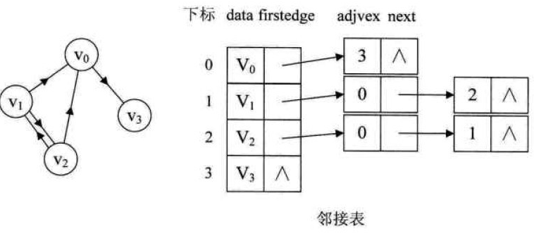

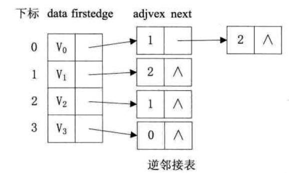

### 优缺点

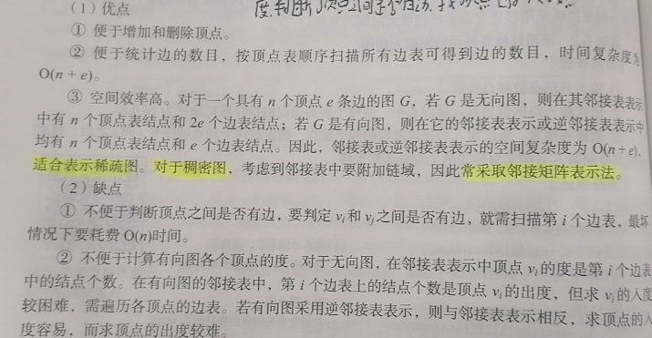

## 十字链表

把邻接表与逆邻接表结合起来，即有向图的一种存储方法**十字链表**(Orthogonal  List)

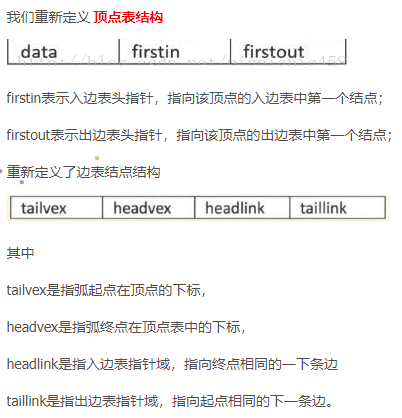

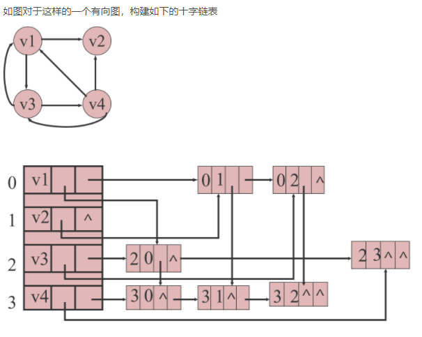

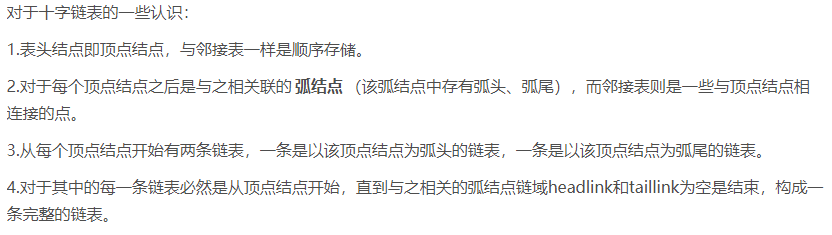

## 邻接多重表

十字链表主要针对有向图，而临接多重表则适用于无向图

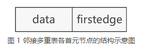

- data：存储此顶点的数据；
- firstedge：指针域，用于指向同该顶点有直接关联的存储其他顶点的节点。

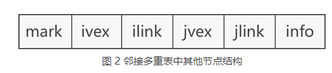

- mark：标志域，用于标记此节点是否被操作过，例如在对图中顶点做遍历操作时，为了防止多次操作同一节点，mark 域为 0 表示还未被遍历；mark 为 1 表示该节点已被遍历；
- ivex 和 jvex：数据域，分别存储图中各边两端的顶点所在数组中的位置下标；
- ilink：指针域，指向下一个存储与 ivex 有直接关联顶点的节点；
- jlink：指针域，指向下一个存储与 jvex 有直接关联顶点的节点；
- info：指针域，用于存储与该顶点有关的其他信息，比如无向网中各边的权；

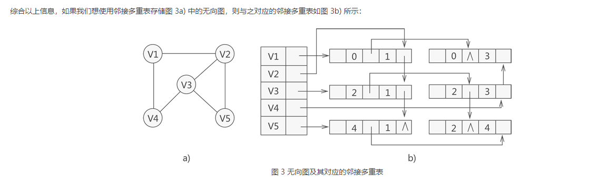

# 图的遍历

## 深度优先搜索 DFS

## 广度优先搜索 BFS

> 参考：

[数据结构——关于图的存储中十字链表和邻接多重表的理解和思考 - 王陸 - 博客园 (cnblogs.com)](https://www.cnblogs.com/wkfvawl/p/9985083.html)