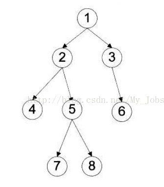

## 二叉树的遍历

1.先序遍历：根结点 ---> 左子树 ---> 右子树

2.中序遍历：左子树---> 根结点 ---> 右子树

3.后序遍历：左子树 ---> 右子树 ---> 根结点

4.层次遍历：只需按层次遍历即可

比如上面这张图，遍历的结果如下所示

先序遍历：1 2 4 5 7 8 3 6

中序遍历：4 2 7 5 8 1 3 6

后序遍历：4 7 8 5 2 6 3 1

层次遍历：1 2 3 4 5 6 7 8

这里我简单解释一下先序遍历。

我们可以看到1是根节点，所以先是1，然后左子树是2，这里我们到2可以看到2是下一课树的根节点，所以左子树是4，这个时候已经不能往下了，所以我们遍历右子树5往下就是左子树7，然后右子树8，到这个时候，我们的1的那个左子树已经遍历完了然后我们向右。后面就不说了

## 二叉树的性质

1.在二叉树的第i层上至多有2^(i-1)个节点

2.深度为k的二叉树至多有2^(k) - 1

3.对于任何一棵二叉树T如果其终端结点数为n0度为2的节点为n2，则n0=n2+1

## 满二叉树

深度为k且含有2^k-1个节点的二叉树，其实就是最后一层可以不满，但是上一层必须摆满。

## B+树，B树，红黑树

### 红黑树

一种二叉查找树,但在每个节点增加一个存储位表示节点的颜色,可以是red或black. 通过对任何一条从根到叶子的路径上各个节点着色的方式的限制,红黑树确保没有一条路径会比其它路径长出两倍.它是一种弱平衡二叉树(**由于是若平衡,可以推出,相同的节点情况下,AVL树的高度低于红黑树**),相对于要求严格的AVL树来说,它的旋转次数变少,所以对于搜索,插入,删除操作多的情况下,我们就用红黑树.

性质：

- 每个节点非红即黑.
- 根节点是黑的。
- 每个叶节点(**叶节点即树尾端NUL指针或NULL节点**)都是黑的.
- 如果一个节点是红的,那么它的两儿子都是黑的.
- 对于任意节点而言,其到叶子点树NIL指针的每条路径都包含相同数目的黑节点.

应用

- 广泛用于C++的STL中,map和set都是用红黑树实现的.
- 著名的linux进程调度[Completely Fair Scheduler](https://en.wikipedia.org/wiki/Completely_Fair_Scheduler),用红黑树管理进程控制块,进程的虚拟内存区域都存储在一颗红黑树上,每个虚拟地址区域都对应红黑树的一个节点,左指针指向相邻的地址虚拟存储区域,右指针指向相邻的高地址虚拟地址空间.
- IO多路复用epoll的实现采用红黑树组织管理sockfd，以支持快速的增删改查.
- ngnix中,用红黑树管理timer,因为红黑树是有序的,可以很快的得到距离当前最小的定时器.
- java中TreeMap的实现.

### B+树和B树

B+树更适合用于文件索引，比如MySQL的innodb就是使用的B+数来进行索引

后面参考这个：https://segmentfault.com/a/1190000020416577

## 线索二叉树

## 哈夫曼树