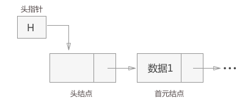

## 链表

链表分为单链表，循环链表，双向链表，二叉链表，十字链表，邻接表，邻接多重表

## 首元节点，头节点，头指针

头结点：有时，在链表的第一个节点之前会额外增设一个节点，该节点的数据域一般不存放数据（有些情况下也可以存放链表的长度等信息），此节点被称为头节点。若链表中存在头节点，且头节点的指针域为空（NULL），表明链表是空表。头节点对于链表来说，不是必须的，换句话说，一个完整的链表中可以不设有头节点。那么，可能有人会问：既然头节点无关紧要，那它有什么作用？在处理某些问题时，给链表添加头节点会使问题变得简单。

首元节点：链表中第一个元素所在的节点，它是头节点后边的第一个节点。其实，首元节点和链表中存放数据的其他节点没什么不同，只是因为该节点位于链表的头部，所以被称为首元节点。

头指针：链表的头指针永远指向链表中第一个节点的位置，换句话说，如果链表有头节点，头指针指向头节点；否则，头指针指向首元节点。一个链表可以头节点，但不能没有头指针。

头节点和头指针的区别是：

- 头指针是一个指针，头指针指向链表的头节点或者首元节点；
- 头节点是一个实际存在的节点，它包含有数据域和指针域。

头节点和头指针的区别在程序中的直接体现是：头指针只声明而没有分配存储空间，头节点需要声明并分配一个节点的实际物理内存。

## 循环链表，双向链表

循环链表是表中最后一个节点的指针域指向头节点。整个链表形成一个环。

双向链表就是每个节点都有两个指针域，一个指向前驱，一个指向后继