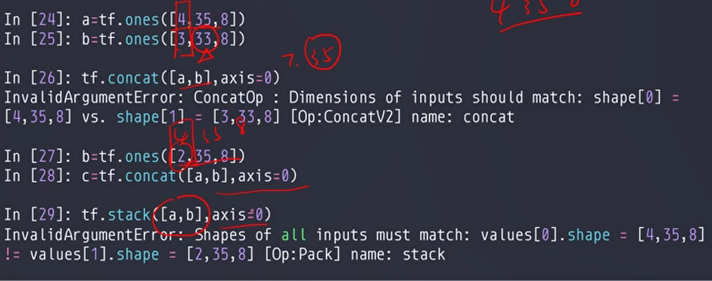
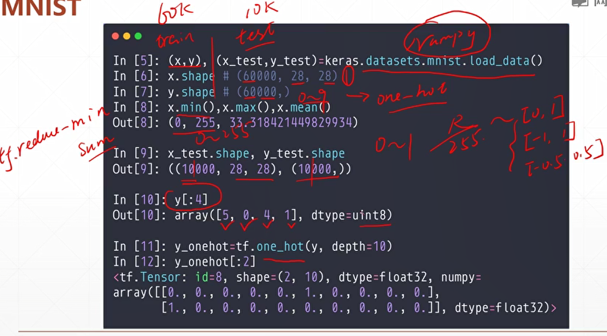
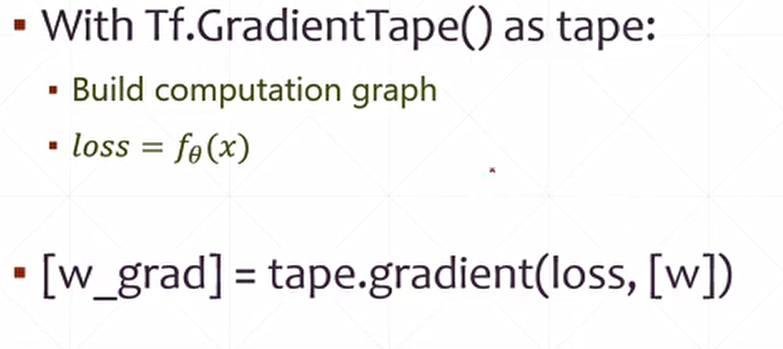

# 张量的数学运算


 

我们这里可以对tensor直接进行加减乘除运算


矩阵相乘


实例


# 前向传播实战


这里我们使用Python来进行实战，来优化误差

```python
import tensorflow as tf
from tensorflow import keras
# 导入keras里面的一个数据集 optimizer是一个优化器 optimizers
from tensorflow.keras import datasets

# 去除无关信息
import os
os.environ['TF_CPP_MIN_LOG_LEVEL'] = '2'


# 加载数据集
# 这里我们导入的两个类型(一个是手写字体的图片集，后面那个60k其实就是图片对应的数字)
# x: [60k,28,28]
# y: [60k]
(x, y), _ = datasets.mnist.load_data()

# 转换一下数据类型
# x:[0:255] => [0~1.0]
x = tf.convert_to_tensor(x, dtype=tf.float32)/255
y = tf.convert_to_tensor(y, dtype=tf.int32)

# 简单看一下x和y的类型
print(x.shape, y.shape, x.dtype, y.dtype)
# 打印的结果如下 (60000, 28, 28) (60000,) <dtype: 'float32'> <dtype: 'int32'>

# 查看x的最小值和最大值
print(tf.reduce_min(x), tf.reduce_max(x))
print(tf.reduce_min(y), tf.reduce_max(y))
# (这个是没有除之前)
# tf.Tensor(0.0, shape=(), dtype=float32) tf.Tensor(255.0, shape=(), dtype=float32)
# tf.Tensor(0, shape=(), dtype=int32) tf.Tensor(9, shape=(), dtype=int32)

# 我们需要创建一个数据集来进行训练(我们取128条数据)
train_db = tf.data.Dataset.from_tensor_slices((x,y)).batch(128)
# 我们使用一个迭代器来不断迭代这些分组数据
train_iter = iter(train_db)
sample = next(train_iter)
print('batch:', sample[0].shape, sample[1].shape)
# 这里我们只取了128条数据来进行测试 batch: (128, 28, 28) (128,)

# 下面我们进行降维操作
# [b,784] => [b,256] => [b,128] => [b,10]
# [dim_in,dim_out],[dim_out]
# 这里我们创建好3个tensor w1是随机生成的b1则全是0
# 因为梯度计算需要variable类型的数据，所以我们这里需要进行数据转换(stddev这里我们修改一下方差)
w1 = tf.Variable(tf.random.truncated_normal([784, 256], stddev=0.1))
b1 = tf.Variable(tf.zeros([256]))
w2 = tf.Variable(tf.random.truncated_normal([256, 128], stddev=0.1))
b2 = tf.Variable(tf.zeros([128]))
w3 = tf.Variable(tf.random.truncated_normal([128, 10], stddev=0.1))
b3 = tf.Variable(tf.zeros([10]))

lr =1e-3
# 为了减小误差，我们这里可以多迭代几遍
for each in range(10):
    # 这里我们每一步都称为一个step， enumerate会返回train_db里面的所有值，给step打印
    for step,(x,y) in enumerate(train_db):
        # x:[128,28,28]
        # y:[128]
        # 这里我们在进行纬度转换，我们把[b,28,28] => [b,28*8]
        x = tf.reshape(x, [-1, 28*28])

        # 参与梯度计算(这个梯度默认只会跟踪tf.variable类型的数据)
        with tf.GradientTape() as tape:
            # x:[b,28*28]
            # h1 = x@w1 + b1 这个和下面那个计算方式是一样的
            # broadcast_to 利用广播将原始矩阵成倍增加，广播是使数组具有兼容形状以进行算术运算的过程
            # [b,784]@[784,256] + [256] => [b,256] + [256] => [b,256] + [b,256]
            h1 = x@w1 + tf.broadcast_to(b1, [x.shape[0], 256])
            # tf.nn.relu()函数是将大于0的数保持不变，小于0的数置为0
            h1 = tf.nn.relu(h1)
            # [b,256] => [b,128] 这个TensorFlow会自动转换，这里我们不管
            h2 = h1@w2 + b2
            h2 = tf.nn.relu(h2)
            # [b,128] => [b,10]
            out = h2@w3 + b3

            # 计算误差 loss
            # print('out:', out)
            # out: [b,10]
            # y: [b]
            y_oneHot = tf.one_hot(y, depth=10)

            # mse = mean((y-out)^2) 这里其实就是在计算每个纬度之间的欧式距离的平方和
            # loss = [b,10]
            loss = tf.square(y_oneHot - out)
            # 上面的loss得到的是二维的矩阵，我们还需要变成标量
            loss = tf.reduce_mean(loss)

        # 这里我们在进行梯度计算
        grades = tape.gradient(loss, [w1, b1, w2, b2, w3, b3])
        # w1 = w1 -lr * w1_grad
        # 这里我们使用assign对w1进行原地更新，新的w1类型不变
        w1.assign_sub(lr * grades[0])
        # 下面这个语句和上面的操作是一样的，只是w1会变成tf.tensor类型
        # w1 = w1 - lr * grades[0]
        b1.assign_sub(lr * grades[1])
        w2.assign_sub(lr * grades[2])
        b2.assign_sub(lr * grades[3])
        w3.assign_sub(lr * grades[4])
        b3.assign_sub(lr * grades[5])

        # 每计算100次，我们打印loos信息
        if step % 100 == 0:
            # 如果出现loss: nan 说明出现了梯度爆炸
            print(step, 'loss:', float(loss))
```


这里的loss就是误差


前后对比我们可以发现我们的误差小了很多倍


# 张量的合并与分割


合并的例子


创建一个新的纬度


下面可以在任意一个轴创建新纬度


stack必须要保存所有纬度都相等




unstack是拆分


splite 不仅可以打散，还能均分


# 数据统计

范数，最大值和最小值

## 向量的范数

二范数，无穷范数，一范数


可以得到最大值还有最大值的位置


去除重复元素


# 张量排序


这里我们使用shuffle打乱数据，然后对数据进行排序


高维排序


# 数据填错充与复制

数据填充


【0,0】 一个是左边，一个是右边


图片填充


复制数据


# 张量限幅


**relu函数 ： 负数变成0 正数保持不变**


 决策树剪


# 高阶操作


我们可以通过where来查询每个位true的坐标值


根据指定的位置来进行更新


# 数据集加载

小型常用的数据集加载


比如我们那个最简单的手写字体



加载图片库


shuffle可以打散数据，同时还不会影响对应关系


.map可以对数据进行预处理


 .batch就是对数据进行操作


# 张量测试实战

这里在上一部的代码基础上进行计算，计算出正确率


实际代码如下：

```python
import tensorflow as tf
from tensorflow import keras
# 导入keras里面的一个数据集 optimizer是一个优化器 optimizers
from tensorflow.keras import datasets

# 去除无关信息
import os

os.environ['TF_CPP_MIN_LOG_LEVEL'] = '2'

# 加载数据集
# 这里我们导入的两个类型(一个是手写字体的图片集，后面那个60k其实就是图片对应的数字)
# x: [60k,28,28]
# y: [60k]
# 这里我们还需要读取测试集
(x, y), (x_test, y_test) = datasets.mnist.load_data()

# 转换一下数据类型
# x:[0:255] => [0~1.0]
x = tf.convert_to_tensor(x, dtype=tf.float32) / 255
y = tf.convert_to_tensor(y, dtype=tf.int32)

x_test = tf.convert_to_tensor(x_test, dtype=tf.float32) / 255
y_test = tf.convert_to_tensor(y_test, dtype=tf.int32)

# 简单看一下x和y的类型
print(x.shape, y.shape, x.dtype, y.dtype)
# 打印的结果如下 (60000, 28, 28) (60000,) <dtype: 'float32'> <dtype: 'int32'>

# 查看x的最小值和最大值
print(tf.reduce_min(x), tf.reduce_max(x))
print(tf.reduce_min(y), tf.reduce_max(y))
# (这个是没有除之前)
# tf.Tensor(0.0, shape=(), dtype=float32) tf.Tensor(255.0, shape=(), dtype=float32)
# tf.Tensor(0, shape=(), dtype=int32) tf.Tensor(9, shape=(), dtype=int32)

# 我们需要创建一个数据集来进行训练(我们取128条数据)
train_db = tf.data.Dataset.from_tensor_slices((x, y)).batch(128)

# 创建一个测试集
test_db = tf.data.Dataset.from_tensor_slices((x_test, y_test)).batch(128)

# 我们使用一个迭代器来不断迭代这些分组数据
train_iter = iter(train_db)
sample = next(train_iter)
print('batch:', sample[0].shape, sample[1].shape)

# 这里我们只取了128条数据来进行测试 batch: (128, 28, 28) (128,)

# 下面我们进行降维操作
# [b,784] => [b,256] => [b,128] => [b,10]
# [dim_in,dim_out],[dim_out]
# 这里我们创建好3个tensor w1是随机生成的b1则全是0
# 因为梯度计算需要variable类型的数据，所以我们这里需要进行数据转换(stddev这里我们修改一下方差)
w1 = tf.Variable(tf.random.truncated_normal([784, 256], stddev=0.1))
b1 = tf.Variable(tf.zeros([256]))
w2 = tf.Variable(tf.random.truncated_normal([256, 128], stddev=0.1))
b2 = tf.Variable(tf.zeros([128]))
w3 = tf.Variable(tf.random.truncated_normal([128, 10], stddev=0.1))
b3 = tf.Variable(tf.zeros([10]))

lr = 1e-3
# 为了减小误差，我们这里可以多迭代几遍
for each in range(10):
    # 这里我们每一步都称为一个step， enumerate会返回train_db里面的所有值，给step打印
    for step, (x, y) in enumerate(train_db):
        # x:[128,28,28]
        # y:[128]
        # 这里我们在进行纬度转换，我们把[b,28,28] => [b,28*8]
        x = tf.reshape(x, [-1, 28 * 28])

        # 参与梯度计算(这个梯度默认只会跟踪tf.variable类型的数据)
        with tf.GradientTape() as tape:
            # x:[b,28*28]
            # h1 = x@w1 + b1 这个和下面那个计算方式是一样的
            # broadcast_to 利用广播将原始矩阵成倍增加，广播是使数组具有兼容形状以进行算术运算的过程
            # [b,784]@[784,256] + [256] => [b,256] + [256] => [b,256] + [b,256]
            h1 = x @ w1 + tf.broadcast_to(b1, [x.shape[0], 256])
            # tf.nn.relu()函数是将大于0的数保持不变，小于0的数置为0
            h1 = tf.nn.relu(h1)
            # [b,256] => [b,128] 这个TensorFlow会自动转换，这里我们不管
            h2 = h1 @ w2 + b2
            h2 = tf.nn.relu(h2)
            # [b,128] => [b,10]
            out = h2 @ w3 + b3

            # 计算误差 loss
            # print('out:', out)
            # out: [b,10]
            # y: [b]
            y_oneHot = tf.one_hot(y, depth=10)

            # mse = mean((y-out)^2) 这里其实就是在计算每个纬度之间的欧式距离的平方和
            # loss = [b,10]
            loss = tf.square(y_oneHot - out)
            # 上面的loss得到的是二维的矩阵，我们还需要变成标量
            loss = tf.reduce_mean(loss)

        # 这里我们在进行梯度计算
        grades = tape.gradient(loss, [w1, b1, w2, b2, w3, b3])
        # w1 = w1 -lr * w1_grad
        # 这里我们使用assign对w1进行原地更新，新的w1类型不变
        w1.assign_sub(lr * grades[0])
        # 下面这个语句和上面的操作是一样的，只是w1会变成tf.tensor类型
        # w1 = w1 - lr * grades[0]
        b1.assign_sub(lr * grades[1])
        w2.assign_sub(lr * grades[2])
        b2.assign_sub(lr * grades[3])
        w3.assign_sub(lr * grades[4])
        b3.assign_sub(lr * grades[5])

        # 每计算100次，我们打印loos信息
        if step % 100 == 0:
            # 如果出现loss: nan 说明出现了梯度爆炸
            print(step, 'loss:', float(loss))

    # 到上面为止我们已经训练好了模型，这里我们测试
    # 计算正确率
    total_correct,total_number = 0, 0
    # 这里我们获取 最新的[w1,b1,2,b2,w3,b3]来进行测试
    for step, (x, y) in enumerate(test_db):
        # b[28,28,28] => [b,28*28]
        x = tf.reshape(x, [-1, 28 * 28])

        # 这里我们进行计算来降维
        #  [b,784] => [b,256] => [b,10]
        h1 = tf.nn.relu(x@w1+b1)
        h2 = tf.nn.relu(h1@w2+b2)
        out = h2@w3 + b3

        # 我们计算的out为 [b,10] ~ R
        # 测试赛的prob为 [b,10] ~ [0,1]
        prob = tf.nn.softmax(out, axis=1)
        # argmax求出概率最大所在的位置 [b,10] => [b]
        # 注意，这里返回的是int64
        pred = tf.argmax(prob, axis=1)
        pred = tf.cast(pred, dtype=tf.int32)
        # 上面这个是预测值，y是实际值
        correct = tf.cast(tf.equal(pred, y), dtype=tf.int32)
        correct = tf.reduce_sum(correct)

        #  计算正确数
        total_correct += int(correct)
        total_number += x.shape[0]

    acc = total_correct / total_number
    print('test acc:', acc)
```

# 全连接层

当我们计算的层数多了起来，就有点像deepLearing了


神经网络今天才发展起来的原因

一是算力的提升


而是大数据（社交媒体产生了大量数据）


下面我们简单的实战一下

```python
import tensorflow as tf
from tensorflow import keras

# 这个是我们的网络样本
x = tf.random.normal([2, 3])

# 我们我们创建了三层的神经网络
model = keras.Sequential([
      keras.layers.Dense(2, activation='relu'),
      keras.layers.Dense(2, activation='relu'),
      keras.layers.Dense(2)
   ])

model.build(input_shape=[None, 3])
model.summary()

for p in model.trainable_variables:
   print(p.name, p.shape)
```


打印结果


# 输出方式

我们有下面这几种输出方式


softmax可以确保总和为1

# 误差计算

loss一般使用欧式距离来计算loss


信息熵在数学上的定义


交叉熵


分类问题的误差计算


交叉熵计算

前面那个是我们的实际值，后面的那个是我们的预测值


# 梯度下降

深度学习的核心就是梯度

梯度就是所有轴方向的微分和


使用下面这个函数来计算梯度



那个tape返回了函数的梯度


二阶求导


# 激活函数及其梯度

激活函数就是没有超过阈值不会变，只有超过阈值就会输出一个固定的值


我们可以变成下面这种的


我们来计算一下导数


# loss及其梯度


# 单输出感知机及其梯度

单层感知机的计算公式如下


 


