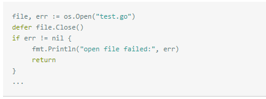
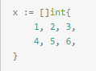
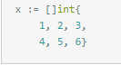
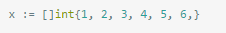
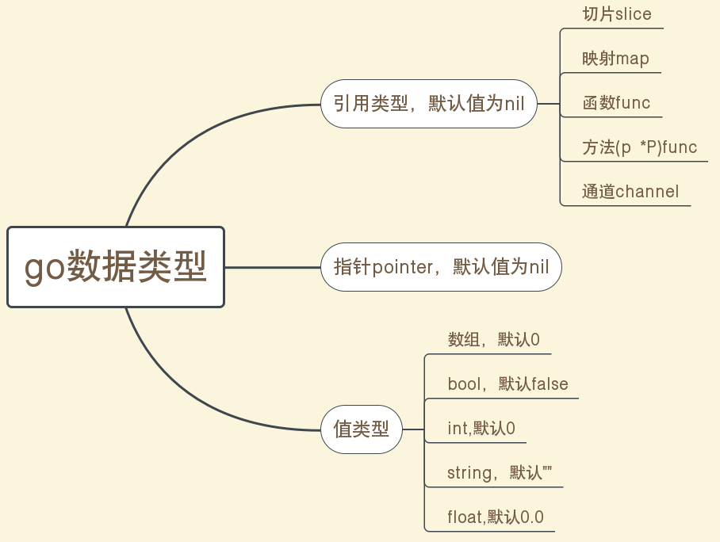
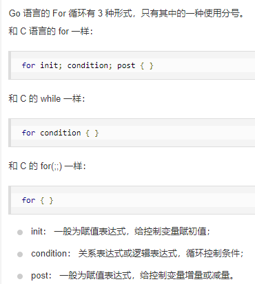
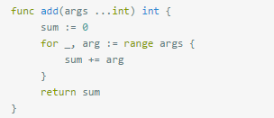
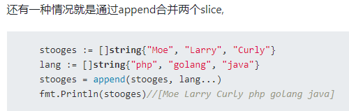
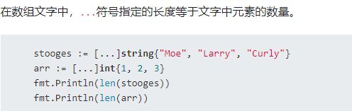
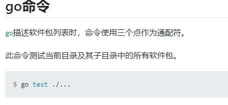

## go的内存回收机制

go的内存回收不会对局部变量进行判断，只要有一个指针指向一个变量，那么这个变量就不会被释放。

## 类型转换和类型断言

类型转换 ->Type（表达式或变量）

类型断言 ->变量或表达式.(Type)

类型断言针对接口来说的，而类型转换则是可以用于变量的转换他也可以用于接口

类型转换是转换不同的数据类型，而类型断言时转换相同的数据类型

go的bool类型和int类型是不能强制转换的

## go的switch语法

go的switch的类型判断部分的表达式是可加可不加的，如果不加就需要在case里面进行判断

```go
switch {
      case grade == "A" :
         fmt.Printf("优秀!
" )  
      case grade == "B", grade == "C" :
         fmt.Printf("良好
" )  
      case grade == "D" :
         fmt.Printf("及格
" )  
      case grade == "F":
         fmt.Printf("不及格
" )
      default:
         fmt.Printf("差
" );
   }
```

case里面可以有一个或者多个表达式

```go
switch marks {
      case 90: grade = "A"
      case 80: grade = "B"
      case 50,60,70 : grade = "C"
      default: grade = "D"  
   }
```

case里是不需要用break的，因为go默认会加break。如果我们不想用break，那么可使用 `fallthrough`关键词来执行下面的case代码块

## go的panic和异常处理

当go出现错误的时候，调用内置的panic函数，然后外围的函数就会立即终止，然后任何延迟执行的defer函数都会被调用，然后就是一层一层的在调用栈中重复发生，直到到达main函数的时候就没有返回的调用者了，这个时候程序就会被终止，然后把最原始的panic的值输出到os.stderr中这个就是错误发生的整体流程

## recover函数

`recover` 可以中止`panic` 造成的程序崩溃。它是一个只能在`defer` 中发挥作用的函数，在其他作用域中调用不会发挥任何作用；这个就相当于异常处理

## defer函数

如果有多个defer表达式，调用顺序类似于栈，越后面的defer表达式越先被调用

关于defer的顺序问题



如果文件开始就打开失败，file为nil，那执行file.close()会引发异常， 正确的做法是将defer 放到if之后，或者在defer中文件file不为空的判断

## go的协程

注意，进程>线程>协程（我们用的Python和java的多线程其实就是线程，当然也可以是多进程）。但是go里面的就是协程（协程是一种用户态的轻量级线程，调度由用户控制，协程有自己的寄存器上下文和栈）

## CGO

这个是一个调用C库的go框架

## 切片和数组

注意go里面的数组的长度是不可变的，而切片可变，相当于动态数组

go切片声明有下面这几种方式

```go
make([]type, len)
s :=[] int {1,2,3 } 
make([]T, length, capacity)
```

capacity是容量，go的关键词中len用于计算切片或数组的长度，而cap用于计算切片的容量。capacity指的是切片最长可以是多少。

切片超出这个切片容量的话就不能加值了，但是我们可以使用copy或者append方法来扩容（本质上就是通过创建一个更大的切片来存值）

比如我们使用append来给切片添加元素

```go
append(numbers, 2,3,4)
// 这里我们使用copy的方式来进行赋值
/* 创建切片 numbers1 是之前切片的两倍容量*/
numbers1 := make([]int, len(numbers), (cap(numbers))*2)
/* 拷贝 numbers 的内容到 numbers1 */
copy(numbers1,numbers)
```

## cap函数

cap的作用—— arry：返回数组的元素个数 slice：返回slice的最大容量 channel：返回channel的buffer容量

## channel 管道

向未初始化的nil channel传入或者读取数据都会找成数据的永久阻塞，同时如果关闭channel会造成panic

从一个已经关闭的管道中只能获取到0

channel初始化ch := make(chan string)

主要channel有双向和单项的，单向的channel一般作为函数的参数或者返回值。 单向通道都是由双向通道转换而来，不能自己声明单向通道，没有意义。 单向通道作为函数或者方法的参数时，表示该函数或者方法作用域内，只能执行接收或者发送操作。 单向通道作为函数或者方法返回值时，表示调用者得到该通道后只能做单向操作。

双向：var value chan int

单向只读：var value <-chan int

单向只写：var value chan<-int

单向一般用于参数传递和返回值

## 序列化

go的序列化大部分指的是把结构体转换为json数据，在序列化的时候要注意变量名必须要大写，小写字母开头的变量是不会被序列化的（还是存在，但是不可现实，值为0值）

golang中大多数数据类型都可以转化为有效的JSON文本，除了channel、complex、函数等。

在golang指针中可进行隐式转换，对指针取值，对所指对象进行序列化。（指针本身是不能序列化的，但是go可以进行隐式转换）

## 常量

Go语言的常量有个不同寻常之处。虽然一个常量可以有任意有一个确定的基础类型，例如int或float64，或者是类似time.Duration这样命名的基础类型，但是许多常量并没有一个明确的基础类型。编译器为这些没有明确的基础类型的数字常量提供比基础类型更高精度的算术运算；你可以认为至少有256bit的运算精度。这里有六种未明确类型的常量类型，分别是无类型的布尔型、无类型的整数、无类型的字符、无类型的浮点数、无类型的复数、无类型的字符串

go的变量通常是无类型的，但是可以进行有类型的计算

存储在常量中的数据类型只可以是布尔型、数字型（整数型、浮点型和复数）和字符串型，所以不能给常量赋值error类型

## 指针

go通过指针变量p访问成员变量的时候，有下面这两种方式来访问

```
p.name
(*p).name
```

为什么->不行呢，因为这个符号是用来操作管道的

go其实是可以自动解引的，所以我们可以不使用*来获取指针，但是go解引能力有限，只能解除一次引用

&是取地址符，放到变量前使用，就会返回相应变量的内存地址。

*用于来获取指针的内容，指针变量可以使用这个符号来获取内容

结构体指针，使用 "." 操作符来访问结构体成员

go的指针是属于引用类型，是复合类型中的一种

go语言的指针不支持指针运算

## make和new

Make只用来创建slice,map,channel。其中map使用前必须初始化。 切片不需要，append可直接动态扩容slice。

`new` 的作用是根据传入的类型分配一片内存空间并返回指向这片内存空间的指针，new一般用于数组的初始化

## go编译器符号的问题

比如下面这个问题，go切片初始化的时候，有下面这几种操作，这几种操作方式都是对的







那么，为什么第一种方式要在后面加 `,`呢

go语言编译器会自动在以标识符、数字字面量、字母字面量、字符串字面量、特定的关键字（break、continue、fallthrough和return）、增减操作符（++和--）、或者一个右括号、右方括号和右大括号（即)、]、}）结束的非空行的末尾自动加上分号。

所以我们必须要加上，如果不加的话，go会自动加编号，导致编译出错。

对于最后一个来说，go fofmt会自动去掉这个 `，`所以不会有出问题

## go error相关

在开发中，无论我们遇到多少错误，都必须使用error，里面带上原因

## complex

是go里面的复数类型，复数是数学里面的概念

## select

select是go用来监听IO操作的，当 IO 操作发生时，触发相应的动作。

在执行select语句的时候，运行时系统会自上而下地判断每个case中的发送或接收操作是否可以被立即执行(立即执行：意思是当前Goroutine不会因此操作而被阻塞)。注意这个操作是循环操作。select 会循环检测条件，如果有满足则执行并退出，否则一直循环检测。

select的用法与switch非常类似，由select开始一个新的选择块，每个选择条件由case语句来描述。与switch语句可以选择任何可使用相等比较的条件相比，select有比较多的限制，其中最大的一条限制就是每个case语句里必须是一个IO操作，确切的说，应该是一个面向channel的IO操作。

## go结构体函数

这个有点类似于显示对象传递func (a 结构体名) 方法名(参数列表) (返回值列表) {函数体}

如果我们想访问这个结构体成员的内容时，没有this指针这个概念的，需要显式的调用

## 匿名函数

如果我们要初始化匿名函数，可以使用下面这样的方法

```go
// 这个是带返回值的 
f:=func()string{
      return "hello world"
 }
 a:=f()
// 当然我们可以直接调用
func(a int)string{
      return "hello world"
 }(4)
```

## goto语句

go是支持goto语句的，不过一般不推荐使用

```go
package main

import "fmt"

func main() {
   /* 定义局部变量 */
   var a int = 10

   /* 循环 */
   LOOP: for a < 20 {
      if a == 15 {
         /* 跳过迭代 */
         a = a + 1
         goto LOOP
      }
      fmt.Printf("a的值为 : %d
", a)
      a++  
   }  
}
```

## go返回值说明

go要求返回参数要么都有变量名要么都没有，必须统一。

## import

go的import的最后面一个元素是包名

1. import后面跟的是包的路径，而不是包名；
2. 同一个目录下可以有多个.go文件，但是只能有一个包；
3. 使用第三方库时，先将源码编译成.a文件放到临时目录下，然后去链接这个.a文件，而不是go install安装的那个.a文件；
4. 使用标准库时，直接链接.a文件，即使修改了源码，也不会从新编译源码；
5. 不管使用的是标准库还是第三方库，源码都是必须存在的，即使使用的是.a文件。

## go数据类型



## go的关键字

go关键字：

var和const ：变量和常量的声明

var varName type 或者 varName : = value
package and import: 导入
func： 用于定义函数和方法
return ：用于从函数返回
defer someCode ：在函数退出之前执行
go : 用于并行
select 用于选择不同类型的通讯
interface 用于定义接口
struct 用于定义抽象数据类型
break、case、continue、for、fallthrough、else、if、switch、goto、default 流程控制
chan用于channel通讯
type用于声明自定义类型
map用于声明map类型数据
range用于读取slice、map、channel数据

## 有缓冲的channel和无缓冲的channel比较

无缓冲的channel是同步的，而有缓冲的channel是非同步的

比如c1:=make(chan int) 无缓冲

c2:=make(chan int,1) 有缓冲

c1<-1

无缓冲的 不仅仅是 向 c1 通道放 1 而是 一直要有别的携程 <-c1 接手了 这个参数，那么c1<-1才会继续下去，要不然就一直阻塞着

而 c2<-1 则不会阻塞，因为缓冲大小是1 只有当 放第二个值的时候 第一个还没被人拿走，这时候才会阻塞。

打个比喻

无缓冲的 就是一个送信人去你家门口送信 ，你不在家 他不走，你一定要接下信，他才会走。

无缓冲保证信能到你手上

有缓冲的 就是一个送信人去你家仍到你家的信箱 转身就走 ，除非你的信箱满了 他必须等信箱空下来。

有缓冲的 保证 信能进你家的邮箱

## delete函数

`delete` 关键字用于删除哈希表 map 中的元素, 参数为 map 和其对应的 key

## for循环

1.for循环支持continue和break来控制循环，但是它提供了一个更高级的break，可以选择中断哪一个循环

2.go里面没有while和都 while循环，循环全部用的是for循环



## go的i++

go语言中的++、--操作符都是后置操作符，必须跟在操作数后面，并且它们没有返回值，所以它们不能用于表达式。

## go语言的main函数

1. main函数不能带参数
2. main函数不能定义返回值
3. main函数所在的包必须为main包
4. main函数中可以使用flag包来获取和解析命令行参数

## nil类型

Go语言中的引用类型只有五个：

**切片** **映射** **函数** **方法** **通道**

nil只能赋值给上面五种通道类型的变量以及指针变量。

## go vendor

1. 基本思路是将引用的外部包的源代码放在当前工程的vendor目录下面
2. 编译go代码会优先从vendor目录先寻找依赖包
3. 有了vendor目录后，打包当前的工程代码到其他机器的$GOPATH/src下都可以通过编译

## 接口

只要两个接口拥有相同的方法列表（次序不同不要紧），那么它们就是等价的，可以相互赋值。 Go语言接口是否可以赋值，是在编译期就确定的。接口的查询是在运行期确定。

A是B的子集，意味着A的方法B中都有，那么A是B的基类，所以A=B是可行的

## init函数

1. init函数可以在任何包中有0个或1个或多个；
2. 首先初始化导入包的变量和常量，然后执行init函数，最后初始化本包的变量和常量，然后是init函数，最最后是main函数；
3. main函数只能在main包中有且只有一个，面包中也可以有0或1或多个init函数；
4. init函数和main函数都不能被显示调用；

## 字符串

GO语言中字符串是不可变的，所以不能对字符串中某个字符单独赋值。

## map

因为map本身是无序的，for range根据循环对象本身的序列顺序进行遍历，所以 map在 for range 中是无序遍历的，每次遍历的顺序可能都不一样。

## go ... 操作符

这个一般用于函数拥有多个参数的情况下



下面这种方式调用是没有问题的

```go
add([]int{1, 3, 7}...)
```





当然这个也可以不用



