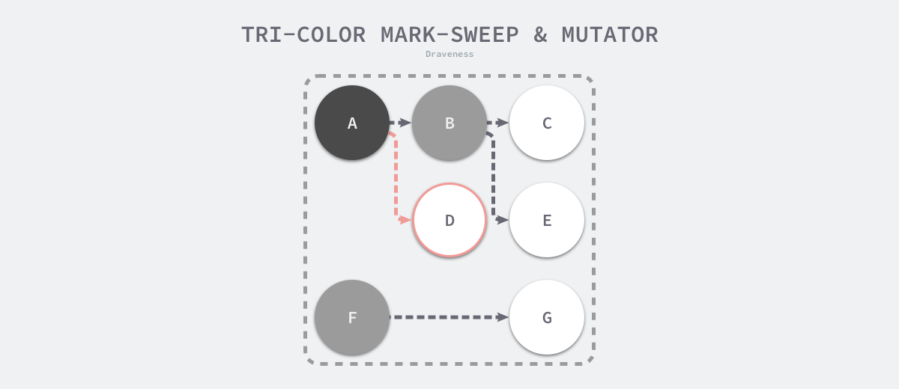

# 同步原语与锁

[Go 语言并发编程、同步原语与锁 | Go 语言设计与实现 (draveness.me)](https://draveness.me/golang/docs/part3-runtime/ch06-concurrency/golang-sync-primitives/#62-同步原语与锁)

## 基本原语

Go 语言在 [`sync`](https://golang.org/pkg/sync/) 包中提供了用于同步的一些基本原语，包括常见的 [`sync.Mutex`](https://draveness.me/golang/tree/sync.Mutex)、[`sync.RWMutex`](https://draveness.me/golang/tree/sync.RWMutex)、[`sync.WaitGroup`](https://draveness.me/golang/tree/sync.WaitGroup)、[`sync.Once`](https://draveness.me/golang/tree/sync.Once) 和 [`sync.Cond`](https://draveness.me/golang/tree/sync.Cond)


上面这些都提供了一些较为基础的同步功能，多数情况下我们应该使用抽象层级更高的channel实现同步

### Mutex 

Go 语言的 [`sync.Mutex`](https://draveness.me/golang/tree/sync.Mutex) 由两个字段 `state` 和 `sema` 组成。其中 `state` 表示当前互斥锁的状态，而 `sema` 是用于控制锁状态的信号量。

```go
type Mutex struct {
	state int32
	sema  uint32
}
```

上述两个加起来只占 8 字节空间的结构体表示了 Go 语言中的互斥锁。

#### 状态 

互斥锁的状态比较复杂，如下图所示，最低三位分别表示 `mutexLocked`、`mutexWoken` 和 `mutexStarving`，剩下的位置用来表示当前有多少个 Goroutine 在等待互斥锁的释放：


在默认情况下，互斥锁的所有状态位都是 0，`int32` 中的不同位分别表示了不同的状态：

- `mutexLocked` — 表示互斥锁的锁定状态；
- `mutexWoken` — 表示从正常模式被从唤醒；
- `mutexStarving` — 当前的互斥锁进入饥饿状态；
- `waitersCount` — 当前互斥锁上等待的 Goroutine 个数；

#### 正常模式和饥饿模式 

[`sync.Mutex`](https://draveness.me/golang/tree/sync.Mutex) 有两种模式 — 正常模式和饥饿模式。我们需要在这里先了解正常模式和饥饿模式都是什么以及它们有什么样的关系。

在正常模式下，锁的等待者会按照先进先出的顺序获取锁。但是刚被唤起的 Goroutine 与新创建的 Goroutine 竞争时，大概率会获取不到锁，为了减少这种情况的出现，一旦 Goroutine 超过 1ms 没有获取到锁，它就会将当前互斥锁切换饥饿模式，防止部分 Goroutine 被『饿死』。


饥饿模式是在 Go 语言在 1.9 中通过提交 [sync: make Mutex more fair](https://github.com/golang/go/commit/0556e26273f704db73df9e7c4c3d2e8434dec7be) 引入的优化[1](https://draveness.me/golang/docs/part3-runtime/ch06-concurrency/golang-sync-primitives/#fn:1)，引入的目的是保证互斥锁的公平性。

在饥饿模式中，互斥锁会直接交给等待队列最前面的 Goroutine。新的 Goroutine 在该状态下不能获取锁、也不会进入自旋状态，它们只会在队列的末尾等待。如果一个 Goroutine 获得了互斥锁并且它在队列的末尾或者它等待的时间少于 1ms，那么当前的互斥锁就会切换回正常模式。

与饥饿模式相比，正常模式下的互斥锁能够提供更好地性能，饥饿模式的能避免 Goroutine 由于陷入等待无法获取锁而造成的高尾延时。

#### 加锁和解锁

我们在这一节中将分别介绍互斥锁的加锁和解锁过程，它们分别使用 [`sync.Mutex.Lock`](https://draveness.me/golang/tree/sync.Mutex.Lock) 和 [`sync.Mutex.Unlock`](https://draveness.me/golang/tree/sync.Mutex.Unlock) 方法。

互斥锁的加锁是靠 [`sync.Mutex.Lock`](https://draveness.me/golang/tree/sync.Mutex.Lock) 完成的，最新的 Go 语言源代码中已经将 [`sync.Mutex.Lock`](https://draveness.me/golang/tree/sync.Mutex.Lock) 方法进行了简化，方法的主干只保留最常见、简单的情况 — 当锁的状态是 0 时，将 `mutexLocked` 位置成 1：

```go
func (m *Mutex) Lock() {
	if atomic.CompareAndSwapInt32(&m.state, 0, mutexLocked) {
		return
	}
	m.lockSlow()
}
```


# 垃圾回收

## 什么是垃圾回收？

内存管理是程序员开发应用的一大难题。传统的系统级编程语言（主要指C/C++）中，程序开发者必须对内存小心的进行管理操作，控制内存的申请及释放。 因为稍有不慎，就可能产生内存泄露问题，这种问题不易发现并且难以定位，一直成为困扰程序开发者的噩梦。

如何解决这个头疼的问题呢？过去一般采用两种办法：

- 内存泄露检测工具。这种工具的原理一般是静态代码扫描，通过扫描程序检测可能出现内存泄露的代码段。然而检测工具难免有疏漏和不足，只能起到辅助作用。
- 智能指针。这是 c++ 中引入的自动内存管理方法，通过拥有自动内存管理功能的指针对象来引用对象，是程序员不用太关注内存的释放，而达到内存自动释放的目的。这种方法是采用最广泛的做法，但是对程序开发者有一定的学习成本（并非语言层面的原生支持），而且一旦有忘记使用的场景依然无法避免内存泄露。

为了解决这个问题，后来开发出来的几乎所有新语言（java，python，php等等）都引入了语言层面的自动内存管理 – 也就是语言的使用者只用关注内存的申请而不必关心内存的释放，内存释放由虚拟机（virtual machine）或运行时（runtime）来自动进行管理。而这种对不再使用的内存资源进行自动回收的行为就被称为垃圾回收。

## 常用的垃圾回收的方法:

### 引用计数（reference counting）

这是最简单的一种垃圾回收算法，和之前提到的智能指针异曲同工。对每个对象维护一个引用计数，当引用该对象的对象被销毁或更新时被引用对象的引用计数自动减一，当被引用对象被创建或被赋值给其他对象时引用计数自动加一。当引用计数为0时则立即回收对象。

这种方法的优点是实现简单，并且内存的回收很及时。这种算法在内存比较紧张和实时性比较高的系统中使用的比较广泛，如ios cocoa框架，php，python等。

但是简单引用计数算法也有明显的缺点：

1. 频繁更新引用计数降低了性能。

一种简单的解决方法就是编译器将相邻的引用计数更新操作合并到一次更新；还有一种方法是针对频繁发生的临时变量引用不进行计数，而是在引用达到0时通过扫描堆栈确认是否还有临时对象引用而决定是否释放。等等还有很多其他方法，具体可以参考这里。

1. 循环引用。

当对象间发生循环引用时引用链中的对象都无法得到释放。最明显的解决办法是避免产生循环引用，如cocoa引入了strong指针和weak指针两种指针类型。或者系统检测循环引用并主动打破循环链。当然这也增加了垃圾回收的复杂度。

### 标记-清除（mark and sweep）

标记-清除（mark and sweep）分为两步，标记从根变量开始迭代得遍历所有被引用的对象，对能够通过应用遍历访问到的对象都进行标记为“被引用”；标记完成后进行清除操作，对没有标记过的内存进行回收（回收同时可能伴有碎片整理操作）。 这种方法解决了引用计数的不足，但是也有比较明显的问题：每次启动垃圾回收都会暂停当前所有的正常代码执行，回收时,系统响应能力大大降低 ！当然后续也出现了很多mark&sweep算法的变种（如三色标记法）优化了这个问题。

### 分代搜集（generation）

java的jvm 就使用的分代回收的思路。在面向对象编程语言中，绝大多数对象的生命周期都非常短。分代收集的基本思想是，将堆划分为两个或多个称为代（generation）的空间。 新创建的对象存放在称为新生代（young generation）中（一般来说，新生代的大小会比 老年代小很多），随着垃圾回收的重复执行，生命周期较长的对象会被提升（promotion）到老年代中（这里用到了一个分类的思路，这个是也是科学思考的一个基本思路）。

因此，新生代垃圾回收和老年代垃圾回收两种不同的垃圾回收方式应运而生，分别用于对各自空间中的对象执行垃圾回收。新生代垃圾回收的速度非常快，比老年代快几个数量级，即使新生代垃圾回收的频率更高，执行效率也仍然比老年代垃圾回收强，这是因为大多数对象的生命周期都很短，根本无需提升到老年代。

## Go是怎么进行垃圾回收的

Golang 1.5后，采取的是“非分代的、非移动的、并发的、三色的”标记清除垃圾回收算法。

golang 中的 gc 基本上是标记清除的过程：


golang 的垃圾回收是基于标记清扫算法，这种算法需要进行 STW（stop the world)，这个过程就会导致程序是卡顿的，频繁的 GC 会严重影响程序性能.

golang 在此基础上进行了改进，通过三色标记清扫法与写屏障来减少 STW 的时间.

gc的过程一共分为四个阶段：

1. 栈扫描（开始时STW），所有对象最开始都是白色.
2. 从 root开始找到所有可达对象（所有可以找到的对象)，标记为灰色，放入待处理队列。
3. 遍历灰色对象队列，将其引用对象标记为灰色放入待处理队列，自身标记为黑色。
4. 清除（并发） 循环步骤3直到灰色队列为空为止，此时所有引用对象都被标记为黑色，所有不可达的对象依然为白色，白色的就是需要进行回收的对象。 三色标记法相对于普通标记清扫，减少了 STW 时间. 这主要得益于标记过程是 "on-the-fly" 的，在标记过程中是不需要 STW 的，它与程序是并发执行的，这就大大缩短了STW的时间.

Golang gc 优化的核心就是尽量使得 STW(Stop The World) 的时间越来越短。

详细的Golang的GC介绍可以参看[Golang垃圾回收](https://github.com/KeKe-Li/For-learning-Go-Tutorial/blob/master/src/spec/02.0.md).

写屏障:

当标记和程序是并发执行的，这就会造成一个问题. 在标记过程中，有新的引用产生，可能会导致误清扫.

清扫开始前，标记为黑色的对象引用了一个新申请的对象，它肯定是白色的，而黑色对象不会被再次扫描，那么这个白色对象无法被扫描变成灰色、黑色，它就会最终被清扫，而实际它不应该被清扫.

这就需要用到屏障技术，golang采用了写屏障，其作用就是为了避免这类误清扫问题. 写屏障即在内存写操作前，维护一个约束，从而确保清扫开始前，黑色的对象不能引用白色对象.

## 什么是三色标记法

为了解决原始标记清除算法带来的长时间 STW，多数现代的追踪式垃圾收集器都会实现三色标记算法的变种以缩短 STW 的时间。三色标记算法将程序中的对象分成白色、黑色和灰色三类[4](https://draveness.me/golang/docs/part3-runtime/ch07-memory/golang-garbage-collector/#fn:4)：

- 白色对象 — 潜在的垃圾，其内存可能会被垃圾收集器回收；
- 黑色对象 — 活跃的对象，包括不存在任何引用外部指针的对象以及从根对象可达的对象；
- 灰色对象 — 活跃的对象，因为存在指向白色对象的外部指针，垃圾收集器会扫描这些对象的子对象；


在垃圾收集器开始工作时，程序中不存在任何的黑色对象，垃圾收集的根对象会被标记成灰色，垃圾收集器只会从灰色对象集合中取出对象开始扫描，当灰色集合中不存在任何对象时，标记阶段就会结束。


三色标记垃圾收集器的工作原理很简单，我们可以将其归纳成以下几个步骤：

1. 从灰色对象的集合中选择一个灰色对象并将其标记成黑色；
2. 将黑色对象指向的所有对象都标记成灰色，保证该对象和被该对象引用的对象都不会被回收；
3. 重复上述两个步骤直到对象图中不存在灰色对象；

当三色的标记清除的标记阶段结束之后，应用程序的堆中就不存在任何的灰色对象，我们只能看到黑色的存活对象以及白色的垃圾对象，垃圾收集器可以回收这些白色的垃圾，下面是使用三色标记垃圾收集器执行标记后的堆内存，堆中只有对象 D 为待回收的垃圾：


因为**用户程序可能在标记执行的过程中修改对象的指针，所以三色标记清除算法本身是不可以并发或者增量执行的，它仍然需要 STW，**在如下所示的三色标记过程中，用户程序建立了从 A 对象到 D 对象的引用，但是因为程序中已经不存在灰色对象了，所以 D 对象会被垃圾收集器错误地回收。



本来不应该被回收的对象却被回收了，这在内存管理中是非常严重的错误，我们将这种错误称为悬挂指针，即指针没有指向特定类型的合法对象，影响了内存的安全性[5](https://draveness.me/golang/docs/part3-runtime/ch07-memory/golang-garbage-collector/#fn:5)，想要并发或者增量地标记对象还是需要使用屏障技术。

### 屏障技术

内存屏障技术是一种屏障指令，它可以让 CPU 或者编译器在执行内存相关操作时遵循特定的约束，目前多数的现代处理器都会乱序执行指令以最大化性能，但是该技术能够保证内存操作的顺序性，在内存屏障前执行的操作一定会先于内存屏障后执行的操作[6](https://draveness.me/golang/docs/part3-runtime/ch07-memory/golang-garbage-collector/#fn:6)。

想要在并发或者增量的标记算法中保证正确性，我们需要达成以下两种三色不变性（Tri-color invariant）中的一种：

- 强三色不变性 — 黑色对象不会指向白色对象，只会指向灰色对象或者黑色对象；
- 弱三色不变性 — 黑色对象指向的白色对象必须包含一条从灰色对象经由多个白色对象的可达路径

[Go 语言垃圾收集器的实现原理 | Go 语言设计与实现 (draveness.me)](https://draveness.me/golang/docs/part3-runtime/ch07-memory/golang-garbage-collector/#标记清除)

