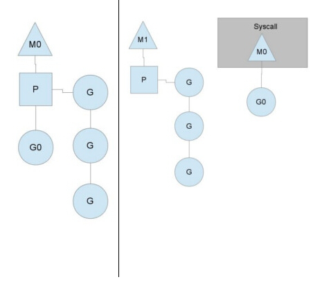
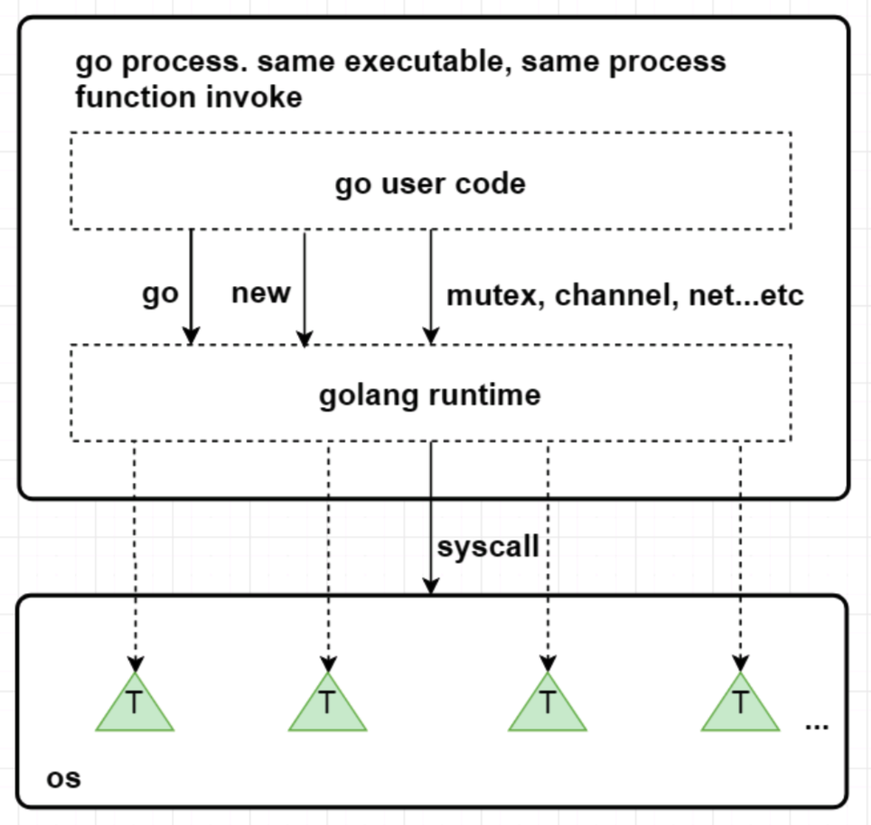

# 知识点总结系列

## Go基本数据类型及占用的字节

### 整数

- int 64位操作系统默认为int64,32位操作系统为int32,但是类型检查时时int
- int8 (byte 1字节)
- int16 (short 2字节)
- int32 (int 4字节)
- int64 (long 8字节)

### 浮点数

- float32 (4字节 float)
- float64 (8字节 double)

### 字符型

**golang没有专门的char类型**，一般用单个byte保存单个字母字符

## 值类型和引用类型

- **值类型**分别**有**：int系列、float系列、bool、string、数组和结构体
- 引用**类型有**：指针、slice切片、管道channel、接口interface、map、函数等

## Go语言常量声明

单个声明

```go
显式类型定义： const b string = "abc"
隐式类型定义： const b = "abc"
```

常量枚举

```go
const (
    Unknown = 0
    Female = 1
    Male = 2
)
```

> 常量可以用len(), cap(), unsafe.Sizeof()函数计算表达式的值。常量表达式中，函数必须是内置函数

### 特殊常量

iota，特殊常量，可以认为是一个可以被编译器修改的常量。

iota 在 const关键字出现时将被重置为 0(const 内部的第一行之前)，const 中每新增一行常量声明将使 iota 计数一次(iota 可理解为 const 语句块中的行索引)。

```go
const (
    a = iota
    b = iota
    c = iota
)
// 第一个 iota 等于 0，每当 iota 在新的一行被使用时，它的值都会自动加 1；所以 a=0, b=1, c=2 可以简写为如下形式：
const (
    a = iota
    b
    c
)
// 甚至可以这样用
const (
    a = iota   //0
    b          //1
    c          //2
    d = "ha"   //独立值，iota += 1
    e          //"ha"   iota += 1
    f = 100    //iota +=1
    g          //100  iota +=1
    h = iota   //7,恢复计数
    i          //8
)
fmt.Println(a,b,c,d,e,f,g,h,i)
```

## 基本命令

[Go 基本命令_kf_panda-CSDN博客](https://blog.csdn.net/gua___gua/article/details/50396828)

```go
// 用于打包编译代码
go build
// 来移除当前源码包和关联源码包里面编译生成的文件
go clean
// 格式化代码文件
go fmt
// 下载安装包
go get
// 这里就是先生成结果文件，然后把这个文件放到我们的包里面去
go install
// 测试文件自动读取源码目录下面名为*_test.go的文件，生成并运行测试用的可执行文件
go test
// go提供的一些工具
go tool fix //用来修复以前老版本的代码到新版本
go tool vet directory|files  //用来分析当前目录的代码是否都是正确的代码
// 用于在编译前自动化生成某类代码。go generate和go build是完全不一样的命令，通过分析源码中特殊的注释，然后执行相应的命令。这些命令都是很明确的，没有任何的依赖在里面。而且大家在用这个之前心里面一定要有一个理念，这个go generate是给你用的，不是给使用你这个包的人用的，是方便你来生成一些代码的。
go generate
// 生成文档
go doc
go version 查看go当前的版本
go env 查看当前go的环境变量
go list 列出当前全部安装的package
go run 编译并运行Go程序
```

## JSON 标准库对 nil slice 和 空 slice 的处理是一致的吗

如果是nilslice，其实会解析为null，空slice会解析为[]

首先Go的JSON 标准库对 `nil slice` 和 空 `slice` 的处理是不一致.

通常错误的用法，会报数组越界的错误，因为只是声明了slice，却没有给实例化的对象。

```
var slice []int
slice[1] = 0
```

此时slice的值是nil，这种情况可以用于需要返回slice的函数，当函数出现异常的时候，保证函数依然会有nil的返回值。

empty slice 是指slice不为nil，但是slice没有值，slice的底层的空间是空的，此时的定义如下：

```
slice := make([]int,0）
slice := []int{}
```

当我们查询或者处理一个空的列表的时候，这非常有用，它会告诉我们返回的是一个列表，但是列表内没有任何值。

总之，`nil slice` 和 `empty slice`是不同的东西,需要我们加以区分的.

# Golang面试问题汇总

[data-structures-questions/golang.01.md at master · KeKe-Li/data-structures-questions (github.com)](https://github.com/KeKe-Li/data-structures-questions/blob/master/src/chapter05/golang.01.md)

## 协程和线程和进程的区别

- 进程

进程是具有一定独立功能的程序关于某个数据集合上的一次运行活动,进程是系统进行资源分配和调度的一个独立单位。每个进程都有自己的独立内存空间，不同进程通过进程间通信来通信。由于进程比较重量，占据独立的内存，所以上下文进程间的切换开销（栈、寄存器、虚拟内存、文件句柄等）比较大，但相对比较稳定安全。

- 线程

线程是进程的一个实体,线程是内核态,而且是CPU调度和分派的基本单位,它是比进程更小的能独立运行的基本单位.线程自己基本上不拥有系统资源,只拥有一点在运行中必不可少的资源(如程序计数器,一组寄存器和栈),但是它可与同属一个进程的其他的线程共享进程所拥有的全部资源。线程间通信主要通过共享内存，上下文切换很快，资源开销较少，但相比进程不够稳定容易丢失数据。

- 协程

协程是一种用户态的轻量级线程，协程的调度完全由用户控制。协程拥有自己的寄存器上下文和栈。 协程调度切换时，将寄存器上下文和栈保存到其他地方，在切回来的时候，恢复先前保存的寄存器上下文和栈，直接操作栈则基本没有内核切换的开销，可以不加锁的访问全局变量，所以上下文的切换非常快。

## Golang中除了加Mutex锁以外还有哪些方式安全读写共享变量

Golang中Goroutine 可以通过 Channel 进行安全读写共享变量,还可以通过原子性操作进行.

## 无缓冲Chan的发送和接收是否同步

```go
ch := make(chan int)    无缓冲的channel由于没有缓冲发送和接收需要同步.
ch := make(chan int, 2) 有缓冲channel不要求发送和接收操作同步. 
```

- channel无缓冲时，发送阻塞直到数据被接收，接收阻塞直到读到数据。
- channel有缓冲时，当缓冲满时发送阻塞，当缓冲空时接收阻塞。

## Golang中常用的并发模型

Golang 中常用的并发模型有三种:

### 通过channel通知实现并发控制

无缓冲的通道指的是通道的大小为0，也就是说，这种类型的通道在接收前没有能力保存任何值，它要求发送 goroutine 和接收 goroutine 同时准备好，才可以完成发送和接收操作。

从上面无缓冲的通道定义来看，发送 goroutine 和接收 gouroutine 必须是同步的，同时准备后，如果没有同时准备好的话，先执行的操作就会阻塞等待，直到另一个相对应的操作准备好为止。这种无缓冲的通道我们也称之为同步通道。

```go
func main() {
    ch := make(chan struct{})
    go func() {
        fmt.Println("start working")
        time.Sleep(time.Second * 1)
        ch <- struct{}{}
    }()
    // 当没有数据的时候就会阻塞当前进程，直到线程里面执行完毕后我们的就可结束程序了
    <-ch
    fmt.Println("finished")
}
```

当主 goroutine 运行到 `<-ch` 接受 channel 的值的时候，如果该 channel 中没有数据，就会一直阻塞等待，直到有值。 这样就可以简单实现并发控制

### 通过sync包中的WaitGroup实现并发控制

Goroutine是异步执行的，有的时候为了防止在结束main函数的时候结束掉Goroutine，所以需要同步等待，这个时候就需要用 WaitGroup了，在 sync 包中，提供了 WaitGroup,它会等待它收集的所有 goroutine 任务全部完成。

在WaitGroup里主要有三个方法:

- Add, 可以添加或减少 goroutine的数量.
- Done, 相当于Add(-1).
- Wait, 执行后会堵塞主线程，直到WaitGroup 里的值减至0.

在主 goroutine 中 Add(delta int) 索要等待goroutine 的数量。在每一个 goroutine 完成后 Done() 表示这一个goroutine 已经完成，当所有的 goroutine 都完成后，在主 goroutine 中 WaitGroup 返回。

```go
func main(){
    var wg sync.WaitGroup
    var urls = []string{
        "http://www.golang.org/",
        "http://www.google.com/",
    }
    for _, url := range urls {
        wg.Add(1)
        go func(url string) {
            defer wg.Done()
            http.Get(url)
        }(url)
    }
    wg.Wait()
}
```

在Golang官网中对于WaitGroup介绍是`A WaitGroup must not be copied after first use`,在 WaitGroup 第一次使用后，不能被拷贝。

```go
func main(){
 wg := sync.WaitGroup{}
    for i := 0; i < 5; i++ {
        wg.Add(1)
        go func(wg sync.WaitGroup, i int) {
            fmt.Printf("i:%d", i)
            wg.Done()
        }(wg, i)
    }
    wg.Wait()
    fmt.Println("exit")
}
// 运行的时候就会报错
i:1i:3i:2i:0i:4fatal error: all goroutines are asleep - deadlock!

goroutine 1 [semacquire]:
sync.runtime_Semacquire(0xc000094018)
        /home/keke/soft/go/src/runtime/sema.go:56 +0x39
sync.(*WaitGroup).Wait(0xc000094010)
        /home/keke/soft/go/src/sync/waitgroup.go:130 +0x64
main.main()
        /home/keke/go/Test/wait.go:17 +0xab
exit status 2
```

它提示所有的 `goroutine` 都已经睡眠了，出现了死锁。这是因为 wg 给拷贝传递到了 goroutine 中，导致只有 Add 操作，其实 Done操作是在 wg 的副本执行的。因此 Wait 就会死锁。

这个第一个修改方式:将匿名函数中 wg 的传入类型改为 `*sync.WaitGroup`,这样就能引用到正确的`WaitGroup`了。这个第二个修改方式:将匿名函数中的 wg 的传入参数去掉，因为Go支持闭包类型，在匿名函数中可以直接使用外面的 wg 变量.

### 在Go 1.7 以后引进的强大的Context上下文，实现并发控制

通常,在一些简单场景下使用 channel 和 WaitGroup 已经足够了，但是当面临一些复杂多变的网络并发场景下 channel 和 WaitGroup 显得有些力不从心了。

比如一个网络请求 Request，每个 Request 都需要开启一个 goroutine 做一些事情，这些 goroutine 又可能会开启其他的 goroutine，比如数据库和RPC服务。

所以我们需要一种可以跟踪 goroutine 的方案，才可以达到控制他们的目的，这就是Go语言为我们提供的 Context，称之为上下文非常贴切，它就是goroutine 的上下文。

它是包括一个程序的运行环境、现场和快照等。每个程序要运行时，都需要知道当前程序的运行状态，通常Go 将这些封装在一个 Context 里，再将它传给要执行的 goroutine 。

context 包主要是用来处理多个 goroutine 之间共享数据，及多个 goroutine 的管理。

具体可以参考我这篇  [go的context包的原理.md](..\..\个人面试问题总结\第二次\go的context包的原理.md) 

## Golang的内存模型中为什么小对象多了会造成GC压力

go里面的垃圾回收用的是三色法

通常小对象过多会导致GC三色法消耗过多的GPU。优化思路是，减少对象分配.

## Go中数据竞争问题怎么解决

Data Race问题可以使用互斥锁sync.Mutex, 或者也可以通过CAS无锁并发解决.

> CAS参考[高并发无锁实现CAS原理 - 简书 (jianshu.com)](https://www.jianshu.com/p/3179005184dd)
>
> 就是不使用锁来控制并发，CAS有三个操作数：内存值V、旧的预期值A、要修改的值B，当且仅当预期值A和内存值V相同时，将内存值修改为B并返回true，否则什么都不做并返回false。不过也有有问题

其中使用同步访问共享数据或者CAS无锁并发是处理数据竞争的一种有效的方法.

golang在1.1之后引入了竞争检测机制，可以使用 `go run -race` 或者 `go build -race`来进行静态检测。

其在内部的实现是,开启多个协程执行同一个命令， 并且记录下每个变量的状态.

竞争检测器基于C/C++的`ThreadSanitizer`运行时库，该库在Google内部代码基地和Chromium找到许多错误。这个技术在2012年九月集成到Go中，从那时开始，它已经在标准库中检测到42个竞争条件。现在，它已经是我们持续构建过程的一部分，当竞争条件出现时，它会继续捕捉到这些错误。

竞争检测器已经完全集成到Go工具链中，仅仅添加-race标志到命令行就使用了检测器。

```go
$ go test -race mypkg    // 测试包
$ go run -race mysrc.go  // 编译和运行程序
$ go build -race mycmd   // 构建程序
$ go install -race mypkg // 安装程序
```

要想解决数据竞争的问题可以使用互斥锁`sync.Mutex`,解决数据竞争(Data race),也可以使用管道解决,使用管道的效率要比互斥锁高.

## 什么是channel，为什么它可以做到线程安全

Channel是Go中的一个核心类型，可以把它看成一个管道，通过它并发核心单元就可以发送或者接收数据进行通讯(communication),Channel也可以理解是一个先进先出的队列，通过管道进行通信。

Golang的Channel,发送一个数据到Channel和从Channel接收一个数据都是原子性的。

Go的设计思想就是, 不要通过共享内存来通信，而是通过通信来共享内存，前者就是传统的加锁，后者就是Channel。

也就是说，设计Channel的主要目的就是在多任务间传递数据的，本身就是安全的。

## Golang垃圾回收算法

垃圾回收参考： [Go进阶学习.md](Go进阶学习.md) 

## GC的触发条件

Go中对 GC 的触发时机存在两种形式：

- 主动触发(手动触发)，通过调用`runtime.GC` 来触发`GC`，此调用阻塞式地等待当前`GC`运行完毕.
- 被动触发，分为两种方式： a. 使用系统监控，当超过两分钟没有产生任何`GC`时，强制触发 `GC`. b. 使用步调（Pacing）算法，其核心思想是控制内存增长的比例,当前内存分配达到一定比例则触发.

## Go的GPM如何调度 

> G、P、M 是 Go 调度器的三个核心组件，各司其职。在它们精密地配合下，Go 调度器得以高效运转，这也是 Go 天然支持高并发的内在动力。

### Goroutine协程

协程拥有自己的寄存器上下文和栈。协程调度切换时，将寄存器上下文和栈保存到其他地方，在切回来的时候，恢复先前保存的寄存器上下文和栈。 因此，协程能保留上一次调用时的状态（即所有局部状态的一个特定组合），每次过程重入时，就相当于进入上一次调用的状态，换种说法：进入上一次离开时所处逻辑流的位置。

线程和进程的操作是由程序触发系统接口，最后的执行者是系统；协程的操作执行者则是用户自身程序，goroutine也是协程。groutine能拥有强大的并发实现是通过GPM调度模型实现.


Go的调度器内部有四个重要的结构：M，P，S，Sched，如上图所示（Sched未给出）.

- M: M代表内核级线程，一个M就是一个线程，goroutine就是跑在M之上的；M是一个很大的结构，里面维护小对象内存cache（mcache）、当前执行的goroutine、随机数发生器等等非常多的信息.
- G: 代表一个goroutine，它有自己的栈，instruction pointer和其他信息（正在等待的channel等等），用于调度.
- P: P全称是Processor，逻辑处理器，它的主要用途就是用来执行goroutine的，所以它也维护了一个goroutine队列，里面存储了所有需要它来执行的goroutine.
- Sched：代表调度器，它维护有存储M和G的队列以及调度器的一些状态信息等.

Go中的GPM调度:

新创建的Goroutine会先存放在Global全局队列中，等待Go调度器进行调度，随后Goroutine被分配给其中的一个逻辑处理器P，并放到这个逻辑处理器对应的Local本地运行队列中，最终等待被逻辑处理器P执行即可。 在M与P绑定后，M会不断从P的Local队列中无锁地取出G，并切换到G的堆栈执行，当P的Local队列中没有G时，再从Global队列中获取一个G，当Global队列中也没有待运行的G时，则尝试从其它的P窃取部分G来执行相当于P之间的负载均衡。


从上图中可以看到，**有2个物理线程M，每一个M都拥有一个处理器P，每一个也都有一个正在运行的goroutine**。P的数量可以**通过GOMAXPROCS()来设置，它其实也就代表了真正的并发度**，即有多少个goroutine可以同时运行。

图中**灰色的那些goroutine并没有运行，而是出于ready的就绪态**，正在等待被调度。P维护着这个队列（称之为runqueue），Go语言里，启动一个goroutine很容易：go function 就行，所以每有一个go语句被执行，runqueue队列就在其末尾加入一个goroutine，在下一个调度点，就从runqueue中取出（如何决定取哪个goroutine？）一个goroutine执行。

当一个OS线程M0陷入阻塞时，P转而在运行M1，图中的M1可能是正被创建，或者从线程缓存中取出。



当MO返回时，它必须**尝试取得一个P来运行goroutine，一般情况下，它会从其他的OS线程那里拿一个P过来**， 如果没有拿到的话，它就把goroutine放在一个`global runqueue`里，然后自己睡眠（放入线程缓存里）。**所有的P也会周期性的检查`global runqueue`并运行其中的goroutine**，否则`global runqueue`上的goroutine永远无法执行。

另一种情况是P所分配的任务G很快就执行完了（分配不均），这就导致了这个处理器P处于空闲的状态，但是此时其他的P还有任务，此时如果global runqueue没有任务G了，那么这个P就会从其他的P里偷取一些G来执行。


通常来说，如果P从其他的P那里要拿任务的话，一般就拿`run queue`的一半，这就确保了每个OS线程都能充分的使用。



## 并发编程的概念

并行是指两个或者多个事件在同一时刻发生；并发是指两个或多个事件在同一时间间隔发生。

并行是在不同实体上的多个事件，并发是在同一实体上的多个事件。在一台处理器上“同时”处理多个任务，在多台处理器上同时处理多个任务。如hadoop分布式集群

并发偏重于多个任务交替执行，而多个任务之间有可能还是串行的。而并行是真正意义上的“同时执行”。

并发编程是指在一台处理器上“同时”处理多个任务。并发是在同一实体上的多个事件。多个事件在同一时间间隔发生。并发编程的目标是充分的利用处理器的每一个核，以达到最高的处理性能。

## Go语言的栈空间管理是怎么样的

Go语言的运行环境（runtime）会在goroutine需要的时候**动态地分配栈空间，而不是给每个goroutine分配固定大小的内存空间。**这样就避免了需要程序员来决定栈的大小。

分块式的栈是最初Go语言组织栈的方式。当创建一个goroutine的时候，**它会分配一个8KB的内存空间来**给goroutine的栈使用。我们可能会考虑当这8KB的栈空间被用完的时候该怎么办?

为了处理这种情况，每个**Go函数的开头都有一小段检测代码。这段代码会检查我们是否已经用完了分配的栈空间。如果是的话，它会调用`morestack`函数。`morestack`函数分配一块新的内存作为栈空间，并且在这块栈空间的底部填入各种信息（包括之前的那块栈地址）。在分配了这块新的栈空间之后，它会重试刚才造成栈空间不足的函数。这个过程叫做栈分裂（stack split）。**

在新分配的栈底部，还插入了一个叫做`lessstack`的函数指针。这个函数还没有被调用。这样**设置是为了从刚才造成栈空间不足的那个函数返回时做准备的。当我们从那个函数返回时，它会跳转到`lessstack`。`lessstack`函数会查看在栈底部存放的数据结构里的信息，然后调整栈指针（stack pointer）。这样就完成了从新的栈块到老的栈块的跳转。**接下来，新分配的这个块栈空间就可以被释放掉了。

`分块式的栈`让我们能够按照需求来扩展和收缩栈的大小。 Go开发者不需要花精力去估计goroutine会用到多大的栈。创建一个新的goroutine的开销也不大。当 Go开发者不知道栈会扩展到多少大时，它也能很好的处理这种情况。

这一直是**之前Go语言管理栈的的方法**。但这个方法有一个问题。缩**减栈空间是一个开销相对较大的操作。如果在一个循环里有栈分裂，那么它的开销就变得不可忽略了。一个函数会扩展，然后分裂栈。当它返回的时候又会释放之前分配的内存块。如果这些都发生在一个循环里的话，代价是相当大的。 这就是所谓的热分裂问题（hot split problem）。**它是Go语言开发者选择新的栈管理方法的主要原因。新的方法叫做`栈复制法（stack copying）`。

**栈复制法**一开始和分块式的栈很像。当goroutine运行并用完栈空间的时候，与之前的方法一样，栈溢出检查会被触发。但是，不像之前的方法那样分配一个新的内存块并链接到老的栈内存块，**新的方法会分配一个两倍大的内存块并把老的内存块内容复制到新的内存块里。**这样做意味着当栈缩减回之前大小时，我们不需要做任何事情。栈的缩减没有任何代价。而且，当栈再次扩展时，运行环境也不需要再做任何事。它可以重用之前分配的空间。

栈的复制听起来很容易，但实际操作并非那么简单。**存储在栈上的变量的地址可能已经被使用到。也就是说程序使用到了一些指向栈的指针。**当移动栈的时候，所有指向栈里内容的指针都会变得无效。然而，指向栈内容的指针自身也必定是保存在栈上的。这是为了保证内存安全的必要条件。否则一个程序就有可能访问一段已经无效的栈空间了。

因为垃圾回收的需要，我们必须知道栈的哪些部分是被用作指针了。**当我们移动栈的时候，我们可以更新栈里的指针让它们指向新的地址。所有相关的指针都会被更新。我们使用了垃圾回收的信息来复制栈，但并不是任何使用栈的函数都有这些信息。因为很大一部分运行环境是用C语言写的，很多被调用的运行环境里的函数并没有指针的信息，所以也就不能够被复制了。当遇到这种情况时，我们只能退回到分块式的栈并支付相应的开销。**

这也是为什么现在运行环境的开发者正在用Go语言重写运行环境的大部分代码。**无法用Go语言重写的部分（比如调度器的核心代码和垃圾回收器）会在特殊的栈上运行。这个特殊栈的大小由运行环境的开发者设置。**

这些改变除了使栈复制成为可能，它也允许我们在将来实现并行垃圾回收。

**另外一种不同的栈处理方式就是在虚拟内存中分配大内存段。由于物理内存只是在真正使用时才会被分配，因此看起来好似你可以分配一个大内存段并让操 作系统处理它**。下面是这种方法的一些问题

首先，32位系统只能支持4G字节虚拟内存，并且应用只能用到其中的3G空间。由于同时运行百万goroutines的情况并不少见，因此你很可 能用光虚拟内存，即便我们假设每个goroutine的stack只有8K。

第二，然而我们可以在64位系统中分配大内存，它**依赖于过量内存使用。所谓过量使用是指当你分配的内存大小超出物理内存大小时，依赖操作系统保证 在需要时能够分配出物理内存。然而，允许过量使用可能会导致一些风险。由于一些进程分配了超出机器物理内存大小的内存，如果这些进程使用更多内存 时，操作系统将不得不为它们补充分配内存。这会导致操作系统将一些内存段放入磁盘缓存，**这常常会增加不可预测的处理延迟。正是考虑到这个原因，一 些新系统关闭了对过量使用的支持。

## Goroutine和Channel的作用分别是什么

协程，可以看作是轻量级的线程。但与线程不同的是，线程的切换是由操作系统控制的，而协程的切换则是由用户控制的。

最早支持协程的程序语言应该是lisp方言scheme里的continuation（续延），续延允许scheme保存任意函数调用的现场，保存起来并重新执行。Lua,C#,python等语言也有自己的协程实现。

Go中的goroutinue就是协程,可以实现并行，多个协程可以在多个处理器同时跑。而协程同一时刻只能在一个处理器上跑（可以把宿主语言想象成单线程的就好了）。 然而,多个goroutine之间的通信是通过channel，而协程的通信是通过yield和resume()操作。

1. channel的操作符号

`ch <- data` 表示data被发送给`channel ch`；

`data <- ch` 表示从`channel ch`取一个值，然后赋给data。

1. 阻塞式channel

channel默认是没有缓冲区的，也就是说，通信是阻塞的。send操作必须等到有消费者accept才算完成。

应用示例:

```go
func main() {
 ch1 := make(chan int)
 go pump(ch1) // pump hangs
 fmt.Println(<-ch1) // prints only 1
}

func pump(ch chan int) {
 for i:= 1; ; i++ {
    ch <- i
 }
}
// 上面这个只会打印1，因为我们发送的时候通信被阻塞了，当我们输入1时，被阻塞，不能插入新值
// 只有当我们 fmt.Println(<-ch1) 操作后我们才能取出值，但是此时程序就已经结束了
```

## 怎么查看Goroutine的数量

在Golang中,`GOMAXPROCS`中控制的是未被阻塞的所有Goroutine,可以被 `Multiplex` 到多少个线程上运行,通过`GOMAXPROCS`可以查看Goroutine的数量。

## Go中的锁有哪些

Go中的三种锁包括:互斥锁,读写锁,`sync.Map`的安全的锁

### 互斥锁

Go并发程序对共享资源进行访问控制的主要手段，由标准库代码包中sync中的Mutex结构体表示。

```go
// Mutex 是互斥锁， 零值是解锁的互斥锁， 首次使用后不得复制互斥锁。
type Mutex struct {
    state int32
    sema  uint32
}
```

sync.Mutex包中的类型只有两个公开的指针方法Lock和Unlock。

```go
// Locker表示可以锁定和解锁的对象。
type Locker interface {
   Lock()
   Unlock()
}

// 锁定当前的互斥量
// 如果锁已被使用，则调用goroutine
// 阻塞直到互斥锁可用。
func (m *Mutex) Lock() 

// 对当前互斥量进行解锁
// 如果在进入解锁时未锁定m，则为运行时错误。
// 锁定的互斥锁与特定的goroutine无关。
// 允许一个goroutine锁定Mutex然后安排另一个goroutine来解锁它。
func (m *Mutex) Unlock()
```

声明一个互斥锁

```go
var mutex sync.Mutex
```

不像C或Java的锁类工具，我们可能会犯一个错误：忘记及时解开已被锁住的锁，从而导致流程异常。但Go由于存在defer，所以此类问题出现的概率极低。关于defer解锁的方式如下：

```go
var mutex sync.Mutex
func Write()  {
   mutex.Lock()
   defer mutex.Unlock()
}
```

如果给上锁的对象再次上锁，此时我们的操作就会阻塞，直到被解锁

```go
fpackage main
import (
  "fmt"
  "sync"
  "time"
)

func main() {
	var mutex sync.Mutex
	fmt.Println("begin lock")
	mutex.Lock()
	fmt.Println("get locked")
	for i := 1; i <= 3; i++ {
		go func(i int) {
			fmt.Println("begin lock ", i)
			mutex.Lock()
			fmt.Println("get locked ", i)
		}(i)
	}
	time.Sleep(time.Second)
	fmt.Println("Unlock the lock")
	mutex.Unlock()
	fmt.Println("get unlocked")
	time.Sleep(time.Second)
}

/* 
我们在for循环之前开始加锁，然后在每一次循环中创建一个协程，并对其加锁，但是由于之前已经加锁了，所以这个for循环中的加锁会陷入阻塞直到main中的锁被解锁， time.Sleep(time.Second) 是为了能让系统有足够的时间运行for循环，输出结果如下：

begin lock
get locked
begin lock  3
begin lock  1
begin lock  2
Unlock the lock
get unlocked
get locked  3
*/
```

这里可以看到解锁后，三个协程会重新抢夺互斥锁权，最终协程3获胜。

互斥锁锁定操作的逆操作并不会导致协程阻塞，但是有可能导致引发一个无法恢复的运行时的panic，比如对一个未锁定的互斥锁进行解锁时就会发生panic。避免这种情况的最有效方式就是使用defer。

我们知道如果遇到panic，可以使用recover方法进行恢复，但是如果对重复解锁互斥锁引发的panic却是无用的（Go 1.8及以后）。

```go
package main
import (
  "fmt"
  "sync"
)
func main() {
	defer func() {
		fmt.Println("Try to recover the panic")
		if p := recover(); p != nil {
			fmt.Println("recover the panic : ", p)
		}
	}()
	var mutex sync.Mutex
	fmt.Println("begin lock")
	mutex.Lock()
	fmt.Println("get locked")
	fmt.Println("unlock lock")
	mutex.Unlock()
	fmt.Println("lock is unlocked")
	fmt.Println("unlock lock again")
	mutex.Unlock()
}

/**
> go run mutex.go 
begin lock
get locked
unlock lock
lock is unlocked
unlock lock again
fatal error: sync: unlock of unlocked mutex

goroutine 1 [running]:
runtime.throw(0x4bc1a8, 0x1e)
     /home/keke/soft/go/src/runtime/panic.go:617 +0x72 fp=0xc000084ea8 sp=0xc000084e78 pc=0x427ba2
sync.throw(0x4bc1a8, 0x1e)
     /home/keke/soft/go/src/runtime/panic.go:603 +0x35 fp=0xc000084ec8 sp=0xc000084ea8 pc=0x427b25
sync.(*Mutex).Unlock(0xc00001a0c8)
     /home/keke/soft/go/src/sync/mutex.go:184 +0xc1 fp=0xc000084ef0 sp=0xc000084ec8 pc=0x45f821
main.main()
     /home/keke/go/Test/mutex.go:25 +0x25f fp=0xc000084f98 sp=0xc000084ef0 pc=0x486c1f
runtime.main()
     /home/keke/soft/go/src/runtime/proc.go:200 +0x20c fp=0xc000084fe0 sp=0xc000084f98 pc=0x4294ec
runtime.goexit()
     /home/keke/soft/go/src/runtime/asm_amd64.s:1337 +0x1 fp=0xc000084fe8 sp=0xc000084fe0 pc=0x450ad1
exit status 2
**/
```

这里试图对重复解锁引发的panic进行recover，但是我们发现操作失败，虽然互斥锁可以被多个协程共享，但还是建议将对同一个互斥锁的加锁解锁操作放在同一个层次的代码中。

## 读写锁

读写锁是针对读写操作的互斥锁，可以分别针对读操作与写操作进行锁定和解锁操作 。

读写锁的访问控制规则如下：

① 多个写操作之间是互斥的 ② 写操作与读操作之间也是互斥的 ③ 多个读操作之间不是互斥的

在这样的控制规则下，读写锁可以大大降低性能损耗。

在Go的标准库代码包中sync中的RWMutex结构体表示为:

```go
// RWMutex是一个读/写互斥锁，可以由任意数量的读操作或单个写操作持有。
// RWMutex的零值是未锁定的互斥锁。
// 首次使用后，不得复制RWMutex。
// 如果goroutine持有RWMutex进行读取而另一个goroutine可能会调用Lock，那么在释放初始读锁之前，goroutine不应该期望能够获取读锁定。 
// 特别是，这种禁止递归读锁定。 这是为了确保锁最终变得可用; 阻止的锁定会阻止新读操作获取锁定。
type RWMutex struct {
     w           Mutex  //如果有待处理的写操作就持有
     writerSem   uint32 // 写操作等待读操作完成的信号量
     readerSem   uint32 //读操作等待写操作完成的信号量
     readerCount int32  // 待处理的读操作数量
     readerWait  int32  // number of departing readers
}
```

sync中的RWMutex有以下几种方法：

```go
//对读操作的锁定
func (rw *RWMutex) RLock()

//对读操作的解锁
func (rw *RWMutex) RUnlock()

//对写操作的锁定
func (rw *RWMutex) Lock()

//对写操作的解锁
func (rw *RWMutex) Unlock()

//返回一个实现了sync.Locker接口类型的值，实际上是回调rw.RLock and rw.RUnlock.
func (rw *RWMutex) RLocker() Locker
```

**Unlock方法会试图唤醒所有想进行读锁定而被阻塞的协程**，而RUnlock方法只会在已无任何读锁定的情况下，**试图唤醒一个因欲进行写锁定而被阻塞的协程。**

若对一个**未被写锁定的读写锁进行写解锁，就会引发一个不可恢复的panic，同理对一个未被读锁定的读写锁进行读写锁也会如此。**

由于读写锁控制下的**多个读操作之间不是互斥的，因此对于读解锁更容易被忽视。对于同一个读写锁，添加多少个读锁定，就必要有等量的读解锁，这样才能其他协程有机会进行操作**。

因此Go中读写锁，**在多个读线程可以同时访问共享数据,写线程必须等待所有读线程都释放锁以后，才能取得锁**.

同样的，读线程必须等待写线程释放锁后，才能取得锁，也就是说读写锁要确保的是如下互斥关系，可以同时读，但是读-写，写-写都是互斥的。


> 参考

[知识点总结系列之：（八）GO | phachon's blog](https://phachon.com/summary/my_summary_8_go.html)

