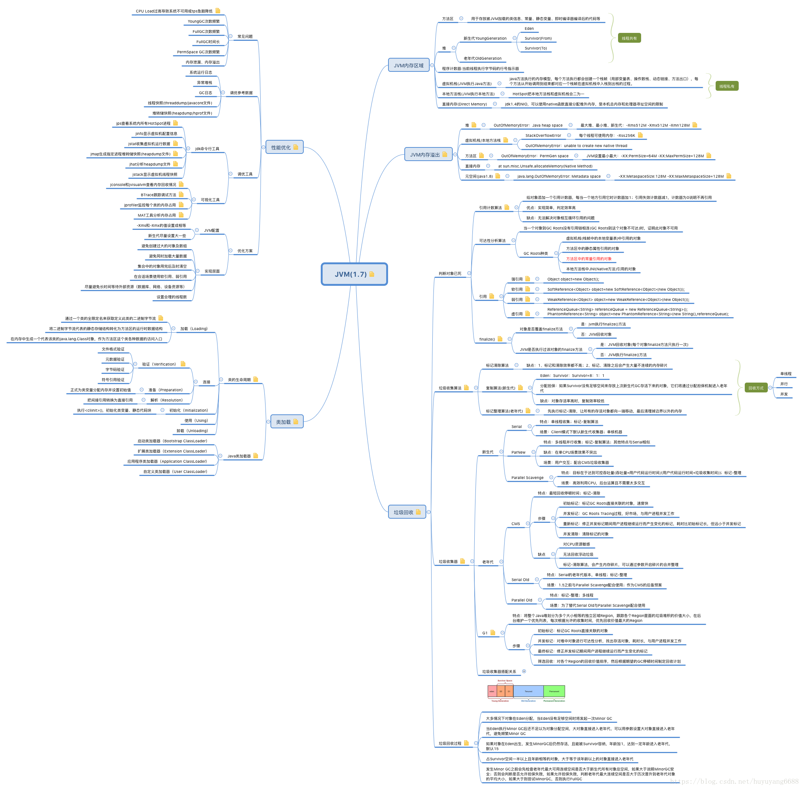

[Java虚拟机（JVM）你只要看这一篇就够了！_Java笔记-CSDN博客_jvm](https://blog.csdn.net/qq_41701956/article/details/81664921)

# 基础知识

[Java类加载机制（全套） (juejin.cn)](https://juejin.cn/post/6844903564804882445#heading-1)

## JVM的物理结构

## 类加载机制的概念

Java虚拟机把描述类的数据从Class文件加载到内存，并对数据进行校验、转换解析和初始化，最终形成可以被虚拟机直接使用的Java类型，这就是虚拟机的加载机制。* Class文件由类装载器装载后，在JVM中将形成一份描述Class结构的元信息对象，通过该元信息对象可以获知Class的结构信息：如构造函数，属性和方法等，Java允许用户借由这个Class相关的元信息对象间接调用Class对象的功能,这里就是我们经常能见到的Class类。

## 类加载过程

>   (1) 装载：查找和导入Class文件；
>
>   (2) 链接：把类的二进制数据合并到JRE中；
>
> > (a)校验：检查载入Class文件数据的正确性；
> > (b)准备：给类的静态变量分配存储空间；
> > (c)解析：将符号引用转成直接引用；
>
>   (3) 初始化：对类的静态变量，静态代码块执行初始化操作

Java程序可以动态扩展是由运行期动态加载和动态链接实现的；比如：如果编写一个使用接口的应用程序，可以等到运行时再指定其实际的实现(多态)，解析过程有时候还可以在初始化之后执行；比如：动态绑定(多态) 如上图所示，加载、验证、准备、初始化和卸载这五个阶段的顺序是确定的，类的加载过程必须按照这个顺序来按部就班地开始，而解析阶段则不一定，它在某些情况下可以在初始化阶段后再开始。 类的生命周期的每一个阶段通常都是互相交叉混合式进行的，通常会在一个阶段执行的过程中调用或激活另外一个阶段。

