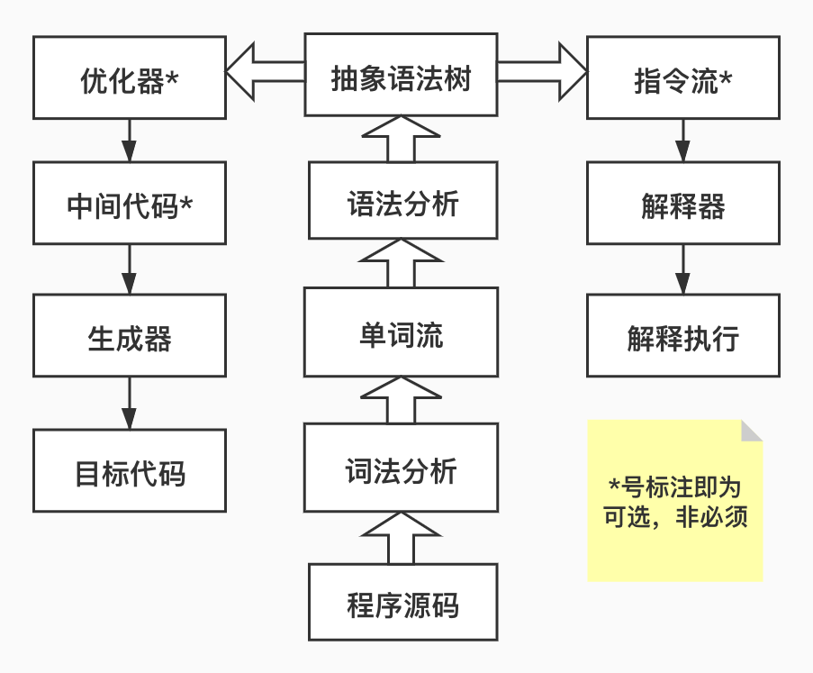

# 基础知识

## 概念

作为JVM最为核心的组成部分，JVM执行引擎的工作方式本身就非常类似于真正物理机的编译以及汇编语言的执行机理，JVM执行引擎可以自己制定指令集和执行结构体系，很多不能被硬件所直接支持的指令集在执行引擎里也能够执行，这都是执行引擎自己所实现的，一般看来，所有的Java虚拟机的执行引擎都是将输入的字节码文件经过字节码解析过程从而得到执行结果的过程。字节码作为JVM的指令集，它需要JVM执行引擎去执行，达到从本地机器码到字节码的编译结果，这看似只是存储格式的转变，但这却深深的影响了编程语言。

## 栈帧

栈帧（Stack Frame）是一种用于支持虚拟机进行方法调用和方法执行的数据结构，它是虚拟机运行时数据区中虚拟机栈的栈元素栈帧作为栈元素并且能支持虚拟机对方法的相关操作自然包含了很多数据元素，也就是说，每一个方法的被调用到结束都对应着一个栈帧从入栈到出栈的过程。

在方法调用到结束的过程中还有一些相关概念：

一个线程中的方法调用链可能会很长，很多方法都同时处于执行状态。对于执行引擎来说，在活动线程中，只有位于栈顶的栈帧才是有效的,每当一个线程启动时，JVM都会为它分配一个栈，栈的单位是帧，并且它负责保存当前线程的运行状态，其中某个线程正在执行的方法就称为当前方法，当前方法所用到的帧称为当前帧，这个方法所属的类就被称作当前类，当前所用到的常量池成为当前常量池，所以在一个线程执行方法时就会追踪当前常量池。栈帧作为当前方法所分配的一个帧，于是也就成了当前帧，这个帧就被用来存储当前方法的相关数据流被压入虚拟机栈中。

概括的说

> 栈是用来保存当前线程的运行状态的，而帧是用来保存当前方法的运行状态的，也就是线程中依次运行不同方法对应着帧的入栈和出栈
>

### 组成成分

#### 局部变量表

相关概念：

局部变量表的容量是容量槽slot为最小单位，一个slot大小为32bit，所以在64位的虚拟机中需要使用对齐补白的手段来使得使得容量槽slot在外观上看起来和32位的虚拟机保持一致，所以说对于64位的数据如long，double都需要使用两个容量槽slot去存储，并且在任何时候都不允许单独访问其中的一个。局部变量表的大小是在编译期间可以查询到的，因为它是作为方法的对应属性里的数据max_local数据项中存储的，也就是编译class文件的过程中，这个最大的需要分配变量的局部变量表的最大存储容量就已经确定了。

#### 局部变量表的顺序：

变量表的索引从0开始，首先是方法所属的对象的引用（静态方法无）->其次是方法的参数变量（按照声明的顺序）->再者是方法的内部的局部变量（按照声明的顺序）。并且对于byte char short这三种数据类型需要转化为int类型存储在局部变量表中

其他性质：

在类被JVM加载时会为类变量赋初值，但是局部变量若声明了但却未赋初值是会出现编译错误的并且slot对于局部变量中没有覆盖整个方法的作用域的变量是可重用的。对于可重用的slot，如果后面没有在定义变量对这个slot进行覆盖，即使这个变量已经无效，那么这个变量在方法体内也不会被回收，除非解释执行的时候显示的赋值为null，但是在JIT编译器优化后赋值为null的操作就会被消除掉，这时候将变量设置为null就没有意义了。

#### 操作数栈

一些操作性质：

操作数栈和局部变量表一样都是编译期间，操作数栈的最大深度在编译的时候写入到Code属性的max_stacks数据项中。操作数栈的元素不明确Java的数据类型，也就是说在所有Java数据类型中，32位数据容量为1,64位数据容量为2，

其他性质：

在概念模型中，一个县城的两个栈帧是相互独立的，但是在虚拟机实现中都会做一些优化处理，让两个栈帧出现一部分重叠，也就是让下面栈帧的部分操作数栈与上面的栈帧的部分局部变量表互相重重叠，这样在进行方法调用时就会公用一部分数据，无需进行额外的参数复制，达到了一定的优化效果。java虚拟机的解释执行引擎称为“基于栈的执行引擎”，其中栈指的就是操作数栈。

#### 动态连接

栈帧包含了一个指向运行时常量池中该栈帧所属方法的引用，这个引用是为了支持方法调用过程中的动态连接。常量池中存有大量的符号引用，字节码中的方法调用指令就以常量池中指向方法的符号引用作为参数。这些符号引用有些会在类加载阶段或者第一次使用的时候就转化为直接引用，这种转化称为静态解析。另外的符号引用将在每一次运行期间转化为直接引用，这部分称为动态解析。

#### 方法返回地址

无论是正常完成退出方法还是异常完成退出方法，都需要返回到方法被调用的位置，才能将程序正常进行下去，方法正常退出时，PC计数器的值可以作为返回地址，栈帧中很可能会保存这个计数器值；方法异常退出时，要通过异常处理器表来确定返回的地址，栈帧中一般不会保存这部分信息。方法退出相当于把当前栈帧出栈，所以方法退出时可能执行恢复上层方法的局部变量表和操作数栈的操作和把返回值（如果存在）压入调用者栈帧的操作数栈中的操作以及调整PC计数器的值以指向方法调用指令后面的一条指令的操作。

## 方法调用

### 解析调用

我们知道，在类加载过程中有解析阶段，在这个阶段中，类文件的一部分符号引用会转化为直接引用，这么做主要是因为方法在真正的执行前就已经有了一个可确定的调用版本，并且这个版本在运行期间是不可变的，这类方法的调用就称作解析调用。并且满足条件的这类方法叫做非虚方法主要有静态方法、私有方法、父类方法、final类方法、实例构造器方法，其他的不满足这样过程的条件都称为虚方法

## 分派与多态

### 静态分派与重载

重载是指方法名是相同的但是方法签名不同的情况，调用时使用方法签名来判断调用哪个具体方法，JVM在重载时是通过静态类型作为判断依据，所以javac编译器会根据参数的静态类型来决定选择哪个版本的方法，静态分派发生在编译阶段，因此确定静态分派的动作实际上不是有虚拟机来执行的。

**方法签名的解释**

方法头指定修饰符、返回值类型、方法名、和形式参数。方法头中定义的变量称为形参 ，形参如同占位符。当方法被调用时，传递一个值给形参，此值称为实参，形参列表指的是形参的类型、顺序和形参的数目。方法签名就是方法名和形参列表共同组成的。

### 动态分配与重写

重写是指方法名和方法签名都相同的子类重写父类的方法，但是需要注意的是静态方法可以重载但是重写是无效的，因为在调用的过程中通过子类的实例对象调用就是调用子类的静态方法，通过父类的实例对象调用则调用父类的静态方法

动态分派和多态重写的本质与字节码指令invokevirtual的多态查找过程相关：1.找到栈顶元素所指向的对象的实际类型，记为C；2. 在类型C中找到与常量池中的描述符与简单名称都相符的方法，然后进行访问权限检查，如果通过则返回这个方法的直接引用，查找结束；如果不通过，则返回java.lang.IllegalAccessError异常。3.否则，按照继承关系，继续重复2中搜索和验证过程。4.如果始终没有找到，则抛出java.lang.AbstractMethodError异常。这里注意，重写的本质其实就是invokevirtual指令把常量池中的符号引用解析到了不同的实际类型的直接引用上

用代码实例验证一下动态分配与静态方法重写问题：

package Second;
//动态分配与静态方法重写的测试
public class Text1 {

	static class Father{
		public void sayHi() {
			System.out.println("Father say Hi");
		}
		public static void testStatic() {
			System.out.println("Father static");
		}
	}
	static class Son extends Father{
		public void sayHi() {
			System.out.println("Son say Hi");
		}
		public static void testStatic() {
			System.out.println("Son static");
		}
	}
	static class Daughter extends Father{
		public void sayHi() {
			System.out.println("Daughter say Hi");
		}
		public static void testStatic() {
			System.out.println("Daughter static");
		}
	}
	public static void main(String[] args) {
		System.out.println("动态分配测试");
		Father s = new Son();
		Father d = new Daughter();
		s.sayHi();
		d.sayHi();
		s = new Daughter();
		s.sayHi();
		System.out.println("静态方法重写测试");
		s.testStatic();
		d.testStatic();
	}
	}
运行结果：

> 动态分配测试
> Son say Hi
> Daughter say Hi
> Daughter say Hi
> 静态方法重写测试
> Father static
> Father static

**这里需要注意的是**：

分派与解析并不是说只能选一个的问题，只是它们在不同的阶段不同层次上筛选和确定目标的过程，就比如静态方法在类加载过程的解析中就进行了解析，但若静态方法含有重载的版本那么这将在静态分派中完成选择问题。

虚方法表
动态分派时为了避免频繁的搜索，会为类在方法区建立一个虚方法表，利用索引来代替元数据查找从而提高性能。虚方法表中存放着各个方法的实际入口地址。如果某个方法在子类中没有重写，那子类的虚方法表里面的地址入口和父类相同方法的地址入口是一致的，都指向父类的实现入口，如果子类中重写了这个方法，那么子类对应的方法的地址将会替代指向父类方法的入口地址。具有相同方法签名的父类、子类的方法在父类和子类的虚方法表中具有相同的索引序号，这样当类型变换时，仅需要变更查找的方法表。

## 解释执行与直接执行

### 解释器

解释器是将平台无关的字节码（原本由javac将java文件编译为class文件，并将源代码编译成了与平台无关的字节码）解释称对应平台的机器码解释执行

### JIT编译器

（即时编译器）是一个把Java的字节码（包括需要被解释的指令的程序）转换成可以直接发送给处理器的指令的程序。JVM对这个函数就不再解释而是直接执行

### 使用环境

用户模式下:解释执行的。
server模式下：先解释执行，然后JVM统计函数执行热点，将这些热点代码仔细优化编译成本地机器码(默认为调用10000次以上)，即使用JIT编译器，当这个热点不再是热点的时候，重新解释执行。

