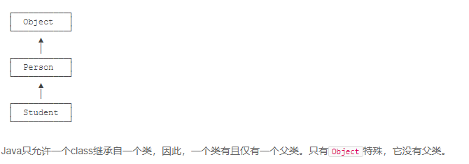
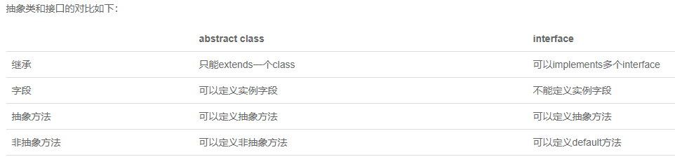
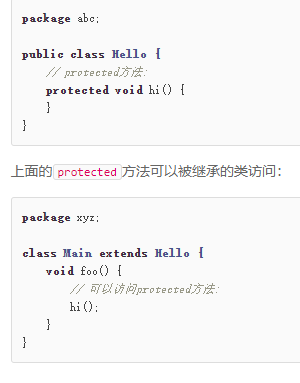

# 构造方法

```java
public class Main {
    public static void main(String[] args) {
        Person p = new Person("Xiao Ming", 15);
        System.out.println(p.getName());
        System.out.println(p.getAge());
    }
}

class Person {
    private String name;
    private int age;
	// 这个就是构造方法
    public Person(String name, int age) {
        this.name = name;
        this.age = age;
    }
    
    public String getName() {
        return this.name;
    }

    public int getAge() {
        return this.age;
    }
}

```

# 方法重载

```java
class Hello {
    public void hello() {
        System.out.println("Hello, world!");
    }

    public void hello(String name) {
        System.out.println("Hello, " + name + "!");
    }

    public void hello(String name, int age) {
        if (age < 18) {
            System.out.println("Hi, " + name + "!");
        } else {
            System.out.println("Hello, " + name + "!");
        }
    }
}
```

# 继承

```java
class Person {
    private String name;
    private int age;

    public String getName() {...}
    public void setName(String name) {...}
    public int getAge() {...}
    public void setAge(int age) {...}
}

class Student extends Person {
    // 不要重复name和age字段/方法,
    // 只需要定义新增score字段/方法:
    private int score;
    public int getScore() { … }
    public void setScore(int score) { … }
}
```

>  注意：子类自动获得了父类的所有字段，严禁定义与父类重名的字段！

在OOP的术语中，我们把`Person`称为超类（super class），父类（parent class），基类（base class），把`Student`称为子类（subclass），扩展类（extended class）。

注意到我们在定义`Person`的时候，没有写`extends`。在Java中，没有明确写`extends`的类，编译器会自动加上`extends Object`。所以，任何类，除了`Object`，都会继承自某个类。下图是`Person`、`Student`的继承树：



## protected

继承有个特点，就是子类无法访问父类的`private`字段或者`private`方法。例如，`Student`类就无法访问`Person`类的`name`和`age`字段：

```java
class Person {
    private String name;
    private int age;
}

class Student extends Person {
    public String hello() {
        return "Hello, " + name; // 编译错误：无法访问name字段
    }
}
```

这使得继承的作用被削弱了。为了让子类可以访问父类的字段，我们需要把`private`改为`protected`。用`protected`修饰的字段可以被子类访问：

```java
class Person {
    protected String name;
    protected int age;
}

class Student extends Person {
    public String hello() {
        return "Hello, " + name; // OK!
    }
}
```

因此，`protected`关键字可以把字段和方法的访问权限控制在继承树内部，一个`protected`字段和方法可以被其子类，以及子类的子类所访问，后面我们还会详细讲解。

## super

`super`关键字表示父类（超类）。子类引用父类的字段时，可以用`super.fieldName`。例如：

```java
class Student extends Person {
    public String hello() {
        return "Hello, " + super.name;
    }
}
```

实际上，这里使用`super.name`，或者`this.name`，或者`name`，效果都是一样的。编译器会自动定位到父类的`name`字段。

> 在Java中，任何`class`的构造方法，第一行语句必须是调用父类的构造方法。如果没有明确地调用父类的构造方法，编译器会帮我们自动加一句`super();`，所以，`Student`类的构造方法实际上是这样：

```java
class Student extends Person {
    protected int score;

    public Student(String name, int age, int score) {
        super(name, age); // 调用父类的构造方法Person(String, int)
        this.score = score;
    }
}
```

> 因此我们得出结论：如果父类没有默认的构造方法，子类就必须显式调用`super()`并给出参数以便让编译器定位到父类的一个合适的构造方法。
>
> 这里还顺带引出了另一个问题：即子类*不会继承*任何父类的构造方法。子类默认的构造方法是编译器自动生成的，不是继承的。

## 阻止继承

正常情况下，只要某个class没有`final`修饰符，那么任何类都可以从该class继承。

从Java 15开始，允许使用`sealed`修饰class，并通过`permits`明确写出能够从该class继承的子类名称。

```java
public sealed class Shape permits Rect, Circle, Triangle {
    ...
}
// 上述Shape类就是一个sealed类，它只允许指定的3个类继承它。如果写：
public final class Rect extends Shape {...}
// 是没问题的，因为Rect出现在Shape的permits列表中。但是，如果定义一个Ellipse就会报错：
public final class Ellipse extends Shape {...}
// Compile error: class is not allowed to extend sealed class: Shape
// 原因是Ellipse并未出现在Shape的permits列表中。这种sealed类主要用于一些框架，防止继承被滥用。
// sealed类在Java 15中目前是预览状态，要启用它，必须使用参数--enable-preview和--source 15。
```

## 向上转型

如果一个引用变量的类型是`Student`，那么它可以指向一个`Student`类型的实例：

现在问题来了：如果`Student`是从`Person`继承下来的，那么，一个引用类型为`Person`的变量，能否指向`Student`类型的实例？

```java
Person p = new Student(); // ???
```

测试一下就可以发现，这种指向是允许的！

这是因为`Student`继承自`Person`，因此，它拥有`Person`的全部功能。`Person`类型的变量，如果指向`Student`类型的实例，对它进行操作，是没有问题的！

这种把一个子类类型安全地变为父类类型的赋值，被称为向上转型（upcasting）。

## 向下转型

和向上转型相反，如果把一个父类类型强制转型为子类类型，就是向下转型（downcasting）。例如：

```java
Person p1 = new Student(); // upcasting, ok
Person p2 = new Person();
Student s1 = (Student) p1; // ok
Student s2 = (Student) p2; // runtime error! ClassCastException!
```

如果测试上面的代码，可以发现：

`Person`类型`p1`实际指向`Student`实例，`Person`类型变量`p2`实际指向`Person`实例。在向下转型的时候，把`p1`转型为`Student`会成功，因为`p1`确实指向`Student`实例，把`p2`转型为`Student`会失败，因为`p2`的实际类型是`Person`，不能把父类变为子类，因为子类功能比父类多，多的功能无法凭空变出来。

因此，向下转型很可能会失败。失败的时候，Java虚拟机会报`ClassCastException`。

## instanceof

为了避免向下转型出错，Java提供了`instanceof`操作符，可以先判断一个实例究竟是不是某种类型：

```java
Person p = new Person();
System.out.println(p instanceof Person); // true
System.out.println(p instanceof Student); // false

Student s = new Student();
System.out.println(s instanceof Person); // true
System.out.println(s instanceof Student); // true

Student n = null;
System.out.println(n instanceof Student); // false
```

`instanceof`实际上判断一个变量所指向的实例是否是指定类型，或者这个类型的子类。如果一个引用变量为`null`，那么对任何`instanceof`的判断都为`false`。

## 组合

具有has关系不应该使用继承，而是使用组合，即`Student`可以持有一个`Book`实例：

```java
class Student extends Person {
    protected Book book;
    protected int score;
}
```

因此，继承是is关系，组合是has关系。

# 多态

## Override

在继承关系中，子类如果定义了一个与父类方法签名完全相同的方法，被称为覆写（Override）。

Override和Overload不同的是，如果方法签名如果不同，就是Overload，Overload方法是一个新方法；如果方法签名相同，并且返回值也相同，就是`Override`。

> 注意：方法名相同，方法参数相同，但方法返回值不同，也是不同的方法。在Java程序中，出现这种情况，编译器会报错。

```java
class Person {
    public void run() { … }
}

class Student extends Person {
    // 不是Override，因为参数不同:
    public void run(String s) { … }
    // 不是Override，因为返回值不同:
    public int run() { … }
}
```

加上`@Override`可以让编译器帮助检查是否进行了正确的覆写。希望进行覆写，但是不小心写错了方法签名，编译器会报错。但是`@Override`不是必需的。

## 多态

多态是指，针对某个类型的方法调用，其真正执行的方法取决于运行时期实际类型的方法。例如：

```java
Person p = new Student();
p.run(); // 无法确定运行时究竟调用哪个run()方法
```

```java
public class Main {
    public static void main(String[] args) {
        // 给一个有普通收入、工资收入和享受国务院特殊津贴的小伙伴算税:
        Income[] incomes = new Income[] {
            new Income(3000),
            new Salary(7500),
            new StateCouncilSpecialAllowance(15000)
        };
        System.out.println(totalTax(incomes));
    }

    public static double totalTax(Income... incomes) {
        double total = 0;
        for (Income income: incomes) {
            total = total + income.getTax();
        }
        return total;
    }
}

class Income {
    protected double income;

    public Income(double income) {
        this.income = income;
    }

    public double getTax() {
        return income * 0.1; // 税率10%
    }
}

class Salary extends Income {
    public Salary(double income) {
        super(income);
    }

    @Override
    public double getTax() {
        if (income <= 5000) {
            return 0;
        }
        return (income - 5000) * 0.2;
    }
}

class StateCouncilSpecialAllowance extends Income {
    public StateCouncilSpecialAllowance(double income) {
        super(income);
    }

    @Override
    public double getTax() {
        return 0;
    }
}
```

多态可以说是方法重写的应用，不同的方法继承同一个父类，重写同一个方法，这样调用时就会有不同的效果

## 覆写Object方法

因为所有的`class`最终都继承自`Object`，而`Object`定义了几个重要的方法：

- `toString()`：把instance输出为`String`；
- `equals()`：判断两个instance是否逻辑相等；
- `hashCode()`：计算一个instance的哈希值。

```java
class Person {
    ...
    // 显示更有意义的字符串:
    @Override
    public String toString() {
        return "Person:name=" + name;
    }
    // 比较是否相等:
    @Override
    public boolean equals(Object o) {
        // 当且仅当o为Person类型:
        if (o instanceof Person) {
            Person p = (Person) o;
            // 并且name字段相同时，返回true:
            return this.name.equals(p.name);
        }
        return false;
    }
    // 计算hash:
    @Override
    public int hashCode() {
        return this.name.hashCode();
    }
}
```

## super

在子类的覆写方法中，如果要调用父类的被覆写的方法，可以通过`super`来调用。例如：

```java
class Person {
    protected String name;
    public String hello() {
        return "Hello, " + name;
    }
}

Student extends Person {
    @Override
    public String hello() {
        // 调用父类的hello()方法:
        return super.hello() + "!";
    }
}
```

## final

继承可以允许子类覆写父类的方法。如果一个父类不允许子类对它的某个方法进行覆写，可以把该方法标记为`final`。用`final`修饰的方法不能被`Override`：

```java
class Person {
    protected String name;
    public final String hello() {
        return "Hello, " + name;
    }
}

Student extends Person {
    // compile error: 不允许覆写
    @Override
    public String hello() {
    }
}
```

如果一个类不希望任何其他类继承自它，那么可以把这个类本身标记为`final`。用`final`修饰的类不能被继承：

```java
final class Person {
    protected String name;
}

// compile error: 不允许继承自Person
Student extends Person {
}
```

对于一个类的实例字段，同样可以用`final`修饰。用`final`修饰的字段在初始化后不能被修改。例如：

```java
class Person {
    public final String name = "Unamed";
}
```

# 抽象类

如果父类的方法本身不需要实现任何功能，仅仅是为了定义方法签名，目的是让子类去覆写它，那么，可以把父类的方法声明为抽象方法：

```java
class Person {
    public abstract void run();
}
```

把一个方法声明为`abstract`，表示它是一个抽象方法，本身没有实现任何方法语句。因为这个抽象方法本身是无法执行的，所以，`Person`类也无法被实例化。编译器会告诉我们，无法编译`Person`类，因为它包含抽象方法。

必须把`Person`类本身也声明为`abstract`，才能正确编译它：

```java
abstract class Person {
    public abstract void run();
}
```

如果一个`class`定义了方法，但没有具体执行代码，这个方法就是抽象方法，抽象方法用`abstract`修饰。

因为无法执行抽象方法，因此这个类也必须申明为抽象类（abstract class）。

使用`abstract`修饰的类就是抽象类。我们无法实例化一个抽象类：

因为抽象类本身被设计成只能用于被继承，因此，抽象类可以强迫子类实现其定义的抽象方法，否则编译会报错。因此，抽象方法实际上相当于定义了“规范”。

# 接口

在抽象类中，抽象方法本质上是定义接口规范：即规定高层类的接口，从而保证所有子类都有相同的接口实现，这样，多态就能发挥出威力。

如果一个抽象类没有字段，所有方法全部都是抽象方法：

```java
abstract class Person {
    public abstract void run();
    public abstract String getName();
}
```

就可以把该抽象类改写为接口：`interface`。

所谓`interface`，就是比抽象类还要抽象的纯抽象接口，因为它连字段都不能有。因为接口定义的所有方法默认都是`public abstract`的，所以这两个修饰符不需要写出来（写不写效果都一样）。

当一个具体的`class`去实现一个`interface`时，需要使用`implements`关键字。举个例子：

我们知道，在Java中，一个类只能继承自另一个类，不能从多个类继承。但是，一个类可以实现多个`interface`，例如：

```java
class Student implements Person, Hello { // 实现了两个interface
    ...
}
```



## default方法

在接口中，可以定义`default`方法。例如，把`Person`接口的`run()`方法改为`default`方法：

```java
public class Main {
    public static void main(String[] args){
        Person p = new Student("Xiao Ming");
        p.run();
    }
}
interface Person {
    String getName();
    default void run() {
        System.out.println(getName() + " run");
    }
}
class Student implements Person {
    private String name;
    public Student(String name) {
        this.name = name;
    }
    public String getName() {
        return this.name;
    }
}
```

实现类可以不必覆写`default`方法。`default`方法的目的是，当我们需要给接口新增一个方法时，会涉及到修改全部子类。如果新增的是`default`方法，那么子类就不必全部修改，只需要在需要覆写的地方去覆写新增方法。

`default`方法和抽象类的普通方法是有所不同的。因为`interface`没有字段，`default`方法无法访问字段，而抽象类的普通方法可以访问实例字段。

### 小结

Java的接口（interface）定义了纯抽象规范，一个类可以实现多个接口；

接口也是数据类型，适用于向上转型和向下转型；

接口的所有方法都是抽象方法，接口不能定义实例字段；

接口可以定义`default`方法（JDK>=1.8）。

# 静态字段和静态方法

## 静态字段

在一个`class`中定义的字段，我们称之为实例字段。实例字段的特点是，每个实例都有独立的字段，各个实例的同名字段互不影响。

还有一种字段，是用`static`修饰的字段，称为静态字段：`static field`。

实例字段在每个实例中都有自己的一个独立“空间”，但是静态字段只有一个共享“空间”，所有实例都会共享该字段。举个例子：

```java
class Person {
    public String name;
    public int age;
    // 定义静态字段number:
    public static int number;
}
```

对于静态字段，无论修改哪个实例的静态字段，效果都是一样的：所有实例的静态字段都被修改了，原因是静态字段并不属于实例：

因此，不推荐用`实例变量.静态字段`去访问静态字段，因为在Java程序中，实例对象并没有静态字段。在代码中，实例对象能访问静态字段只是因为编译器可以根据实例类型自动转换为`类名.静态字段`来访问静态对象。

推荐用类名来访问静态字段。可以把静态字段理解为描述`class`本身的字段（非实例字段）。对于上面的代码，更好的写法是：

```java
Person.number = 99;
System.out.println(Person.number);
```

## 静态方法

有静态字段，就有静态方法。用`static`修饰的方法称为静态方法。

调用实例方法必须通过一个实例变量，而调用静态方法则不需要实例变量，通过类名就可以调用。静态方法类似其它编程语言的函数。例如：

```java
public class Main {
    public static void main(String[] args) {
        Person.setNumber(99);
        System.out.println(Person.number);
    }
}
class Person {
    public static int number;
    public static void setNumber(int value) {
        number = value;
    }
}

```

因为静态方法属于`class`而不属于实例，因此，静态方法内部，无法访问`this`变量，也无法访问实例字段，它只能访问静态字段。

通过实例变量也可以调用静态方法，但这只是编译器自动帮我们把实例改写成类名而已。

通常情况下，通过实例变量访问静态字段和静态方法，会得到一个编译警告。

静态方法经常用于工具类。例如：

- Arrays.sort()
- Math.random()

静态方法也经常用于辅助方法。注意到Java程序的入口`main()`也是静态方法。

## 接口的静态字段

因为`interface`是一个纯抽象类，所以它不能定义实例字段。但是，`interface`是可以有静态字段的，并且静态字段必须为`final`类型：

```java
public interface Person {
    public static final int MALE = 1;
    public static final int FEMALE = 2;
}
```

实际上，因为`interface`的字段只能是`public static final`类型，所以我们可以把这些修饰符都去掉，上述代码可以简写为：

```java
public interface Person {
    // 编译器会自动加上public statc final:
    int MALE = 1;
    int FEMALE = 2;
}
```

编译器会自动把该字段变为`public static final`类型。

## 小结

- 静态字段属于所有实例“共享”的字段，实际上是属于`class`的字段；
- 调用静态方法不需要实例，无法访问`this`，但可以访问静态字段和其他静态方法；
- 静态方法常用于工具类和辅助方法。

# 作用域

在Java中，我们经常看到`public`、`protected`、`private`这些修饰符。在Java中，这些修饰符可以用来限定访问作用域。

## public

定义为`public`的`class`、`interface`可以被其他任何类访问：

## private

定义为`private`的`field`、`method`无法被其他类访问：

## protected

`protected`作用于继承关系。定义为`protected`的字段和方法可以被子类访问，以及子类的子类：



## package

最后，包作用域是指一个类允许访问同一个`package`的没有`public`、`private`修饰的`class`，以及没有`public`、`protected`、`private`修饰的字段和方法。

## 局部变量

在方法内部定义的变量称为局部变量，局部变量作用域从变量声明处开始到对应的块结束。方法参数也是局部变量。

## final

Java还提供了一个`final`修饰符。`final`与访问权限不冲突，它有很多作用。

- 用`final`修饰`class`可以阻止被继承
- 用`final`修饰`method`可以阻止被子类覆写
- 用`final`修饰`field`可以阻止被重新赋值
- 用`final`修饰局部变量可以阻止被重新赋值

## 最佳实践

如果不确定是否需要`public`，就不声明为`public`，即尽可能少地暴露对外的字段和方法。

把方法定义为`package`权限有助于测试，因为测试类和被测试类只要位于同一个`package`，测试代码就可以访问被测试类的`package`权限方法。

一个`.java`文件只能包含一个`public`类，但可以包含多个非`public`类。如果有`public`类，文件名必须和`public`类的名字相同。

## 小结

Java内建的访问权限包括`public`、`protected`、`private`和`package`权限；

Java在方法内部定义的变量是局部变量，局部变量的作用域从变量声明开始，到一个块结束；

`final`修饰符不是访问权限，它可以修饰`class`、`field`和`method`；

一个`.java`文件只能包含一个`public`类，但可以包含多个非`public`类。

# 内部类

如果一个类定义在另一个类的内部，这个类就是Inner Class：

```java
class Outer {
    class Inner {
        // 定义了一个Inner Class
    }
}
```

上述定义的`Outer`是一个普通类，而`Inner`是一个Inner Class，它与普通类有个最大的不同，就是Inner Class的实例不能单独存在，必须依附于一个Outer Class的实例。示例代码如下：

```java
public class Main {
    public static void main(String[] args) {
        Outer outer = new Outer("Nested"); // 实例化一个Outer
        Outer.Inner inner = outer.new Inner(); // 实例化一个Inner
        inner.hello();
    }
}

class Outer {
    private String name;

    Outer(String name) {
        this.name = name;
    }

    class Inner {
        void hello() {
            System.out.println("Hello, " + Outer.this.name);
        }
    }
}
```

## 匿名内部类

还有一种定义Inner Class的方法，它不需要在Outer Class中明确地定义这个Class，而是在方法内部，通过匿名类（Anonymous Class）来定义。示例代码如下：

```java
public class Main {
    public static void main(String[] args) {
        Outer outer = new Outer("Nested");
        outer.asyncHello();
    }
}

class Outer {
    private String name;
    Outer(String name) {
        this.name = name;
    }
    void asyncHello() {
        Runnable r = new Runnable() {
            @Override
            public void run() {
                System.out.println("Hello, " + Outer.this.name);
            }
        };
        new Thread(r).start();
    }
}
```

观察`asyncHello()`方法，我们在方法内部实例化了一个`Runnable`。`Runnable`本身是接口，接口是不能实例化的，所以这里实际上是定义了一个实现了`Runnable`接口的匿名类，并且通过`new`实例化该匿名类，然后转型为`Runnable`。在定义匿名类的时候就必须实例化它，定义匿名类的写法如下：

```java
Runnable r = new Runnable() {
    // 实现必要的抽象方法...
};
```

匿名类和Inner Class一样，可以访问Outer Class的`private`字段和方法。之所以我们要定义匿名类，是因为在这里我们通常不关心类名，比直接定义Inner Class可以少写很多代码。

观察Java编译器编译后的`.class`文件可以发现，`Outer`类被编译为`Outer.class`，而匿名类被编译为`Outer$1.class`。如果有多个匿名类，Java编译器会将每个匿名类依次命名为`Outer$1`、`Outer$2`、`Outer$3`……

除了接口外，匿名类也完全可以继承自普通类。观察以下代码：

```java
import java.util.HashMap;

public class Main {
    public static void main(String[] args) {
        HashMap<String, String> map1 = new HashMap<>();
        HashMap<String, String> map2 = new HashMap<>() {}; // 匿名类!
        HashMap<String, String> map3 = new HashMap<>() {
            {
                put("A", "1");
                put("B", "2");
            }
        };
        System.out.println(map3.get("A"));
    }
}
```

## 静态内部类

最后一种内部类和Inner Class类似，但是使用`static`修饰，称为静态内部类（Static Nested Class）：

```java
public class Main {
    public static void main(String[] args) {
        Outer.StaticNested sn = new Outer.StaticNested();
        sn.hello();
    }
}
class Outer {
    private static String NAME = "OUTER";
    private String name;
    Outer(String name) {
        this.name = name;
    }
    static class StaticNested {
        void hello() {
            System.out.println("Hello, " + Outer.NAME);
        }
    }
}
```

用`static`修饰的内部类和Inner Class有很大的不同，它不再依附于`Outer`的实例，而是一个完全独立的类，因此无法引用`Outer.this`，但它可以访问`Outer`的`private`静态字段和静态方法。如果把`StaticNested`移到`Outer`之外，就失去了访问`private`的权限。

## 小结

Java的内部类可分为Inner Class、Anonymous Class和Static Nested Class三种：

- Inner Class和Anonymous Class本质上是相同的，都必须依附于Outer Class的实例，即隐含地持有`Outer.this`实例，并拥有Outer Class的`private`访问权限；
- Static Nested Class是独立类，但拥有Outer Class的`private`访问权限。

# classpath和jar

## classpath

在Java中，我们经常听到`classpath`这个东西。网上有很多关于“如何设置classpath”的文章，但大部分设置都不靠谱。

到底什么是`classpath`？

`classpath`是JVM用到的一个环境变量，它用来指示JVM如何搜索`class`。

因为Java是编译型语言，源码文件是`.java`，而编译后的`.class`文件才是真正可以被JVM执行的字节码。因此，JVM需要知道，如果要加载一个`abc.xyz.Hello`的类，应该去哪搜索对应的`Hello.class`文件。

所以，`classpath`就是一组目录的集合，它设置的搜索路径与操作系统相关。例如，在Windows系统上，用`;`分隔，带空格的目录用`""`括起来，可能长这样：

```
C:\work\project1\bin;C:\shared;"D:\My Documents\project1\bin"
```

在Linux系统上，用`:`分隔，可能长这样：

```
/usr/shared:/usr/local/bin:/home/liaoxuefeng/bin
```

现在我们假设`classpath`是`.;C:\work\project1\bin;C:\shared`，当JVM在加载`abc.xyz.Hello`这个类时，会依次查找：

- <当前目录>\abc\xyz\Hello.class
- C:\work\project1\bin\abc\xyz\Hello.class
- C:\shared\abc\xyz\Hello.class

注意到`.`代表当前目录。如果JVM在某个路径下找到了对应的`class`文件，就不再往后继续搜索。如果所有路径下都没有找到，就报错。

`classpath`的设定方法有两种：

在系统环境变量中设置`classpath`环境变量，不推荐；

在启动JVM时设置`classpath`变量，推荐。

我们强烈*不推荐*在系统环境变量中设置`classpath`，那样会污染整个系统环境。在启动JVM时设置`classpath`才是推荐的做法。实际上就是给`java`命令传入`-classpath`或`-cp`参数：

```
java -classpath .;C:\work\project1\bin;C:\shared abc.xyz.Hello
```

或者使用`-cp`的简写：

```
java -cp .;C:\work\project1\bin;C:\shared abc.xyz.Hello
```

没有设置系统环境变量，也没有传入`-cp`参数，那么JVM默认的`classpath`为`.`，即当前目录：

```
java abc.xyz.Hello
```

上述命令告诉JVM只在当前目录搜索`Hello.class`。

在IDE中运行Java程序，IDE自动传入的`-cp`参数是当前工程的`bin`目录和引入的jar包。

通常，我们在自己编写的`class`中，会引用Java核心库的`class`，例如，`String`、`ArrayList`等。这些`class`应该上哪去找？

有很多“如何设置classpath”的文章会告诉你把JVM自带的`rt.jar`放入`classpath`，但事实上，根本不需要告诉JVM如何去Java核心库查找`class`，JVM怎么可能笨到连自己的核心库在哪都不知道？

 不要把任何Java核心库添加到classpath中！JVM根本不依赖classpath加载核心库！

更好的做法是，不要设置`classpath`！默认的当前目录`.`对于绝大多数情况都够用了。

## jar包

如果有很多`.class`文件，散落在各层目录中，肯定不便于管理。如果能把目录打一个包，变成一个文件，就方便多了。

jar包就是用来干这个事的，它可以把`package`组织的目录层级，以及各个目录下的所有文件（包括`.class`文件和其他文件）都打成一个jar文件，这样一来，无论是备份，还是发给客户，就简单多了。

jar包实际上就是一个zip格式的压缩文件，而jar包相当于目录。如果我们要执行一个jar包的`class`，就可以把jar包放到`classpath`中：

```
java -cp ./hello.jar abc.xyz.Hello
```

那么问题来了：如何创建jar包？

因为jar包就是zip包，所以，直接在资源管理器中，找到正确的目录，点击右键，在弹出的快捷菜单中选择“发送到”，“压缩(zipped)文件夹”，就制作了一个zip文件。然后，把后缀从`.zip`改为`.jar`，一个jar包就创建成功。


jar包还可以包含一个特殊的`/META-INF/MANIFEST.MF`文件，`MANIFEST.MF`是纯文本，可以指定`Main-Class`和其它信息。JVM会自动读取这个`MANIFEST.MF`文件，如果存在`Main-Class`，我们就不必在命令行指定启动的类名，而是用更方便的命令：

```
java -jar hello.jar
```

jar包还可以包含其它jar包，这个时候，就需要在`MANIFEST.MF`文件里配置`classpath`了。

在大型项目中，不可能手动编写`MANIFEST.MF`文件，再手动创建zip包。Java社区提供了大量的开源构建工具，例如[Maven](https://www.liaoxuefeng.com/wiki/1252599548343744/1255945359327200)，可以非常方便地创建jar包。

## 小结

JVM通过环境变量`classpath`决定搜索`class`的路径和顺序；

不推荐设置系统环境变量`classpath`，始终建议通过`-cp`命令传入；

jar包相当于目录，可以包含很多`.class`文件，方便下载和使用；

`MANIFEST.MF`文件可以提供jar包的信息，如`Main-Class`，这样可以直接运行jar包。

# 模块

从Java 9开始，JDK又引入了模块（Module）。

什么是模块？这要从Java 9之前的版本说起。

我们知道，`.class`文件是JVM看到的最小可执行文件，而一个大型程序需要编写很多Class，并生成一堆`.class`文件，很不便于管理，所以，`jar`文件就是`class`文件的容器。

在Java 9之前，一个大型Java程序会生成自己的jar文件，同时引用依赖的第三方jar文件，而JVM自带的Java标准库，实际上也是以jar文件形式存放的，这个文件叫`rt.jar`，一共有60多M。

如果是自己开发的程序，除了一个自己的`app.jar`以外，还需要一堆第三方的jar包，运行一个Java程序，一般来说，命令行写这样：

```bash
java -cp app.jar:a.jar:b.jar:c.jar com.liaoxuefeng.sample.Main
```

如果漏写了某个运行时需要用到的jar，那么在运行期极有可能抛出`ClassNotFoundException`。

所以，jar只是用于存放class的容器，它并不关心class之间的依赖。

从Java 9开始引入的模块，主要是为了解决“依赖”这个问题。如果`a.jar`必须依赖另一个`b.jar`才能运行，那我们应该给`a.jar`加点说明啥的，让程序在编译和运行的时候能自动定位到`b.jar`，这种自带“依赖关系”的class容器就是模块。

为了表明Java模块化的决心，从Java 9开始，原有的Java标准库已经由一个单一巨大的`rt.jar`分拆成了几十个模块，这些模块以`.jmod`扩展名标识，可以在`$JAVA_HOME/jmods`目录下找到它们：

- java.base.jmod
- java.compiler.jmod
- java.datatransfer.jmod
- java.desktop.jmod
- ...

这些`.jmod`文件每一个都是一个模块，模块名就是文件名。例如：模块`java.base`对应的文件就是`java.base.jmod`。模块之间的依赖关系已经被写入到模块内的`module-info.class`文件了。所有的模块都直接或间接地依赖`java.base`模块，只有`java.base`模块不依赖任何模块，它可以被看作是“根模块”，好比所有的类都是从`Object`直接或间接继承而来。

把一堆class封装为jar仅仅是一个打包的过程，而把一堆class封装为模块则不但需要打包，还需要写入依赖关系，并且还可以包含二进制代码（通常是JNI扩展）。此外，模块支持多版本，即在同一个模块中可以为不同的JVM提供不同的版本。


感觉应该不会问，所以跳过


> 参考

[模块 - 廖雪峰的官方网站 (liaoxuefeng.com)](https://www.liaoxuefeng.com/wiki/1252599548343744/1281795926523938)